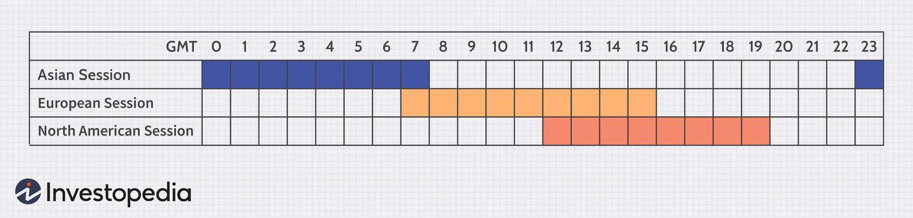

## Table of Contents

## What is the Forex Three-Session Trading System?

The Forex Three-Session Trading System is a way to trade currencies by focusing on three main time periods during the day. These periods are when the big financial centers in Tokyo, London, and New York are open for business. Each session has its own busy times and quiet times, and traders use this to decide when to buy or sell currencies. The idea is to take advantage of the times when there is a lot of trading happening, because that's when prices can move a lot.

Traders who use this system pay close attention to when these sessions overlap. For example, the Tokyo and London sessions overlap for a few hours, and so do the London and New York sessions. During these overlap times, there is usually more trading happening, which can lead to bigger price movements. By knowing when these overlaps happen, traders can plan their trades to make the most of these active times. This system helps traders organize their day and focus on the times when they are most likely to see big changes in currency prices.

## How does the Forex Three-Session Trading System differ from other trading systems?

The Forex Three-Session Trading System is different from other trading systems because it focuses on the timing of trades based on when the major financial centers are open. Most other trading systems might focus on technical analysis, like looking at charts and patterns, or fundamental analysis, like studying economic reports and news. But the Three-Session System is all about knowing when Tokyo, London, and New York are trading, and using those times to make trades. This means traders using this system are more concerned with when they trade rather than just what they trade.

Another way the Three-Session System is different is that it takes advantage of the times when these sessions overlap. During these overlaps, like when Tokyo and London are both open, or when London and New York are both open, there is a lot more trading happening. This can cause bigger price movements in the currency markets. Other trading systems might not pay as much attention to these specific times, but for traders using the Three-Session System, these overlaps are key moments to watch and act on. This focus on timing can help traders make decisions that are more in line with the natural flow of the market.

## What are the three sessions in the Forex Three-Session Trading System?

The Forex Three-Session Trading System has three main sessions: Tokyo, London, and New York. The Tokyo session starts first and covers the Asian market. It usually begins at around 12 AM GMT and ends at 9 AM GMT. This is when traders in Japan and other parts of Asia are most active. The London session is next and it covers the European market. It starts at around 8 AM GMT and ends at 5 PM GMT. This is a very busy time because many traders in Europe are trading during these hours. The New York session is the last one and it covers the North American market. It starts at around 1 PM GMT and ends at 10 PM GMT. This session is also very important because it includes traders from the United States and Canada.

The sessions overlap at certain times, which is important for traders using this system. The Tokyo and London sessions overlap from 8 AM GMT to 9 AM GMT. This is when traders from both Asia and Europe are trading at the same time, so there can be a lot of activity and price movement. The London and New York sessions overlap from 1 PM GMT to 5 PM GMT. This is another busy time because traders from both Europe and North America are active. By knowing when these sessions happen and when they overlap, traders can plan their trades to take advantage of the times when there is the most trading happening.

## How do the time zones affect the Forex Three-Session Trading System?

Time zones are really important for the Forex Three-Session Trading System because they decide when the Tokyo, London, and New York sessions happen. Each session starts and ends at different times based on where they are in the world. For example, the Tokyo session starts at 12 AM GMT, which is midnight in London but morning in Tokyo. The London session starts at 8 AM GMT, which is morning in London but still night in New York. The New York session starts at 1 PM GMT, which is morning in New York but evening in Tokyo. So, traders need to know what time it is in GMT to figure out when each session is happening.

The time zones also affect when the sessions overlap, which is a big deal for traders using this system. The Tokyo and London sessions overlap from 8 AM GMT to 9 AM GMT. This means that for one hour, traders from both Asia and Europe are trading at the same time, which can make the market more active. The London and New York sessions overlap from 1 PM GMT to 5 PM GMT, which is four hours of busy trading time because traders from both Europe and North America are active. By understanding these time zones and overlaps, traders can plan their trades to happen when the market is most likely to move a lot.

## What are the key characteristics of each session in the Forex Three-Session Trading System?

The Tokyo session is the first session of the day and it starts at 12 AM GMT. This session is all about the Asian market, so it's busy when traders in Japan and other parts of Asia are working. During this time, the market can be quieter compared to the other sessions because there are fewer big trades happening. But, the Tokyo session can still have some big moves, especially if there's important news from Asia. The session ends at 9 AM GMT, right when the London session starts.

The London session is next and it's very important because it's when the European market is open. It starts at 8 AM GMT and ends at 5 PM GMT. This session is usually the busiest because a lot of big banks and traders in Europe are trading during these hours. The market can move a lot during the London session, especially when it overlaps with the Tokyo session from 8 AM to 9 AM GMT. This overlap can make the market even more active because traders from both Asia and Europe are trading at the same time.

The last session is the New York session, which covers the North American market. It starts at 1 PM GMT and ends at 10 PM GMT. This session is also very busy because it includes traders from the United States and Canada. The market can have big moves during the New York session, especially when it overlaps with the London session from 1 PM to 5 PM GMT. During this four-hour overlap, traders from both Europe and North America are trading, so there can be a lot of activity and price movement.

## How can a beginner start using the Forex Three-Session Trading System?

To start using the Forex Three-Session Trading System, a beginner first needs to understand when the Tokyo, London, and New York sessions happen. The Tokyo session starts at 12 AM GMT and ends at 9 AM GMT. The London session starts at 8 AM GMT and ends at 5 PM GMT. The New York session starts at 1 PM GMT and ends at 10 PM GMT. It's important to know these times because they tell you when to trade. Beginners should also pay attention to the times when these sessions overlap. The Tokyo and London sessions overlap from 8 AM to 9 AM GMT, and the London and New York sessions overlap from 1 PM to 5 PM GMT. These overlaps are busy times when the market can move a lot, so they are good times to trade.

Once a beginner knows the session times, they can start planning their trades. They should focus on trading during the busy times, especially during the overlaps, because that's when the market is most active. They can use a simple trading plan that says, "I will trade during the London and New York overlap because that's when there's a lot of movement." Beginners should also keep an eye on the news because big news can make the market move even more during these sessions. By understanding the session times and planning trades around them, a beginner can start using the Forex Three-Session Trading System to make better trading decisions.

## What are the best strategies to use during each session of the Forex Three-Session Trading System?

During the Tokyo session, which starts at 12 AM GMT and ends at 9 AM GMT, the market can be quieter than other times. A good strategy for beginners is to look for small, steady trades. This session is good for trading currency pairs that involve the Japanese yen, like USD/JPY or EUR/JPY. Since the market moves slower, you can use a strategy called "range trading." This means you buy when the price is low and sell when it's high within a certain range. Also, keep an eye on any big news from Asia because it can make the market move more than usual.

The London session, from 8 AM GMT to 5 PM GMT, is usually the busiest. A good strategy here is to focus on the overlap with the Tokyo session from 8 AM to 9 AM GMT because that's when the market can move a lot. You can use a "[breakout](/wiki/breakout-trading) strategy," which means you trade when the price breaks out of its usual range. This session is also good for trading major currency pairs like EUR/USD or GBP/USD. During the London session, you should be ready for bigger moves and more trading activity, so be quick to make trades and watch the news for any big events that might affect the market.

The New York session, from 1 PM GMT to 10 PM GMT, is another busy time, especially during the overlap with the London session from 1 PM to 5 PM GMT. A good strategy here is to use a "trend-following" approach, where you trade in the direction of the market's trend. This session is good for trading pairs like USD/CAD or USD/CHF. During the overlap, the market can move a lot, so be ready to make quick trades. Also, keep an eye on any big news from the U.S. because it can cause big moves in the market. By understanding these strategies and using them during the right sessions, beginners can start trading more effectively.

## How does market volatility vary across the three sessions in the Forex Three-Session Trading System?

Market [volatility](/wiki/volatility-trading-strategies) changes a lot during the three sessions in the Forex Three-Session Trading System. The Tokyo session, from 12 AM GMT to 9 AM GMT, usually has less volatility. This means the market moves slower and there are fewer big changes in prices. It's a good time for small, steady trades, especially with currency pairs that involve the Japanese yen. But, if there's big news from Asia, the market can get more active and prices can move more.

The London session, from 8 AM GMT to 5 PM GMT, is the busiest and has the most volatility. This means the market moves a lot and prices can change quickly. It's especially busy during the one-hour overlap with the Tokyo session from 8 AM to 9 AM GMT. During this time, traders from both Asia and Europe are trading, so there's a lot of activity. The London session is a good time for trading major currency pairs like EUR/USD or GBP/USD, and you need to be ready for big moves and quick trades.

The New York session, from 1 PM GMT to 10 PM GMT, also has high volatility, especially during the four-hour overlap with the London session from 1 PM to 5 PM GMT. During this time, traders from both Europe and North America are active, so the market can move a lot. This session is good for trading pairs like USD/CAD or USD/CHF. You should be ready for big price changes and watch for any big news from the U.S. that can make the market even more volatile.

## What are the common pitfalls to avoid when trading with the Forex Three-Session Trading System?

One common pitfall to avoid when trading with the Forex Three-Session Trading System is overtrading during the quiet Tokyo session. Since this session can be less active, it's easy to get bored and start making trades just to do something. But this can lead to small losses that add up over time. It's better to wait for the right moment, like when there's big news or during the overlap with the London session, instead of trading too much.

Another pitfall is not being prepared for the high volatility during the London and New York sessions. These sessions, especially during their overlaps, can have big price swings. If you're not ready for these moves, you might get surprised and make quick, bad decisions. It's important to have a plan and stick to it, even when the market is moving a lot. Also, always keep an eye on the news because big events can make the market even more volatile, and you need to be ready for that.

## How can advanced traders optimize their trading using the Forex Three-Session Trading System?

Advanced traders can optimize their trading by focusing on the specific characteristics of each session in the Forex Three-Session Trading System. During the Tokyo session, they can use their knowledge of the Asian market to make smart trades, especially with yen pairs like USD/JPY or EUR/JPY. They might use range trading strategies to take advantage of the slower market movements but should also be ready for sudden changes if big news comes out from Asia. By understanding the lower volatility of this session, advanced traders can avoid overtrading and wait for the best opportunities.

In the London and New York sessions, advanced traders can use their experience to handle the high volatility. They should focus on the overlaps between these sessions, especially the London-Tokyo overlap from 8 AM to 9 AM GMT and the London-New York overlap from 1 PM to 5 PM GMT. During these times, the market can move a lot, so traders can use breakout and trend-following strategies to make profitable trades. Advanced traders should also keep a close watch on economic news and events, as these can cause big price swings. By being prepared and having a solid trading plan, they can make the most of the active trading periods and avoid getting caught off guard by sudden market movements.

## What tools and resources are essential for effectively implementing the Forex Three-Session Trading System?

To effectively implement the Forex Three-Session Trading System, traders need a reliable economic calendar to keep track of important news events that can affect the market. This helps them know when to expect big price movements, especially during the busy London and New York sessions. A good trading platform is also essential because it lets traders see real-time price charts and make trades quickly. Advanced traders might use technical analysis tools like moving averages or RSI to spot trends and make better trading decisions.

Another important tool is a time zone converter to make sure traders know exactly when each session starts and ends in their local time. This is crucial for planning trades around the Tokyo, London, and New York sessions and their overlaps. Keeping a trading journal can also help traders review their trades and learn from their mistakes. By using these tools and resources, traders can better understand the market's rhythms and make smarter trades during the right times.

## How can one evaluate the performance of the Forex Three-Session Trading System over time?

To evaluate the performance of the Forex Three-Session Trading System over time, a trader should keep a detailed trading journal. This journal should record every trade made during the Tokyo, London, and New York sessions, including the time of the trade, the currency pair, the entry and [exit](/wiki/exit-strategy) prices, and whether the trade was a win or a loss. By looking at this journal regularly, traders can see which sessions and strategies are working best for them. They can also spot patterns, like if they tend to make more money during the London-New York overlap or if they often lose money during the quieter Tokyo session.

Another way to evaluate the system's performance is by using performance metrics like win rate, average profit per trade, and drawdown. The win rate tells you what percentage of your trades are successful. The average profit per trade shows how much money you make on average from each winning trade. Drawdown measures the largest peak-to-trough decline in your account balance, which helps you understand the risk you're taking. By tracking these metrics over time, traders can see if their performance is improving and if the Forex Three-Session Trading System is helping them make more money.

## References & Further Reading

[1]: Harris, L. (2002). ["Trading and Exchanges: Market Microstructure for Practitioners."](https://books.google.com/books/about/Trading_and_Exchanges.html?id=xNfnCwAAQBAJ) Oxford University Press.

[2]: Lopez de Prado, M. (2018). ["Advances in Financial Machine Learning."](https://www.amazon.com/Advances-Financial-Machine-Learning-Marcos/dp/1119482089) Wiley.

[3]: Aronson, D. R. (2006). ["Evidence-Based Technical Analysis: Applying the Scientific Method and Statistical Inference to Trading Signals."](https://www.amazon.com/Evidence-Based-Technical-Analysis-Scientific-Statistical/dp/0470008741) Wiley.

[4]: Jansen, S. (2020). ["Machine Learning for Algorithmic Trading."](https://github.com/stefan-jansen/machine-learning-for-trading) Packt Publishing.

[5]: Tebaldi, C., & West, M. (1998). ["Bayesian Inference on the Probability of Backtesting Overfitting."](https://www.studocu.com/en-us/document/george-washington-university/design-analysis-of-algorithm/tebaldi-1998-optional-papers/45365514) Econometric Society.

[6]: Chan, E. (2009). ["Quantitative Trading: How to Build Your Own Algorithmic Trading Business."](https://github.com/ftvision/quant_trading_echan_book) Wiley.