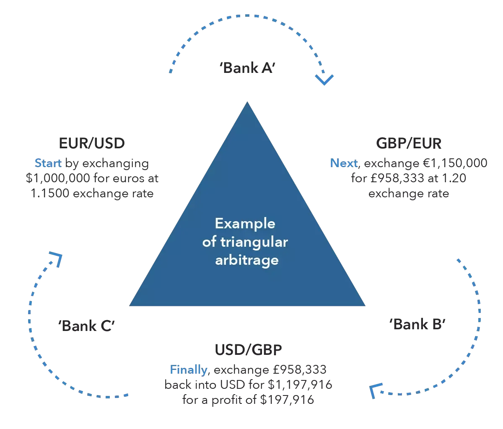

## Table of Contents

## What is forex trading arbitrage?

Forex trading arbitrage is a strategy where traders try to make money by taking advantage of small differences in currency prices between different markets. Imagine you can buy a currency at a lower price in one place and sell it at a higher price somewhere else at the same time. That's basically what arbitrage is about. Traders use special software and quick actions to spot these price differences and make trades before the prices change.

This method can seem like an easy way to make profits, but it's not without risks. The main challenge is that these price differences often disappear very quickly because many traders are looking for the same opportunities. Also, there are costs like transaction fees that can eat into the profits. So, while arbitrage can be profitable, it requires fast technology, careful planning, and a good understanding of the markets to be successful.

## How does arbitrage work in the forex market?

Arbitrage in the forex market is like finding a deal where you can buy something cheap in one place and sell it for more in another place, but with currencies. Imagine the Euro is worth a bit less in New York than it is in London. A trader can buy Euros in New York and then quickly sell them in London for a profit. This works because the forex market is huge and spread all over the world, so sometimes the price of a currency can be slightly different from one place to another.

However, making money this way isn't easy. The price differences that traders look for usually don't last long because many people are trying to do the same thing. Also, there are costs like fees for making trades that can make the profit smaller. To do [arbitrage](/wiki/arbitrage) well, traders need fast computers to spot these price differences quickly and make trades before the prices change. It's a bit like a race where being the fastest can make all the difference.

## What are the different types of forex arbitrage strategies?

There are a few different ways people try to make money from [forex](/wiki/forex-system) arbitrage. One way is called "spatial arbitrage." This is when someone buys a currency where it's cheaper and sells it where it's more expensive at the same time. For example, if the Euro is cheaper in Tokyo than in New York, a trader can buy Euros in Tokyo and sell them in New York to make a profit. Another way is "triangular arbitrage," which is a bit more complicated. It involves trading three different currencies in a loop to take advantage of price differences. For instance, a trader might start with US dollars, buy Euros, then use those Euros to buy British pounds, and finally use the pounds to buy back US dollars, hopefully ending up with more dollars than they started with.

Another type of forex arbitrage is "[statistical arbitrage](/wiki/statistical-arbitrage)." This method uses math and computer programs to find patterns in currency prices that might not be obvious. Traders use these patterns to predict when prices might change and make trades based on those predictions. It's a bit like trying to guess the future based on past behavior. Lastly, there's "covered interest arbitrage," which involves taking advantage of differences in interest rates between two countries. A trader might borrow money in a country with low interest rates, convert it to another currency, and invest it in a country with higher interest rates. The goal is to make more money from the interest than what they have to pay back on the loan, even after accounting for any changes in currency values.

## What are the basic requirements to start forex arbitrage trading?

To start forex arbitrage trading, you need a few basic things. First, you need a fast and reliable internet connection. This is important because arbitrage involves making quick trades based on small differences in currency prices, so you need to be able to act fast. You also need a good trading platform that can show you prices from different markets around the world. This helps you spot the price differences you need to make a profit. Finally, you need some money to start trading with. This is called your trading capital, and you'll use it to buy and sell currencies.

Another important requirement is having the right software. Many arbitrage traders use special computer programs that can automatically find and take advantage of price differences. These programs can be expensive, but they can also help you make trades faster and more accurately than you could on your own. It's also a good idea to have some knowledge about how the forex market works. Understanding things like currency pairs, exchange rates, and how to read market data can help you make better trading decisions. While you don't need to be an expert, having a basic understanding can make a big difference in your success.

## How can beginners identify arbitrage opportunities in forex?

For beginners looking to identify arbitrage opportunities in forex, the first step is to understand what arbitrage is. It's about finding small differences in the price of a currency between different markets. For example, if the Euro is cheaper in one place than another, you can buy it where it's cheaper and sell it where it's more expensive. To spot these opportunities, beginners need to keep an eye on currency prices across different trading platforms. This means watching the prices of the same currency pair on different exchanges to see if there's a difference that can be used to make a profit.

Using special software can make this easier. There are programs designed to automatically scan different markets and find these price differences for you. These tools can be a big help, especially for beginners who might not be able to watch all the markets at once. However, it's important to remember that these opportunities can disappear quickly because many traders are looking for the same thing. So, beginners need to act fast and be ready to make trades as soon as they spot a chance to make a profit.

## What are the risks associated with forex arbitrage?

Forex arbitrage can seem like a good way to make money, but it comes with some risks. One big risk is that the price differences that traders look for often don't last long. Many people are trying to do the same thing, so these opportunities can disappear in just a few seconds. This means that if you're not quick enough, you might miss out on making a profit. Also, there are costs like fees for making trades that can eat into your profits. These fees can make it harder to make money, especially if the price differences are very small.

Another risk is that you might need special software to find these price differences quickly. This software can be expensive, and it's not always easy to use. If you don't have the right tools or if they don't work well, you could miss out on good opportunities. Plus, even with the best tools, there's always a chance that something could go wrong with your trades. For example, if there's a delay in your internet connection, you might not be able to buy or sell at the right time. So, while forex arbitrage can be profitable, it's important to understand these risks and be prepared for them.

## How does technology and software assist in forex arbitrage?

Technology and software play a big role in helping people do forex arbitrage. They make it easier to find the small differences in currency prices that traders need to make a profit. Special computer programs can look at lots of markets at the same time and quickly spot these price differences. This is really helpful because these opportunities can disappear fast, and it's hard for a person to watch all the markets by themselves. The software can also make trades automatically, so you don't have to do everything by hand. This means you can act fast and not miss out on making money.

Using technology also means you need to have a good internet connection. If your internet is slow, you might not be able to make trades at the right time. Plus, the software can be expensive, and it might take some time to learn how to use it well. But if you can get the right tools and use them properly, they can really help you do better at forex arbitrage. They can help you find more opportunities and make trades faster, which can lead to more profits.

## What is triangular arbitrage and how is it executed in forex trading?

Triangular arbitrage is a way to make money in forex trading by using three different currencies to take advantage of price differences. Imagine you start with US dollars. You can buy Euros with your dollars, then use those Euros to buy British pounds, and finally use the pounds to buy back US dollars. If you end up with more dollars than you started with, you've made a profit. This works because sometimes the exchange rates between three currencies don't match up perfectly, creating a chance to make money.

To do triangular arbitrage, you need to be quick and have good technology. You need to watch the exchange rates of the three currencies very closely. When you see a chance to make a profit, you have to act fast because these opportunities don't last long. Special software can help by automatically finding these price differences and making the trades for you. But even with the best tools, it's still a tricky thing to do because there are costs like fees that can eat into your profits, and the markets are always changing.

## How do interest rate differentials affect forex arbitrage strategies?

Interest rate differentials can play a big role in forex arbitrage, especially in a strategy called covered interest arbitrage. This is when traders borrow money in a country with low interest rates, convert it to another currency, and then invest it in a country with higher interest rates. The goal is to make more money from the interest than what they have to pay back on the loan. But, they also need to think about how the value of the currencies might change. If the currency they borrowed in goes up in value compared to the currency they invested in, it could eat into their profits.

For example, if the [interest rate](/wiki/interest-rate-trading-strategies) in the US is lower than in Australia, a trader might borrow US dollars, convert them to Australian dollars, and invest in Australia. If the interest they earn in Australia is more than what they have to pay back in the US, they make a profit. But, if the US dollar gets stronger against the Australian dollar while they're doing this, it could make their profit smaller or even turn it into a loss. So, traders need to keep an eye on both interest rates and currency values to make covered interest arbitrage work.

## What are the regulatory considerations for forex arbitrage trading?

Forex arbitrage trading involves buying and selling currencies to make a profit from small price differences. But, there are rules you need to follow when you do this. Different countries have different rules about trading forex, and you need to make sure you know and follow these rules. Some countries might require you to have a special license to trade forex, while others might have limits on how much you can trade or what kinds of trades you can make.

Also, there are rules about using software and technology for arbitrage. Some places might have rules about what kind of software you can use or how you can use it. You might need to report your trades to a government agency, or there might be rules about how you handle the money you make from trading. It's important to understand these rules because if you don't follow them, you could get in trouble or have to pay fines. So, before you start forex arbitrage trading, it's a good idea to learn about the rules in your country and make sure you follow them.

## How can advanced traders optimize their forex arbitrage strategies?

Advanced traders can optimize their forex arbitrage strategies by using high-speed technology and sophisticated software. These tools help them spot price differences quickly and make trades before the opportunities disappear. They might use algorithms that can analyze lots of data in real time to find the best chances for arbitrage. This means they can act faster and more accurately than someone who's just looking at the markets themselves. Also, advanced traders often use multiple trading platforms to compare prices from different markets around the world. This gives them a better chance of finding the small price differences they need to make a profit.

Another way advanced traders can optimize their strategies is by understanding and using different types of arbitrage, like triangular arbitrage or covered interest arbitrage. They can use their knowledge of how currencies and interest rates work together to find more opportunities. For example, they might look at how interest rate changes in different countries could affect currency values and use that information to make better trades. They also need to keep an eye on transaction costs and make sure these costs don't eat into their profits too much. By combining technology, knowledge, and careful planning, advanced traders can make their forex arbitrage strategies more effective and increase their chances of making money.

## What case studies or examples illustrate successful forex arbitrage?

One example of successful forex arbitrage happened in the early 2000s when a trader named John saw a small difference in the price of the Euro between two different trading platforms. The Euro was cheaper on one platform and more expensive on another. John quickly bought Euros on the cheaper platform and sold them on the more expensive one, making a profit from the price difference. This opportunity only lasted for a few seconds, but John used special software to spot it and make the trade fast enough. His success showed how important it is to have good technology and be ready to act quickly in forex arbitrage.

Another case involved a group of traders who used triangular arbitrage to make money. They started with US dollars, bought Euros, then used those Euros to buy British pounds, and finally used the pounds to buy back US dollars. They found that the exchange rates between these three currencies didn't match up perfectly, which gave them a chance to make a profit. By using advanced software to watch the markets and make trades automatically, they were able to take advantage of this opportunity and end up with more dollars than they started with. This example shows how understanding the relationships between different currencies can help in forex arbitrage.

## References & Further Reading

[1]: Bergstra, J., Bardenet, R., Bengio, Y., & Kégl, B. (2011). ["Algorithms for Hyper-Parameter Optimization."](https://papers.nips.cc/paper/4443-algorithms-for-hyper-parameter-optimization) Advances in Neural Information Processing Systems 24.

[2]: ["Advances in Financial Machine Learning"](https://www.amazon.com/Advances-Financial-Machine-Learning-Marcos/dp/1119482089) by Marcos Lopez de Prado

[3]: ["Evidence-Based Technical Analysis: Applying the Scientific Method and Statistical Inference to Trading Signals"](https://www.amazon.com/Evidence-Based-Technical-Analysis-Scientific-Statistical/dp/0470008741) by David Aronson

[4]: ["Machine Learning for Algorithmic Trading"](https://github.com/stefan-jansen/machine-learning-for-trading) by Stefan Jansen

[5]: ["Quantitative Trading: How to Build Your Own Algorithmic Trading Business"](https://www.amazon.com/Quantitative-Trading-Build-Algorithmic-Business/dp/1119800064) by Ernest P. Chan