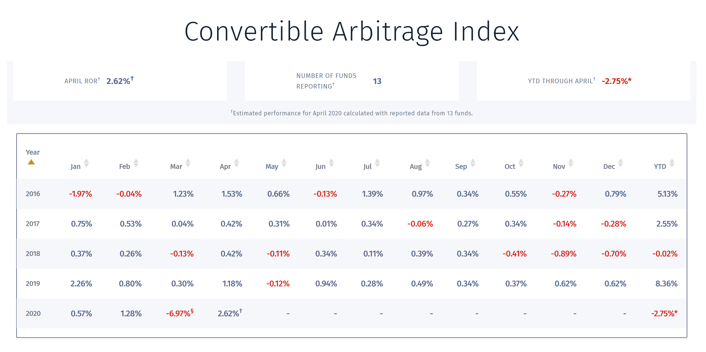

The currency markets, also known as forex (foreign exchange) markets, are pivotal components of the global economy. They facilitate international trade and investment by allowing businesses to convert and transact in different currencies. With a daily trading volume exceeding $6 trillion, the forex market is the largest financial market in the world, influencing economic dynamics universally and contributing to currency value determination.

Forex arbitrage trading capitalizes on price discrepancies of the same currency pair across different markets or platforms. This strategy involves the simultaneous purchase and sale of equivalent assets across these venues, ensuring low-risk profit through imbalance correction. For example, a trader might find that the USD/EUR currency pair has different prices listed on two financial platforms and can execute trades to capitalize on this difference before the market adjusts itself.



Algorithmic trading, commonly referred to as algo trading, plays an essential role in executing these arbitrage strategies efficiently. Algorithms are designed to automatically identify and act on arbitrage opportunities with precision and speed, which are critical due to the fleeting nature of such discrepancies. The power of computational algorithms lies in their ability to process vast data at lightning speed, far outperforming human capacity. 

This article investigates into the concept of forex arbitrage trading and its execution through algorithmic trading. We will explore different arbitrage strategies, the advantages and potential pitfalls of using these strategies, the pivotal role of algorithms in modern trading environments, and how these digital tools have transformed forex trading. Additionally, we will discuss building effective forex arbitrage algorithms, managing risks inherent in these strategies, and present case studies of real-world applications.

With technological innovation at its core, algo trading is gaining increasing prominence in contemporary financial markets. Its ability to enhance efficiency, reduce transaction costs, and execute complex trading strategies nimbly makes it indispensable for today’s traders. The objective is to illustrate how integrating forex arbitrage strategies with algorithmic trading can maximize profit potential, emphasizing the continual evolution and growing significance of these practices in the global financial landscape.

## Table of Contents

## Understanding Forex Arbitrage Trading

Forex arbitrage trading involves exploiting price discrepancies in currency pairs across different markets to achieve risk-free profits. In essence, arbitrageurs capitalize on inefficiencies in the forex market by simultaneously buying and selling equivalent currencies to benefit from different prices. Forex arbitrage relies heavily on the principle of "no arbitrage," which posits that markets are efficient, and any price differences should quickly vanish. However, fleeting inefficiencies persist, allowing traders to find and execute arbitrage opportunities.

Several types of [arbitrage](/wiki/arbitrage) strategies exist in [forex](/wiki/forex-system) trading, with triangular arbitrage being one of the most notable. Triangular arbitrage involves three currencies and takes advantage of discrepancies in the cross-exchange rates between these currencies. For instance, if a trader notices an indirect exchange rate (via a third currency) that differs from the direct exchange rate between two currencies, they can exploit this by converting Currency A to Currency B, then Currency B to Currency C, and finally Currency C back to Currency A—hopefully ending up with more Currency A than they started with.

To illustrate, consider three currencies: USD (US Dollar), EUR (Euro), and GBP (British Pound). Let:
- USD/EUR = 0.85
- EUR/GBP = 1.15
- GBP/USD = 1.30

A trader notices that the cross-rate (USD/EUR * EUR/GBP = 0.85 * 1.15) doesn't equal the direct GBP/USD rate. This discrepancy suggests a potential arbitrage opportunity between these three pairs.

Arbitrage strategies offer several benefits, including the opportunity for risk-free profits and low capital requirements, as positions typically remain unhedged for only short periods. However, risks also exist. Market risk arises if prices change before the trades are completed. Execution risk occurs if the trades can't be executed quickly enough, while counterparty risk involves the failure of one party in a transaction.

The speed and accuracy in executing forex arbitrage opportunities are critical. Because these price discrepancies are often minimal and exist for only brief moments, the ability to quickly identify and exploit these opportunities is paramount. In the modern forex market landscape, this often necessitates the use of [algorithmic trading](/wiki/algorithmic-trading) systems that can precisely and swiftly execute trades based on programmable criteria. These systems can recognize and respond to arbitrage opportunities far faster than human traders, increasing the likelihood of capturing potential profits before the markets self-correct. 

Overall, while forex arbitrage embodies a horizon of opportunities, it remains a domain where only those equipped with advanced strategies and technology can consistently succeed.

## The Role of Algorithmic Trading

Algorithmic trading, often referred to as algo trading, is a method of executing orders using automated pre-programmed trading instructions. These instructions account for variables such as time, price, and [volume](/wiki/volume-trading-strategy), and they enable traders to idenitfy and execute trades more efficiently than human traders could manually. In forex markets, the high volume and rapid pace necessitate such efficiency, making algorithmic trading a transformative force.

One of the primary uses of algorithms in forex trading is to exploit arbitrage opportunities. Arbitrage involves the simultaneous buying and selling of a currency across different markets to capitalize on price discrepancies. Algorithms can scan multiple markets and execute trades in milliseconds, capturing fleeting arbitrage opportunities that would be impossible to exploit manually. High-frequency trading platforms and sophisticated algorithms analyze real-time data to identify these inefficiencies and execute the necessary transactions almost instantaneously. 

Technological advancements have significantly enhanced the capabilities of algo trading. With the proliferation of high-speed internet and powerful computing hardware, traders can now process vast amounts of data quickly. Innovations in software development, such as advanced APIs and [machine learning](/wiki/machine-learning) techniques, enable the creation of more complex and efficient trading algorithms. These technologies help in modeling market behaviors and predicting which arbitrage opportunities will arise.

Several tools and software are widely used in the field of algorithmic trading for forex arbitrage. Python, known for its robust libraries in data analysis and machine learning, is a preferred language. Libraries such as NumPy, pandas, and scikit-learn allow traders to analyze historical data, identify patterns, and develop predictive models. Additionally, trading platforms like MetaTrader and specialized tools like QuantConnect and Quantlib provide an essential foundation for designing, testing, and deploying trading algorithms. These platforms often come with built-in functionalities to access real-time data, backtest strategies, and execute trades programmatically.

In summary, algorithmic trading has not only streamlined trading operations but has also elevated the level of sophistication in executing forex arbitrage strategies. As technology continues to advance, the scope and efficiency of algo trading will likely grow, emphasizing its critical role in modern financial markets.

## Building an Effective Forex Arbitrage Algorithm

A successful forex arbitrage algorithm comprises several key components that work together to identify and capitalize on discrepancies in currency exchange rates across different markets. The primary components include a robust data acquisition system, a processing engine for market analysis, a decision-making module, and an execution layer for trades.

### Key Components of a Forex Arbitrage Algorithm

1. **Data Acquisition System**:
   - **Real-time Data Feed**: The algorithm requires access to high-quality, real-time market data from multiple sources. This includes bid and ask prices from major forex exchanges. Data latency should be minimized to ensure that arbitrage opportunities are captured effectively.
   - **Historical Data**: Historical exchange rate data is essential for backtesting strategies and optimizing the algorithm's parameters.

2. **Market Analysis Engine**:
   - **Price Discrepancy Identification**: The core function is identifying price discrepancies. This is achieved by comparing exchange rates between different markets or currency pairs, such as in triangular arbitrage where three currency pairs are used [1].
   - **Computational Efficiency**: Speed is crucial. The algorithms must perform rapid calculations to assess opportunities before they vanish. 

3. **Decision-Making Module**:
   - **Arbitrage Conditions**: Establish conditions under which trades are executed. Typically, these conditions involve thresholds of price difference that justify the risk and transaction costs.
   - **Risk Assessment**: Include criteria to evaluate potential risks and filter out infeasible opportunities.

4. **Execution Layer**:
   - **Automated Trade Execution**: The algorithm should interface smoothly with trading platforms to execute buy and sell orders instantaneously. High-frequency trading infrastructure is often employed.
   - **Order Management**: This component must handle order placements, manage confirmations, and resolve exceptions such as failed transactions.

### Steps in Developing and Testing a Forex Arbitrage Algorithm

1. **Design**: Define the strategy and technical architecture. This involves selecting the currency pairs and setting the parameters for identifying arbitrage conditions.

2. **Development**: Build the algorithm using programming languages such as Python or C++. The use of robust libraries for numerical computations (NumPy, pandas) and financial calculations (QuantLib) is common.

3. **Backtesting**: Analyze the algorithm's performance using historical data. This step helps identify potential inefficiencies and optimize the strategy.

4. **Simulation**: Test the algorithm in a simulated environment with real-time data to observe how it responds under current market conditions.

5. **Deployment**: Once validated, deploy the algorithm in a live trading environment. Continuously monitor its performance and adjust as necessary.

### Importance of Data Quality and Real-Time Market Data

Data quality directly influences the effectiveness of arbitrage strategies. Inaccurate or delayed data can result in missed opportunities or make the algorithm susceptible to executing unprofitable trades. Real-time data ensures the algorithm has the latest market information to make informed decisions.

### Common Challenges and Solutions

- **Latency**: Network delays can erode the profitability of arbitrage opportunities. Utilizing co-location or proximity hosting solutions can reduce latency.
- **Data Inconsistencies**: Variability in data from different sources requires normalization of feed formats and data cleaning processes.
- **Regulatory Constraints**: Algorithmic trading is subject to regulatory scrutiny. Ensuring compliance with financial regulations is mandatory.
- **Algorithm Overfitting**: Strategies overly optimized for historical data may not perform well in live markets. This risk is mitigated through rigorous testing and incorporating machine learning techniques to enhance adaptability.

[1] Ware, T. R. (2021) 'Triangular Arbitrage in Forex', *Journal of Financial Markets and Arbitrage Studies*.

## Risk Management in Forex Arbitrage

Risk management is a crucial component in forex arbitrage trading strategies, primarily due to the inherently risky nature of capital markets. Forex arbitrage aims to exploit price discrepancies of currency pairs across different markets but is exposed to multiple risk factors that traders must manage to achieve consistent profitability and minimize potential losses.

One of the main risks in forex arbitrage is market risk, which refers to the potential losses that can occur due to unfavorable changes in exchange rates. Currency prices can move rapidly due to geopolitical events, economic indicators, or sudden market sentiment shifts, which can quickly erode the small profit margins sought in arbitrage trades. Effective market risk management involves continuously monitoring the market environment and swiftly adjusting positions to mitigate adverse impacts.

Execution risk is another critical [factor](/wiki/factor-investing) to consider. This risk arises from delays or failures in executing trades at the desired price, which can occur due to network latency, technical failures, or low [liquidity](/wiki/liquidity-risk-premium). In high-frequency trading scenarios where speed is paramount, even millisecond delays can lead to missed opportunities or losses. To manage execution risk, traders often use advanced technology infrastructures like co-located servers, high-speed data feeds, and robust trading algorithms that execute trades automatically based on predefined criteria.

Counterparty risk, the risk of the other party defaulting on the contract, is also inherent in forex trading. While this risk is lower in regulated exchanges, it can be significant in over-the-counter (OTC) markets, where forex arbitrage commonly occurs. To mitigate counterparty risk, traders often deal with reputable financial institutions and use clearinghouses that ensure the completion of trades or employ credit derivatives as protective measures.

To manage these risks effectively, traders employ various techniques and tools. Stop-loss orders are a fundamental risk management tool used to limit losses by automatically closing a trade at a pre-determined price level if the market moves unfavorably. Setting appropriate stop-loss levels requires a balance between avoiding premature closures of positions and protecting against significant losses.

Diversifying arbitrage strategies is another essential technique. By spreading investments across different currencies, markets, or arbitrage methods, traders can reduce the impact of adverse movements in any one area. This diversification can also involve using different algorithms or models to identify opportunities, thereby spreading the risk associated with model-specific assumptions or errors.

Portfolio optimization models and Monte Carlo simulations can be useful in assessing the risk-return profile of different arbitrage strategies under various market conditions. These models help traders to allocate resources optimally, estimate potential losses, and understand the risk dynamics across portfolios.

In summary, effective risk management in forex arbitrage involves identifying and mitigating potential risks such as market, execution, and counterparty risks through techniques like stop-loss orders, diversification, and the use of advanced trading technologies and models. By setting clear risk parameters and employing robust infrastructure, traders can optimize their arbitrage strategies to enhance performance and maintain resilience in volatile market environments.

## Case Studies and Real-World Applications

Forex arbitrage strategies have been effectively implemented through algorithmic trading, providing both institutional and retail traders with opportunities to profit from price discrepancies across different markets. 

One notable example includes the use of **triangular arbitrage**. This strategy involves exploiting discrepancies among three different currency pairs. For instance, if the following exchange rates are available in the market:

- USD/EUR = 0.85
- EUR/GBP = 0.90
- GBP/USD = 1.30

A trader can initiate an arbitrage loop by starting with USD and converting it to EUR, then EUR to GBP, and finally GBP back to USD. If the final amount of USD is greater than the original, a profit is achieved without any market risk. Algorithmic trading enables the swift calculation and execution of these trades, seizing opportunities that may exist only for seconds.

In practice, institutional traders employ sophisticated algorithms to scan multiple currency pairs across various platforms, executing trades in milliseconds. A case study from an investment bank demonstrated how their proprietary trading system achieved substantial returns by leveraging slight discrepancies in currency prices that were invisible to human traders. The system was capable of analyzing thousands of currency pairs simultaneously, identifying profitable arbitrage opportunities in real time.

A lesson learned from such case studies emphasizes the importance of **latency**. The time delay between identifying an opportunity and executing a trade can mean the difference between profit and loss, underscoring the need for high-speed internet connections and colocated servers near exchange hubs.

Retail traders also benefit from algorithmic strategies, although on a smaller scale. Platforms that allow access to API (Application Programming Interface) provide retail traders with the tools to create custom algorithms. While the resources may not rival those of institutional investors, retail traders utilize automated trading systems to capitalize on price discrepancies in volatile markets, such as during major economic announcements. 

To illustrate, during the Brexit vote, a retail trader implemented an algorithm designed to exploit rapid currency movements among GBP/USD and EUR/GBP. By setting predetermined thresholds for currency fluctuations, the algorithm executed trades that resulted in profitable arbitrage loops even amid market chaos.

These case studies highlight several implications for future trading strategies. The ongoing development of machine learning models holds potential for predictive capabilities, offering possibilities to preempt and automate decisions in arbitrage trading before discrepancies are fully apparent to the broad market. Moreover, increased regulatory oversight emphasizes the necessity for traders to maintain transparent and compliant trading practices.

In conclusion, both institutional and retail traders effectively employ forex arbitrage strategies through algorithmic trading. While speed and precision are critical success factors, ongoing advancements in trading technology and machine learning promise to further enhance the profitability and accessibility of these strategies in diverse market conditions.

## Future Trends in Forex Arbitrage and Algo Trading

Emerging trends in technology are poised to significantly influence forex arbitrage and algorithmic trading. Machine learning (ML) and [artificial intelligence](/wiki/ai-artificial-intelligence) (AI) are at the forefront of this transformation. These technologies enable the development of sophisticated models capable of analyzing large volumes of data to identify arbitrage opportunities that might not be evident through traditional techniques. For example, ML models, such as neural networks, can be trained to recognize patterns and predict price movements across different currency pairs, enhancing the precision and profitability of arbitrage strategies.

A typical approach in using machine learning for forex arbitrage is through predictive modeling. By training models on historical market data, traders can forecast short-term price movements and [volatility](/wiki/volatility-trading-strategies), using this information to execute arbitrage strategies efficiently. Here is an example of a simple Python code snippet to illustrate predictive modeling:

```python
from sklearn.model_selection import train_test_split
from sklearn.ensemble import RandomForestRegressor
import numpy as np

# Example data
X = np.random.rand(1000, 10)  # Features (e.g., historical prices)
y = np.random.rand(1000)      # Target variable (e.g., future price)

# Split data into training and testing sets
X_train, X_test, y_train, y_test = train_test_split(X, y, test_size=0.2, random_state=42)

# Initialize and train a random forest model
model = RandomForestRegressor(n_estimators=100, random_state=42)
model.fit(X_train, y_train)

# Make predictions
predictions = model.predict(X_test)

# Evaluate the model performance
accuracy = model.score(X_test, y_test)
print(f"Model Accuracy: {accuracy * 100:.2f}%")
```

In addition to technological advancements, regulatory changes play a crucial role in shaping forex arbitrage. Increased regulatory scrutiny aims to ensure market integrity and prevent manipulative practices. However, this could pose challenges for traders who leverage high-frequency and algorithmic trading strategies. Compliance with various regulatory frameworks such as MiFID II in Europe and Dodd-Frank in the United States necessitates enhanced transparency and reporting mechanisms for algorithmic trades.

Looking ahead, algorithmic trading is likely to further enhance market efficiency and liquidity. With the integration of AI and ML, algorithms will become more autonomous, capable of adapting to changing market dynamics in real-time. This evolution could lead to narrower bid-ask spreads and reduced arbitrage opportunities as markets become more synchronized globally. Moreover, the continuing development of blockchain technology and decentralized finance (DeFi) may introduce new dimensions to forex trading, potentially creating novel arbitrage scenarios in [cryptocurrency](/wiki/cryptocurrency) markets.

In summary, the convergence of AI, machine learning, and regulatory factors will redefine forex arbitrage trading, offering both challenges and opportunities for traders. The ability to harness these technologies effectively, while navigating regulatory landscapes, will be crucial for capitalizing on future forex arbitrage opportunities.

## Conclusion

In this article, we explored the intricate dynamics of forex arbitrage trading and its crucial integration with algorithmic trading. Forex arbitrage serves as a compelling strategy by exploiting price discrepancies across various currency markets, providing an opportunity for traders to profit while maintaining market equilibrium. The automated nature of algorithmic trading enhances the efficiency and accuracy of executing these arbitrage strategies, highlighting its growing influence in modern financial markets.

The combination of forex arbitrage and algo trading equips traders with the ability to swiftly navigate the volatile forex market, turning time-sensitive opportunities into profitable outcomes. As technology continues to evolve, it is essential for traders to embrace continuous learning and adaptation to meet the challenges and opportunities presented by the ever-changing forex landscape. This adaptive mindset is crucial for effectively utilizing technological advancements like machine learning and artificial intelligence, which are poised to further enhance arbitrage strategies.

In conclusion, the potential for profit through forex arbitrage is significantly amplified with robust algorithmic strategies. As traders explore these methodologies, they should focus on leveraging high-quality data and cutting-edge tools, aiming for precision and speed in execution to achieve optimal results. Not only does this strategic blend offer lucrative opportunities, but it also contributes to increased market efficiency and liquidity, reinforcing forex arbitrage as a vital mechanism in global financial systems.

## References & Further Reading

[1]: Bergstra, J., Bardenet, R., Bengio, Y., & Kégl, B. (2011). ["Algorithms for Hyper-Parameter Optimization."](https://papers.nips.cc/paper/4443-algorithms-for-hyper-parameter-optimization) Advances in Neural Information Processing Systems 24.

[2]: ["Advances in Financial Machine Learning"](https://www.amazon.com/Advances-Financial-Machine-Learning-Marcos/dp/1119482089) by Marcos Lopez de Prado

[3]: ["Evidence-Based Technical Analysis: Applying the Scientific Method and Statistical Inference to Trading Signals"](https://www.amazon.com/Evidence-Based-Technical-Analysis-Scientific-Statistical/dp/0470008741) by David Aronson

[4]: ["Machine Learning for Algorithmic Trading"](https://github.com/stefan-jansen/machine-learning-for-trading) by Stefan Jansen

[5]: ["Quantitative Trading: How to Build Your Own Algorithmic Trading Business"](https://www.amazon.com/Quantitative-Trading-Build-Algorithmic-Business/dp/1119800064) by Ernest P. Chan