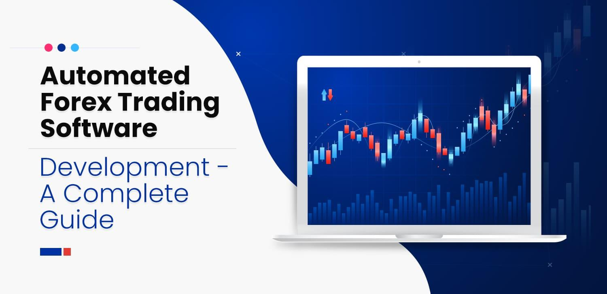

Welcome to our comprehensive guide on hands-free trading through forex automation and algo trading software. Technology has revolutionized forex trading, allowing traders to automate their strategies, thereby minimizing manual input and reducing the emotional influences that can negatively affect trading decisions. Automated trading systems, powered by sophisticated algorithms, have become an integral part of the trading ecosystem, supporting traders to execute trades with precision and speed.

In this guide, we will explore the multifaceted benefits that come with employing automated software in forex trading. These include the elimination of emotions from trading, the capacity to operate on multiple markets concurrently, and the potential to enhance decision-making processes through systematic strategy execution. By understanding how these systems function, traders can make informed choices about which software aligns best with their trading objectives and risk tolerance.



Automation does not come without its challenges, however. We will discuss potential pitfalls such as over-reliance on automated systems and the unpredictable nature of forex markets. Understanding these risks is crucial for any trader aspiring to leverage technology effectively.

By the end of this article, you will have a comprehensive understanding of how forex automation and algo trading software operate. You will also gain insights into maximizing your trading efficiency and effectiveness, ensuring that you are well-equipped to navigate the complexities of forex trading with confidence and competence.

## Table of Contents

## What is Forex Automation Trading Software?

Forex automation trading software refers to specialized computer programs that facilitate the automation of trading strategies in the forex market. These programs are engineered to execute trades on behalf of traders by following a set of predefined rules and algorithms. The primary advantage of using such software is the reduction of human emotional interference, which can significantly affect trading decisions. By relying on a systematic approach, these tools ensure that trades are executed consistently, according to the trader's strategic framework.

Automation trading software generally falls into a few distinct categories based on their functionality and integration capabilities. Some of these include:

1. **Expert Advisors (EAs):** Often used with platforms like MetaTrader, EAs are scripts or programs coded to follow specific trading strategies. They allow traders to perform technical analysis and manage transactions without manual input, operating 24/7 to seize trading opportunities as they arise.

2. **Algorithmic Trading Systems:** These are more complex than simple EAs and often involve sophisticated algorithms that can analyze market conditions quickly. They might incorporate elements like statistical arbitrage, machine learning, or predictive analytics to forecast market moves and execute trades accordingly.

3. **High-Frequency Trading (HFT) Software:** This variant focuses on executing a large number of orders at extremely fast speeds, aiming to profit from small price differentials. While HFT is more prevalent in equity and futures markets due to the requisite infrastructure, it is gradually finding a foothold in forex trading as well.

Automation tools fit seamlessly into the modern [forex](/wiki/forex-system) trading landscape by leveraging powerful computational abilities and enhanced data processing. For instance, Python, a popular language in financial modeling, can be used to develop [algorithmic trading](/wiki/algorithmic-trading) strategies. A basic example of an algorithm that could be automated using Python would be a moving average crossover strategy:

```python
import pandas as pd

def moving_average_crossover(data, short_window=40, long_window=100):
    data['short_mavg'] = data['Close'].rolling(window=short_window, min_periods=1).mean()
    data['long_mavg'] = data['Close'].rolling(window=long_window, min_periods=1).mean()
    data['signal'] = 0
    data['signal'][short_window:] = np.where(data['short_mavg'][short_window:] > data['long_mavg'][short_window:], 1, 0)
    data['positions'] = data['signal'].diff()
    return data

# Here 'data' is a Pandas DataFrame containing forex data with a 'Close' price series.
```

This script checks for instances where a short-term moving average crosses above a long-term moving average, signaling potential buy opportunities. Such automation reduces the need for constant monitoring and decision-making during trading hours.

Overall, forex automation trading software is instrumental in creating efficient, consistent, and emotion-free trading environments. Its integration into existing trading systems offers traders numerous advantages and has become indispensable for those looking to leverage technology for effective trading in the global forex markets.

## Advantages of Hands-Free Trading

Hands-free trading through forex automation offers several advantages, fundamentally altering the approach to currency trading by allowing traders to concentrate on developing their strategies rather than overseeing trade executions. The capacity to automate trading introduces a more analytical and systematic process, freeing traders from the need to constantly monitor the markets and manually execute trades. This efficiency gains result in a more thorough approach to researching potential trades and analyzing market trends, thereby enhancing the overall quality of trading strategies.

One significant advantage of automated systems is their ability to mitigate the emotional biases that often cloud human judgment and decision-making in trading. Traders may experience a range of emotions, including fear and greed, which can lead to impulsive or irrational decisions that undermine their trading strategies. Automated systems operate based on predefined algorithms and rules without emotional interference. By executing trades solely based on data-driven insights, these systems uphold consistency and discipline in trading, which are crucial to long-term success in the volatile forex market.

Moreover, forex automation enables traders to engage in multiple markets simultaneously, thereby broadening their exposure to various trading opportunities and reducing risk through diversification. The software's capability to process vast amounts of data at high speeds ensures that traders do not miss potential opportunities in different currency pairs or global markets. This level of multitasking is virtually impossible to achieve through manual trading, where the trader is constrained by their capacity to monitor only a limited number of markets at any given time.

Automation can also augment trading efficiency and effectiveness, as demonstrated in real-world applications. For example, a trader using an automated system can implement and backtest multiple trading strategies over historical data to identify the most profitable ones without risking actual capital. Such rigorous testing helps refine strategies and optimize parameters to achieve better trading outcomes. Consider the following simple Python pseudo-code that illustrates a basic [backtesting](/wiki/backtesting) approach for an automated trading strategy:

```python
def backtest_strategy(data, strategy):
    profit = 0
    for trade in data:
        if strategy.buy_condition(trade):
            profit += execute_buy(trade)
        elif strategy.sell_condition(trade):
            profit += execute_sell(trade)
    return profit

historical_data = load_historical_data('EURUSD')
trading_strategy = define_strategy(parameters)
backtesting_results = backtest_strategy(historical_data, trading_strategy)
print(f"Strategy Profit: {backtesting_results}")
```

This code exemplifies how an automated system can simulate trading strategies over historical price data to gauge their viability and make necessary adjustments before deploying them in live trading environments.

In summary, hands-free trading via forex automation enhances trading processes by minimizing manual intervention, reducing emotional influences, enabling multi-market participation, and facilitating strategic optimization through backtesting. These improvements make automated trading an attractive proposition for traders seeking to optimize their operations and enhance their decision-making quality.

## Choosing the Right Algorithmic Trading Software

When selecting the right algorithmic trading software, understanding your trading style and specific needs is crucial. Algorithmic trading software comes in various designs, tailored to accommodate different trading strategies, market interactions, and user preferences.

**Ease of Use:** The interface of the trading software should be intuitive and straightforward. Novice traders often benefit from software that offers guided tutorials or inbuilt help features, reducing the learning curve. For experienced traders, ease of use translates to readily accessible advanced features and seamless navigation within the application.

**Customization Options:** Effective software should allow for considerable customization. This flexibility means users can tailor algorithms to match their trading strategies. Whether you focus on trend following, arbitrage, or other strategies, the software should support custom script writing and the ability to adjust parameters like stop-loss, take-profit levels, and other trading signals. For traders who do not code, a drag-and-drop interface or pre-built strategy templates can be particularly advantageous.

**Compatibility with Trading Platforms:** It's essential to verify that the algorithmic software integrates smoothly with your chosen trading platform. Compatibility ensures that data feeds are correctly synchronized, and orders are executed precisely as intended. Many popular trading platforms, such as MetaTrader 4 (MT4), MetaTrader 5 (MT5), and others, have dedicated communities developing plugins and APIs that help connect them to various algorithmic trading software options.

**Customer Reviews and Trial Periods:** Before committing to a particular software, reviewing user feedback and professional evaluations can provide valuable insights into its real-world performance and reliability. Look for comments on speed, reliability, support, and updates. Furthermore, exploiting trial periods or free versions allows you to test software functionalities and effectiveness without financial risk.

**Key Features to Look For:** Robust algorithmic trading software often includes features such as:

- **Real-time Data Processing**: The software should process market data in real-time, ensuring decisions are based on the latest information.

- **Backtesting Capabilities**: This feature allows you to test your strategies against historical data to evaluate past performance and optimize algorithms.

- **Advanced Analytics and Reporting**: Detailed analytics give insights into trading performance, helping to fine-tune strategies. Comprehensive reporting capabilities assist in maintaining an audit trail for trades.

- **Security Measures**: Since trading involves sensitive data, your chosen software should offer strong encryption and data protection to safeguard against unauthorized access.

In conclusion, selecting the right algorithmic trading software involves a careful assessment of your needs, the software’s features, and the overall value it can bring to your trading endeavors. By prioritizing ease of use, customization, compatibility, and comprehensive analysis tools, you'll be better positioned to automate your trading strategy effectively.

## Key Features of Forex Trading Software

Forex trading software has revolutionized the way traders interact with the forex market by offering a suite of features that enhance trading efficiency and decision-making. Here, we delineate the key attributes to consider when selecting forex trading software to elevate trading strategies effectively.

A prominent feature to look for is **real-time monitoring**. This allows traders to track market conditions and price movements instantly, enabling quick decisions based on the most current data. Real-time monitoring means traders can execute trades at the most opportune moments, potentially increasing profitability while minimizing latency risks.

Another essential feature is **backtesting capabilities**. Backtesting involves running trading strategies against historical data to evaluate their effectiveness. This process can identify potential weaknesses in a strategy before it's deployed in the live market. For software to be effective, it should allow users to conduct comprehensive backtests with a variety of customizable parameters. The backtesting process usually involves programming trading algorithms using past data to simulate various market conditions and assessing the potential success rate of these strategies.

```python
import backtrader as bt

# Example of setting up a simple backtest using Python's Backtrader library
class TestStrategy(bt.Strategy):
    def next(self):
        # Simple Moving Average Crossover Strategy
        if self.dataclose[0] > self.sma[0]:
            self.buy(size=100)
        elif self.dataclose[0] < self.sma[0]:
            self.sell(size=100)

# Setup and run strategy
cerebro = bt.Cerebro()
cerebro.addstrategy(TestStrategy)
data = bt.feeds.YahooFinanceData(dataname='EURUSD=X',
                                 fromdate=datetime(2020, 1, 1),
                                 todate=datetime(2023, 1, 1))
cerebro.adddata(data)
cerebro.run()
```
The above code demonstrates a basic framework using the `Backtrader` library, highlighting how customizable strategies can be implemented and tested.

Effective software should also provide **customizable trading strategies**, which allow traders to adapt strategies based on specific market behaviors or personal risk tolerance. Customizability ensures that one can optimize algorithmic behaviors according to evolving market dynamics or personal insights.

Access to **detailed reporting and analytics** is crucial for tracking performance and making informed decisions. Ideal software should offer comprehensive reporting tools that present historical performance data, trade execution quality, and other relevant trading [statistics](/wiki/bayesian-statistics). These analytics empower traders to identify patterns, refine their strategies, and enhance overall trading efficacy.

Additionally, the ability to **integrate with existing trading systems** is an imperative feature. Compatibility with popular trading platforms like MetaTrader 4 or 5, among others, ensures that traders can seamlessly incorporate automated strategies without disrupting their current trading setup.

Lastly, a **user-friendly interface** is vital. A clear, intuitive interface reduces the learning curve for new users and allows seasoned traders to navigate complex data efficiently. The interface should offer responsive design elements and easy access to essential features without unnecessary complexity.

Forex trading software with these key features is indispensable for traders aiming to leverage automation for improved trading outcomes. As technology continues to evolve, these features become increasingly sophisticated, offering traders innovative tools to stay ahead in the competitive forex market.

## Important Considerations and Pitfalls

When utilizing forex automation trading software, traders must be vigilant about the potential risks and pitfalls associated with these systems. One primary risk is the over-reliance on automated systems, which can lead to complacency among traders. Automation can process trades based on predefined rules and algorithms, but it lacks human intuition and adaptability in volatile markets. This limitation can result in substantial losses during unforeseen market events, where human discretion might have been beneficial.

In addition to dependency risks, traders must understand the costs involved with trading software. Initial fees for acquiring the software can be significant, but there may also be other associated costs, such as subscription fees, updates, and potential hidden charges for accessing advanced features. Over time, these costs can accumulate and affect overall profitability.

Proper due diligence is crucial when selecting a trading software provider to avoid scams and invest in a reputable product. Traders should seek software with a track record of reliability and transparency. Investigating customer reviews and considering software with trial periods can offer insights into reliability and performance before making long-term commitments.

Strategies to mitigate these risks include maintaining a balanced approach that leverages the benefits of automated trading while staying engaged with market analysis. Regularly monitoring software performance and adjusting strategies as needed can help account for changing market conditions. Furthermore, implementing stop-loss orders and capital allocation limits can serve as safeguards against excessive losses. Continuing to educate oneself on market trends and software updates ensures that traders can adapt and optimize their automated strategies.

By acknowledging these considerations and taking proactive measures, traders can effectively mitigate risks and harness the potential of forex automation trading systems.

## Conclusion

Automated forex trading provides significant advantages for traders aiming to optimize their trading performance with reduced manual intervention. By integrating sophisticated algorithms and technology, traders can automate various aspects of their trading strategies, thus ensuring consistent execution and reducing the emotional biases that can often interfere with decision-making. Mastering the workings of these systems and judiciously choosing a compatible software package are the primary steps towards successful automation.

To maximize the efficacy of automated trading, traders should remain aware of the system's limitations. The market's unpredictability means that no algorithm can guarantee success under all conditions. Regular evaluation and updates of your trading system are crucial to adapting to changing market dynamics and maintaining optimal performance. 

It is also important to stay informed about the latest advancements in technology and trading strategies. The financial markets continually evolve, and staying adaptive allows traders to leverage new tools and methods to sustain a competitive edge. By doing so, traders can fully harness the potential of hands-free forex trading, enjoying both enhanced efficiency and prospective returns.

## References & Further Reading

[1]: Bergstra, J., Bardenet, R., Bengio, Y., & Kégl, B. (2011). ["Algorithms for Hyper-Parameter Optimization."](https://dl.acm.org/doi/10.5555/2986459.2986743) Advances in Neural Information Processing Systems 24.

[2]: ["Advances in Financial Machine Learning"](https://www.amazon.com/Advances-Financial-Machine-Learning-Marcos/dp/1119482089) by Marcos Lopez de Prado

[3]: ["Evidence-Based Technical Analysis: Applying the Scientific Method and Statistical Inference to Trading Signals"](https://www.amazon.com/Evidence-Based-Technical-Analysis-Scientific-Statistical/dp/0470008741) by David Aronson

[4]: ["Machine Learning for Algorithmic Trading"](https://github.com/stefan-jansen/machine-learning-for-trading) by Stefan Jansen

[5]: ["Quantitative Trading: How to Build Your Own Algorithmic Trading Business"](https://www.amazon.com/Quantitative-Trading-Build-Algorithmic-Business/dp/1119800064) by Ernest P. Chan