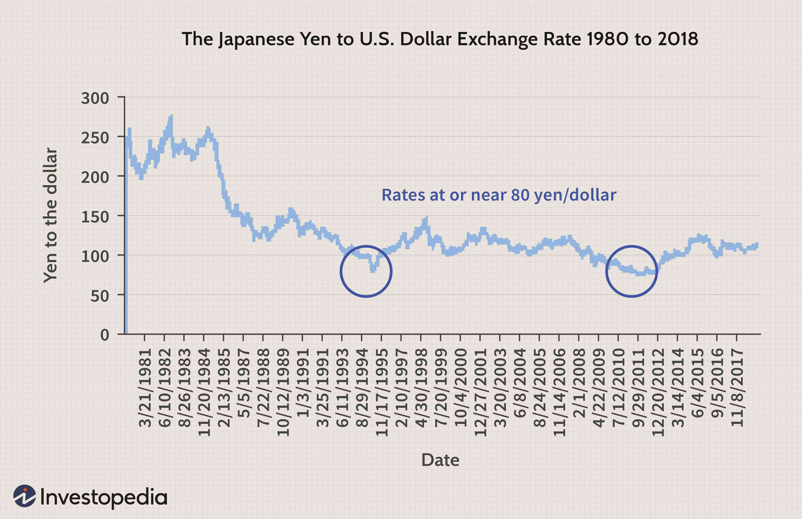

The foreign exchange market, commonly recognized as Forex, represents one of the largest and most liquid financial markets globally, with daily trading volumes exceeding $6 trillion as of 2019 (BIS, 2019). This expansive market encompasses a vast array of currencies, with the Japanese Yen (JPY) standing out as a crucial player due to its significant role in international trade and finance. The Yen's prominence is anchored in Japan's robust economic stature as one of the world's leading economies and its reputation for producing high-quality goods and pursuing innovative technologies.

The JPY's appeal is multifaceted, attributed to its inherent stability and extensive liquidity, which make it a preferred choice for investors seeking a safe haven in times of economic turbulence or global uncertainty. Its stability is bolstered by Japan's historically conservative fiscal policies and the currency's widespread use in both trade and finance across Asia.



Within this complex forex environment, algorithmic trading (algo trading) emerges as a vital tool for traders. This computerized approach enables the execution of trades based on pre-set rules and market data analyses, minimizing human emotions and biases. Algorithmic strategies can process vast volumes of market data rapidly, allowing traders to execute timely, informed decisions. The integration of algo trading in the Forex market can thus harness market efficiency, addressing the volatile swings typical in major currencies like the JPY, and potentially optimizing trading outcomes.

This exploration into the currency exchange mechanisms of the Japanese Yen aims to furnish both experienced and beginner traders with valuable perspectives on leveraging algorithmic strategies. By understanding the factors influencing the JPY, traders can better position themselves to capitalize on the Yen's stability and the strategic benefits afforded by algorithmic trading while weighing the associated challenges.

## Table of Contents

## Understanding the Japanese Yen

The Japanese Yen (JPY) is widely recognized as a safe-haven currency. This reputation is primarily due to Japan's robust economic architecture and political stability, making the Yen an attractive option for investors during periods of economic uncertainty or geopolitical tension. Historically, the Yen's appeal as a haven has been evident during global financial turmoil when other riskier assets tend to lose value.

Japan's monetary policy significantly influences the JPY's role in global forex markets. The Bank of Japan (BoJ) has maintained low to negative interest rates for extended periods, a strategy aimed at stimulating economic growth and countering persistent deflationary pressures. This policy environment creates fertile ground for carry trades, where investors borrow in Yen at low-interest rates to invest in higher-yielding currencies. Carry trades can impact the Yen's valuation substantially, leading to periods of high volatility.

Understanding the yen requires an awareness of Japan's unique economic conditions. One crucial [factor](/wiki/factor-investing) is its aging population, which poses challenges to economic growth and productivity. A shrinking labor force influences government policies on pension systems, healthcare costs, and tax revenues, ultimately impacting economic performance and, consequently, the yen's value. 

Japan has historically grappled with deflationary trends, characterized by decreased consumer prices, a phenomenon that has shaped its monetary policy. The BoJ's efforts to combat deflation often involve unconventional strategies, such as quantitative easing and negative interest rates, reinforcing the Yen's low-yield status and affecting international currency trading strategies.

Economic indicators play a vital role in forecasting the Yen's movements. Key indicators include Japan's Gross Domestic Product (GDP), Consumer Price Index (CPI), trade balance, and unemployment rate. These metrics provide insight into the health of Japan's economy, influencing investor sentiment and market dynamics related to the yen. For instance, a trade surplus typically supports the Yen's strength, while a trade deficit might weaken it.

The interaction between Japan's economic policies, demographic challenges, and macroeconomic indicators collectively shapes the JPY's role in global finance. Understanding these elements is essential for traders seeking to navigate the yen's complexities in the [forex](/wiki/forex-system) market.

## Major Forex Pairings Involving the Yen

The USD/JPY pair stands out as one of the most liquid and actively traded currency pairs in the Forex market. This pair is popular among traders due to its significant [volatility](/wiki/volatility-trading-strategies) and high trading [volume](/wiki/volume-trading-strategy), allowing traders to execute large orders with minimal impact on the currency's price. Liquidity is a critical element in Forex trading as it typically leads to narrower spreads (the difference between the bid and ask prices), enhancing the profitability of trading activities.

Besides USD/JPY, the EUR/JPY and GBP/JPY pairs also offer substantial trading opportunities. The EUR/JPY pair combines two major global economies, the Eurozone and Japan, making it sensitive to economic indicators from both regions, such as interest rates, political events, and economic data releases. Factors such as the European Central Bank's monetary policy decisions and Japan's economic outlook can significantly influence the EUR/JPY exchange rate.

Similarly, the GBP/JPY pair presents unique trading dynamics, influenced by economic factors from both the United Kingdom and Japan. Currency movements in this pair are often driven by [interest rate](/wiki/interest-rate-trading-strategies) differentials, geopolitical events, and financial policies impacting the British economy. The GBP/JPY pair is particularly known for its volatility, often leading to substantial price swings and trading opportunities.

Traders often employ various strategies to capitalize on the price movements of these JPY-related pairs, leveraging both short-term and long-term trading approaches. Short-term strategies may include [day trading](/wiki/day-trading-spy) or [scalping](/wiki/gamma-scalping), focusing on capturing small price movements within tight time frames. Long-term strategies might involve [trend following](/wiki/trend-following) or position trading, where traders hold positions based on macroeconomic trends or longer-term market movements. By understanding the economic factors influencing these pairings, traders can optimize their strategies to exploit both short-term fluctuations and long-term trends effectively.

## The Role of Algorithmic Trading in Forex

Algorithmic trading in the forex market involves the use of advanced computer programs and algorithms to execute trades based on predefined criteria. This approach reduces the necessity for human intervention, allowing for faster and more precise trading decisions. By harnessing computational power, traders can efficiently analyze and process large volumes of data, identify potential trading opportunities, and react swiftly to changing market conditions.

In the highly dynamic and liquid Forex market, where the Japanese Yen (JPY) stands out due to its volatility and global significance, [algorithmic trading](/wiki/algorithmic-trading) can provide a significant edge. The automation of trading strategies allows for the execution of trades at optimal speeds and timing, which can be crucial for capitalizing on short-lived [arbitrage](/wiki/arbitrage) opportunities or sudden market movements.

A key advantage of algorithmic trading is its capability to systematically exploit market inefficiencies. Utilizing complex algorithms, traders can develop strategies that respond to specific market patterns or scenarios. For example, algorithms can be programmed to recognize historical price patterns, execute trades when a currency pair reaches a predefined threshold, or act on macroeconomic data releases that significantly affect currency valuations.

Moreover, algorithmic trading systems can continuously monitor multiple currency pairs, including those involving the JPY, assessing various indicators such as moving averages, relative strength indexes (RSI), and market sentiment data. This constant surveillance ensures that trading decisions are based on the most current and comprehensive information available, thereby potentially increasing profitability and managing risks more effectively.

The use of algorithmic trading in the forex market, especially involving the JPY, exemplifies the evolution of trading strategies toward data-driven, highly efficient methods. By automating the process and removing emotional biases that can affect manual trading, algorithmic systems enable a focus on analytical precision, enhancing the overall trading experience and success in the Forex arena.

## Effective Algo Trading Strategies for JPY

Arbitrage Strategies: In the Forex market, arbitrage strategies involve the exploitation of price discrepancies for the same currency across different platforms or markets. Given the Japanese Yen's (JPY) high [liquidity](/wiki/liquidity-risk-premium), such opportunities can be frequent yet fleeting. For instance, if the USD/JPY exchange rate differs between two trading platforms, a trader can simultaneously buy low on one platform and sell high on another, pocketing the difference as profit. This process can often be automated using algorithms that are programmed to detect these discrepancies and execute trades within milliseconds.

Momentum-Based Strategies: Momentum strategies depend on the ability to capitalize on the continuation of existing trends within the currency market. This approach is particularly useful for the JPY, which can exhibit significant price movements influenced by economic factors. Algorithms implementing [momentum](/wiki/momentum) strategies typically utilize technical indicators such as Moving Averages (MA) and the Relative Strength Index (RSI) to identify strong trends. For example, a strategy might trigger a buy order when a short-term moving average crosses above a long-term average, signaling the start of an upward trend.

Mean Reversion Strategies: Mean reversion assumes that currency prices will revert to their historical averages over time. Traders implementing this strategy on the JPY might use Bollinger Bands, which consist of a moving average and two standard deviation lines. When the market price of JPY moves outside the bands, it may suggest that the currency is overbought or oversold, prompting a potential reversal. This provides a strategic entry or [exit](/wiki/exit-strategy) point as the price is expected to revert to the mean.

News and Sentiment-Based Strategies: The Forex market is significantly impacted by economic news and market sentiment, making these factors critical in trading strategies involving the JPY. Algorithms can be programmed to analyze news feeds, economic forecasts, and social media sentiment to predict market movements. For instance, an unexpected policy announcement from the Bank of Japan or geopolitical events can lead to sharp movements in the JPY. Sentiment analysis might involve parsing text data with natural language processing (NLP) techniques to quantify the market's outlook on the JPY, thereby informing buy or sell decisions. 

These strategies, when executed effectively, can enhance precision and timing in trading the Japanese Yen, thereby making the most of the various market conditions.

## Risk Management in Forex Algo Trading

Effective risk management is a crucial component of successful forex algorithmic trading, particularly due to the inherent volatility of the forex market. Volatility can lead to significant swings in currency value, which, while presenting opportunities for profit, also increase the potential for substantial losses. A robust risk management plan is essential to mitigate these risks and safeguard trading capital.

**Position Sizing**

Position sizing is a fundamental risk management tool that determines the amount of capital committed to a single trade. It involves calculating the optimal size of a position relative to the total funds available, ensuring that no single trade can cause undue financial damage. The formula for calculating position size in forex can be expressed as:

$$
\text{Position Size} = \frac{\text{Account Risk} \times \text{Account Balance}}{\text{Stop-Loss Distance} \times \text{Value Per Pip}}
$$

Here, the Account Risk is the percentage of the account balance that the trader is willing to risk on a trade, while the Stop-Loss Distance is the number of pips between the entry price and the stop-loss level.

**Stop-Loss Orders**

Stop-loss orders are essential for capping potential losses on any given trade. By setting a predetermined exit point, traders can prevent losses from exceeding an acceptable level. An intelligently placed stop-loss order acts as a safety net, ensuring that unforeseen market movements do not result in catastrophic losses.

**Diversification**

Diversification is a risk mitigation strategy that involves spreading investments across different currency pairs and trading strategies. By diversifying, traders reduce their exposure to adverse movements in any single market. This approach not only minimizes risk but also increases the potential for capturing profits from various market conditions.

**Continuous Review and Optimization**

Markets are dynamic, and what constitutes effective risk management in one scenario may become inadequate in another. Traders must continuously review and adjust their risk management strategies in line with changes in market conditions and their own trading objectives. This involves analyzing historical data, assessing current market conditions, and using predictive analytics to forecast future trends.

For traders employing algorithmic strategies, regular [backtesting](/wiki/backtesting) and optimization of algorithms are essential to ensure that they perform well under varying market conditions. By using programming languages like Python, traders can develop scripts to automate these tests:

```python
import backtrader as bt

class MyStrategy(bt.Strategy):
    def __init__(self):
        self.sma = bt.indicators.MovingAverageSimple(self.data.close, period=15)

    def next(self):
        if self.data.close[0] > self.sma[0]:
            self.buy(size=100)
        elif self.data.close[0] < self.sma[0]:
            self.sell(size=100)

# Instantiate cerebro engine
cerebro = bt.Cerebro()
cerebro.addstrategy(MyStrategy)

# Run backtest
cerebro.run()
```

By employing such rigorous backtesting frameworks, traders can refine their strategies to optimize both returns and risk management. This dynamic alignment is pivotal to thriving in the ever-changing forex marketplace.

## Regulatory Considerations

Forex trading, particularly when employing algorithmic strategies, necessitates rigorous compliance with both local and international regulatory frameworks. These regulations ensure market integrity, transparency, and protection for investors operating within this fast-paced and often volatile market.

In Japan, the Financial Services Agency (FSA) is the primary regulatory authority overseeing the foreign exchange market. The FSA plays a crucial role in maintaining the stability and efficiency of Japan’s financial systems. One of its key responsibilities includes enforcing transparency and ensuring that financial institutions and traders adhere to established leverage limits. These leverage restrictions are designed to mitigate the risk of substantial losses that can result from the high levels of borrowing often used in forex trading. By regulating leverage, the FSA seeks to promote prudent trading practices and safeguard the financial ecosystem from systemic risks that can arise from highly leveraged positions.

On the international front, forex traders must align with regulations enforced by agencies such as the Commodity Futures Trading Commission (CFTC) in the United States and the Financial Conduct Authority (FCA) in the United Kingdom. These agencies have laid out comprehensive guidelines and standards that impact trading strategies and operations. For instance, in the U.S., the CFTC imposes strict requirements on retail foreign exchange dealers, including registration, reporting, and disclosure obligations. These measures are intended to protect traders by ensuring they have access to fair, orderly, and transparent markets.

Similarly, in the UK, the FCA mandates that forex brokers and traders adhere to rigorous standards concerning operational practices, risk management, and client fund protection. This includes requirements for regular financial reporting, maintaining client funds in segregated accounts, and implementing robust risk mitigation strategies to prevent excessive trader losses.

Algorithmic trading adds an additional layer of complexity to regulatory compliance. As these strategies often involve high-frequency trading and sophisticated algorithms, they are subject to scrutiny to ensure they do not manipulate market conditions or create unfair advantages. Regulators focus on aspects such as algorithm testing and approval, monitoring for unusual trading patterns, and ensuring systems can handle market stress without amplifying volatility.

Compliance with these regulatory frameworks is essential for the sustainable operation of forex trading activities. Traders and financial institutions must remain informed about changes in regulations and continuously adapt their strategies and operational practices to remain within legal boundaries. Failure to comply can result in significant penalties, including fines, restrictions on trading activities, or complete bans from the market. Therefore, a robust regulatory compliance strategy is indispensable for anyone engaging in the forex market, ensuring both the protection of individual investors and the stability of the broader financial system.

## Conclusion

The Japanese Yen plays a significant role in global finance, providing a wealth of trading opportunities due to its economic landscape and its stability as a safe-haven currency. The application of algorithmic trading in the Japanese Yen forex market offers a high level of sophistication and precision. By utilizing automation and advanced mathematical models, traders can systematically process market data and execute trades based on predefined strategies. These algorithmic systems allow for swift responses to market changes, enhancing trading decisions and exploiting arbitrage opportunities more effectively.

Despite the promising potential for elevated returns, achieving success on a sustained basis in forex trading requires diligent risk management. This involves the implementation of strategies like position sizing, stop-loss orders, and diversification to mitigate market volatility. Moreover, maintaining compliance with stringent regulatory frameworks is essential. These frameworks, established by governing bodies like Japan’s Financial Services Agency (FSA) and international entities such as the CFTC in the U.S. and the FCA in the UK, are crucial in ensuring market integrity and protecting traders from excessive risks.

Algorithmic trading, with its data-driven approach, combined with meticulous risk management and compliance with regulations, can significantly augment the efficiency and effectiveness of trading activities involving the Japanese Yen.

## References & Further Reading

[1]: Bank for International Settlements (2019). ["Triennial Central Bank Survey of Foreign Exchange and OTC Derivatives Markets in 2019."](https://www.bis.org/statistics/rpfx19.htm)

[2]: Lopez de Prado, M. (2018). ["Advances in Financial Machine Learning."](https://www.amazon.com/Advances-Financial-Machine-Learning-Marcos/dp/1119482089) Wiley.

[3]: Aronson, D. R. (2007). ["Evidence-Based Technical Analysis: Applying the Scientific Method and Statistical Inference to Trading Signals."](https://onlinelibrary.wiley.com/doi/book/10.1002/9781118268315) Wiley.

[4]: Jansen, S. (2020). ["Machine Learning for Algorithmic Trading."](https://github.com/stefan-jansen/machine-learning-for-trading) Packt Publishing.

[5]: Chan, E. (2008). ["Quantitative Trading: How to Build Your Own Algorithmic Trading Business."](https://github.com/ftvision/quant_trading_echan_book) Wiley.