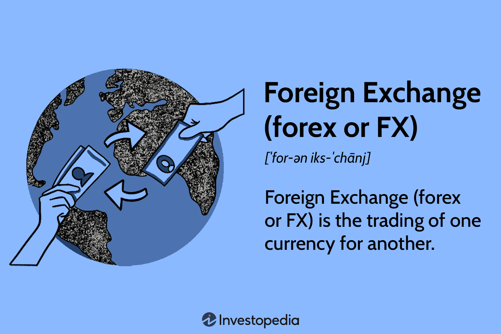

## Table of Contents

## What is Forex trading and how does it differ from currency exchange?

Forex trading, short for foreign exchange trading, is the act of buying and selling currencies on the foreign exchange market with the aim of making a profit. Traders speculate on the value of one currency against another, for example, whether the Euro will rise or fall against the US Dollar. This trading happens over-the-counter (OTC), meaning it's done electronically rather than on a centralized exchange. Forex markets are open 24 hours a day, five days a week, allowing traders to react to news and events at any time.

Currency exchange, on the other hand, is the process of converting one currency into another for practical purposes, such as traveling or conducting international business. When you go to a bank or a currency exchange office to change your money, you're participating in currency exchange. The main difference between Forex trading and currency exchange is the purpose: Forex trading is done to make a profit from currency fluctuations, while currency exchange is done to facilitate transactions in a different currency. Additionally, Forex trading involves much larger volumes and can be more speculative and risky than simply exchanging currency for immediate use.

## How does the Forex market work and who are the main participants?

The Forex market works by people and organizations buying and selling different currencies. It's like a big global marketplace that never sleeps, open 24 hours a day from Monday to Friday. When someone thinks a currency will go up in value, they buy it. If they think it will go down, they sell it. The price of currencies changes all the time based on what's happening around the world, like news, politics, and the economy. Traders use special platforms to make these trades, and they can make money if they guess right about which way the currency prices will move.

The main participants in the Forex market are banks, big companies, governments, and regular people like you and me. Banks are the biggest players because they handle a lot of money moving around the world. They trade currencies to help their customers and to make profits for themselves. Big companies use the Forex market when they need to pay for things in different countries or when they want to protect themselves from changes in currency values. Governments and central banks also play a big role, often trading to control their own currency's value or to manage their country's economy. Lastly, individual traders and investors join in, hoping to make money from the ups and downs of currency prices.

## What are the basic terms and concepts a beginner should know in Forex trading?

When you start Forex trading, there are a few key terms and ideas you should know. First, a 'currency pair' is what you trade. It's two currencies where you buy one and sell the other at the same time. For example, if you trade EUR/USD, you're buying Euros and selling US Dollars. 'Pips' are the smallest move a currency pair can make. Most pairs move in steps of 0.0001, and that step is one pip. 'Leverage' lets you control a big amount of money with a small amount of your own. It can make your profits bigger, but it also makes your losses bigger if things go wrong. 'Margin' is the money you need to put up to open a trade when using leverage.

Another important thing to know is 'bid' and 'ask' prices. The 'bid' price is what someone is willing to pay to buy the currency pair from you, and the 'ask' price is what you have to pay to buy the currency pair. The difference between these two is called the 'spread', and it's how brokers make money. 'Stop-loss' and 'take-profit' orders are tools to help you manage risk. A 'stop-loss' order automatically closes your trade if the price goes against you to a certain point, to limit your loss. A 'take-profit' order does the same but closes your trade when you reach a profit goal. Understanding these basic terms and concepts will help you start trading in the Forex market.

## How can someone start trading Forex, including setting up an account and choosing a broker?

To start trading Forex, the first step is to choose a reputable broker. A broker is like a middleman who helps you buy and sell currencies. You should look for a broker that is regulated by a financial authority, has good reviews, and offers a trading platform that is easy to use. Once you've picked a broker, you'll need to open an account on their website. This usually involves filling out some personal information and uploading documents to verify your identity, like a passport or driver's license. After your account is set up and verified, you'll need to deposit money into it. Brokers usually have a minimum amount you need to deposit to start trading, so make sure you know what that is.

Once your account is funded, you can start trading. Most brokers offer a practice account, called a demo account, where you can trade with fake money to get a feel for how it works before using real money. When you're ready to trade for real, you'll use the broker's trading platform. This is a software where you can see the prices of currency pairs and make trades. You'll decide which currency pair to trade, how much money to use, and whether to buy or sell. Remember, trading Forex can be risky, so it's a good idea to learn as much as you can and maybe even practice with a demo account before you start trading with real money.

## What are the most common currency pairs traded in the Forex market?

In the Forex market, the most common currency pairs are called the "majors." These are the ones that get traded the most because they involve the world's biggest economies. The top pair is the EUR/USD, which is the Euro against the US Dollar. Another popular one is the USD/JPY, which is the US Dollar against the Japanese Yen. You'll also see a lot of trading in GBP/USD, which is the British Pound against the US Dollar, and USD/CHF, the US Dollar against the Swiss Franc. These pairs are popular because they're from strong economies and a lot of money moves between them.

Besides the majors, there are also "crosses" and "exotics." Crosses are pairs that don't include the US Dollar, like EUR/GBP or AUD/JPY. They're less traded than the majors but still pretty common. Exotics are pairs where one currency is from a smaller or emerging market economy, like USD/TRY (US Dollar against the Turkish Lira) or USD/ZAR (US Dollar against the South African Rand). These pairs can be more risky because they might not move as predictably, but some traders like them because they can offer bigger moves and chances to make money.

## What are the different types of Forex trading strategies and which might suit a beginner?

Forex trading strategies can be broken down into a few main types, each with its own way of trying to make money. There's the '[day trading](/wiki/day-trading-spy)' strategy, where traders buy and sell currencies within the same day, trying to make small profits from quick moves in the market. 'Swing trading' is another approach, where traders hold onto their trades for a few days or weeks, hoping to catch bigger moves in the market. Then there's 'position trading', which is about holding trades for months or even years, focusing on long-term trends. Lastly, '[scalping](/wiki/gamma-scalping)' is a fast-paced strategy where traders make lots of small trades to catch tiny price changes, often holding trades for just a few seconds or minutes.

For a beginner, the best strategy to start with might be swing trading. It's not as fast-paced as day trading or scalping, so there's less pressure to make quick decisions. Swing trading gives you more time to think about your trades and learn from them. It's also easier to manage because you don't need to watch the market all day long. You can look at the market once or twice a day, make your trades, and then wait for a few days or weeks to see what happens. This can help you learn the ropes of Forex trading without feeling overwhelmed by the speed of the market.

## How do economic indicators and news events affect Forex markets?

Economic indicators and news events can shake up the Forex markets a lot. When a country releases important economic data, like how many jobs were created or how fast the economy is growing, it can make the value of its currency go up or down. For example, if the US reports more jobs were created than expected, the US Dollar might get stronger because it shows the economy is doing well. Traders watch these indicators closely because they can give clues about where currency prices might be headed next. News events, like elections or big policy changes, can also move the markets. If a country elects a new leader who promises to change economic policies, traders might start buying or selling that country's currency based on what they think will happen.

These economic indicators and news events can cause big swings in currency prices. Sometimes, the market might react right away, with prices jumping up or down as soon as the news comes out. Other times, the market might take a while to figure out what the news means, and prices might move more slowly. Traders need to stay on top of these events because they can create both opportunities to make money and risks of losing money. Understanding how different indicators and news can affect currencies is a big part of being a good Forex trader.

## What are the risks involved in Forex trading and how can they be managed?

Forex trading can be risky because the market can move a lot, and you might lose money. One big risk is that you use leverage, which means you can control a lot of money with just a little bit of your own. This can make your profits bigger, but it can also make your losses bigger if things don't go your way. Another risk is that the market can be unpredictable. News and events around the world can make currency prices jump up or down quickly, and if you're not ready, you might lose money. Also, there's the risk of choosing a bad broker. If your broker isn't honest or goes out of business, you could lose your money.

To manage these risks, you can use a few simple strategies. First, always use a stop-loss order. This is like a safety net that closes your trade if the price moves against you too much, so you don't lose more than you can handle. Second, don't use too much leverage. It's tempting to use a lot to make big profits, but it can also lead to big losses, so be careful. Third, learn as much as you can about the market and keep up with the news. The more you know, the better you can predict what might happen next. Finally, start with a demo account to practice trading without risking real money. This can help you get a feel for the market and build confidence before you start trading for real.

## How can technical analysis be used to make Forex trading decisions?

Technical analysis is a way to look at past price movements and patterns to guess where currency prices might go next. Traders use charts and special tools to spot trends and patterns. For example, they might look at moving averages, which are lines on a chart that show the average price over a certain time. If the price is above the moving average, it might mean the currency is getting stronger. Traders also use indicators like the Relative Strength Index (RSI) to see if a currency is overbought or oversold, which can help them decide when to buy or sell.

By using technical analysis, traders can make better decisions about when to enter or [exit](/wiki/exit-strategy) trades. They look for patterns like 'head and shoulders' or 'double tops and bottoms' to predict where the price might go. If they see a pattern that usually leads to a price drop, they might decide to sell. On the other hand, if they see a pattern that often leads to a price rise, they might buy. Technical analysis isn't perfect and it doesn't work every time, but it can help traders make more informed guesses about what might happen next in the Forex market.

## What is leverage in Forex trading and how does it impact potential profits and losses?

Leverage in Forex trading is like borrowing money from your broker to make bigger trades than you could with just your own money. Imagine you have $1,000, but with leverage, you can control a trade worth $100,000 or even more. It's like using a lever to lift a heavy weight; you use a small force to move something much bigger. In Forex, leverage is usually shown as a ratio, like 1:100 or 1:500. This means for every dollar you have, you can trade $100 or $500 worth of currency.

Leverage can make your profits bigger, but it can also make your losses bigger. If the market moves in your favor, you can make a lot more money than if you were just using your own cash. But if the market goes against you, your losses can grow very quickly. For example, if you use 1:100 leverage and the market moves just 1% against you, you could lose all your money. That's why it's important to use leverage carefully and always have a plan to limit your losses, like using stop-loss orders.

## How do advanced traders use algorithmic trading and what tools do they use?

Advanced traders use [algorithmic trading](/wiki/algorithmic-trading) to make trades automatically based on a set of rules they program into a computer. This means they can trade faster and more often than if they were doing it by hand. They use special software called trading algorithms that look at market data and make decisions to buy or sell currencies. These algorithms can be set up to follow certain patterns or trends in the market, or to react to news and events quickly. This way, traders don't have to watch the market all the time, and they can make trades even when they're not at their computer.

The tools advanced traders use for algorithmic trading include trading platforms like MetaTrader 4 or 5, which have built-in programming languages like MQL4 or MQL5. They also use other software like Python, which is popular for writing trading algorithms because it's easy to use and has a lot of tools for working with data. Some traders also use APIs (Application Programming Interfaces) to connect their algorithms directly to the market, so they can get real-time data and make trades instantly. These tools help traders automate their strategies and manage their trades more efficiently.

## What are the latest trends and future predictions for the Forex market?

The Forex market is always changing, and right now, one big trend is the use of technology. More and more traders are using computers and special software to trade automatically. This is called algorithmic trading, and it lets traders make trades faster and without having to watch the market all the time. Another trend is the growing interest in cryptocurrencies. Some traders are now including digital currencies like Bitcoin in their Forex trading, which adds a new layer of complexity and opportunity to the market. Also, there's a lot of focus on how global events, like pandemics or political changes, can shake up the market quickly, so traders are using more data and news to make their decisions.

Looking ahead, experts think the Forex market will keep growing and changing. Technology will likely play an even bigger role, with more advanced tools and algorithms helping traders make better decisions. The rise of cryptocurrencies might continue, and they could become a regular part of Forex trading. Also, as the world becomes more connected, events in one country can affect currencies everywhere, so traders will need to stay on top of global news and trends. Overall, the future of Forex trading looks busy and full of new chances to make money, but also with new challenges to keep up with all the changes.

## References & Further Reading

[1]: Bergstra, J., Bardenet, R., Bengio, Y., & Kégl, B. (2011). ["Algorithms for Hyper-Parameter Optimization."](https://papers.nips.cc/paper/4443-algorithms-for-hyper-parameter-optimization) Advances in Neural Information Processing Systems 24.

[2]: ["Advances in Financial Machine Learning"](https://www.amazon.com/Advances-Financial-Machine-Learning-Marcos/dp/1119482089) by Marcos Lopez de Prado

[3]: ["Evidence-Based Technical Analysis: Applying the Scientific Method and Statistical Inference to Trading Signals"](https://www.amazon.com/Evidence-Based-Technical-Analysis-Scientific-Statistical/dp/0470008741) by David Aronson

[4]: ["Machine Learning for Algorithmic Trading"](https://github.com/stefan-jansen/machine-learning-for-trading) by Stefan Jansen

[5]: ["Quantitative Trading: How to Build Your Own Algorithmic Trading Business"](https://www.amazon.com/Quantitative-Trading-Build-Algorithmic-Business/dp/1119800064) by Ernest P. Chan