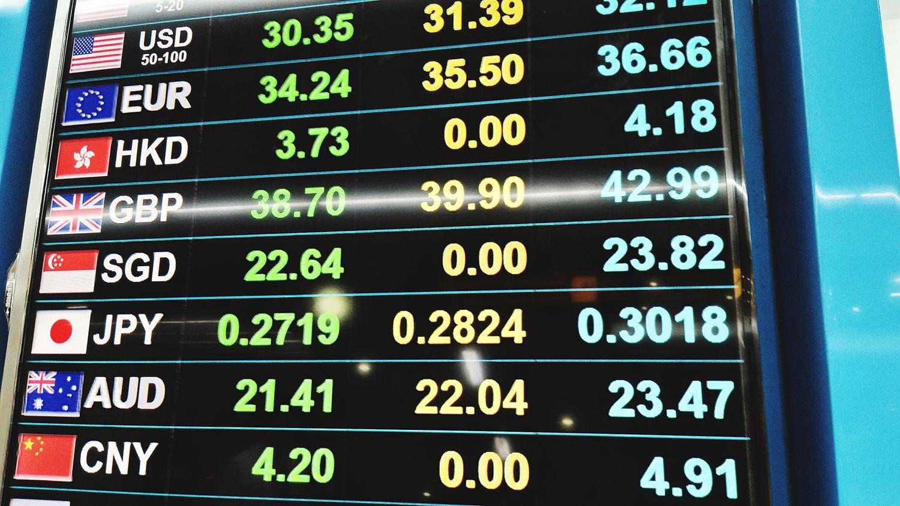

The landscape of finance is undergoing rapid transformation, primarily propelled by technological advancements. At the forefront of this evolution is the Foreign Exchange Market (FX), which stands as one of the largest and most liquid global financial markets. Forex trading, deeply embedded within this dynamic environment, has witnessed significant changes, largely due to the advent of technology-driven methodologies like algorithmic trading. 

Algorithmic trading, specifically, represents a shift in how trading operations are conducted, employing sophisticated computer algorithms to automate the execution of trades. By leveraging pre-defined rules and data-driven strategies, this approach enhances efficiency, precision, and speed in trading activities. The convergence of algorithmic trading with forex trading activities is restructuring traditional trading patterns, making them more efficient and less susceptible to human errors and emotional biases.



This article aims to explore the complex dynamics of this transformation. It will focus on how these components—namely the FX market, forex trading, and algorithmic trading—interact to shape the current and future financial landscapes. Furthermore, we will examine the revolutionary impact of algorithmic trading on forex, highlighting its potential to redefine how currency trading is approached in both institutional and retail contexts.

## Table of Contents

## Understanding the FX Market

Forex, or foreign exchange, is the global marketplace for trading currencies and stands as the largest and most liquid financial market worldwide. Unlike other financial markets, it does not have a centralized exchange but instead operates over-the-counter (OTC). This means that trading occurs directly between participants, such as banks, institutions, and individual traders, through electronic networks.

One of the unique features of the forex market is its continuous operation, running 24 hours a day, five days a week. This non-stop nature arises from the time zone overlaps of major financial centers, allowing trading to transition from one region to another seamlessly. For example, when New York's trading session ends, Tokyo and then London start, keeping the market active almost without pause.

The scale and liquidity of the forex market provide traders with ample opportunities to profit from changes in currency exchange rates. Liquidity refers to the ease with which an asset can be bought or sold without affecting its price. In the forex market, the high trading volume and number of participants ensure that currency pairs can be traded efficiently, even in large quantities.

Forex trading involves the simultaneous buying and selling of currency pairs. A currency pair quotation, such as EUR/USD, indicates the value of one currency in terms of another. Traders make profits by speculating on the direction of exchange rate fluctuations between the base currency (the first currency in the pair) and the quote currency (the second currency in the pair).

The decentralized nature of the [forex](/wiki/forex-system) market and its vast size make it resilient to individual trader influences and manipulation. However, it is also susceptible to macroeconomic indicators and geopolitical events, which can lead to volatile price swings. Thus, understanding these dynamics is crucial for successful participation in forex trading.

## Essentials of Forex Trading

Forex trading involves buying and selling currency pairs, a process where currencies are exchanged in pairs. Each pair consists of a base currency and a quote currency. The base currency is the first currency in the pair, while the quote currency is the second. For instance, in the EUR/USD pair, the euro (EUR) is the base currency, and the U.S. dollar (USD) is the quote currency. The exchange rate indicates how much of the quote currency is required to purchase one unit of the base currency.

Traders profit from fluctuations in exchange rates by buying a currency pair at one rate and selling it at a higher rate. For example, if a trader buys the EUR/USD pair at 1.1000 and sells it at 1.1050, the profit is 50 pips (where a pip is the smallest price move possible, typically in the fourth decimal place in most currency pairs).

Understanding forex pairs and quotes is essential for any trader. A direct quote expresses the amount of domestic currency required to buy one unit of a foreign currency, while an indirect quote indicates the amount of foreign currency needed to buy one unit of the domestic currency. This understanding helps traders make informed predictions about future price movements.

Another critical aspect of forex trading is the concept of lots and leverage, which are fundamental for managing risk. A standard lot in forex is 100,000 units of the base currency. There are also mini lots (10,000 units) and micro lots (1,000 units) for traders with smaller capital. Leverage allows traders to control larger positions than their actual investment might allow. For example, a leverage of 1:100 means that for every $1 in the trader's account, they can control $100 in the market.

While leverage can amplify returns, it also heightens risk, making risk management strategies crucial. Traders must be aware of potential losses and set stop-loss orders to mitigate possible adverse price movements. Overall, successful trading requires a deep understanding of these fundamental elements to effectively navigate the forex market and optimize trading strategies.

## The Rise of Algorithmic Trading

Algorithmic trading employs sophisticated computer programs to execute transactions at high speed and in large volumes. This technological advancement automates trading through the application of pre-defined rules and strategies, significantly enhancing trading precision and mitigating the influence of human emotions and biases on decision-making processes.

Initially, [algorithmic trading](/wiki/algorithmic-trading) was predominantly utilized by institutional investors due to the complexities and costs involved in developing and maintaining trading algorithms and the required infrastructure. These large-scale investors, such as hedge funds and investment banks, leveraged algorithmic trading to manage substantial portfolios with efficiency and precision, benefiting from the ability to process vast amounts of data swiftly and execute trades more accurately than a human trader.

In recent years, the landscape has evolved, and algorithmic trading has become increasingly accessible to retail traders. Advancements in technology have played a critical role in this shift, reducing entry barriers by offering sophisticated trading platforms and tools that can be used by individual investors. These platforms provide access to market data, analytical tools, and customizable scripts, allowing retail traders to design, test, and implement trading algorithms without requiring extensive resources.

Algorithmic trading also offers the advantage of real-time analysis and execution. Unlike manual trading, where time delays can affect transaction outcomes, algorithms can react to market movements instantly, ensuring that trades are executed at optimal prices. This capability is particularly beneficial in the foreign exchange (forex) market, where rapid price changes can present opportunities for profit.

A typical algorithmic trading strategy involves multiple steps, including signal generation, risk management, and order execution. These steps are programmatically defined, allowing for consistent and repeatable trade execution. An example of a basic algorithmic trading strategy in Python could look like this:

```python
import pandas as pd
import numpy as np

def moving_average_strategy(prices, short_window=40, long_window=100):
    signals = pd.DataFrame(index=prices.index)
    signals['signal'] = 0.0
    signals['short_mavg'] = prices['Close'].rolling(window=short_window, min_periods=1).mean()
    signals['long_mavg'] = prices['Close'].rolling(window=long_window, min_periods=1).mean()

    # Create buy/sell signals
    signals['signal'][short_window:] = np.where(signals['short_mavg'][short_window:] 
                                                > signals['long_mavg'][short_window:], 1.0, 0.0)

    # Generate trading orders
    signals['positions'] = signals['signal'].diff()
    return signals

# Usage example with hypothetical data
prices = pd.DataFrame({'Close': np.random.random(150)})
signals = moving_average_strategy(prices)
```

This basic moving average crossover strategy generates buy/sell signals based on short-term and long-term moving averages of prices. Although simplified, it demonstrates how logic and rules can be encoded into algorithms to automate trading decisions.

With the continued advancement of technology and the democratization of trading tools, the role of algorithmic trading in financial markets is likely to expand further, offering even greater access and opportunities for both institutional and retail investors.

## Integration of Algo Trading and Forex

Algorithmic trading has significantly improved the efficiency of forex markets by automating complex decision-making processes. This automation facilitates quicker and more precise execution of trades, reducing the need for manual input that is prone to human error and emotional biases. Individual traders now have access to a variety of tools and platforms that enable the development and implementation of trading algorithms tailored to their specific strategies and goals.

Modern trading platforms, such as MetaTrader 4 and 5, TradeStation, and NinjaTrader, provide users with the ability to create custom algorithms using integrated development environments. These platforms often support popular programming languages like Python, which is favored for its extensive libraries and ease of use. For instance, traders can use Python's pandas library to manage and analyze market data efficiently. A simple script to calculate a moving average, a common trading indicator, might look like this:

```python
import pandas as pd

# Sample data: time series of currency prices
data = pd.Series([1.298, 1.304, 1.312, 1.308, 1.317])

# Compute a simple 3-period moving average
moving_average = data.rolling(window=3).mean()

print(moving_average)
```

Automated systems analyze vast amounts of market data to identify trading opportunities that would be challenging for a human to spot manually. These systems use various techniques, including technical indicators and [machine learning](/wiki/machine-learning) algorithms, to process and interpret large datasets. Once a trading signal is generated, the automated system executes trades with precise timing, leveraging the advantage of high-speed data processing and execution capabilities.

Timing is crucial in forex trading due to the market's high [liquidity](/wiki/liquidity-risk-premium) and [volatility](/wiki/volatility-trading-strategies). Algorithms can react to market conditions within milliseconds, seizing favorable trading conditions that might elude manual traders. This level of precision not only enhances potential profitability but also mitigates the risks associated with human decision-making delays.

Algorithmic trading also allows traders to execute a higher [volume](/wiki/volume-trading-strategy) of trades across multiple currency pairs simultaneously. This scalability enables the diversification of strategies and can potentially increase overall returns while spreading risk. Furthermore, by automating repetitive trading tasks, traders can focus on developing and refining their strategies rather than spending significant time on execution. This shift in focus fosters a more strategic approach to analyzing and responding to market dynamics.

Overall, the integration of algorithmic trading into forex markets represents a paradigm shift in how trading is conducted, offering enhanced efficiency, precision, and opportunity for both institutional and retail traders.

## Benefits of Algorithmic Forex Trading

Algorithmic forex trading presents significant benefits to traders, notably in terms of speed, accuracy, and cost efficiency. The automation provided by algorithmic systems allows for rapid execution of trades, capitalizing on fleeting opportunities in the forex market that human traders might miss. Algorithms can operate at speeds far beyond human capability, enabling traders to make multiple transactions in fractions of a second. This speed is critical in the forex market, where exchange rates can fluctuate rapidly.

Accuracy is another major advantage of algorithmic trading. Algorithms follow set instructions without deviation, eliminating the emotional and psychological biases that often affect human traders. By sticking rigidly to predefined rules, algorithmic systems can improve the precision of trading strategies, reducing the chance of error and enhancing overall trading performance.

Cost efficiency is achieved through the automation of routine trading tasks. This reduces the need for large trading teams, lowering operational costs and creating a more scalable trading approach. Moreover, algorithmic trading allows traders to backtest strategies using historical data. This means traders can assess the viability of their strategies before risking actual capital on market trades. Backtesting involves simulating a trading strategy on past data to evaluate its performance before applying it in a live trading environment. It helps in identifying potential flaws and optimizing the strategy for better risk-adjusted returns.

Algorithmic trading also facilitates the simultaneous management of multiple markets and strategies, which is a considerable advantage in the diverse and volatile forex environment. Traders can deploy numerous algorithms tailored to specific market conditions or currency pairs, allowing them to exploit various opportunities as they arise. This multitasking capability means traders can diversify their trading strategies, spreading risk, and potentially enhancing returns.

Finally, automation in algorithmic trading significantly reduces human error. Mistakes such as incorrect entry of orders, which can be costly, are minimized. Algorithms operate continuously, monitoring markets and executing trades without the fatigue or distraction that can affect human traders. This relentless vigilance ensures that opportunities are seized as soon as they emerge, optimized by the precise logic of the algorithm.

In conclusion, algorithmic forex trading offers compelling advantages over manual trading approaches. While there are inherent risks and challenges, the benefits of increased speed, accuracy, cost efficiency, and error reduction make it an attractive option for modern traders looking to navigate the complexity of global forex markets effectively.

## Challenges and Risks

Algorithmic trading, while offering several advantages over traditional trading methods, is not without its challenges. Traders and developers must acknowledge and address these challenges to ensure successful algorithmic trading operations.

System failures are a primary concern. The reliance on computer systems and networks means that any hardware or software malfunction can lead to significant disruptions. Even a minor glitch can prevent a trade from being executed at the desired price or time, resulting in potential financial losses. Continuous system monitoring and maintenance are critical to minimize the risk of downtime or operational failures.

Over-optimization is another challenge, often leading to strategies that perform exceptionally well in past data but fail in real-world scenarios. Also known as "curve fitting," over-optimization occurs when a trading algorithm is excessively fine-tuned to historical data, capturing noise rather than genuine market patterns. This often results in poor performance when applied to new, unseen data.

Technical errors can also pose significant risks. These may include programming errors (such as incorrect logic in the algorithm), data feed inaccuracies, or software bugs. It's essential that algorithms are thoroughly tested and debugged before deployment. For instance, using Python, traders can utilize extensive testing frameworks like `pytest` for ensuring code accuracy:

```python
def test_algorithm_logic():
    """Test the trading logic of the algorithm."""
    assert trade_decision(price_data) == expected_decision
```

Moreover, market conditions are inherently volatile and can change rapidly, sometimes without prior indication. Economic events, geopolitical developments, or sudden shifts in market sentiment can drastically alter price dynamics, potentially rendering an algorithm ineffective. Adaptive algorithms that can modify strategy parameters in response to market changes are becoming increasingly significant.

Proper understanding and management of these risks involve several strategies. Backtesting with a wide range of data, including different market conditions, helps assess an algorithm's robustness. When possible, stress testing algorithms under worst-case scenarios can provide insights into their resilience. Risk management protocols, such as setting stop-loss limits and diversifying trading strategies across uncorrelated assets, are also vital.

In conclusion, while algorithmic trading presents numerous opportunities for enhancing trading performance, it also demands rigorous risk management practices. Continuous learning and refining of strategies are necessary to navigate the complexities and uncertainties inherent in algorithmic forex trading.

## Conclusion

The integration of algorithmic trading into forex markets has significantly reshaped the landscape of currency trading. By leveraging sophisticated computer algorithms, market participants can execute trades with remarkable speed and precision, enhancing the overall efficiency and liquidity of the market. However, despite these advancements, traders must remain vigilant and cognizant of the inherent risks and complexities associated with algorithmic trading.

One of the foremost advantages of algorithmic trading is eliminating emotional biases and human errors, allowing for more disciplined and structured decision-making processes. Moreover, the capacity to backtest strategies using historical data empowers traders to refine and optimize their approaches, potentially improving performance prospects. The ability to manage and execute multiple strategies and market positions simultaneously further underscores the versatility of algorithmic trading.

Nonetheless, these advantages are accompanied by potential challenges, such as system failures and the necessity for continuous monitoring. Algorithmic traders must consider the risks of over-optimization, where strategies may be tailored too specifically to historical data, thereby impacting real-time application. Additionally, sudden shifts in market conditions can lead to unexpected outcomes, necessitating a comprehensive understanding and management of associated risks.

To effectively leverage algorithmic trading, continuous learning and adaptation are imperative. Traders must stay updated with technological advancements and market developments, continually refining their strategies to align with evolving dynamics. This commitment to learning ensures that they can harness the full potential of technology while mitigating potential drawbacks.

The future of [FX](/wiki/fx-anomaly) trading is promising, with ongoing technological innovations poised to further revolutionize the field. As algorithmic trading continues to expand its reach, new tools and methodologies are expected to emerge, offering greater opportunities for both institutional and retail traders alike. Embracing these advancements will undoubtedly shape the future of forex trading, presenting an exciting horizon for market participants.

## References & Further Reading

[1]: Bergstra, J., Bardenet, R., Bengio, Y., & Kégl, B. (2011). ["Algorithms for Hyper-Parameter Optimization."](https://papers.nips.cc/paper/4443-algorithms-for-hyper-parameter-optimization) Advances in Neural Information Processing Systems 24.

[2]: ["Advances in Financial Machine Learning"](https://www.amazon.com/Advances-Financial-Machine-Learning-Marcos/dp/1119482089) by Marcos Lopez de Prado

[3]: ["Evidence-Based Technical Analysis: Applying the Scientific Method and Statistical Inference to Trading Signals"](https://www.amazon.com/Evidence-Based-Technical-Analysis-Scientific-Statistical/dp/0470008741) by David Aronson

[4]: ["Machine Learning for Algorithmic Trading"](https://github.com/stefan-jansen/machine-learning-for-trading) by Stefan Jansen

[5]: ["Quantitative Trading: How to Build Your Own Algorithmic Trading Business"](https://www.amazon.com/Quantitative-Trading-Build-Algorithmic-Business/dp/1119800064) by Ernest P. Chan