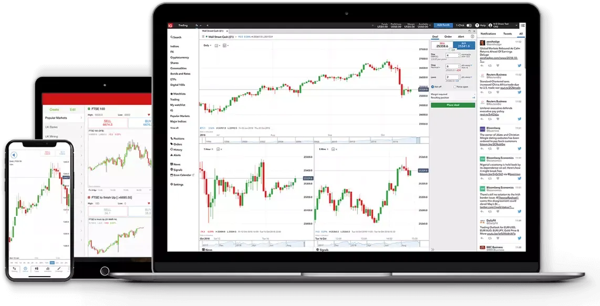

## Table of Contents

## What is a demo account in forex trading?

A demo account in forex trading is a practice account that lets you trade with fake money. It's like a simulator where you can learn how to trade without risking your own money. You can try different strategies and see how the market works without any real financial risk.

These accounts are very useful for beginners who want to get a feel for trading before they start using real money. They help you understand the trading platform, practice making trades, and learn from your mistakes without losing anything. Many brokers offer demo accounts for free, and you can use them for as long as you need to feel ready for real trading.

## Why should beginners use a demo account?

Beginners should use a demo account because it lets them practice trading without losing real money. When you're new to forex trading, it can be scary to put your own money on the line. A demo account takes away that fear because you're using fake money. This way, you can make mistakes and learn from them without any financial risk. It's a safe space to figure out how everything works.

Also, a demo account helps you get familiar with the trading platform. Every broker has a different platform, and it can be confusing at first. With a demo account, you can explore all the features and tools without pressure. You can try different strategies and see what works best for you. This practice can make you more confident when you're ready to trade with real money.

## How can one open a forex demo account?

To open a [forex](/wiki/forex-system) demo account, you first need to choose a broker that offers demo accounts. Many brokers provide this service for free. Once you've picked a broker, go to their website and look for a button or link that says something like "Open Demo Account" or "Start Trading Demo." Click on it and you'll usually need to fill out a simple form with your name, email, and maybe a phone number. After you submit the form, the broker will send you an email with instructions on how to log in to your new demo account.

Once you're logged in, you'll see that the demo account looks just like a real trading account, but with fake money. You can start trading right away, trying out different strategies and getting used to the platform. It's a good idea to spend some time exploring all the features and tools the broker offers. This way, when you're ready to switch to a real account, you'll feel more confident and prepared. Remember, you can use the demo account for as long as you need to feel comfortable before moving to real trading.

## What are the key features to look for in a forex demo account?

When looking for a forex demo account, it's important to find one that closely matches the real trading experience. The demo account should have the same tools and features as the live trading platform. This means you should be able to use the same charts, indicators, and trading tools that you would use with real money. It's also good if the demo account lets you practice with different trading strategies and see how they work in real market conditions.

Another key feature to look for is the amount of virtual money you get to start with. A good demo account will give you enough fake money to try out different trades and see how they affect your balance. It's also helpful if the demo account is easy to use and understand, so you can focus on learning how to trade without getting confused by the platform. Lastly, make sure the demo account is available for as long as you need it, so you can practice until you feel ready to trade with real money.

## How long should a beginner use a demo account before trading with real money?

A beginner should use a demo account for at least a few months before trading with real money. This time allows you to get comfortable with the trading platform, understand how the forex market works, and practice different trading strategies. It's important to take as long as you need to feel confident because trading with real money can be risky.

During this time, you can make mistakes and learn from them without losing any money. Try to trade as if you were using real money, and keep track of your wins and losses. Once you start to see consistent results and feel ready, you can think about moving to a real account. Remember, there's no rush, and it's better to be safe and take your time.

## Can demo account trading results predict real trading performance?

Demo account trading results can give you a good idea of how you might do when trading with real money, but they don't guarantee the same results. When you use a demo account, you're not risking real money, so you might take bigger risks or feel less stress. This can make your demo results look better than what you might get in real trading.

In real trading, the pressure of losing money can affect your decisions. You might feel more nervous or make different choices than you did in the demo. So, while practicing on a demo account is really helpful, your real trading performance can be different. It's best to use the demo to learn and get ready, but be ready for some differences when you start trading with real money.

## What are the common mistakes to avoid when using a forex demo account?

When using a forex demo account, a common mistake is to take too many risks because you're not using real money. It's easy to feel brave and try big trades that you wouldn't do with your own money. But this can give you a false sense of how you'll do in real trading. It's better to trade on the demo account like you would with real money, so you get a true feel for what it's like.

Another mistake is not taking the demo account seriously enough. Some people treat it like a game and don't put in the effort to learn properly. But the demo account is a great chance to practice and learn without losing money. You should use it to try different strategies, keep track of your trades, and see what works best for you. This way, you'll be more ready when you start trading with real money.

Lastly, some beginners move too quickly from the demo to a real account. They might feel confident after a few good trades on the demo, but real trading can be different. It's important to spend enough time on the demo account, maybe a few months, to really understand the market and feel ready. Rushing into real trading without enough practice can lead to big losses.

## How can intermediate traders benefit from using demo accounts?

Intermediate traders can use demo accounts to test new trading strategies without risking their own money. They might want to try out different ways of trading or use new tools and indicators. The demo account lets them see how these strategies work in real market conditions, but without the stress of losing money. This way, they can find out what works best for them before using it in their real trading.

Also, demo accounts are great for practicing during times when the market is moving a lot. Intermediate traders can use the demo to get used to fast-changing market conditions and see how their strategies hold up. This practice can help them feel more confident and ready when they face similar situations in real trading. It's like a safe space to keep learning and getting better at trading.

## What advanced strategies can be tested using a demo account?

Intermediate traders can use a demo account to test advanced strategies like [scalping](/wiki/gamma-scalping), which involves making many small trades to take advantage of tiny price changes. They can practice entering and exiting trades quickly to see if they can make a profit this way. Another strategy they might try is using complex technical indicators, like the Relative Strength Index (RSI) or Bollinger Bands, to find the best times to buy and sell. The demo account lets them see how these indicators work in real market conditions without risking their own money.

They can also test out [algorithmic trading](/wiki/algorithmic-trading), where they use computer programs to make trades based on certain rules. This can be a good way to see if their trading ideas can be turned into a successful strategy. By using a demo account, intermediate traders can fine-tune their algorithms and see how they perform over time. This practice helps them understand what works and what doesn't, so they can be more confident when they start using these strategies with real money.

## How do demo accounts help in understanding market psychology?

Demo accounts help intermediate traders understand market psychology by letting them see how they react to different market situations without risking real money. When you trade on a demo account, you can watch how you feel and act when the market goes up or down. This can show you if you get too excited when you're winning or too scared when you're losing. Understanding these feelings can help you stay calm and make better choices when you're trading with real money.

Also, demo accounts let you practice trading in different market conditions, like when the market is moving fast or slow. This helps you see how your emotions change in these situations. For example, you might notice that you feel more confident when the market is calm, but get nervous when it's moving a lot. By practicing on a demo account, you can learn to control your emotions better and make smarter trading decisions. This understanding of market psychology can make you a better trader when you move to real trading.

## What are the limitations of using a demo account for forex trading?

Demo accounts are great for practicing forex trading without risking real money, but they have some limits. One big limit is that they don't feel the same as trading with real money. When you use fake money, you might take bigger risks or not feel as nervous as you would with your own money. This can make your demo results look better than what you might get in real trading. So, while demo accounts are helpful for learning, they don't always show how you'll do when real money is on the line.

Another limit is that demo accounts might not always show the real market conditions. Sometimes, the prices and data you see on a demo account can be a bit different from what's happening in the real market. This can make it hard to know if your trading strategies will work the same way when you start using real money. It's good to remember these limits and use the demo account as a learning tool, but be ready for some differences when you move to real trading.

## How can expert traders use demo accounts to refine their trading systems?

Expert traders can use demo accounts to test and improve their trading systems without risking real money. They can try out new strategies or make changes to their current ones to see how they work in different market conditions. For example, they might want to add new indicators or change their risk management rules. By using a demo account, they can see if these changes make their trading better without losing any money. This way, they can fine-tune their systems and find the best way to trade.

Also, demo accounts let expert traders practice during times when the market is moving a lot or when big news comes out. They can see how their systems handle these situations and make sure they're ready for anything. This practice helps them understand how their strategies work in real life and can make them more confident when they use these strategies with real money. By using a demo account, expert traders can keep learning and getting better at trading.

## References & Further Reading

[1]: Bergstra, J., Bardenet, R., Bengio, Y., & Kégl, B. (2011). ["Algorithms for Hyper-Parameter Optimization."](https://dl.acm.org/doi/10.5555/2986459.2986743) Advances in Neural Information Processing Systems 24.

[2]: ["Advances in Financial Machine Learning"](https://www.amazon.com/Advances-Financial-Machine-Learning-Marcos/dp/1119482089) by Marcos Lopez de Prado

[3]: ["Evidence-Based Technical Analysis: Applying the Scientific Method and Statistical Inference to Trading Signals"](https://www.amazon.com/Evidence-Based-Technical-Analysis-Scientific-Statistical/dp/0470008741) by David Aronson

[4]: ["Machine Learning for Algorithmic Trading"](https://github.com/stefan-jansen/machine-learning-for-trading) by Stefan Jansen

[5]: ["Quantitative Trading: How to Build Your Own Algorithmic Trading Business"](https://www.amazon.com/Quantitative-Trading-Build-Algorithmic-Business/dp/1119800064) by Ernest P. Chan