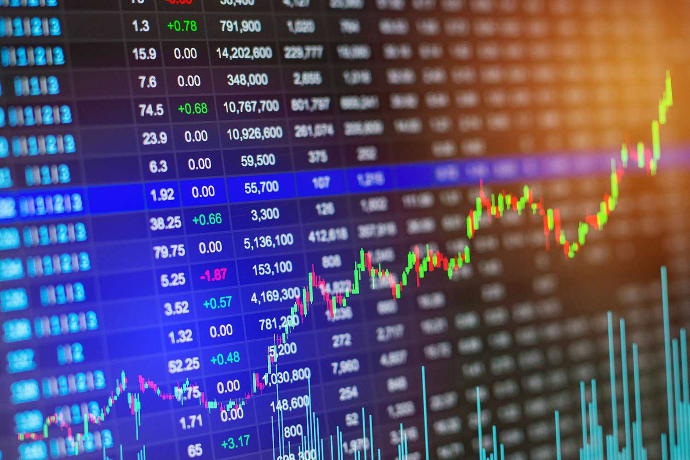

Currency trading is a highly dynamic and intricate domain, integrating several key facets: demo accounts, forex trading, and algorithmic trading. Each component serves a vital function in enhancing traders' skills and market engagement. Demo accounts are indispensable tools, providing a risk-free simulation of the trading environment where individuals can develop and hone their trading strategies without the stress of financial loss. This function is crucial in equipping both novice and experienced traders with the necessary acumen to navigate real-time markets effectively.

Forex trading represents the core of currency trading practices, involving the buying and selling of various currencies within the expansive global market. It operates continuously, 24 hours a day, across different time zones, making it one of the most liquid markets worldwide. Traders engage in this market to profit from fluctuations in currency value, needing an astute understanding of market trends and currency pairings to optimize their trading outcomes.



Algorithmic trading introduces a modern approach to currency trading by utilizing preprogrammed software to execute trades based on a set of predetermined criteria. This method significantly enhances trading efficiency by reducing the influence of human emotions on trading decisions and increasing the speed of trade executions. The software can incorporate complex strategies, deploying technical indicators and statistical models to predict market movements.

These interconnected aspects of currency trading—demo accounts, forex trading, and algorithmic trading—jointly contribute to a more comprehensive and effective trading experience. By leveraging these tools, traders can better prepare themselves for the various challenges posed by the global currency market, optimizing their strategies for more informed and successful trading decisions.

## Table of Contents

## What is a Currency Trading Demo Account?

Currency trading demo accounts are invaluable tools that provide traders with the opportunity to engage in foreign exchange trading without risking actual financial resources. These demo accounts mirror live trading conditions, allowing traders to experience placing trades, using various analytical tools, and navigating trading platforms such as MetaTrader 4 (MT4) and MetaTrader 5 (MT5).

The significance of these demo accounts lies primarily in their educational value. Beginners can familiarize themselves with the intricacies of trading platforms, executing trades, and utilizing the array of tools available to aid decision-making in trading. For instance, demo accounts enable the exploration of charting techniques, technical indicators, and risk management practices such as setting stop-loss and take-profit orders. By simulating real-world market dynamics, users can better understand how markets operate and respond to market events.

Platforms like MT4 and MT5, which are widely used in [forex](/wiki/forex-system) trading, incorporate numerous features such as customizable charts, automated trading capabilities, and live quotes. Understanding these platforms' functionalities without monetary implications can empower novice traders to build confidence and competence. For instance, traders can simulate strategies using [algorithmic trading](/wiki/algorithmic-trading) scripts to test their viability. Below is a basic Python example using a hypothetical trading algorithm:

```python
def simple_moving_average(prices, n):
    return sum(prices[-n:]) / n

def trading_strategy(prices):
    short_term_avg = simple_moving_average(prices, short_term_period)
    long_term_avg = simple_moving_average(prices, long_term_period)

    if short_term_avg > long_term_avg:
        return "Buy"
    elif short_term_avg < long_term_avg:
        return "Sell"
    else:
        return "Hold"

# Example of usage
prices = [1.2, 1.3, 1.4, 1.5, 1.6, 1.5, 1.3]
short_term_period = 3
long_term_period = 5
decision = trading_strategy(prices)
print(f"Trading decision: {decision}")
```

By testing strategies like the simple moving average crossover in a demo environment, traders can refine their techniques and evaluate performance without financial risk. This iterative process helps in adapting strategies to different market conditions before transitioning to live trading.

The testing environment of a demo account is a safe space for scrutinizing prospective trading strategies, enabling traders to observe how trades would perform over time if executed in real market conditions. However, while immensely beneficial, demo accounts have limitations, such as the absence of emotional decision-making influences and potential discrepancies between simulated and live market conditions.

Despite these acknowledged constraints, utilizing a demo account significantly elevates a trader's proficiency and confidence, ideally preparing them for the eventual shift to live trading scenarios where real monetary stakes are involved.

## Fundamentals of Forex Trading

Forex trading involves the exchange of currencies in the foreign exchange market, which stands as one of the world's largest and most liquid asset markets. This market operates continuously, 24 hours a day, across major global financial centers including London, New York, Tokyo, and Sydney, enabling traders to participate at any time.

A critical foundational concept in forex trading is the currency pair, which represents the quotation of two different currencies. The first currency in the pair is termed the 'base currency', while the second is the 'quote currency'. Forex traders aim to profit from the change in value between one currency relative to another. For instance, in the EUR/USD currency pair, EUR is the base currency and USD is the quote currency. 

The smallest price move in forex trading is known as a 'pip', which stands for "percentage in point" or "price interest point". Most currency pairs are quoted to four decimal places, and a pip is typically one of those smallest increments, or 0.0001.

Leverage is another pivotal concept in forex trading, allowing traders to control a larger position with a smaller amount of capital. This can amplify both gains and losses, making it a powerful but double-edged tool. For instance, a leverage ratio of 50:1 allows a trader to control $50,000 worth of currencies with just $1,000 in their trading account.

Market influencers such as geopolitical stability, economic events, governmental changes, and natural disasters can significantly affect currency values. Traders often rely on economic indicators and reports like GDP, unemployment rates, and manufacturing indices to gauge the health of a country's economy.

Forex trading platforms provide essential tools such as real-time charts, price quotes, and news feeds, aiding traders in making informed decisions. Platforms like MetaTrader 4 (MT4) and MetaTrader 5 (MT5) are widely utilized for their robust features and user-friendly interface.

Strategizing in forex involves two primary types of analysis: technical and fundamental. Technical analysis focuses on statistical trends from historical price movements, employing tools like trend lines, indicators, and chart patterns. Fundamental analysis examines economic indicators and news events to assess a currency's intrinsic value.

In summary, mastering the fundamentals of forex trading involves understanding currency pairs, accurately calculating pips, effectively utilizing leverage, and analyzing market influencers. With the right strategies incorporating technical and [fundamental analysis](/wiki/fundamental-analysis), traders can enhance their ability to forecast and capitalize on currency price movements.

## Exploring Algorithmic Trading in Forex

Algorithmic trading, commonly known as algo trading, is a systematic method of executing trades using computer programs designed to follow a specific set of rules. This approach leverages the power of technology to manage trade orders at speeds and frequencies that a human trader cannot achieve, thus enhancing the efficiency and accuracy of executing trades.

One of the most significant advantages of algorithmic trading is its ability to minimize the influence of human emotions in trading decisions. Emotions like fear and greed can often lead to irrational trading choices, but with algo trading, trades are executed based on data and logical criteria defined in advance. This method ensures consistency and can contribute to a more disciplined trading strategy.

Algo trading strategies vary in complexity. They can be as simple as executing a trade at a specific time or as sophisticated as employing models that analyze intricate statistical relationships between currency pairs. Common strategies involve technical indicators such as moving averages, [momentum](/wiki/momentum) indicators, or more complex statistical [arbitrage](/wiki/arbitrage) models that assess market inefficiencies.

To engage in algorithmic trading within the forex market, a fundamental understanding of Application Programming Interfaces (APIs) and programming languages is necessary. Popular platforms like MetaTrader use programming languages such as MQL4 and MQL5, which allow traders to create custom indicators and automated trading strategies. Additionally, languages like Python, known for its versatility and extensive libraries (such as NumPy, pandas, and scikit-learn), are frequently used to develop and test trading algorithms. A sample Python snippet for a simple moving average strategy might look like:

```python
import pandas as pd

# Sample data
data = pd.DataFrame({
    'Close': [1.1, 1.15, 1.2, 1.25, 1.3]
})

# Calculate moving averages
data['SMA_20'] = data['Close'].rolling(window=20).mean()
data['SMA_50'] = data['Close'].rolling(window=50).mean()

# Identify signals
data['Signal'] = 0
data.loc[data['SMA_20'] > data['SMA_50'], 'Signal'] = 1
data.loc[data['SMA_20'] < data['SMA_50'], 'Signal'] = -1

print(data)
```

Before applying these algorithms to live trading, they can be tested in a risk-free environment using demo accounts. This approach allows traders to refine their strategies and evaluate their performance under simulated market conditions without the financial risk. Testing on demo accounts can provide insights into how an algorithm might perform in a real market setting, facilitating necessary adjustments to improve strategy effectiveness.

In conclusion, algorithmic trading represents a growing frontier in forex trading, offering speed, efficiency, and the capacity to execute complex strategies. By harnessing the capabilities of modern programming languages and testing these strategies using demo accounts, traders can fine-tune their approaches for optimal performance in real trading environments.

## Benefits and Challenges of Using a Demo Account for Forex & Algo Trading

Demo accounts serve as an essential tool for both novice and experienced traders in the forex and algorithmic trading sectors. Their primary benefit lies in providing a risk-free environment where individuals can test various trading strategies and familiarize themselves with platform functionalities without the threat of financial loss. This feature is particularly advantageous for beginners who need to learn about the intricacies of trading platforms and for seasoned traders aiming to refine new algorithms or strategies.

One of the significant advantages of using a demo account is the ability to simulate trades and trial different approaches to gauge their effectiveness. For novices, this facilitates an understanding of forex markets, allowing them to practice executing trades, understanding leverage, and managing virtual portfolios. For algorithmic traders, demo accounts offer an experimental ground to develop and test automated trading strategies using programming languages like Python or MQL4/MQL5.

Despite these benefits, demo trading is not without its challenges. A critical limitation is the absence of emotional pressure experienced in real trading environments. Real-world trading introduces psychological elements like fear and greed, which can significantly impact decision-making processes. The lack of these elements in a simulated environment can result in an unrealistic assessment of a strategy's performance.

Furthermore, the simulated market conditions in demo accounts may not always mirror live market scenarios precisely. Factors such as [liquidity](/wiki/liquidity-risk-premium), slippage, and order execution speed are often idealized in demo environments, which may lead to discrepancies when transitioning to real trading. For instance, while a demo account might execute an order instantaneously, live trading may involve delays due to market [volatility](/wiki/volatility-trading-strategies) or brokerage policies.

Despite these limitations, demo accounts remain invaluable tools for both practice and analysis. They allow traders to hone their skills, test the viability of their strategies, and gain confidence before committing real capital. By using these accounts effectively, traders can minimize the risk of unexpected losses and improve their readiness for the actual trading environment.

Maintaining a habit of reevaluating strategies in a demo setting can be crucial, especially as market dynamics evolve. As traders become more proficient, the insights gained from demo trading can be instrumental in fine-tuning strategies for success in live trading scenarios. Hence, demo accounts are indispensable in bridging the gap between theoretical knowledge and practical trading acumen, paving the way for informed and effective trading decisions.

## Future Trends in Currency Trading

Currency trading is on the brink of significant transformations driven by technological advancements, particularly [artificial intelligence](/wiki/ai-artificial-intelligence) (AI) and [machine learning](/wiki/machine-learning). AI and machine learning offer enhanced analytical capabilities, allowing traders to process vast amounts of data efficiently. These technologies enable the development of sophisticated models for predicting market trends, identifying trading signals, and making informed decisions.

Automated and algorithmic trading are set to become more sophisticated and accessible. As computational capabilities improve, these trading systems can analyze market conditions and execute trades with minimal human intervention. The accessibility of algorithmic trading is also increasing due to platforms offering user-friendly interfaces and tools that cater to both novice and experienced traders.

The demand for real-time data and advanced analytical tools is ever-growing. Forex traders are seeking platforms that provide instant access to information and analytics, enabling them to respond rapidly to market changes. Advanced tools such as predictive analytics, sentiment analysis, and real-time news feeds can give traders an edge in decision-making processes.

Regulatory landscapes are also evolving, affecting currency trading strategies and practices. As regulatory frameworks adapt to technological advancements and global economic shifts, traders must remain aware of these changes to ensure compliance and optimize their strategies within the given legal frameworks.

To remain competitive, traders should stay informed about both technological and market trends. This requires continuous learning and adaptation to integrate new tools and methodologies into trading practices. Engaging with educational resources, participating in trading communities, and leveraging demo accounts to test new strategies can help traders navigate the changing landscape effectively.

In summary, the future of currency trading will be heavily influenced by technological progress, with AI, machine learning, and automation leading the charge. Staying informed and adapting to these changes will be crucial for traders aiming to succeed in an increasingly complex and dynamic market environment.

## Conclusion

Demo accounts are indispensable in both forex and algorithmic trading, offering crucial platforms for learning and strategy development. These accounts facilitate a risk-free environment where traders can hone their skills and test new strategies without the fear of financial loss. By simulating real market conditions, demo accounts allow traders to gain familiarity with trading platforms and to practice decision-making in response to various market scenarios.

Understanding the fundamentals of forex trading, such as currency pairs, pips, and leverage, is crucial before employing algorithmic trading strategies. A solid grasp of these concepts ensures that traders can make informed decisions and effectively implement algorithms designed to execute trades automatically based on predetermined criteria.

Demo accounts and algorithmic trading are expected to continue playing significant roles in the ever-evolving landscape of currency trading. As the trading environment becomes increasingly sophisticated, staying informed and regularly practicing trading strategies using demo accounts are essential steps for traders aiming for success in live markets.

Technological advancements, including artificial intelligence and machine learning, are reshaping currency trading. Traders should embrace new tools and technologies to enhance their trading efficiency and effectiveness. This ongoing adaptation to technology will ensure that traders remain competitive and can capitalize on emerging opportunities in the market.

## References & Further Reading

[1]: Bergstra, J., Bardenet, R., Bengio, Y., & Kégl, B. (2011). ["Algorithms for Hyper-Parameter Optimization."](https://dl.acm.org/doi/10.5555/2986459.2986743) Advances in Neural Information Processing Systems 24.

[2]: ["Advances in Financial Machine Learning"](https://www.amazon.com/Advances-Financial-Machine-Learning-Marcos/dp/1119482089) by Marcos Lopez de Prado

[3]: ["Evidence-Based Technical Analysis: Applying the Scientific Method and Statistical Inference to Trading Signals"](https://www.amazon.com/Evidence-Based-Technical-Analysis-Scientific-Statistical/dp/0470008741) by David Aronson

[4]: ["Machine Learning for Algorithmic Trading"](https://github.com/stefan-jansen/machine-learning-for-trading) by Stefan Jansen

[5]: ["Quantitative Trading: How to Build Your Own Algorithmic Trading Business"](https://www.amazon.com/Quantitative-Trading-Build-Algorithmic-Business/dp/1119800064) by Ernest P. Chan