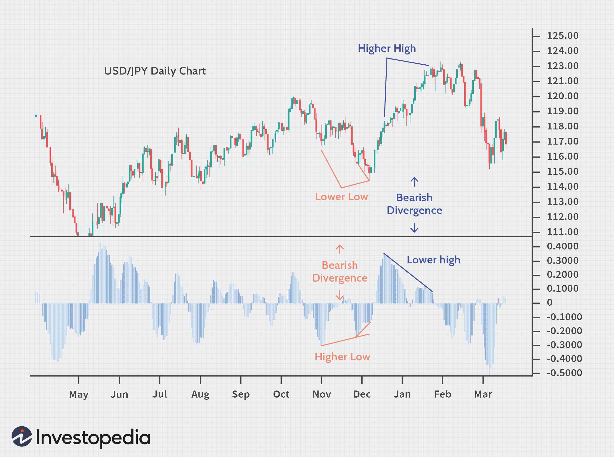

Divergences in forex trading refer to the discrepancies observed between the price movement of currency pairs and corresponding technical indicators, such as the Relative Strength Index (RSI) or the Moving Average Convergence Divergence (MACD). These divergences provide traders with crucial insights, often indicating a potential reversal or continuation of the prevailing trend. Essentially, divergences signal a discrepancy between the momentum of the price action and the momentum indicated by the technical tools, suggesting potential shifts in buying or selling pressures.

In forex trading, where market dynamics can be influenced by a myriad of factors including economic data releases, geopolitical events, and central bank policies, the ability to anticipate market reversals or continuations through divergence analysis can be immensely beneficial. This is particularly relevant as forex markets are highly liquid and operate on a 24-hour basis, making timely decision-making essential.



Algorithmic trading, often referred to as algo trading, has become increasingly prominent in the forex market. By utilizing complex mathematical models and algorithms, traders can analyze vast amounts of forex price data, execute trades at high speeds, and remove human emotions from trading decisions. Algo trading is particularly advantageous in forex due to its precision in executing trades based on predefined strategies, such as those predicated on divergence signals.

Divergences serve as potent signals within algorithmic trading strategies, automating entry and exit decisions with enhanced precision. When embedded in algorithmic systems, divergences can facilitate robust trading strategies by systematically identifying potential price reversals or continuations. For instance, if a trader observes that the price of a currency pair is making new highs while the RSI fails to reach new highs, this regular divergence may indicate a weakening trend, prompting the algorithm to execute a trade that anticipates a price reversal.

The integration of divergence analysis in algorithmic strategies not only enhances the accuracy of trade signals but also improves consistency, as these systems can continuously monitor markets and act swiftly upon identification of divergence patterns. Ultimately, leveraging divergences in forex algo trading can lead to more informed trading decisions, optimizing the profitability and efficacy of trading systems in the dynamic foreign exchange market.

## Table of Contents

## Understanding Divergence in Forex Trading

Divergence in forex trading refers to a situation where the price of a currency pair and an associated indicator, typically a momentum oscillator like the Relative Strength Index (RSI) or Moving Average Convergence Divergence (MACD), move in opposite directions. This phenomenon is significant in the forex market because it can provide traders with early warning signals of potential changes in price trends, offering opportunities to anticipate trend reversals or continuations.

Divergence indicates a shift in [momentum](/wiki/momentum), suggesting that the current trend may be losing strength. This shift occurs because prices might be making new highs or lows, but the indicator fails to reach a corresponding level, indicating that the momentum driving the trend is weakening. Traders use this information to prepare for possible price corrections or reversals.

There are primarily two types of divergences in [forex](/wiki/forex-system) trading: regular divergence and hidden divergence. 

1. **Regular Divergence**: Regular divergence occurs when the price forms a new high or low, but the indicator fails to do so. For example, in an uptrend, if the price reaches a higher high, but the momentum indicator forms a lower high, this is a bearish regular divergence, suggesting that the uptrend may be weakening and a reversal or pullback might occur. Conversely, in a downtrend, if the price makes a lower low but the indicator makes a higher low, it indicates bullish regular divergence, hinting at a potential trend reversal to the upside.

   Mathematically, regular divergence can be expressed as:
   - **Bearish Regular Divergence**: $\text{Price} > \text{Previous Price}$ and $\text{Indicator} < \text{Previous Indicator}$
   - **Bullish Regular Divergence**: $\text{Price} < \text{Previous Price}$ and $\text{Indicator} > \text{Previous Indicator}$

2. **Hidden Divergence**: Hidden divergence signals trend continuation rather than reversal. It occurs when the price shows a higher low or lower high, but the indicator does not confirm this movement. In an uptrend, if the price makes any higher low and the momentum indicator forms a lower low, it suggests hidden bullish divergence, indicating that the uptrend is likely to continue. In a downtrend, if the price makes a lower high and the indicator makes a higher high, this implies hidden bearish divergence, signaling the trend's continuation downwards.

   Mathematically:
   - **Hidden Bullish Divergence**: $\text{Price} > \text{Previous Price}$ and $\text{Indicator} < \text{Previous Indicator}$
   - **Hidden Bearish Divergence**: $\text{Price} < \text{Previous Price}$ and $\text{Indicator} > \text{Previous Indicator}$

In practice, the identification of these divergences is crucial for traders looking to refine their entry and [exit](/wiki/exit-strategy) points. By carefully analyzing divergences, traders can make informed decisions by anticipating potential trend changes, thus optimizing their forex trading strategies.

## Types of Divergence and Their Implications

Divergence in forex trading is a valuable indicator for identifying potential changes in market trends. It stems from the comparative analysis between the price action of a currency pair and an oscillating indicator, such as the Relative Strength Index (RSI) or the Moving Average Convergence Divergence (MACD). Divergences can provide insights into momentum shifts and are categorized primarily into two types: regular divergence and hidden divergence. Each type plays a distinct role in forex trading strategies, particularly in signaling reversals or continuations of trends.

### Regular Divergence

Regular divergence is a pattern that suggests a potential trend reversal. It occurs when the price of a currency pair is moving in the opposite direction of an oscillating indicator. There are two subtypes:

1. **Bullish Regular Divergence**: This occurs when the price forms lower lows, while the indicator forms higher lows. It signals that, despite the price decline, selling momentum is weakening, which may indicate a reversal to an upward trend.

2. **Bearish Regular Divergence**: This is observed when the price forms higher highs, but the indicator forms lower highs. It suggests that buying momentum is waning, which could foreshadow a downward trend reversal.

Practical Example:
Suppose the EUR/USD chart shows that the price has formed a series of lower lows, but the RSI presents a series of higher lows. This bullish regular divergence can indicate that the downward trend might be losing momentum, prompting traders to anticipate a potential reversal to the upside.

### Hidden Divergence

Hidden divergence is used to signal trend continuation. It is identified when the price makes a higher low (in an uptrend) or a lower high (in a downtrend), while the indicator shows opposing patterns.

1. **Bullish Hidden Divergence**: Occurs when the price makes a higher low, and the indicator draws a lower low. This alignment reinforces the probability of the current uptrend's persistence.

2. **Bearish Hidden Divergence**: Appears when the price sets a lower high, whereas the indicator marks a higher high. This suggests that the strength of the ongoing downtrend is poised to continue.

Practical Example:
Imagine a scenario where the GBP/USD is in an uptrend and the price forms a higher low. During the same period, the MACD forms a lower low. This bullish hidden divergence suggests the continuation of the existing upward trend, allowing traders to maintain bullish positions.

### Practical Illustration with Python

To identify divergences programmatically, one can use Python along with packages such as pandas and numpy for data handling and computation. Here is a simplified example for detecting bullish regular divergence using RSI:

```python
import pandas as pd
import numpy as np

# Sample price and RSI data
data = {
    'price': [1.2, 1.18, 1.15, 1.17, 1.16],
    'rsi': [30, 35, 40, 45, 50]
}

df = pd.DataFrame(data)

def find_divergence(df):
    price_lows = (df['price'] < df['price'].shift(1)) & (df['price'].shift(-1) > df['price'])
    rsi_higher_lows = (df['rsi'] > df['rsi'].shift(1)) & (df['rsi'].shift(-1) < df['rsi'])

    bullish_divergence = price_lows & rsi_higher_lows
    return bullish_divergence

bullish_divergence_points = find_divergence(df)
print("Bullish Divergence Points:")
print(df[bullish_divergence_points])
```

In this example, the program identifies points where a bullish regular divergence might occur based on the lows detected in the price series and corresponding higher lows in the RSI data. By employing such computational techniques, traders can automate the detection of trading signals, aiding their decision-making process in pursuing trend reversals or continuations.

## Leveraging Divergence in Algo Trading

Integrating divergence analysis into [algorithmic trading](/wiki/algorithmic-trading) models enhances the precision and efficacy of forex trading systems. Divergences occur when the price of a currency pair moves in the opposite direction of an indicator, such as the Relative Strength Index (RSI) or Moving Average Convergence Divergence (MACD). By incorporating divergence analysis, traders can program algorithms to detect these anomalies, highlighting potential opportunities for profitable trades.

Automating entry and exit points using divergences offers significant advantages. When a divergence is detected, an algorithm can execute buy or sell orders instantly, minimizing delays and capturing optimal market conditions. This automation reduces emotional bias and human error, ensuring consistent application of trading strategies. For instance, an algorithm may be programmed to buy when regular divergence occurs—where the price is making a new low but the indicator is making a higher low—indicating a potential trend reversal.

Moreover, algorithms enhance accuracy by processing large volumes of data at high speeds, identifying divergences that might be overlooked by manual analysis. They can systematically apply predefined rules to determine entry and exit points with precision. For example:

```python
import pandas as pd
import talib

# Load historical forex data
data = pd.read_csv('forex_data.csv')

# Calculate RSI
rsi = talib.RSI(data['Close'], timeperiod=14)

# Detect Regular Bullish Divergence
divergence = (data['Close'].shift(1) < data['Close']) & (rsi.shift(1) > rsi)

# Execute trade if divergence is detected
if divergence.iloc[-1]:
    print("Buy Signal Detected")
```

This script reads historical forex data, computes the RSI, and checks for divergence conditions. When detected, the program triggers a buy signal. Such automation ensures the strategy is applied consistently, regardless of market conditions.

In divergence trading, algorithms also contribute to consistency. By systematically enforcing strategy parameters, traders can avoid subjective decision-making, leading to more reliable outcomes. Additionally, these systems can be backtested with historical data, optimizing and validating strategies before real-world application, thus refining accuracy over time.

In summary, integrating divergence analysis into algorithmic trading systems can significantly enhance entry and exit point precision and provide consistency across trades. Algorithms process and react to data faster than human traders, ensuring that trading decisions are made based on quantitative analysis rather than emotion or speculation.

## Building a Divergence-Based Forex Algo Strategy

In creating a divergence-based forex algorithmic strategy, traders can harness the predictive power of divergences to inform trading decisions. Divergences occur when the price of a currency pair moves in the opposite direction of an indicator, typically an oscillator like the Relative Strength Index (RSI) or the Moving Average Convergence Divergence (MACD). By automating the detection of these signals, traders can execute strategies with increased speed and precision.

### Creating a Basic Algorithm

1. **Signal Detection**: The first step is to program the algorithm to detect divergences. This can be done using a popular programming language like Python. For example, when using the RSI, the algorithm should identify points where the price reaches a new high, but the RSI does not reach a new high. This discrepancy signals a divergence.

    ```python
    def find_divergence(price_series, indicator_series):
        divergence_points = []
        for i in range(1, len(price_series)):
            if price_series[i] > price_series[i-1] and indicator_series[i] <= indicator_series[i-1]:
                divergence_points.append((i, 'bearish_divergence'))
            elif price_series[i] < price_series[i-1] and indicator_series[i] >= indicator_series[i-1]:
                divergence_points.append((i, 'bullish_divergence'))
        return divergence_points
    ```

2. **Entry and Exit Signals**: Once divergences are identified, the next step is to define entry and exit points. Entry could be initiated immediately when a divergence is detected, whereas exits might be based on predefined profit targets or stop-loss levels.

    ```python
    entry_price = current_price
    stop_loss = entry_price * 0.98  # Example: 2% below entry
    take_profit = entry_price * 1.05  # Example: 5% above entry
    ```

### Backtesting

Backtesting involves testing the strategy against historical forex data to evaluate its effectiveness. This process helps assess how the strategy would have performed in the past, providing insights into its potential future performance.

- **Historical Data**: Gather historical price and indicator data. This data can be sourced from forex data providers or trading platforms.
- **Simulation**: Run the algorithm over the historical data to simulate trades. This can help in understanding the strategy's performance metrics such as win rate, profit factor, and drawdowns.

### Risk Management and Optimization

Effective risk management is crucial for the sustainability of any trading strategy. Implementing mechanisms to control risk exposure is essential.

- **Position Sizing**: Determine the amount of capital to allocate per trade based on risk tolerance. A typical approach is the fixed fractional position sizing, where a set percentage of the account equity is risked per trade.
$$
    \text{Position Size} = \frac{\text{Account Equity} \times \text{Risk per Trade}}{\text{Stop Loss Distance}}

$$

- **Diversification**: Avoid concentrating risk by diversifying across multiple currency pairs or incorporating additional strategies.

- **Optimization**: Regularly optimize the strategy to adapt to changing market conditions. This involves tweaking parameters, re-evaluating indicators used, and testing new risk management rules.

In conclusion, building a divergence-based forex algorithmic strategy combines the technical aspects of divergence detection with robust [backtesting](/wiki/backtesting) and risk management to create a system capable of navigating the forex market efficiently. By methodically crafting and refining these strategies, traders can potentially enhance their trading performance.

## Challenges and Limitations

Trading divergences algorithmically in the forex market presents several challenges and limitations. It is crucial to understand these issues to effectively incorporate divergence signals into trading systems.

One key pitfall when trading divergences is the potential for false signals. Divergence indicates a discrepancy between the price movement and an indicator, such as the Relative Strength Index (RSI) or Moving Average Convergence Divergence (MACD). While these signals can suggest potential reversals, they do not guarantee one, often leading to false positives. To mitigate this, traders can incorporate additional parameters or confirmatory signals, such as price action patterns or support and resistance levels, to validate divergence signals. Additionally, using multiple time frames to confirm divergence can enhance the robustness of the signal.

Moreover, divergence signals have limitations based on the sensitivity of the indicators used. For instance, oscillators like the RSI can remain in overbought or oversold conditions for extended periods, even as divergences appear. This behavior can result in premature trade entries. To address this, modifying the look-back period or smoothing the indicator with a moving average can reduce sensitivity and improve accuracy. For example, in Python, one might use the pandas library to apply a rolling average to the RSI:

```python
import pandas as pd

# Sample RSI calculation
rsi = pd.Series([some_prices])

# Smoothing RSI with a moving average to reduce noise
smoothed_rsi = rsi.rolling(window=14).mean()
```

Market noise is another challenge when employing divergence strategies. In volatile forex markets, price movements are often erratic, making it difficult to discern genuine divergence signals. Filtering out noise can involve using higher time frames to focus on more persistent trends rather than short-term fluctuations.

Furthermore, algorithmic divergence strategies must account for the dynamic nature of the forex market. Market conditions can change rapidly due to geopolitical events, macroeconomic data releases, or central bank interventions. Algorithms should be adaptable, with continual parameter tuning and optimization based on new market data. Practicing robust backtesting across various market conditions is essential to test the viability of divergence trading strategies.

While trading divergences algorithmically poses distinct challenges, incorporating additional validation techniques, optimization strategies, and continually adapting to market conditions can mitigate these limitations. A comprehensive approach that combines divergence with other technical analysis tools can enhance the overall effectiveness and reliability of forex trading strategies.

## Conclusion

Divergences in forex trading present a powerful opportunity for enhancing algorithmic trading strategies. By identifying shifts in momentum and potential trend reversals or continuations, divergences offer key insights that can inform better trading decisions. Algorithmic trading, with its capacity to process vast amounts of data and execute trades with precision, is particularly well-suited to leverage these signals, thereby facilitating more accurate and consistent trading outcomes.

Incorporating divergences into forex algo trading allows traders to automate entry and exit points, effectively reducing emotional bias and improving decision-making efficiency. This automation not only streamlines the trading process but also harnesses the potential of divergences to capture market movements that may be overlooked in manual trading. The ability of algorithms to analyze divergences across multiple time frames further enhances the robustness of trading strategies, making them adaptable to varying market conditions.

Continual learning and adaptation are crucial to refining these systems. The forex market is dynamic, and staying abreast of emerging trends and refining algorithmic models based on new information is essential for sustained success. Traders should be encouraged to revisit their strategies regularly, incorporating feedback from both successful and unsuccessful trades.

Moreover, the importance of using a combination of strategies cannot be overstated. While divergences are valuable tools, they are most effective when integrated with other technical indicators and risk management practices. This multi-faceted approach aids in mitigating potential downsides such as false signals and market noise. By blending different methodologies, traders can develop a comprehensive trading system that maximizes potential returns while minimizing risks.

In conclusion, divergences provide significant potential to enhance forex algo trading. Their integration into trading systems, combined with ongoing learning and a balanced approach to strategy development, can lead to improved performance and more resilient trading models. Achieving optimal results often requires a thoughtful amalgamation of strategies, with divergences playing a central yet complementary role.

## Further Reading and Resources

### Further Reading and Resources

To deepen your understanding of divergence trading and its implementation in algorithmic trading models, consider the following [books](/wiki/algo-trading-books) and articles:

1. **"Technical Analysis of the Financial Markets" by John J. Murphy**  
   This book provides comprehensive insights into technical analysis, including the concept of divergences. It's a foundational read for anyone interested in the technical aspects of Forex trading.

2. **"Trading for a Living" by Dr. Alexander Elder**  
   Alexander Elder's book explains the concept of divergences in the context of overall market psychology and trading strategies. It is a valuable resource for understanding both regular and hidden divergences.

3. **"The New Trading for a Living" by Dr. Alexander Elder**  
   An updated version of his previous work, this book elaborates further on the practical aspects of trading, with new tools and techniques, including trading divergences.

4. **"Trading Divergences: Proven Techniques for Profiting from Market Turning Points" by Urban Jaekle & Emilio Tomasini**  
   This book specifically focuses on trading divergences, offering detailed strategies and examples of how divergences can be utilized to predict market turning points.

5. **"Algorithmic Trading: Winning Strategies and Their Rationale" by Ernie Chan**  
   This book explores various algorithmic trading strategies, including those that use technical indicators such as divergences, providing a solid foundation for building automated trading systems.

Online resources and platforms for developing trading algorithms:

- **QuantConnect** [QuantConnect](https://www.quantconnect.com/): This platform offers a cloud-based algorithmic trading backtesting environment where you can develop and test your algorithms using a rich dataset for forex markets.

- **Alpaca Markets** [Alpaca Markets](https://alpaca.markets/): Alpaca is a commission-free platform that supports the development, testing, and execution of algorithmic trading strategies. It provides access to Forex market data and trading services via APIs.

- **TradingView** [TradingView](https://www.tradingview.com/): TradingView offers a platform to write custom technical indicators with Pinescript, allowing you to manually write divergence indicators that can be backtested directly on their platform.

- **Kaggle** [Kaggle](https://www.kaggle.com/): As a data science community platform, Kaggle hosts numerous datasets and Python notebooks aimed at financial analysis and algorithmic trading, making it a valuable resource for testing out divergence strategies.

These resources will assist you in gaining a comprehensive understanding of divergence trading and provide helpful platforms to practice and develop your algorithmic trading strategies.

## References & Further Reading

[1]: Murphy, J. J. (1999). ["Technical Analysis of the Financial Markets."](https://archive.org/details/technicalanalysi0000murp) New York Institute of Finance.

[2]: Elder, A. (1993). ["Trading for a Living."](https://www.amazon.com/Trading-Living-Psychology-Tactics-Management/dp/0471592242) Wiley.

[3]: Elder, A. (2014). ["The New Trading for a Living."](https://www.amazon.com/New-Trading-Living-Psychology-Discipline/dp/1118443926) Wiley.

[4]: Jaekle, U., & Tomasini, E. (2019). ["Trading Divergences: Proven Techniques for Profiting from Market Turning Points."](https://www.amazon.com/Trading-Systems-2nd-development-optimisation/dp/085719755X) Harriman House.

[5]: Chan, E. P. (2009). ["Algorithmic Trading: Winning Strategies and Their Rationale."](https://github.com/ftvision/quant_trading_echan_book) Wiley.

[6]: [QuantConnect](https://www.quantconnect.com/): A platform that offers a cloud-based algorithmic trading backtesting environment for forex markets.

[7]: [Alpaca Markets](https://alpaca.markets/): A commission-free platform that supports the development of algorithmic trading strategies with access to Forex market data and trading services via APIs.

[8]: [TradingView](https://www.tradingview.com/): A platform that allows users to write custom technical indicators with Pinescript, suitable for creating and backtesting divergence indicators.

[9]: Jansen, S. (2020). ["Machine Learning for Algorithmic Trading."](https://github.com/stefan-jansen/machine-learning-for-trading) Packt Publishing.