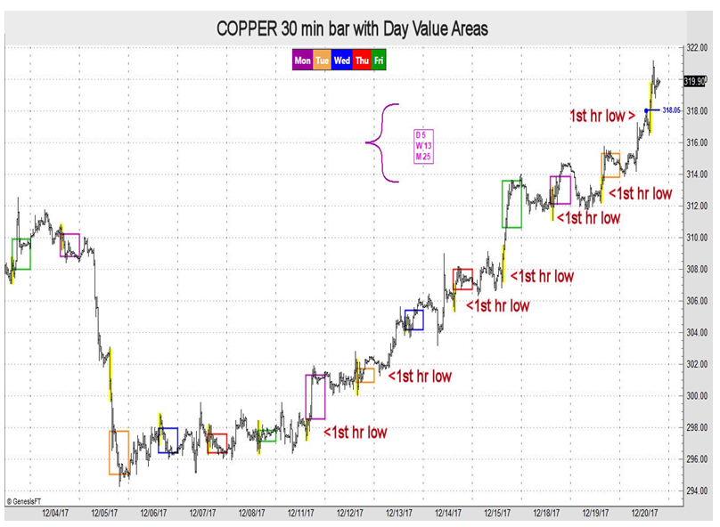

## Table of Contents

## What is forex trading and why is market momentum important?

Forex trading, also known as foreign exchange trading, is when people buy and sell different currencies to make money. It's like trading one country's money for another country's money, hoping that the value of the currency you buy will go up so you can sell it later for a profit. For example, if you think the US dollar will get stronger compared to the Euro, you might buy dollars with Euros, and then sell the dollars later when their value goes up.

Market momentum is important in forex trading because it shows the strength of a currency's movement. When a currency has strong momentum, it means more people are buying or selling it, and it's likely to keep moving in that direction for a while. Traders watch momentum to decide when to enter or exit trades. If the momentum is strong, it can be a good time to join the trend and make a profit. But if the momentum starts to slow down, it might be a sign that the trend is ending, and it could be time to sell and take your profits before the currency's value changes direction.

## How can beginners identify market momentum in forex trading?

Beginners can identify market momentum in forex trading by looking at price charts. These charts show how the price of a currency pair changes over time. If the price is going up and making higher highs and higher lows, it means the momentum is strong and the trend is bullish. On the other hand, if the price is going down and making lower highs and lower lows, the momentum is strong but the trend is bearish. By watching these patterns, beginners can get a sense of whether the market is moving strongly in one direction.

Another way to identify market momentum is by using technical indicators like the Moving Average Convergence Divergence (MACD) or the Relative Strength Index (RSI). These tools help traders see if a currency pair is overbought or oversold, which can signal if the momentum is likely to continue or reverse. For example, if the MACD line crosses above the signal line, it might mean the momentum is picking up and it's a good time to buy. If the RSI is above 70, it could mean the currency is overbought and the momentum might slow down soon. By using these indicators, beginners can better understand the strength and direction of market momentum.

## What are the key indicators used to monitor market momentum?

Key indicators used to monitor market momentum include the Moving Average Convergence Divergence (MACD) and the Relative Strength Index (RSI). The MACD is a popular tool that helps traders see the relationship between two moving averages of a currency's price. It shows when the momentum is getting stronger or weaker. If the MACD line crosses above the signal line, it suggests the momentum is increasing and it might be a good time to buy. If it crosses below, the momentum might be decreasing, and it could be a good time to sell.

The RSI is another important indicator that measures how fast and how much the price of a currency is changing. It ranges from 0 to 100 and helps traders see if a currency is overbought or oversold. If the RSI is above 70, it means the currency might be overbought and the momentum could slow down soon. If it's below 30, the currency might be oversold, and the momentum could pick up. By watching these indicators, traders can get a better idea of market momentum and make smarter trading decisions.

## How does the Moving Average Convergence Divergence (MACD) help in assessing market momentum?

The Moving Average Convergence Divergence (MACD) helps traders see the strength and direction of market momentum by comparing two moving averages of a currency's price. It does this by creating a MACD line and a signal line. The MACD line is the difference between a fast moving average (usually 12 periods) and a slow moving average (usually 26 periods). The signal line is a moving average of the MACD line, often set to 9 periods. When the MACD line crosses above the signal line, it suggests that the momentum is picking up and it might be a good time to buy. When the MACD line crosses below the signal line, it means the momentum might be slowing down, and it could be a good time to sell.

Another way the MACD helps assess market momentum is by looking at the histogram, which shows the distance between the MACD line and the signal line. If the histogram bars are getting taller, it means the momentum is getting stronger. If the bars are getting shorter, the momentum is weakening. Traders use these signals to decide when to enter or exit trades. By watching the MACD, traders can get a clear picture of whether the market is moving strongly in one direction or if it's about to change direction.

## What role does the Relative Strength Index (RSI) play in monitoring market momentum?

The Relative Strength Index (RSI) is a tool that helps traders see if a currency is moving strongly or if it might be ready for a change. It measures how fast and how much the price of a currency is changing, and it gives a number between 0 and 100. If the RSI is above 70, it means the currency might be overbought, which means a lot of people have bought it and the price might go down soon. If the RSI is below 30, it means the currency might be oversold, which means not many people want it and the price might go up soon. By watching the RSI, traders can get a sense of whether the market is moving strongly in one direction or if it's about to change direction.

Traders also use the RSI to look for something called divergence. Divergence happens when the price of a currency is going one way, but the RSI is going the other way. For example, if the price is going up but the RSI is going down, it might mean the momentum is getting weaker and the price might start to go down too. By spotting these divergences, traders can make better guesses about when to buy or sell a currency. The RSI helps traders understand the strength of the market's momentum and make smarter trading decisions.

## How can traders use volume to gauge market momentum in forex?

Traders can use volume to gauge market momentum in forex by looking at how much of a currency pair is being traded. When a lot of people are buying or selling a currency pair, it means the volume is high. High volume often shows that the market is moving strongly in one direction. If the price is going up and the volume is high, it means more people want to buy the currency, which can make the momentum stronger. On the other hand, if the price is going down with high volume, it means more people are selling, which can also show strong momentum but in the opposite direction.

By watching the volume, traders can see if the market's momentum is likely to keep going or if it might be ready to change. If the volume starts to go down while the price is still going up or down, it might mean the momentum is getting weaker. This can be a sign that the price might start to move the other way soon. So, volume helps traders understand how strong the market's momentum is and when it might be a good time to buy or sell a currency pair.

## What are the differences between short-term and long-term market momentum in forex trading?

Short-term market momentum in forex trading is all about quick changes in the market that happen over a few hours or days. Traders who focus on short-term momentum look at small price movements and use tools like the RSI or MACD to see if the market is moving fast. They might trade a lot in a short time, trying to make money from these quick ups and downs. Short-term momentum can be exciting but also risky because the market can change direction quickly.

Long-term market momentum, on the other hand, is about bigger trends that last weeks, months, or even years. Traders who focus on long-term momentum look at the overall direction of the market and use things like moving averages to see where the market is going. They might not trade as often, but they hold onto their trades for a long time, hoping to make money from the big moves in the market. Long-term momentum is usually less risky than short-term momentum because it's based on bigger trends that are more likely to continue.

## How can advanced traders combine multiple momentum indicators for better decision-making?

Advanced traders can combine multiple momentum indicators to get a clearer picture of the market and make better trading decisions. For example, they might use the MACD to see if the momentum is getting stronger or weaker, and then check the RSI to see if the currency is overbought or oversold. If the MACD shows that the momentum is picking up and the RSI is not yet overbought, it might be a good time to buy. But if the MACD shows the momentum is slowing down and the RSI is overbought, it might be a good time to sell. By looking at both indicators, traders can see if the signals match up and make more confident trades.

Another way advanced traders use multiple indicators is by adding volume to the mix. They might see that the MACD and RSI are showing strong momentum, but if the volume is low, it might mean the trend is not as strong as it looks. On the other hand, if the volume is high along with strong signals from the MACD and RSI, it can confirm that the momentum is really strong. By combining these indicators, traders can get a better sense of whether the market is likely to keep moving in the same direction or if it might change soon. This helps them make smarter decisions about when to buy or sell.

## What are the common pitfalls when relying on market momentum indicators?

One common pitfall when using market momentum indicators is that they can give false signals. This means the indicators might show that the market is moving strongly in one direction, but then the market does something different. For example, the MACD might say it's a good time to buy, but the price might go down instead. This can happen because the indicators are based on past data, and the market can change quickly. Traders need to be careful and use other tools to check if the signals are right before making big decisions.

Another pitfall is that traders might focus too much on just one or two indicators and miss other important signs. For example, if a trader only looks at the RSI and sees that a currency is overbought, they might think it's time to sell. But if they also looked at the volume and saw that it was still going up, they might realize the trend is still strong and it's not a good time to sell yet. By using different indicators together and looking at the big picture, traders can avoid making mistakes based on just one piece of information.

## How does market sentiment influence forex market momentum and how can it be tracked?

Market sentiment is how people feel about the market. It can make the market move fast in one direction or slow down. If a lot of people feel good about a currency, they might buy more of it, which makes the price go up and the momentum get stronger. But if people feel bad about a currency, they might sell it, which makes the price go down and the momentum get weaker. So, market sentiment can really change how fast and in what direction the market moves.

To track market sentiment, traders look at things like news, reports, and what other traders are saying. They might read the news to see if there are big events that could make people feel good or bad about a currency. They can also look at economic reports to see if the economy is doing well or not. Another way is to use tools like the Commitment of Traders (COT) report, which shows what big traders are doing. By keeping an eye on these things, traders can get a sense of how people feel about the market and how it might affect the momentum.

## What advanced techniques can be used to predict shifts in market momentum?

Advanced traders can use something called sentiment analysis to predict when market momentum might change. This means they look at what people are saying on social media, in news articles, and in financial reports to see if people's feelings about a currency are changing. If more people start talking positively about a currency, it might mean the momentum will get stronger soon. But if more people start talking negatively, it could mean the momentum will get weaker. Traders use special tools and computer programs to analyze all these words and figure out the overall sentiment. By watching how sentiment changes, traders can guess when the market might start moving in a different direction.

Another technique is to use something called intermarket analysis. This means traders look at how different markets, like stocks, bonds, and commodities, are moving together. If these markets start to move differently than they usually do, it can be a sign that the momentum in the forex market might change soon. For example, if stock prices start to go down while a currency is going up, it might mean the currency's momentum will slow down. Traders use charts and graphs to see these connections and predict when the momentum might shift. By combining sentiment analysis and intermarket analysis, traders can make better guesses about when the market might change direction.

## How do global economic events impact forex market momentum and what strategies should traders employ?

Global economic events can have a big impact on forex market momentum. When something important happens in the world, like a country's central bank changing interest rates or a big report coming out about how well an economy is doing, it can make people feel differently about currencies. If the news is good, like a country's economy growing faster than expected, people might want to buy that country's currency more, which can make the momentum stronger. But if the news is bad, like a country going into a recession, people might want to sell that currency, which can make the momentum weaker. These events can cause the market to move quickly in one direction or another.

Traders need to be ready for these changes and have good strategies to handle them. One strategy is to keep an eye on the news and economic reports so they know when big events are happening. This way, they can guess how the market might react and be ready to buy or sell at the right time. Another strategy is to use something called stop-loss orders, which automatically sell a currency if its price goes down too much. This can help traders avoid losing a lot of money if the momentum suddenly changes direction. By staying informed and using smart trading tools, traders can better manage the ups and downs caused by global economic events.

## What is Understanding Market Momentum?

Market momentum refers to the rate of acceleration of a financial security's price or volume. This concept is crucial for traders as it provides insights into potential long-term trends or shifts in market direction. By understanding momentum, traders can make more informed decisions regarding entry and exit points in the financial markets.

Momentum is often assessed through technical analysis indicators, such as the Moving Average Convergence Divergence (MACD) and the Relative Strength Index (RSI). The MACD is a trend-following momentum indicator that illustrates the relationship between two moving averages of a security’s price. It is calculated by subtracting the 26-period Exponential Moving Average (EMA) from the 12-period EMA. The result of this calculation is the MACD line. A nine-day EMA of the MACD, called the "signal line," is then plotted on top of the MACD line, which can function as a trigger for buy and sell signals.

$$
\text{MACD} = \text{EMA}_{12} - \text{EMA}_{26}
$$

The RSI, on the other hand, measures the speed and change of price movements. It is typically used to identify overbought or oversold conditions in a market. The RSI is calculated using the following formula:

$$
\text{RSI} = 100 - \left( \frac{100}{1 + \frac{\text{Average Gain}}{\text{Average Loss}}} \right)
$$

Momentum trading capitalizes on the idea of 'buying high and selling higher' in markets that are trending upwards, or 'selling low and buying lower' in markets that are trending downwards. This strategy is based on the premise that securities which have been rising steadily will continue to do so, and those that have been falling will continue their decline. By effectively utilizing [momentum](/wiki/momentum), traders can position themselves advantageously to profit from continuing trends.

## References & Further Reading

[1]: Bergstra, J., Bardenet, R., Bengio, Y., & Kégl, B. (2011). ["Algorithms for Hyper-Parameter Optimization."](https://dl.acm.org/doi/10.5555/2986459.2986743) Advances in Neural Information Processing Systems 24.

[2]: ["Advances in Financial Machine Learning"](https://www.amazon.com/Advances-Financial-Machine-Learning-Marcos/dp/1119482089) by Marcos Lopez de Prado

[3]: ["Evidence-Based Technical Analysis: Applying the Scientific Method and Statistical Inference to Trading Signals"](https://www.amazon.com/Evidence-Based-Technical-Analysis-Scientific-Statistical/dp/0470008741) by David Aronson

[4]: ["Machine Learning for Algorithmic Trading"](https://github.com/stefan-jansen/machine-learning-for-trading) by Stefan Jansen

[5]: ["Quantitative Trading: How to Build Your Own Algorithmic Trading Business"](https://www.amazon.com/Quantitative-Trading-Build-Algorithmic-Business/dp/1119800064) by Ernest P. Chan