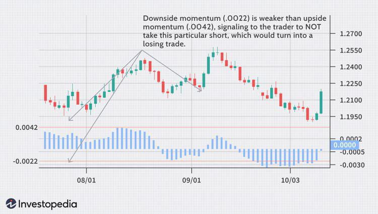

In the world of forex trading, understanding market momentum and utilizing algorithmic trading strategies can significantly enhance trading success. Momentum refers to the speed at which asset prices move, and recognizing this can help traders anticipate future price movements and capital allocations. As the forex market is characterized by high liquidity and volatility, traders who master momentum trading strategies are at a distinct advantage.

This article aims to explore various momentum trading strategies in the forex market, highlighting the integration of algorithmic trading tools. Algorithmic trading, which uses computer programs to execute trades according to predefined criteria, optimizes the process by eliminating emotional biases and improving execution speed. By incorporating algorithmic tools, traders can systematically analyze market data and execute trades with greater precision.



Understanding the significance of momentum in trading and how it influences decision-making is crucial for any trader seeking consistent results. Momentum often indicates the direction strength of a market trend, allowing traders to 'ride the wave' of a trend for potential profits. Tools like Moving Average Convergence Divergence (MACD) and Relative Strength Index (RSI) are commonly used to measure momentum and make informed trading decisions. By focusing on these indicators, traders can refine entry and exit points, leading to more successful trades.

By the end of this article, you should have a comprehensive understanding of how to incorporate these strategies into your trading plan. With a firm grasp of combining momentum indicators and algorithmic techniques, traders can better navigate the complexities of the forex market and seize lucrative opportunities effectively.

## Table of Contents

## Understanding Market Momentum

Market momentum refers to the rate of acceleration of a financial security's price or volume. This concept is crucial for traders as it provides insights into potential long-term trends or shifts in market direction. By understanding momentum, traders can make more informed decisions regarding entry and exit points in the financial markets.

Momentum is often assessed through technical analysis indicators, such as the Moving Average Convergence Divergence (MACD) and the Relative Strength Index (RSI). The MACD is a trend-following momentum indicator that illustrates the relationship between two moving averages of a security’s price. It is calculated by subtracting the 26-period Exponential Moving Average (EMA) from the 12-period EMA. The result of this calculation is the MACD line. A nine-day EMA of the MACD, called the "signal line," is then plotted on top of the MACD line, which can function as a trigger for buy and sell signals.

$$
\text{MACD} = \text{EMA}_{12} - \text{EMA}_{26}
$$

The RSI, on the other hand, measures the speed and change of price movements. It is typically used to identify overbought or oversold conditions in a market. The RSI is calculated using the following formula:

$$
\text{RSI} = 100 - \left( \frac{100}{1 + \frac{\text{Average Gain}}{\text{Average Loss}}} \right)
$$

Momentum trading capitalizes on the idea of 'buying high and selling higher' in markets that are trending upwards, or 'selling low and buying lower' in markets that are trending downwards. This strategy is based on the premise that securities which have been rising steadily will continue to do so, and those that have been falling will continue their decline. By effectively utilizing [momentum](/wiki/momentum), traders can position themselves advantageously to profit from continuing trends.

## Top Momentum Trading Strategies

### Top Momentum Trading Strategies

Momentum trading is a popular technique among [forex](/wiki/forex-system) traders that revolves around seizing the inertia of the market. Here are three pivotal momentum trading strategies:

1. **Breakout Strategies**: Breakout strategies involve initiating a trade when the price of a security surpasses established support or resistance levels. This transition often signifies the onset of substantial price movements. Traders aim to capture the early stages of these movements by setting up entry points above resistance levels or below support levels. Breakouts can be identified using various tools, such as Bollinger Bands or price channels, which help in detecting volatility and predicting potential breakout points.

2. **Pullback Strategies**: Pullback strategies are employed after the initial momentum of a trending market experiences a temporary reversal, or pullback. This approach involves purchasing during these dips - when the market is generally expected to continue its trend after the minor correction. Traders often use Fibonacci retracement levels to identify possible pullback levels, where they can re-enter the market while minimizing risk. By capitalizing on these short-term corrections, traders position themselves to exploit the resumption of the prevailing trend for potentially higher returns.

3. **Trend Following using ADX**: The Average Directional Index (ADX) is crucial for assessing the strength of a prevailing trend, rather than its direction. A high ADX value indicates a strong trend, making it safe for traders to follow. ADX is part of the broader Directional Movement System, often used in conjunction with +DI and -DI indicators, which aid in identifying bullish or bearish trends. Trades are recommended when the ADX value is above 20 or 25, and the strategy involves entering trades in the direction indicated by the trend's strength while ensuring that momentum aligns with the indicator’s readings. 

Overall, these strategies rely on technical indicators and precise calculations to forecast trade opportunities driven by momentum. By meticulously applying these techniques, traders can potentially improve their market timing and enhance profitability.

## Role of Algorithmic Trading in Momentum Strategies

Algorithmic trading, also referred to as algo trading, involves the use of computer programs to execute trades according to predefined criteria. In the context of momentum trading, these algorithms utilize momentum indicators to identify and act on trending opportunities. These indicators are essential as they measure the strength and direction of a price movement, thereby offering traders a systematic approach to intervene in the market.

The primary advantage of using algorithms in momentum strategies lies in their capacity to process vast amounts of data rapidly. By analyzing complex data sets much faster than a human could manually, algorithms can detect subtle momentum shifts and execute trades at greater speed and efficiency. This capability is crucial, particularly in the foreign exchange market, where currency values can fluctuate rapidly due to geopolitical events, economic releases, or other factors.

A key component of [algorithmic trading](/wiki/algorithmic-trading) is [backtesting](/wiki/backtesting). Backtesting allows traders to apply trading algorithms to historical market data to gauge how a strategy would have performed in the past. This process helps traders optimize their strategies by adjusting parameters to achieve better results in real-world trading conditions. The core advantage is that it offers a glimpse into the potential success or failure of a strategy without risking actual capital. For instance, a trader might use Python in conjunction with libraries such as Pandas for data manipulation and Matplotlib for visualizing historical performance. Sample Python code for backtesting might look like this:

```python
import pandas as pd
import matplotlib.pyplot as plt

# Sample historical data for backtesting
data = {'date': ['2023-01-01', '2023-01-02', '2023-01-03'],
        'price': [1.15, 1.16, 1.14]}
df = pd.DataFrame(data)

df['SMA_5'] = df['price'].rolling(window=5).mean()
df['momentum'] = df['price'] - df['SMA_5']

# Backtest the strategy by checking where momentum crosses zero
buy_signals = df[df['momentum'] > 0]['price']
sell_signals = df[df['momentum'] < 0]['price']

plt.plot(df['date'], df['price'], label='Price')
plt.scatter(buy_signals.index, buy_signals, label='Buy Signal', marker='^', color='g')
plt.scatter(sell_signals.index, sell_signals, label='Sell Signal', marker='v', color='r')
plt.title('Momentum Strategy Backtesting')
plt.xlabel('Date')
plt.ylabel('Price')
plt.legend()
plt.show()
```

This code demonstrates a simple backtesting framework where a short-term momentum strategy is evaluated. It uses a moving average (SMA_5) to determine the presence of upward or downward momentum, generating buy or sell signals accordingly.

Despite the considerable benefits of algorithmic trading in momentum strategies, challenges remain. Algorithms must be meticulously calibrated to avoid reacting to false signals. These false signals might lead to unnecessary trades, potentially increasing transaction costs and lowering profitability. It is also vital to regularly update the algorithms to reflect changing market conditions, ensuring that they remain effective in capturing genuine momentum shifts.

## Implementing Momentum Strategies in the Forex Market

Forex traders can effectively apply momentum strategies by focusing on currency pairs exhibiting significant [volume](/wiki/volume-trading-strategy) and [volatility](/wiki/volatility-trading-strategies). High volume and volatility often indicate strong market interest and potential price movements that traders can capitalize on. Analyzing these pairs involves employing technical indicators and risk management techniques, which are crucial for defining precise entry and [exit](/wiki/exit-strategy) points and minimizing potential losses.

Among the primary tools for identifying market momentum are moving averages. These averages help smooth out price data to highlight trends over a specified time frame. For instance, the simple moving average (SMA) and the exponential moving average (EMA) are widely used to gauge trend direction. When a shorter period moving average crosses above a longer period moving average, it can signal an upward momentum, whereas the opposite crossing indicates a downward momentum.

The Moving Average Convergence Divergence (MACD) is another essential tool. It consists of the MACD line, the signal line, and the histogram. Traders look for crossovers between the MACD line and the signal line. A crossover above the signal line suggests a bullish momentum, while a crossover below indicates bearish momentum.

Trend lines are simple yet effective tools for momentum trading, drawn along price highs or lows to represent the direction and speed of price movements. If prices consistently bounce off an upward trend line, it confirms bullish momentum. Conversely, prices that repeatedly fall below a downward trend line underline bearish momentum.

Risk management is critical when implementing momentum strategies in the volatile forex market. Setting stop-loss orders helps limit potential losses by automatically closing a trade if the market moves against the trader's position beyond a certain point. Similarly, take-profit levels lock in profits once the price reaches a preset favorable level. These measures protect the trading account from significant drawdowns.

Consider the following Python snippet demonstrating the calculation of a simple moving average and a MACD using historical price data:

```python
import pandas as pd

def calculate_sma(data, window):
    return data.rolling(window=window).mean()

def calculate_ema(data, window):
    return data.ewm(span=window, adjust=False).mean()

def calculate_macd(price_data, short_window, long_window, signal_window):
    short_ema = calculate_ema(price_data, short_window)
    long_ema = calculate_ema(price_data, long_window)
    macd_line = short_ema - long_ema
    signal_line = calculate_ema(macd_line, signal_window)
    return macd_line, signal_line

# Example usage with pandas DataFrame containing a 'Close' column
# df = pd.DataFrame({'Close': historical_close_prices})
# sma_20 = calculate_sma(df['Close'], 20)
# macd_line, signal_line = calculate_macd(df['Close'], 12, 26, 9)
```

By applying these techniques and tools, forex traders can better navigate the market's volatility and make informed trading decisions based on momentum dynamics.

## Challenges and Risk Considerations

Momentum trading strategies, particularly in the forex market, offer lucrative opportunities but come with inherent challenges and risk considerations that traders must navigate carefully. 

A critical aspect of momentum trading is the necessity for a profound understanding of market indicators and the need for constant monitoring of trades. Traders utilize various technical analysis tools, such as Moving Average Convergence Divergence (MACD) and Relative Strength Index (RSI), to gauge market momentum. However, the effectiveness of these indicators hinges on the trader's ability to interpret them accurately and respond swiftly to market changes.

One of the significant challenges is the rapid pace and frequency of trades inherent in momentum trading strategies. Such strategies often involve entering and exiting the market quickly, generating a high volume of transactions. Consequently, these frequent trades can accumulate substantial transaction costs, which can erode overall profitability. To mitigate this, traders must consider cost-effective trading platforms and brokers that offer competitive spreads and commissions.

Another challenge is the prevalence of false signals, which can mislead traders into making suboptimal decisions. Market noise and short-term volatility can often result in unreliable signals from momentum indicators. Traders must rely on robust filtering techniques and validate signals with multiple indicators to minimize the risk of acting on false data.

Algorithmic trading, often employed in momentum strategies, adds another layer of complexity. While it enables rapid execution of trades, the success of algorithmic models is contingent upon their ability to adapt to evolving market conditions. Poorly tuned algorithms that fail to accommodate sudden market shifts or changes in volatility can lead to significant trading losses. Therefore, it is crucial for traders to engage in continuous model evaluation and backtesting to ensure their algorithms remain reliable.

To address these challenges, effective risk management strategies are imperative. Implementing measures such as stop-loss orders and take-profit levels can help protect against significant losses. Moreover, maintaining a balanced trading plan that accommodates for risk and includes regular reassessment of strategies in response to market developments is essential for the long-term sustainability of momentum trading.

In summary, while momentum trading, especially with algorithmic support, holds potential for high rewards, it requires vigilance, strategic planning, and adept risk management to navigate its challenges effectively.

## Conclusion

Momentum trading strategies, when effectively combined with algorithmic trading, create robust opportunities in the forex market. By capitalizing on the rate of acceleration of price or volume, traders can make informed decisions that align with market trends. The integration of algorithmic tools allows for the automation of these momentum-based approaches, making them more efficient and precise. Trader's ability to harness both momentum indicators and algorithmic execution offers a dual advantage—leveraging the natural trends in the market while minimizing human error and enhancing speed.

Accurate application of these strategies requires a solid understanding of various momentum indicators such as Moving Average Convergence Divergence (MACD) and Relative Strength Index (RSI). These tools provide the analytical foundation needed to identify optimal entry and exit points. The precision and speed of algorithmic trading further enable traders to exploit short-lived market opportunities that are often missed through manual trading methods.

Furthermore, continuous learning and adaptation are crucial for sustained success in forex trading. The dynamic nature of the forex market demands that traders remain vigilant and receptive to emerging trends and patterns. This adaptability ensures that their strategies evolve with market conditions, thus maintaining their efficacy. Staying informed of technological advancements in algorithmic trading and regularly updating trading algorithms can significantly enhance trading outcomes.

In conclusion, the synergy of momentum trading strategies with algorithmic trading tools provides forex traders with significant advantages. Through continual refinement and adaptation, traders can not only improve their financial outcomes but also position themselves for sustainable success in an ever-changing trading environment.

## References & Further Reading

[1]: Bergstra, J., Bardenet, R., Bengio, Y., & Kégl, B. (2011). ["Algorithms for Hyper-Parameter Optimization."](https://dl.acm.org/doi/10.5555/2986459.2986743) Advances in Neural Information Processing Systems 24.

[2]: ["Advances in Financial Machine Learning"](https://www.amazon.com/Advances-Financial-Machine-Learning-Marcos/dp/1119482089) by Marcos Lopez de Prado

[3]: ["Evidence-Based Technical Analysis: Applying the Scientific Method and Statistical Inference to Trading Signals"](https://www.amazon.com/Evidence-Based-Technical-Analysis-Scientific-Statistical/dp/0470008741) by David Aronson

[4]: ["Machine Learning for Algorithmic Trading"](https://github.com/stefan-jansen/machine-learning-for-trading) by Stefan Jansen

[5]: ["Quantitative Trading: How to Build Your Own Algorithmic Trading Business"](https://www.amazon.com/Quantitative-Trading-Build-Algorithmic-Business/dp/1119800064) by Ernest P. Chan