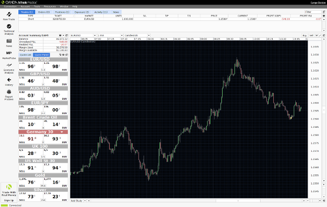

## Table of Contents

## What is a forex trading robot?

A forex trading robot is a computer program that trades in the foreign exchange market automatically. It uses special math formulas and rules to decide when to buy or sell currencies. People use these robots because they can work all the time without getting tired, and they can react very quickly to changes in the market.

These robots are made by experts who know a lot about trading and computer programming. You can set them up to follow your own trading plan or use one that comes with the robot. But, it's important to remember that even though they can be very helpful, they are not perfect. Sometimes they might make mistakes, so it's good to keep an eye on them and be ready to step in if needed.

## How do forex trading robots function?

Forex trading robots work by following a set of rules that tell them when to buy or sell currencies. These rules are based on math formulas and patterns that the robot's creator thinks will help make money in the forex market. When the robot sees a situation that matches its rules, it will automatically make a trade without needing a person to tell it what to do. This can happen very quickly, much faster than a human could react, which is one reason why people use these robots.

Even though forex trading robots can trade on their own, they still need some help from people. You have to set them up with the right rules and keep an eye on them to make sure they are working well. Sometimes the market changes in ways that the robot's rules don't expect, and it might make a bad trade. That's why it's important to check on the robot and be ready to change its rules or stop it if it's not doing well. Using a robot can be a good way to trade, but it's not a way to make money without any work.

## What are the basic components of a forex trading robot?

A forex trading robot has a few main parts that help it work. The first part is the algorithm or trading strategy. This is like a set of instructions that tells the robot when to buy or sell currencies. The algorithm uses math and patterns to make these decisions. The second part is the software platform. This is the computer program where the robot runs. It connects to the forex market and lets the robot send buy and sell orders.

Another important part is the data feed. This gives the robot information about what's happening in the market, like prices and news. The robot uses this data to follow its trading strategy. The last part is risk management tools. These are rules that help the robot not lose too much money. They can set limits on how much the robot can trade or how much it can lose on one trade. All these parts work together to make the robot trade on its own.

## Can you explain the difference between automated and semi-automated forex trading robots?

An automated forex trading robot does all the trading work by itself. Once you set it up with the trading rules, it will buy and sell currencies without needing any help from you. It looks at the market data and follows its instructions to make trades. This can be good because the robot can work all the time and make quick decisions. But, if the market changes a lot, the robot might keep following the same old rules and lose money.

A semi-automated forex trading robot, on the other hand, needs some help from you. It will give you suggestions about when to buy or sell, but you have to decide if you want to follow those suggestions. This can be good because you can use the robot's ideas but also use your own thinking to make better choices. It's a bit more work because you have to keep an eye on it, but it can help you avoid big mistakes if the robot's suggestions are not right for the current market situation.

## What are the common strategies used by forex trading robots?

Forex trading robots use many different strategies to trade in the market. One common strategy is trend following. This means the robot looks for a clear direction in the market, like if the price of a currency is going up or down over time. If it sees a trend, the robot will buy if the price is going up or sell if the price is going down. Another strategy is mean reversion. This is when the robot thinks the price will go back to its average after moving away from it. So, if the price is too high, the robot might sell, expecting it to fall back to the average, and if it's too low, it might buy, expecting it to rise back up.

Another strategy that forex trading robots use is called breakout trading. This happens when the price of a currency moves past a certain level that it hasn't been able to pass before. The robot will buy if the price breaks out above this level, thinking it will keep going up, or sell if it breaks out below, thinking it will keep going down. Some robots also use a strategy called scalping, where they make many small trades to try and make a little bit of money from each one. These strategies help the robots decide when to trade, but they all have risks and need to be watched carefully.

## How can a beginner start using a forex trading robot?

If you're a beginner and want to start using a forex trading robot, the first thing you need to do is pick a good robot. Look for one that is made by a trusted company and has good reviews from other users. Once you've chosen a robot, you'll need to set up a trading account with a broker that supports automated trading. This is important because not all brokers let you use robots. After you've set up your account, you can download the robot's software and install it on your computer or use it through the broker's platform.

After you have everything set up, you need to learn how to use the robot. Most robots come with a guide that explains how to set them up and start trading. You'll need to decide on the trading strategy the robot will use, which can be the one it comes with or one you make yourself. It's a good idea to start with a demo account where you can practice trading without using real money. This way, you can see how the robot works and make sure you understand it before you start trading with real money. Remember, even with a robot, it's important to keep learning about the forex market and to check on your robot often to make sure it's doing well.

## What are the potential risks associated with using forex trading robots?

Using forex trading robots can be risky. One big risk is that the robot might not work well all the time. The rules it follows might not fit the market anymore because the market can change a lot. If the robot keeps trading with old rules, it could lose a lot of money. Another risk is that you might trust the robot too much and not watch it closely enough. Even though the robot can trade on its own, it's important to keep an eye on it and be ready to step in if something goes wrong.

Another risk is that some forex trading robots might not be made by honest people. There are robots out there that promise to make a lot of money but end up being scams. It's important to do your homework and choose a robot from a company you can trust. Also, using a robot doesn't mean you can just forget about trading. You still need to learn about the forex market and understand what the robot is doing. If you don't, you might make bad choices and lose money.

## How do you evaluate the performance of a forex trading robot?

To evaluate the performance of a forex trading robot, you need to look at how much money it makes and how much risk it takes. Start by checking the robot's profit and loss over time. You can do this by looking at the trading history to see if the robot is making more money than it's losing. It's also important to see how often the robot wins trades compared to how often it loses. A good robot should have a high win rate and make steady profits.

Another way to evaluate the robot's performance is by looking at how it handles risk. Check the drawdown, which is the biggest drop in the account balance. A lower drawdown means the robot is better at managing risk. Also, see if the robot follows your risk rules, like not trading too much at once or using stop-loss orders to limit losses. By looking at both the profits and the risks, you can tell if the forex trading robot is working well for you.

## What are the costs involved in purchasing and maintaining a forex trading robot?

The costs of using a forex trading robot can vary a lot. When you first buy a robot, you might have to pay a one-time fee or a monthly subscription. Some robots are free, but they might not be as good as the ones you pay for. Besides the cost of the robot itself, you also need to think about the fees from your broker. Brokers charge for each trade the robot makes, and these fees can add up if the robot trades a lot. You might also need to pay for a special trading platform or software to run the robot, which can cost extra money.

After you buy the robot, there are other costs to keep in mind. You might need to pay for updates or new versions of the robot to keep it working well. Some companies charge for customer support or help if you have problems with the robot. Also, if the robot loses money, you could end up spending more than you planned. It's important to think about all these costs before you start using a forex trading robot, so you know what to expect and can plan your budget.

## Are there any free forex trading robots available, and how do they compare to paid versions?

Yes, there are free forex trading robots available. You can find them on the internet, often from big trading platforms like MetaTrader 4 or MetaTrader 5. These free robots can be a good way to start if you don't want to spend money right away. But, they might not be as good as the ones you pay for. Free robots might not have as many features, and they might not work as well because they use simpler trading rules. Also, the companies that make free robots might not help you if you have problems, and the robots might not get updated as often.

Paid forex trading robots usually come with more features and better support. They are made by companies that spend a lot of time making sure the robots work well and can make money in the market. When you pay for a robot, you often get help from the company if you have questions or problems. Paid robots also get updated more often to keep up with changes in the market. So, while free robots can be a good start, paid ones might be a better choice if you want something that works well and gets regular updates.

## How can one customize a forex trading robot to better fit their trading strategy?

To customize a forex trading robot to better fit your trading strategy, you first need to understand the robot's settings and parameters. Most robots come with a lot of options you can change, like when to buy or sell, how much money to trade, and how to manage risk. You can adjust these settings to match your own ideas about how to trade. For example, if you think the market will move a lot in a short time, you can set the robot to trade more often. Or, if you want to be careful, you can set it to trade less and use stop-loss orders to limit your losses.

Once you've made these changes, it's important to test the robot to see how well it works with your new settings. You can use a demo account to try out the robot without risking real money. Watch how it trades and see if it's making the kinds of trades you want. If it's not working well, you can go back and change the settings again until you find what works best for you. Remember, customizing a robot takes time and patience, but it can help you trade in a way that feels right for you.

## What advanced features should an expert look for in a high-end forex trading robot?

An expert looking for a high-end forex trading robot should pay attention to features like advanced algorithms and machine learning. These robots use smart math to find the best times to trade. They can learn from the market and change their strategies over time. This means they can keep making money even when the market changes a lot. Another important feature is backtesting, which lets you test the robot with old market data to see how well it would have done in the past. This helps you trust the robot more because you can see how it might do in the future.

Also, experts should look for robots with good risk management tools. These tools help the robot not lose too much money. They can set limits on how much the robot can trade or how much it can lose on one trade. Another useful feature is real-time data analysis, which lets the robot look at what's happening in the market right now and make quick decisions. High-end robots also often come with good customer support, so if you have problems, you can get help from the people who made the robot. These features can make a big difference in how well the robot works and how much money you can make.

## How do you select the right Forex trading robot?

Choosing the right forex trading robot requires careful evaluation to ensure it aligns with your trading objectives and risk appetite. A critical first step is to assess the robot's track record. Verified performance records offer an informative view of the robot's historical effectiveness and consistency. It is beneficial to seek systems with transparent data detailing how they have performed under various market conditions. 

Understanding the underlying algorithm of the robot is vital. The transparency of the robot's functions can greatly influence your trust and reliance on it. A clear explanation of the algorithm guides expectations on trading strategies and decision-making processes. Such knowledge helps in predicting how the robot will respond to market changes.

Engaging with the trading community can also aid in making an informed decision. Reviews from other users and discussions on forums like Forex Factory or Myfxbook provide insights into the reliability and efficiency of different bots. These platforms offer shared experiences that can highlight potential issues or endorse particular systems.

Financial considerations are equally important when selecting a forex trading robot. Assess the price in relation to the potential return on investment (ROI). It is crucial to calculate expected returns based on the robot's past performance and determine if they justify the cost. The formula for ROI is:

$$

\text{ROI} = \frac{\text{Net Profit}}{\text{Cost of Investment}} \times 100
$$

This calculation helps determine if the expenditure on a trading robot is a wise investment.

In conclusion, selecting the right forex trading robot involves scrutinizing its performance history, understanding its algorithmic logic, gathering community insights, and evaluating financial feasibility. This comprehensive approach can significantly enhance the prospects of optimal trading outcomes.

## References & Further Reading

[1]: ["Advances in Financial Machine Learning"](https://www.amazon.com/Advances-Financial-Machine-Learning-Marcos/dp/1119482089) by Marcos Lopez de Prado

[2]: ["Evidence-Based Technical Analysis: Applying the Scientific Method and Statistical Inference to Trading Signals"](https://www.amazon.com/Evidence-Based-Technical-Analysis-Scientific-Statistical/dp/0470008741) by David Aronson

[3]: ["Machine Learning for Algorithmic Trading"](https://github.com/PacktPublishing/Machine-Learning-for-Algorithmic-Trading-Second-Edition) by Stefan Jansen

[4]: ["Quantitative Trading: How to Build Your Own Algorithmic Trading Business"](https://books.google.com/books/about/Quantitative_Trading.html?id=j70yEAAAQBAJ) by Ernest P. Chan

[5]: ["Algorithmic Trading: Winning Strategies and Their Rationale"](https://www.wiley.com/en-us/Algorithmic+Trading%3A+Winning+Strategies+and+Their+Rationale-p-9781118460146) by Ernest P. Chan