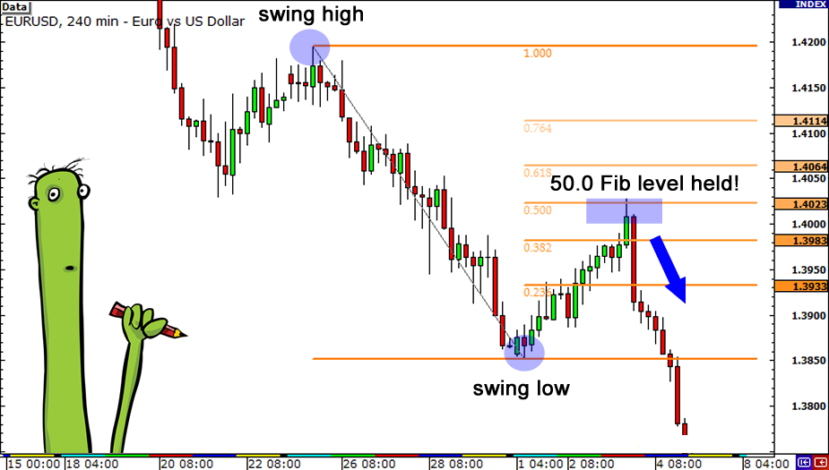

The foreign exchange market, commonly known as the forex market, is a vast and decentralized global marketplace where currencies are traded. It is crucial for facilitating international trade and investment by allowing businesses and governments to convert one currency into another. The forex market is the largest and most liquid financial market globally, with a daily trading volume exceeding $6 trillion as of 2023. This high liquidity ensures that currency values remain stable, impacting everything from the price of goods and services to the economic stability of nations.

Trading strategies within the forex market are essential for navigating its complexities. They can be broadly categorized into fundamental analysis and technical analysis. Technical analysis, in particular, involves studying price movements and patterns on charts to predict future price behavior. It relies on historical data and mathematical indicators to inform trading decisions. One key tool used in technical analysis is the Fibonacci retracement, derived from the Fibonacci sequence—a series of numbers where each number is the sum of the two preceding ones, often found in natural phenomena and known for its unique mathematical properties.



Fibonacci retracements help traders identify potential reversal levels in the market by measuring specific ratios such as 23.6%, 38.2%, 50%, 61.8%, and 100% between significant price points. For instance, if a currency pair moves from a low of 100 to a high of 200, a 38.2% retracement level suggests a potential support area around the 161.8 price level. This technique allows traders to anticipate corrections and trend reversals, aiding in strategic entry and exit points.

Algorithmic trading, or algo trading, involves using computer programs to execute trades based on predetermined criteria and strategies automatically. With the ability to process large volumes of data and execute orders at speeds far beyond human capability, algorithmic trading has gained immense popularity in recent years. It offers numerous advantages, such as eliminating emotional biases, optimizing trade timings, and increasing accuracy and efficiency in executing trades.

This article aims to explore the integration of Fibonacci retracements within algorithmic trading frameworks. By combining the mathematical precision of Fibonacci levels with the speed and efficiency of algo trading, traders can develop sophisticated strategies that leverage the strengths of both approaches. This intersection offers promising opportunities for increased trading effectiveness in the ever-evolving forex market.

## Table of Contents

## Understanding Forex Trading

Forex trading, also known as foreign exchange trading, involves the exchange of currencies with the primary objective of [earning](/wiki/earning-announcement) a profit. Operating 24 hours a day, the forex market is the largest financial market in the world, with a daily trading volume exceeding $6 trillion. It plays a crucial role in global commerce, as it enables the conversion of currencies essential for international trade and investment.

Key participants in the [forex](/wiki/forex-system) market include banks, corporations, and retail traders. Banks are the largest participants, engaging in forex transactions both for their clients and for profit through proprietary trading. Corporations participate in the forex market primarily to hedge against currency risk that arises from international operations and transactions. Retail traders are individual investors who speculate on currency movements, facilitated by brokers offering leverage to amplify potential returns.

Currencies in the forex market are traded in pairs, reflecting the relative value of one currency against another. Each currency pair consists of a base currency and a quote currency. For instance, in the EUR/USD pair, the euro (EUR) is the base currency, while the US dollar (USD) is the quote currency. The price of a currency pair indicates how much of the quote currency is required to purchase one unit of the base currency. Currency pairs are categorized into three types: major pairs (involving the USD and other major currencies such as EUR, GBP, JPY), minor pairs (excluding USD), and exotic pairs (consisting of a major currency paired with the currency of an emerging economy).

Volatility and [liquidity](/wiki/liquidity-risk-premium) are two critical characteristics of the forex market. Volatility refers to the degree of variation in the price of a currency pair, offering both risks and opportunities for traders. High [volatility](/wiki/volatility-trading-strategies) can result in significant price swings within short periods, potentially leading to substantial profits or losses. Liquidity, the ease with which an asset can be bought or sold without affecting its price, is abundant in the forex market due to its size and the number of participants. High liquidity generally results in tighter spreads and reduced transaction costs.

Traders employ various strategies in the forex market, adapting to its volatility and liquidity. Technical analysis, which involves studying price charts and patterns, is a popular approach. Traders also use [fundamental analysis](/wiki/fundamental-analysis), examining economic indicators and geopolitical factors affecting currency values. Some common trading strategies include:

1. **Scalping**: Involves executing numerous trades over short time frames to capitalize on small price changes.
2. **Day trading**: Involves entering and exiting trades within the same day to avoid overnight market risks.
3. **Swing trading**: Involves holding positions for several days or weeks to profit from medium-term market movements.
4. **Position trading**: Long-term strategy focusing on larger trends, often holding positions for months.

By understanding these facets of forex trading, traders can make informed decisions, applying strategies that align with their risk tolerance and market outlook. The dynamic nature of the forex market necessitates continuous learning and adaptation to changing market conditions.

## Fibonacci Retracements in Forex Trading

The Fibonacci sequence, identified by Leonardo of Pisa, more commonly known as Fibonacci, is a series of numbers where each number is the sum of the two preceding ones, typically starting with 0 and 1. This sequence, i.e., 0, 1, 1, 2, 3, 5, 8, and so on, is prevalent in various facets of nature, including the arrangement of leaves, the branching of trees, and the spiral patterns of shells. Beyond its occurrences in nature, the Fibonacci sequence holds significant importance in finance, particularly in predicting potential levels of support and resistance in financial markets.

Fibonacci retracement levels are horizontal lines that indicate potential support and resistance levels where the price could reverse. These levels are derived from the Fibonacci sequence through the selection of percentages based on the Fibonacci ratios: 23.6%, 38.2%, 50%, 61.8%, and 100%. The 61.8% retracement, often termed the "golden ratio," is particularly significant, as it is based on the concept that widely observed patterns and proportions exist universally, which market movements tend to follow.

In the context of forex trading, traders utilize Fibonacci retracements to predict possible price reversals or continuation zones. By drawing these retracements between two significant price points—typically, a peak and a trough—traders can identify critical levels. A retracement level might suggest that a currency pair will stall or reverse its current direction at this juncture. Thus, traders often look for these pullback levels as opportunities to enter or [exit](/wiki/exit-strategy) trades.

To practically apply Fibonacci retracements in forex charts, one may take the following steps:

- Identify the trend: Traders first need to spot a significant trend by identifying the highest peak and lowest trough over a given period.

- Draw the retracement: Using charting tools, a trader can then draw Fibonacci retracements by connecting the peak and trough. The retracement levels will appear automatically.

- Analyze price movements: Observe how prices react at these levels. Prices often find temporary resistance or support near these Fibonacci levels, making them potential points of reversal or continuation.

For instance, if a currency pair rises from 1.0000 to 1.1000, a trader applying these retracements will look for a 38.2% retracement back to around the 1.0618 level. If the price stalls there, it may indicate a reversal, presenting a potential buying opportunity.

The application of Fibonacci retracements in forex trading is not without its critiques. While these levels can provide valuable insights into potential market reversal points, their reliability is not guaranteed. Market conditions, trader psychology, and external factors can influence price movements, causing prices to ignore Fibonacci levels. Hence, relying solely on Fibonacci analysis without considering other indicators or market factors might lead to erroneous conclusions.

Furthermore, Fibonacci levels can be subjective; different traders might select different peaks and troughs, which can result in varied interpretations. Despite these limitations, many traders find Fibonacci retracements to be a useful part of their broader analytical toolkit, often combining them with other technical analysis tools to enhance their effectiveness.

## Integration of Algorithmic Trading Techniques

Algorithmic trading, often referred to as algo trading, is a method of executing orders using automated and pre-programmed trading instructions. This approach is based on variables such as time, price, and [volume](/wiki/volume-trading-strategy), making it beneficial for modern financial markets. The primary advantages include increased trading speed, reduced human error, and the ability to process complex data far more efficiently than manual trading. Algorithmic trading allows traders to execute large orders without significantly impacting the market, providing liquidity and better opportunities for price changes.

Algorithms can automate the use of Fibonacci retracements by identifying potential reversal levels and systematically applying trading rules. Fibonacci retracement levels, which are based on mathematical sequences, help traders predict areas where a market is likely to reverse after a significant price movement. Algorithms can be programmed to recognize these levels within real-time data and execute trades when these conditions are met. For example, writing an algorithm to buy when a price hits the 38.2% retracement level and sell at 61.8% can standardize trading methods and remove the emotional pitfalls associated with manual trading.

Several [algorithmic trading](/wiki/algorithmic-trading) platforms and tools support these automated strategies. Notable platforms include MetaTrader 4/5, known for its MQL4/5 scripting language, and NinjaTrader, which supports C# programming for strategy development. Additionally, Python's vast libraries, such as NumPy and pandas, allow traders to construct and backtest their strategies with precision.

Backtesting plays a crucial role in developing robust algo trading strategies. By simulating how a trading strategy would have performed in the past using historical data, traders can evaluate the viability of their methods. A sample [backtesting](/wiki/backtesting) snippet in Python might involve:

```python
import pandas as pd

# Load historical data
data = pd.read_csv('historical_data.csv')

# Calculate Fibonacci retracement levels
def fibonacci_levels(high, low):
    diff = high - low
    return low + 0.382 * diff, low + 0.618 * diff

# Apply backtesting
for i in range(len(data)-1):
    high, low = data['High'][i], data['Low'][i]
    fib_382, fib_618 = fibonacci_levels(high, low)
    # Implement trading logic based on retracement levels
```

Challenges in using algo trading systems include the need for accurate data, potential software issues, and market illiquidity during volatile periods. Additionally, while backtesting is essential, strategies that perform well in historical tests may not always yield similar results in live markets due to changes in market dynamics or computational limitations in real-time trading. Traders must also consider the latency, cost of data feeds, and the importance of maintaining robust risk management protocols.

In conclusion, integrating Fibonacci retracements within algorithmic trading frameworks provides traders a method to enhance decision-making efficiency and consistency. Careful consideration of platform capabilities, robust backtesting, and rigorous risk management are crucial for successful deployment in live markets.

## Combining Fibonacci Retracements with Algo Trading

Integrating Fibonacci retracements into algorithmic trading frameworks involves a structured approach that combines technical analysis with automated execution. The first step is to programmatically identify key Fibonacci retracement levels, typically 23.6%, 38.2%, 50%, 61.8%, and 78.6%, which are calculated based on horizontal lines of support and resistance drawn between a high and a low point on a price chart. Utilizing these levels, traders can develop algorithms to set precise entry and exit points.

When setting entry and exit points using Fibonacci levels, traders often look for confluences of Fibonacci retracement levels with other technical indicators such as moving averages or trend lines, which may add confirmation to potential trade opportunities. Entry points are typically set when the price approaches a Fibonacci level, showing signs of reversing in the direction of the prevailing trend. Exit points can be set at the next Fibonacci level or adjusted based on additional factors like trailing stops or volatility conditions.

The integration of human expertise with algorithmic precision brings several advantages. While algorithms can process vast amounts of data with speed and accuracy, human traders provide contextual understanding and the ability to adapt to unforeseen market conditions. This synergy enhances the robustness of trading strategies, leveraging the strengths of both human and machine. Anecdotal evidence of successful integrations often highlights cases where algorithms identified a profitable Fibonacci retracement opportunity, complemented by a trader's insights into market sentiment or geopolitical factors that could influence movements.

Despite the potential benefits, traders must be aware of several pitfalls associated with integrating Fibonacci strategies into automated systems. For instance, market conditions can change rapidly, and algorithms may struggle to adapt without significant reprogramming or intervention. Moreover, over-reliance on one indicator, like Fibonacci, can lead to oversight of other critical market signals. It is crucial to conduct comprehensive backtesting across various market conditions to ensure the algorithm's reliability and to identify possible weaknesses.

To mitigate risks in automated Fibonacci strategies, traders can incorporate steps such as implementing risk management protocols, including stop-loss and take-profit orders, and regularly updating their algorithms with the latest market data and feedback loops for continuous improvement. Furthermore, periodic manual oversight and adjustments can be instrumental in accommodating changes in market dynamics that pure algorithmic systems might not anticipate.

By carefully managing these factors, traders can effectively integrate Fibonacci retracements within their algorithmic trading frameworks, optimizing their strategies for greater efficiency and profitability.

## Practical Tips for Traders

Selecting appropriate software for integrating Fibonacci retracements and algorithmic strategies is pivotal for forex traders. Opt for platforms that offer robust charting tools, customizable algorithms, and backtesting capabilities. MetaTrader 4 and 5, NinjaTrader, and cTrader are popular choices due to their comprehensive features and user-friendly interfaces. These platforms typically support various technical indicators and automated trading systems, allowing traders to experiment and refine their strategies.

Continuous learning is essential in the ever-evolving forex market. Engaging with reputable financial education platforms, such as Investopedia and BabyPips, can enhance one's understanding of market dynamics. Participating in webinars, attending workshops, and joining online forums can also provide valuable insights and keep traders updated on recent market trends and technological advancements.

Risk management is a cornerstone of successful forex trading. Effective risk management involves setting appropriate stop-loss orders, maintaining a risk-reward ratio of at least 1:2, and never risking more than 1-2% of the trading capital on a single trade. Diversifying trades across various currency pairs can also reduce exposure to market volatility. 

Maintaining emotional discipline is crucial when navigating both manual and algorithmic trading. Emotions such as greed and fear can impair judgment, leading to impulsive decisions. Implementing a solid trading plan and adhering strictly to it helps mitigate emotional influences. Utilizing algorithmic systems can further reduce emotional biases, as trades are executed automatically, based on predefined criteria.

To support ongoing development as a forex trader, several resources are at one's disposal. Online courses from institutions like Coursera and edX provide structured learning opportunities. Reading [books](/wiki/algo-trading-books) such as "Trading in the Zone" by Mark Douglas or "Currency Trading for Dummies" by Kathleen Brooks can also offer deep insights into trading psychology and strategy. Finally, practicing with a demo account allows traders to apply new knowledge risk-free, honing their skills and building confidence before transitioning to live trading.

## Conclusion

In this article, we explored the integration of Fibonacci retracements and algorithmic trading strategies within the forex market. Starting with the fundamental importance of the forex market for global trade, we delved into how traders use technical analysis and strategies like Fibonacci retracements to guide trading decisions. The Fibonacci sequence provides a mathematical basis for predicting potential support and resistance levels, which can significantly enhance trading strategies when accurately applied.

Algorithmic trading represents a major evolution in trading strategy, automating complex decisions and allowing for rapid execution that human counterparts cannot match. When combined with Fibonacci retracement levels, these algorithms can systematically identify and act upon trading opportunities with high precision. Incorporating both traditional techniques and modern innovations provides a robust framework for improving trading outcomes.

The importance of adopting both traditional and modern trading strategies cannot be overstated. Traders are encouraged to leverage the precision of algorithmic trading alongside the predictive capabilities of Fibonacci tools to enhance their trading strategies. Successful integration of these elements can lead to increased efficiency and potentially better financial outcomes.

Looking ahead, the future of forex trading appears to hinge on the innovative use of both established techniques like Fibonacci analysis and advancements in trading technology, such as algorithmic systems. The continuous evolution of these tools will likely open new paths for improved market analysis and trading execution.

As a call to action, traders should remain engaged with continuous learning and adaptation to ever-changing market dynamics. By embracing both Fibonacci retracements and algorithmic methods, traders can refine their strategies to better navigate the complexities of the forex market. This pursuit of knowledge and skill development will be crucial in keeping pace with financial market innovations, ensuring traders stay competitive in an increasingly sophisticated trading environment.

## References & Further Reading

[1]: ["Technical Analysis of the Financial Markets: A Comprehensive Guide to Trading Methods and Applications"](https://www.amazon.com/Technical-Analysis-Financial-Markets-Comprehensive/dp/0735200661) by John J. Murphy

[2]: ["Fibonacci Analysis"](https://www.investopedia.com/ask/answers/05/fibonacciretracement.asp) by Constance Brown

[3]: ["Algorithmic Trading: Winning Strategies and Their Rationale"](https://www.wiley.com/en-us/Algorithmic+Trading%3A+Winning+Strategies+and+Their+Rationale-p-9781118460146) by Ernie Chan

[4]: ["The New Trading for a Living: Psychology, Discipline, Trading Tools and Systems, Risk Control, Trade Management"](https://www.amazon.com/New-Trading-Living-Psychology-Discipline/dp/1118443926) by Alexander Elder

[5]: ["Forex Trading with Fibonacci Retracement"](https://blueberrymarkets.com/academy/how-to-use-fibonacci-retracement-in-forex-trading/) - Investopedia

[6]: ["Algorithmic Trading and DMA: An introduction to Direct Access Trading Strategies"](https://www.semanticscholar.org/paper/Algorithmic-trading-%26-DMA-%3A-an-introduction-to-Johnson/aa5de1ab883d5e23b6651faa7c1807586d688e4b) by Barry Johnson