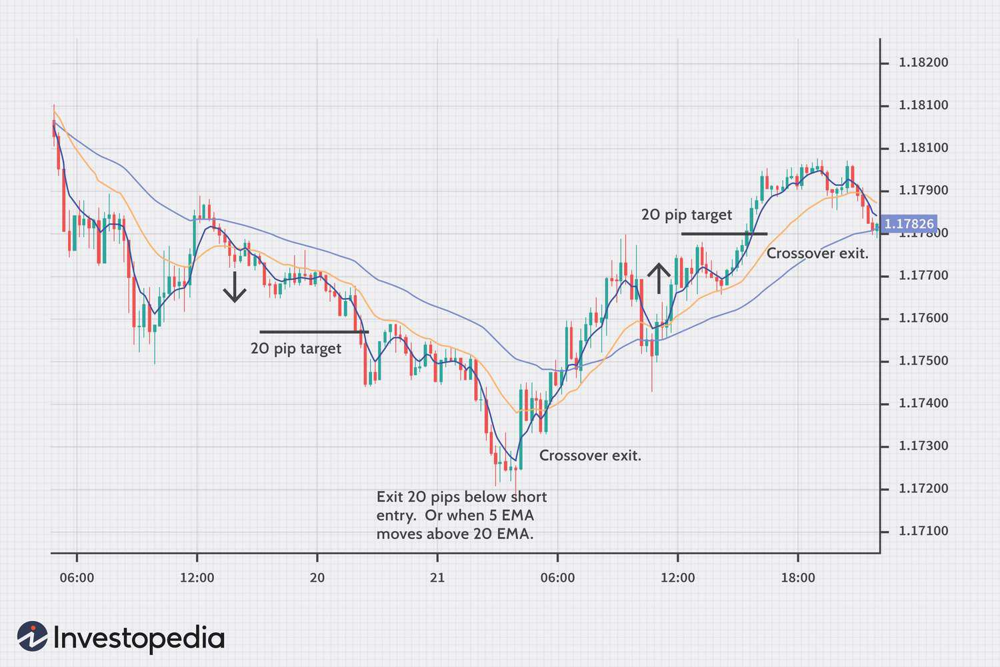

Forex trading, short for foreign exchange trading, represents the largest financial market globally, with a daily trading volume exceeding $6 trillion. This market operates 24 hours a day, allowing traders worldwide to participate at any time, which presents ample opportunities for making significant profits but also comes with its own set of challenges. Forex traders employ numerous strategies to navigate this vast market, aiming to capitalize on currency fluctuations. 

Among the various strategies employed by traders, two stand out for their potential to maximize profitability: trading based on news releases and algorithmic trading (algo trading). Each of these strategies offers unique advantages and requires distinct approaches.



News releases often trigger substantial market movements, offering traders opportunities to capitalize on volatility. Key economic indicators, such as interest rate decisions, employment data, and GDP reports, can lead to sharp currency price shifts. For traders, the ability to anticipate and react swiftly to these developments can be highly profitable.

In contrast, algorithmic trading automates the trading process using sophisticated computer programs. Algo trading facilitates the rapid execution of trades based on predefined criteria, emphasizing speed, precision, and the capacity to analyze vast data sets without human intervention. This approach can continuously monitor the market and execute trades with greater efficiency than manual methods.

This article examines the intricacies of trading strategies related to news releases and algo trading within the Forex market. Understanding these strategies can significantly enhance trading efficiency and profitability, whether you are an experienced trader or just starting in the Forex market. By leveraging the power of news to anticipate market movements and applying algorithmic systems to execute trades, traders can optimize their strategies to gain an edge in a highly competitive landscape.

## Table of Contents

## Understanding News Releases in Forex Trading

News releases play a pivotal role in Forex trading due to their capacity to cause significant fluctuations in currency values. Traders closely analyze economic indicators such as [interest rate](/wiki/interest-rate-trading-strategies) decisions, employment data, and Gross Domestic Product (GDP) reports, since these factors directly influence the currency markets. Such indicators provide insights into a nation's economic health and monetary policy direction, thereby impacting investor sentiment and market dynamics.

Interest rate decisions, often made by central banks, are among the most influential news releases. A change in interest rates can alter the yield on a nation's assets, affecting the demand for its currency. For instance, a rise in interest rates might increase the currency's value as investors seek higher returns, whereas a rate cut could diminish its value.

Employment data, notably non-farm payroll figures, offer insights into economic growth and labor market strength. Positive employment data typically suggests a robust economy, potentially increasing currency value due to anticipated future economic stability.

GDP reports are another critical indicator, representing the total economic output of a country. A higher-than-expected GDP growth rate can boost investor confidence, leading to currency appreciation, while a disappointing GDP figure might trigger devaluation.

Monitoring economic calendars, which list upcoming news releases and events, is crucial for traders aiming to anticipate market reactions. Being aware of scheduled announcements enables traders to prepare strategies tailored to potential market shifts.

Timing and swift decision-making are key aspects of trading during news releases. Markets can react within seconds to new information, requiring traders to act quickly. Thus, having a pre-determined strategy before the release of news is essential. This may involve setting up specific entry and [exit](/wiki/exit-strategy) points, using stop-loss orders to mitigate risk, and deciding on position sizes to manage potential [volatility](/wiki/volatility-trading-strategies).

Overall, a strategic approach to news releases involves preparedness and staying informed. By developing the ability to interpret and react to economic data swiftly, traders can better position themselves to capitalize on market movements induced by news releases.

## Trading Strategies for News Releases

The '[breakout](/wiki/breakout-trading) strategy' is a widely used approach in Forex trading when dealing with news releases. It hinges on identifying a consolidation phase—a period during which a currency pair's price moves within a relatively narrow range. This phase is characterized by an equilibrium between buyers and sellers, resulting in lower volatility and price movement. The core idea is to anticipate that major news releases can disrupt this equilibrium, leading to a breakout—a significant move in price beyond the established range.

To effectively implement this strategy, traders often employ technical analysis tools, such as support and resistance levels or Bollinger Bands, to help identify consolidation patterns. Once a breakout is confirmed, traders must act swiftly to capitalize on the ensuing market movement. Speed and precision are critical, as the initial breakout can lead to rapid price changes.

Another sophisticated strategy when trading news releases involves the use of exotic options. These financial instruments can be tailored to capture market volatility while managing risk. Options such as strangles or straddles are popular choices. A straddle, for instance, involves buying both a call option and a put option at the same strike price and expiration date. This positions the trader to benefit from significant price movements in either direction, which are common following major news announcements.

Understanding key market hours and currency pairs likely affected by specific news releases plays a crucial role. Forex trading is influenced by different time zones, with major currency pairs reacting more intensely during their respective market hours. For example, EUR/USD might experience higher volatility during the European and American sessions. Traders should align their news-release strategies with these periods to maximize potential gains.

Risk management is indispensable in news release trading. The Forex market's inherent volatility, especially around news events, necessitates robust risk controls. Stop-loss orders are vital; they automatically close a position when the price moves against the trader's prediction beyond a predetermined level, mitigating potential losses. Similarly, setting clear entry and exit points helps maintain disciplined trading and protects against emotional decision-making. 

In conclusion, trading strategies for news releases require careful planning and execution. By employing techniques such as breakout strategies or trading exotic options, and by understanding key market dynamics and implementing stringent risk management, traders can better navigate the uncertainties brought about by major economic news. Proper preparation and strategy can potentially lead to significant trading achievements.

## Algorithmic Trading in Forex

Algorithmic trading, commonly referred to as algo trading, utilizes computer algorithms to execute trades on the Forex market based on pre-established criteria. This automated approach provides traders with substantial benefits, including increased speed, enhanced precision, and the capability to operate continuously, thereby minimizing the potential for human error.

One of the primary advantages of [algorithmic trading](/wiki/algorithmic-trading) is its speed. Algorithms can process large volumes of data and execute trades in milliseconds, far faster than a human trader could. This speed is crucial in the Forex market, where currency prices can fluctuate rapidly. Furthermore, the precision of algo trading ensures that trades are executed at the optimal time and price, as dictated by the predefined criteria set by the trader.

Additionally, the continuous operation of algo trading algorithms allows for execution in global markets that operate 24/7. This uninterrupted trading capability is particularly advantageous given the around-the-clock nature of the Forex market. The absence of human intervention reduces errors associated with manual trading, such as emotional decision-making and fatigue.

Developing a robust algorithmic trading system necessitates a comprehensive understanding of market data, trading platforms, and risk management techniques. Traders must be proficient in programming to create and maintain these algorithms effectively. A solid grasp of quantitative analysis is essential to develop strategies that can effectively predict price movements based on historical data and current market conditions.

For those coding in Python, a popular library for implementing algorithmic trading strategies is `pandas` for handling data structures and `NumPy` for numerical computations. Here is a simple example of a Python script that might be a building block for an algorithmic trading system:

```python
import pandas as pd
import numpy as np

# Example of calculating simple moving average (SMA)
def calculate_sma(data, window):
    sma = data.rolling(window=window).mean()
    return sma

# Sample data for currency prices
data = pd.Series([1.30, 1.31, 1.29, 1.28, 1.27, 1.30, 1.32])

# Calculate a 3-day moving average
sma = calculate_sma(data, window=3)
print(sma)
```

Moreover, comprehensive risk management protocols, such as stop-loss and take-profit orders, are integral to a successful algo trading strategy. These parameters help limit potential losses and secure profits, ensuring the trading system remains resilient against adverse market movements.

In summary, algorithmic trading in Forex offers significant advantages through speed, precision, and non-stop operation, making it an invaluable tool for traders seeking to optimize their strategies and outcomes. Developing an effective algo trading system requires technical expertise, strategic planning, and robust risk management to thrive in the competitive Forex landscape.

## Developing a Robust Algorithmic Trading System

Developing a robust algorithmic trading system involves several key components aimed at enhancing trading performance and mitigating risks. The first step is to define clear trading goals. These goals should align with the trader's specific needs, whether they are aimed at short-term gains, long-term investments, or specific market conditions. Clarity in objectives helps in designing algorithms that are tailored to achieve desired outcomes.

Backtesting is an essential aspect of validating an algorithmic trading strategy. By testing the algorithm against historical market data, traders can assess its effectiveness and refine its parameters. Backtesting involves analyzing past data to simulate how the algorithm would have performed historically. Consider using Python libraries like `[backtrader](/wiki/backtrader)` or `zipline` for implementing [backtesting](/wiki/backtesting). A simple backtesting code snippet in Python might look like this:

```python
import backtrader as bt

class MyStrategy(bt.Strategy):
    def next(self):
        if self.data.close[0] > self.data.open[0]:
            self.buy(size=100)

cerebro = bt.Cerebro()
cerebro.addstrategy(MyStrategy)
data = bt.feeds.YahooFinanceData(dataname='AAPL', fromdate=dt.datetime(2020, 1, 1), todate=dt.datetime(2021, 1, 1))
cerebro.adddata(data)
cerebro.run()
```

Incorporating risk management strategies within the algorithm is crucial. This includes setting stop-loss and take-profit levels, which are designed to limit losses and secure profits automatically. For example, a stop-loss order is a directive to sell a security when it reaches a specified price, thus preventing further losses.

Regular monitoring and adjustment of the algorithm are necessary to keep up with changing market conditions. Markets are dynamic, and strategies that work well in one scenario might underperform in another. Thus, algorithms should be regularly updated based on ongoing performance analysis.

Additionally, incorporating [machine learning](/wiki/machine-learning) techniques can provide adaptive capabilities to the algorithm, allowing it to modify its strategy based on predictive analytics. This adaptive process can involve continually retraining models on new data.

By focusing on these key areas, traders can enhance the robustness and reliability of their algorithmic trading systems, making them better equipped to navigate the complexities of Forex markets.

## Combining News Releases and Algorithmic Trading

Integrating news release strategies with algorithmic trading in Forex creates a hybrid model that combines the reactive nature of news trading with the systematic precision of automation. At the core of this approach is the real-time analysis of market data, where algorithms are programmed to respond to specific economic indicators and geopolitical events as they occur.

Using news triggers, algorithms can execute trades within milliseconds, seizing opportunities during spikes in volatility typically associated with major announcements. For instance, if a central bank announces a change in interest rates unexpectedly, such a release can cause significant currency pair movements. An algorithm can be set to identify these patterns and place trades based on predefined criteria, such as a breakout strategy, without delay.

Risk management remains a critical component in this hybrid approach. Algorithms can be designed with built-in risk parameters to ensure that trades adhere to acceptable risk levels. Essential elements include stop-loss and take-profit triggers that react instantaneously to market conditions, thereby minimizing human error and emotional decision-making.

To successfully implement this model, traders must focus on continuous learning and adaptation. As market conditions fluctuate and technological advancements emerge, such systems require ongoing optimization. Algorithms should be regularly backtested and refined, using historical data to improve performance accuracy and reliability. Additionally, traders can enhance strategies by incorporating machine learning techniques to predict and respond to market trends more effectively.

Maintaining a competitive edge involves embracing change and fostering a robust understanding of both analytical and creative aspects of trading. This adaptability ensures traders can navigate the fluidity of Forex markets while harnessing the power of integrated news release and algorithmic trading strategies.

## Conclusion

Forex trading encompasses a variety of strategies that cater to different market conditions and trader profiles. Among these, trading on news releases and utilizing algorithmic trading are two methods that stand out for their potential to enhance trading success. News releases provide traders with opportunities to capitalize on significant market movements, triggered by economic indicators and geopolitical events. A well-timed and strategic response to these releases can offer advantageous market positions. Meanwhile, algorithmic trading allows for precise and rapid trade execution, operating on predefined criteria to eliminate human error and continuously respond to market changes.

A comprehensive understanding and diligent application of these strategies can yield substantial benefits. For instance, those who master news-based trading strategies can effectively anticipate market reactions and position themselves accordingly. Simultaneously, traders employing algorithmic methods are equipped to handle vast amounts of data, enabling them to execute trades with greater accuracy and consistency.

Continuous skill enhancement and adaptation to new technologies are essential for traders aiming to remain competitive in this dynamic market landscape. As technology evolves, the integration of sophisticated tools into trading methodologies becomes increasingly crucial. This not only involves staying abreast of technological advancements but also calls for a commitment to learning and applying these developments to one's trading approach. By embracing ongoing education and technological innovation, traders can optimize their strategies and achieve long-term success in the Forex market.

## References & Further Reading

[1]: Moskowitz, T. J., Ooi, Y. H., & Pedersen, L. H. (2012). ["Time series momentum."](https://www.sciencedirect.com/science/article/pii/S0304405X11002613) Journal of Financial Economics.

[2]: Lopez de Prado, M. (2018). ["Advances in Financial Machine Learning."](https://books.google.com/books/about/Advances_in_Financial_Machine_Learning.html?id=oU9KDwAAQBAJ) Wiley.

[3]: Chaboud, A. P., Chiquoine, B., Hjalmarsson, E., & Vega, C. (2014). ["Rise of the machines: Algorithmic trading in the foreign exchange market."](https://www.jstor.org/stable/43612951) The Journal of Finance.

[4]: Cartea, Á., & Jaimungal, S. (2015). ["Algorithmic and High-Frequency Trading."](https://assets.cambridge.org/97811070/91146/frontmatter/9781107091146_frontmatter.pdf) Cambridge University Press.

[5]: Jansen, S. (2018). ["Machine Learning for Algorithmic Trading."](https://www.amazon.com/Hands-Machine-Learning-Algorithmic-Trading/dp/178934641X) Packt Publishing.

[6]: Chan, E. P. (2009). ["Quantitative Trading: How to Build Your Own Algorithmic Trading Business."](https://github.com/ftvision/quant_trading_echan_book) Wiley.

[7]: Aronson, D. R. (2007). ["Evidence-Based Technical Analysis: Applying the Scientific Method and Statistical Inference to Trading Signals."](https://onlinelibrary.wiley.com/doi/book/10.1002/9781118268315) Wiley.

[8]: Harvey, C. R., Rattray, S., Sinclair, A., & Hemert, O. (2016). ["Man vs. Machine: Comparing Discretionary and Systematic Hedge Fund Performance."](https://papers.ssrn.com/sol3/papers.cfm?abstract_id=2880641) Financial Analysts Journal.