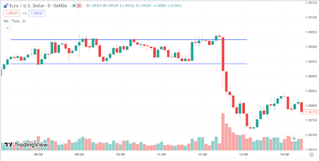

## Table of Contents

## What is forex trading and how does it relate to news releases?

Forex trading, also known as foreign exchange trading, is when people buy and sell different currencies to make money. It's like trading one country's money for another's, hoping that the value of the currency you buy will go up compared to the one you sold. People do this trading in a big market that works all day and night, from Monday to Friday. The goal is to make a profit from the changes in the value of currencies.

News releases are very important in forex trading. When a country releases news about its economy, like job numbers or interest rates, it can change how people think about that country's currency. If the news is good, more people might want to buy that currency, making its value go up. If the news is bad, people might sell it, and its value can go down. Traders watch these news releases closely because they can cause big changes in currency values, and traders can make money if they guess right about how the market will react to the news.

## What are the most common types of news releases that impact forex markets?

The most common types of news releases that impact forex markets are economic reports and announcements from central banks. Economic reports include things like employment data, inflation rates, and gross domestic product (GDP) numbers. For example, if a country reports more people are working than expected, it might make its currency stronger because it shows the economy is doing well. On the other hand, if inflation is higher than expected, it might make the currency weaker because it could mean the central bank will raise interest rates to control inflation.

Central bank announcements are also very important. These can include changes to interest rates or statements about the future direction of monetary policy. If a central bank raises interest rates, it usually makes the country's currency stronger because higher rates attract more foreign investment. If they hint at lowering rates in the future, it might make the currency weaker. Traders pay close attention to these announcements because they can cause big moves in the forex market.

## How can beginners identify which news releases are likely to affect currency pairs?

Beginners can identify which news releases are likely to affect currency pairs by focusing on economic indicators and central bank announcements. Economic indicators like employment data, inflation rates, and GDP numbers are important because they show how well a country's economy is doing. If the numbers are better than what people expected, the currency might get stronger. If they're worse, the currency might get weaker. For example, if the U.S. releases a report showing more jobs were created than expected, the U.S. dollar might go up in value against other currencies.

Central bank announcements, like changes in interest rates or statements about future policy, also have a big impact. When a central bank raises interest rates, it often makes the country's currency stronger because higher rates can attract more investors. On the other hand, if they suggest they might lower rates in the future, the currency might weaken. Beginners should keep an eye on the economic calendar, which lists when these important news releases are happening, and pay attention to what the central banks are saying. This way, they can better understand which news might move the forex market and affect currency pairs.

## What is the difference between scheduled and unscheduled news releases?

Scheduled news releases are economic reports and announcements that happen at known times. They are planned in advance, so traders know when they will happen. These can include things like monthly employment reports, quarterly GDP numbers, and regular central bank meetings. Because traders know when these releases are coming, they can prepare for them and try to guess how the market will react. This makes scheduled news releases a big part of how traders plan their trading strategies.

Unscheduled news releases, on the other hand, are events that happen unexpectedly. They can be things like sudden changes in government policy, unexpected statements from central bank leaders, or big economic surprises. Because these events are not planned, they can catch traders off guard and cause quick, big changes in the market. Traders need to be ready for these surprises because they can create a lot of movement in currency values, sometimes even more than scheduled releases.

## How should a trader prepare for a major news release?

A trader should prepare for a major news release by first checking the economic calendar to know exactly when the news will come out. This helps them plan their trading day and be ready for any big changes in the market. They should also look at what people expect the news to say. If the actual numbers are better or worse than expected, it can move the market a lot. So, knowing what to expect can help a trader guess how the market might react.

Once they know when the news is coming and what to expect, traders should decide if they want to trade before, during, or after the news release. Trading before the news can be risky because the market might move in a way they didn't expect. Some traders choose to wait until after the news to see how the market reacts and then make their moves. It's also a good idea to set up stop-loss orders to limit any losses if the market moves against them. By being prepared and having a plan, traders can handle the ups and downs that come with major news releases.

## What are some basic strategies for trading forex during news releases?

One basic strategy for trading forex during news releases is to trade the news directly. This means a trader tries to guess how the market will react to the news and makes a trade based on that guess. For example, if a trader thinks a good jobs report will make the U.S. dollar stronger, they might buy the dollar before the news comes out. The key is to be quick because the market can move fast right after the news is released. This strategy can be risky because the market might not react the way the trader expects, so it's important to have a plan for limiting losses, like using stop-loss orders.

Another strategy is to wait and see how the market reacts to the news before making a trade. This is called trading the reaction. After the news comes out, the market might move a lot in one direction, but then it might move back the other way as traders rethink their positions. A trader using this strategy would wait until the initial reaction is over and then look for a good time to enter the market. This can be less risky than trading the news directly because the trader has more information about how the market is reacting. But it still needs careful watching and quick decisions to make the most of the market's movements.

## How can traders use economic calendars to plan their trading around news releases?

Traders can use economic calendars to plan their trading around news releases by keeping track of when important reports and announcements are coming out. Economic calendars list all the major news releases, like employment data, GDP numbers, and central bank meetings, along with the exact times they will happen. By checking the calendar regularly, traders can see what news is coming up and prepare for it. This helps them know when to expect big moves in the market and plan their trades around those times.

Using an economic calendar also helps traders understand what the market might expect from the news. The calendar often shows what people think the numbers will be, so traders can compare the actual numbers to the expectations. If the actual numbers are better or worse than expected, it can cause big changes in currency values. By knowing what to expect, traders can make better guesses about how the market will react and decide if they want to trade before, during, or after the news comes out. This way, they can be ready for the ups and downs that news releases can bring.

## What are the risks associated with trading forex during news releases and how can they be mitigated?

Trading forex during news releases can be risky because the market can move a lot and quickly. If the news is different from what people expected, it can make the currency values change a lot in a short time. This can be good if a trader guessed right and made money, but it can also be bad if they guessed wrong and lost money. Another risk is that the market might be very busy and hard to trade in right after the news comes out. This can make it tough to get into or out of trades at the prices a trader wants.

To help lower these risks, traders can use stop-loss orders. These are like safety nets that automatically close a trade if it starts to lose too much money, helping to limit losses. Another way to be safer is to wait and see how the market reacts to the news before making a trade. This can give a trader more information and help them make better decisions. Also, it's a good idea to not risk too much money on one trade. By keeping the amount of money at risk small, traders can handle the ups and downs of news releases better.

## How can more advanced traders use technical analysis in conjunction with news releases?

Advanced traders can use technical analysis along with news releases to make better trading decisions. Technical analysis looks at past price movements and patterns on charts to guess where prices might go next. When a big news release is coming, traders can use technical analysis to see where the market might be heading before the news comes out. For example, if the price is near a key support or resistance level, the news might push it through that level. By watching these levels, traders can get ready for big moves and decide if they want to buy or sell based on what the news might do to the market.

After the news comes out, technical analysis can help traders see how the market is reacting. If the news is different from what people expected, the market might move a lot. Traders can use technical indicators like moving averages or the Relative Strength Index (RSI) to see if the market is overbought or oversold. This can help them decide if the move after the news is likely to keep going or if it might turn around. By combining what they know from the news with what they see on the charts, advanced traders can make smarter trades and handle the ups and downs of the market better.

## What are some advanced strategies for trading the immediate aftermath of a news release?

One advanced strategy for trading right after a news release is called "fading the initial move." This means that if the market moves a lot right after the news comes out, a trader might guess that the move will not last long. They might wait for the first big move to happen and then trade in the opposite direction, hoping the market will come back to where it was before the news. This can be risky because the market might keep moving in the same direction, but if a trader uses technical analysis to see if the market is overbought or oversold, it can help them make a better guess about when to trade.

Another strategy is called "straddling the news." This means a trader puts in two orders at the same time, one to buy and one to sell, right before the news comes out. They set these orders at prices that are a bit away from where the market is now. If the news makes the market move a lot, one of the orders will get filled, and the trader can then close the other order. This way, they can make money no matter which way the market goes after the news. It's a bit like betting on both sides of a coin flip, but it needs careful planning and quick action to work well.

## How can expert traders leverage algorithmic trading systems to capitalize on news releases?

Expert traders can use algorithmic trading systems to take advantage of news releases by setting up their computers to trade automatically based on the news. These systems can be programmed to look at news feeds and quickly make trades when certain news comes out. For example, if a big jobs report is released and it's better than expected, the system can buy the currency right away, before most human traders can react. This can help the trader make money from the quick moves in the market that happen right after the news.

Another way expert traders use these systems is by setting up strategies that look at both the news and the market's reaction to it. The system can use technical analysis to see if the market is overbought or oversold after the news, and then make trades based on that. This can help the trader make smarter decisions and take advantage of the ups and downs that come with news releases. By letting the computer do the work, expert traders can handle more trades and make money even when they're not watching the market all the time.

## What are the best practices for reviewing and adjusting strategies post-news release?

After a news release, it's important for traders to look back at what happened and see if their trading plan worked well. They should check if they made money or lost money and think about why that happened. Did the market move the way they thought it would after the news? Were their guesses about the news right or wrong? By looking at these things, traders can learn from their mistakes and see what they did right. This helps them make their trading plan better for the next time.

Traders should also think about changing their plan based on what they learned. If they see that the market often moves in a certain way after a type of news, they might want to change their strategy to take advantage of that. They can also try new ways of trading, like using different technical indicators or setting up their trades differently. By always trying to make their plan better, traders can get better at making money from news releases.

## References & Further Reading

[1]: Moskowitz, T. J., Ooi, Y. H., & Pedersen, L. H. (2012). ["Time series momentum."](https://www.sciencedirect.com/science/article/pii/S0304405X11002613) Journal of Financial Economics.

[2]: Lopez de Prado, M. (2018). ["Advances in Financial Machine Learning."](https://books.google.com/books/about/Advances_in_Financial_Machine_Learning.html?id=oU9KDwAAQBAJ) Wiley.

[3]: Chaboud, A. P., Chiquoine, B., Hjalmarsson, E., & Vega, C. (2014). ["Rise of the machines: Algorithmic trading in the foreign exchange market."](https://www.jstor.org/stable/43612951) The Journal of Finance.

[4]: Cartea, Á., & Jaimungal, S. (2015). ["Algorithmic and High-Frequency Trading."](https://assets.cambridge.org/97811070/91146/frontmatter/9781107091146_frontmatter.pdf) Cambridge University Press.

[5]: Jansen, S. (2018). ["Machine Learning for Algorithmic Trading."](https://www.amazon.com/Hands-Machine-Learning-Algorithmic-Trading/dp/178934641X) Packt Publishing.

[6]: Chan, E. P. (2009). ["Quantitative Trading: How to Build Your Own Algorithmic Trading Business."](https://github.com/ftvision/quant_trading_echan_book) Wiley.

[7]: Aronson, D. R. (2007). ["Evidence-Based Technical Analysis: Applying the Scientific Method and Statistical Inference to Trading Signals."](https://onlinelibrary.wiley.com/doi/book/10.1002/9781118268315) Wiley.

[8]: Harvey, C. R., Rattray, S., Sinclair, A., & Hemert, O. (2016). ["Man vs. Machine: Comparing Discretionary and Systematic Hedge Fund Performance."](https://papers.ssrn.com/sol3/papers.cfm?abstract_id=2880641) Financial Analysts Journal.