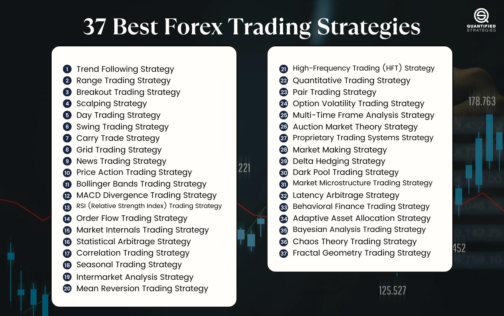

## Table of Contents

## What is Forex trading and why is it important?

Forex trading, also known as foreign exchange trading, is the buying and selling of currencies on the foreign exchange market. It's like a big marketplace where people and businesses from all over the world trade different currencies, like trading dollars for euros or yen for pounds. The goal is to make money by buying a currency when it's cheap and selling it when it's more expensive. Forex trading happens all the time, 24 hours a day, because different countries have different time zones.

Forex trading is important for a few reasons. First, it helps businesses and travelers exchange money when they need to buy things in another country. For example, if a company in the U.S. wants to buy goods from Japan, they need to convert their dollars into yen. Second, it helps countries manage their economies. Governments and central banks use forex markets to keep their currency stable and control inflation. Without forex trading, it would be much harder for the world to do business and travel across borders.

## What are the basic principles of Forex trading strategies?

Forex trading strategies are like plans that traders use to decide when to buy and sell currencies. The first principle is understanding the market trends. Traders look at charts and data to see if a currency is going up or down. If they think a currency will go up, they buy it, hoping to sell it later for a profit. If they think it will go down, they might sell it or wait for a better time to buy. It's all about trying to predict what will happen next based on what's happening now.

Another key principle is managing risk. Forex trading can be risky because the market can change quickly. Traders use tools like stop-loss orders to limit how much money they can lose on a trade. They also spread their money across different currencies to not put all their eggs in one basket. This way, if one trade goes bad, they won't lose everything. Good traders also know when to take profits and not get too greedy, which helps them stay in the game longer.

Lastly, having a clear trading plan is crucial. This means setting goals, knowing how much money you're willing to risk, and sticking to your strategy even when the market gets tough. A good plan helps traders stay disciplined and not make decisions based on emotions. Whether it's a simple strategy like following trends or a more complex one involving technical analysis, sticking to a plan can make a big difference in success in [forex](/wiki/forex-system) trading.

## How do beginners start with Forex trading strategies?

For beginners, starting with Forex trading strategies can feel overwhelming, but it's important to begin with the basics. The first step is to learn about the market and how it works. You can do this by reading [books](/wiki/algo-trading-books), taking online courses, or even watching videos that explain Forex trading in simple terms. Once you understand the basics, try to focus on one or two simple strategies. A common strategy for beginners is [trend following](/wiki/trend-following), where you buy a currency when it's going up and sell it when it starts to go down. You can use charts and tools to help you see these trends.

After you've learned a bit and picked a simple strategy, the next step is to practice. Many trading platforms offer demo accounts where you can trade with fake money. This is a great way to try out your strategy without risking real money. As you practice, keep a trading journal to note what works and what doesn't. This will help you improve your strategy over time. Remember, the key is to start small, stay patient, and keep learning. Forex trading can be risky, so it's important to only use money you can afford to lose and to always think about managing your risk.

## What are the most common Forex trading strategies for beginners?

One of the most common Forex trading strategies for beginners is trend following. This strategy is all about watching the market to see which way the currency is moving. If a currency is going up, you buy it, hoping it will keep going up so you can sell it later for a profit. If it's going down, you might wait until it starts going up again before buying. You can use charts and tools to help you spot these trends. It's a simple strategy that doesn't require a lot of fancy analysis, which makes it great for beginners.

Another popular strategy is range trading. This is when you look for currencies that seem to move up and down between two points, like a yo-yo. You buy the currency when it's at the low point and sell it when it reaches the high point. This strategy works well when the market isn't moving a lot in one direction. It's a bit like buying something on sale and selling it when the price goes back up. Both trend following and range trading are good starting points for beginners because they are easy to understand and don't need a lot of complicated tools.

## How can technical analysis improve Forex trading strategies?

Technical analysis can help improve Forex trading strategies by giving traders tools to predict where currency prices might go next. It's like using a map to see where you're going. Traders use charts and patterns to spot trends and decide when to buy or sell. For example, if a currency keeps going up, technical analysis can show that trend on a chart. This helps traders decide to buy that currency, hoping it will keep going up so they can sell it later for a profit. It's all about looking at past prices to guess what might happen in the future.

Another way technical analysis helps is by showing support and resistance levels. These are like invisible lines on a chart where the price often stops going up or down. If a currency price keeps bouncing off a certain level without going below it, that's a support level. If it keeps hitting a level without going above it, that's a resistance level. Knowing these levels can help traders make better decisions about when to buy or sell. For example, if a currency is close to a resistance level, a trader might decide to sell it before it goes back down. By using technical analysis, traders can make smarter choices and improve their chances of making money in Forex trading.

## What role does fundamental analysis play in Forex trading?

Fundamental analysis in Forex trading is like looking at the big picture of a country's economy to figure out what might happen to its currency. Traders use this method to understand how things like interest rates, employment rates, and even big events like elections can affect a currency's value. For example, if a country's economy is doing well, with low unemployment and high interest rates, its currency might get stronger because more people want to invest there. On the other hand, if the economy is struggling, the currency might get weaker.

By using [fundamental analysis](/wiki/fundamental-analysis), traders can make better guesses about where a currency might be headed in the long run. It's not about looking at charts and patterns like in technical analysis, but more about understanding the news and economic reports. This helps traders decide if a currency is a good buy or if it's time to sell. Combining fundamental analysis with technical analysis can give traders a fuller picture of the market, helping them make smarter trading decisions.

## How can risk management be integrated into Forex trading strategies?

Risk management is super important in Forex trading because it helps traders protect their money. One way to do this is by using stop-loss orders. A stop-loss order is like a safety net that automatically closes a trade if the currency price goes against you by a certain amount. This stops you from losing too much money on one trade. Another way is by not putting all your money into one trade. Instead, spread it out over different trades, so if one goes bad, you still have money in other trades. It's also smart to only use money you can afford to lose, so you don't end up in a tough spot if things go wrong.

Another part of risk management is knowing when to take profits. Sometimes, traders get too greedy and hold onto a trade for too long, hoping to make even more money. But this can be risky because the market can change quickly. Setting a target for how much profit you want to make can help you sell at the right time. Also, keeping a trading journal can help you learn from your mistakes and improve your strategy over time. By thinking about risk before you trade, you can make better decisions and stay in the game longer.

## What advanced Forex trading strategies should intermediate traders consider?

For intermediate traders looking to step up their Forex trading game, one advanced strategy to consider is [scalping](/wiki/gamma-scalping). Scalping involves making lots of small trades throughout the day to take advantage of tiny price changes. Traders who use this strategy need to be quick and pay close attention to the market because they're trying to make profits from small movements in currency prices. It can be exciting but also stressful, so it's important to have a solid plan and good risk management in place. Scalping works well for those who can handle the fast pace and have the time to monitor the market closely.

Another strategy intermediate traders might want to explore is using [carry](/wiki/carry-trading) trades. This involves borrowing money in a currency with a low [interest rate](/wiki/interest-rate-trading-strategies) and then using that money to buy a currency with a higher interest rate. The goal is to make money from the difference in interest rates between the two currencies. This strategy can be profitable, but it also comes with risks, like changes in interest rates or sudden shifts in currency values. Traders need to keep an eye on economic news and be ready to adjust their positions if things change. Both scalping and carry trades require a deeper understanding of the market and can help intermediate traders improve their skills and potentially increase their profits.

## How do algorithmic trading strategies work in Forex markets?

Algorithmic trading strategies in Forex markets use computer programs to buy and sell currencies automatically. These programs follow a set of rules that traders create based on things like market trends, price patterns, and even news events. The computer does all the work, making trades much faster than a human could. This can be really helpful because the Forex market moves quickly, and being able to trade fast can make a big difference. Traders can set up their algorithms to look for certain signals, like when a currency price hits a certain level, and then the program will buy or sell without the trader having to do anything.

These strategies can also help traders manage risk better. For example, an algorithm can be set up to automatically use stop-loss orders, which close a trade if it starts losing too much money. This helps protect the trader's money. Another way algorithms help is by taking emotions out of trading. Sometimes, traders can make bad decisions because they're feeling scared or greedy, but a computer program just follows the rules without getting emotional. By using [algorithmic trading](/wiki/algorithmic-trading), intermediate and advanced traders can improve their strategies, make trades more efficiently, and potentially make more money in the Forex market.

## What are the psychological aspects of Forex trading and how do they affect strategy?

The psychological aspects of Forex trading play a big role in how traders make decisions and stick to their strategies. One common emotion traders feel is fear. When the market moves quickly or unexpectedly, traders might get scared and make quick decisions to close trades, even if it's not the best move for their strategy. This fear can lead to missing out on potential profits or selling at a loss. On the other hand, greed can also mess up a trader's plan. If a trade is going well, a trader might hold onto it too long, hoping to make even more money, but this can backfire if the market suddenly changes direction. Staying disciplined and sticking to a plan, even when emotions are running high, is key to successful Forex trading.

Another psychological [factor](/wiki/factor-investing) is overconfidence. When traders have a few good trades, they might start to think they can predict the market perfectly. This can lead them to take bigger risks or ignore their trading plan, which often results in big losses. To manage these emotions, traders need to be self-aware and use tools like trading journals to keep track of their decisions and learn from their mistakes. By understanding and controlling their emotions, traders can follow their strategies more effectively and make better decisions in the fast-paced world of Forex trading.

## How can expert traders optimize and customize Forex trading strategies?

Expert traders can optimize and customize Forex trading strategies by carefully analyzing their past trades and market conditions. They look at their trading journals to see what worked and what didn't, and use this information to fine-tune their strategies. For example, if a certain currency pair performs better at certain times of the day, they might adjust their trading schedule to focus on those times. They also use advanced technical analysis tools to spot more complex patterns and trends that might not be obvious to less experienced traders. By constantly learning and adapting, expert traders can make their strategies more effective and increase their chances of making profits.

Another way expert traders customize their strategies is by using a mix of different approaches. They might combine technical analysis, which looks at charts and patterns, with fundamental analysis, which considers economic news and events. This gives them a fuller picture of the market and helps them make better decisions. They also use advanced risk management techniques, like setting tighter stop-loss orders or using more sophisticated algorithms to manage their trades automatically. By blending these different methods and tools, expert traders can create personalized strategies that fit their trading style and goals, helping them navigate the Forex market more successfully.

## What are the latest trends and innovations in Forex trading strategies for 2023?

In 2023, one of the biggest trends in Forex trading strategies is the use of [artificial intelligence](/wiki/ai-artificial-intelligence) (AI) and [machine learning](/wiki/machine-learning). These technologies help traders analyze huge amounts of data quickly and make smarter trading decisions. AI can spot patterns and trends that humans might miss, and it can also learn from past trades to improve its predictions over time. This means traders can use AI to create more accurate and efficient trading strategies. Some platforms even offer AI-powered tools that can automatically adjust trading parameters based on real-time market conditions, making it easier for traders to stay ahead of the game.

Another innovation in Forex trading this year is the increased focus on social trading and copy trading. Social trading platforms let traders share their strategies and insights with each other, creating a community where people can learn from the best. Copy trading takes this a step further by allowing less experienced traders to automatically copy the trades of more successful traders. This can be a great way for beginners to learn and potentially make profits without having to come up with their own strategies from scratch. Both of these trends make Forex trading more accessible and collaborative, helping traders of all levels improve their skills and results.

## References & Further Reading

[1]: ["Algorithmic Trading: Winning Strategies and Their Rationale"](https://www.wiley.com/en-us/Algorithmic+Trading%3A+Winning+Strategies+and+Their+Rationale-p-9781118460146) by Ernie Chan

[2]: ["Advances in Financial Machine Learning"](https://www.amazon.com/Advances-Financial-Machine-Learning-Marcos/dp/1119482089) by Marcos Lopez de Prado

[3]: Parracho, J. A., & Brito, P. P. (2017). ["An Analysis of Forex Trend Following Strategies."](https://pubmed.ncbi.nlm.nih.gov/24162151/) arXiv preprint arXiv:1705.07621.

[4]: ["Evidence-Based Technical Analysis: Applying the Scientific Method and Statistical Inference to Trading Signals"](https://www.amazon.com/Evidence-Based-Technical-Analysis-Scientific-Statistical/dp/0470008741) by David Aronson

[5]: ["Machine Learning for Algorithmic Trading"](https://github.com/PacktPublishing/Machine-Learning-for-Algorithmic-Trading-Second-Edition) by Stefan Jansen

[6]: ["Quantitative Trading: How to Build Your Own Algorithmic Trading Business"](https://books.google.com/books/about/Quantitative_Trading.html?id=j70yEAAAQBAJ) by Ernest P. Chan