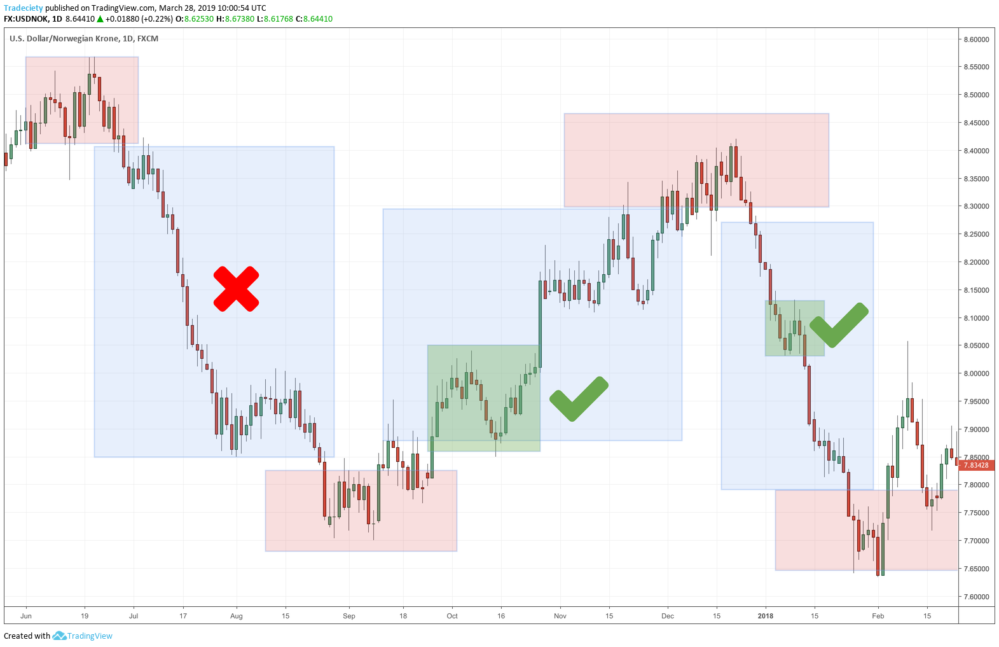

## Table of Contents

## What is Forex trading and why is it important?

Forex trading, also known as foreign exchange trading, is the buying and selling of currencies on the foreign exchange market. It's like a big marketplace where people and organizations trade money from different countries. For example, if you think the US dollar will get stronger compared to the Euro, you might buy dollars with Euros, hoping to sell them back later at a higher rate.

Forex trading is important for several reasons. First, it helps businesses and travelers exchange money when they need to buy things in different countries. Without Forex, it would be hard for a company in Japan to buy goods from the United States, or for a tourist to pay for a meal in Italy. Second, Forex trading affects the value of currencies, which can impact the economy of entire countries. When a currency gets stronger or weaker, it can change how much things cost and how much people can buy, which is a big deal for everyone.

## How does the Forex market work?

The Forex market is where people trade different currencies. It's open all the time, from Monday to Friday, because there are always different parts of the world where it's daytime. When you trade, you're basically guessing that one currency will get stronger compared to another. For example, if you think the Euro will get stronger than the US dollar, you might buy Euros with dollars. If you're right and the Euro does get stronger, you can sell your Euros back for more dollars than you started with, making a profit.

The market works through a network of banks, brokers, and traders all around the world. They use electronic trading platforms to buy and sell currencies. The prices of currencies change all the time based on things like how well a country's economy is doing, interest rates, and even big news events. When lots of people want to buy a certain currency, its price goes up. If lots of people want to sell it, the price goes down. This constant buying and selling is what makes the Forex market so active and important.

## What are the basic terms and concepts a beginner should know in Forex trading?

When you start with Forex trading, there are some key terms and ideas you should know. First, there's the 'currency pair', which is just two currencies you're trading with each other, like EUR/USD (Euros and US dollars). One currency is the 'base currency' and the other is the 'quote currency'. The price you see tells you how much of the quote currency you need to buy one unit of the base currency. Then there's the 'pip', which is a small change in the currency pair's price. Most of the time, a pip is the fourth number after the decimal point in a price quote, like 0.0001 for EUR/USD. Pips are how you measure how much money you make or lose.

Another important idea is 'leverage', which lets you trade with more money than you actually have. It's like borrowing money to make bigger trades, but it can be risky because you can lose a lot if the trade goes the wrong way. 'Margin' is the money you need to put up to open a leveraged trade. 'Bid' and 'ask' prices are also key: the bid is what people are willing to pay for the currency pair, and the ask is what they're asking to sell it for. The difference between these two is called the 'spread', and it's how brokers make money. Understanding these terms will help you navigate the Forex market better as a beginner.

## What are the most common Forex trading strategies for beginners?

One common strategy for beginners is called 'scalping'. This means you make lots of small trades in a short time, trying to make a little bit of money from each one. The idea is to take advantage of small price changes that happen all the time in the Forex market. You need to be quick and pay close attention to the market, but it can be a good way to learn how trading works without risking too much money at once.

Another strategy is 'day trading', where you buy and sell currencies within the same day. You don't hold onto your trades overnight, so you don't have to worry about what might happen to the market while you're sleeping. Day traders often use technical analysis, which means looking at charts and patterns to guess where prices might go next. This strategy can be less stressful than scalping because you have a bit more time to make decisions, but it still requires you to watch the market closely during the day.

A third strategy is 'swing trading', which is a bit slower than the others. With swing trading, you hold onto your trades for a few days or even weeks, trying to catch bigger moves in the market. This can be less stressful because you don't need to watch the market every second, but it still requires you to understand the bigger trends and patterns. Swing trading can be a good choice for beginners who want to learn more about the market without the pressure of making quick decisions.

## How can one set up a Forex trading account?

Setting up a Forex trading account is pretty easy. First, you need to pick a good Forex broker. A broker is like a middleman who helps you buy and sell currencies. Look for a broker that is trustworthy and has good reviews. Once you've chosen a broker, go to their website and look for a button that says something like "Open an Account" or "Sign Up". You'll need to fill out some forms with your personal information, like your name, address, and sometimes a copy of your ID to prove who you are. This is to make sure everything is safe and legal.

After you've filled out the forms and your account is approved, you'll need to put some money into your account. This is called making a deposit. You can usually do this with a bank transfer, credit card, or sometimes even with services like PayPal. Once your money is in your account, you can start trading. Most brokers have a trading platform, which is a special program or app where you can see the prices of different currencies and make your trades. It's a good idea to practice first with a demo account, where you can trade with pretend money to get the hang of things before you start using real money.

## What are the key factors to consider when choosing a Forex broker?

When choosing a Forex broker, one of the most important things to think about is how safe and trustworthy they are. You want to make sure your money is safe, so look for brokers that are regulated by big financial groups like the FCA in the UK or the NFA in the US. These groups make sure brokers follow rules and treat customers fairly. Another thing to consider is how much it costs to trade with them. Brokers make money from the difference between the buying and selling prices, which is called the spread, and they might also charge other fees. Make sure you understand all the costs before you start trading.

Another key [factor](/wiki/factor-investing) is the trading platform the broker offers. A good platform should be easy to use and have all the tools you need to make smart trading decisions, like charts and indicators. It's also important to check if the broker offers good customer support. If you have a problem or a question, you want to be able to get help quickly. Lastly, think about what kind of trading you want to do. Some brokers are better for beginners, offering educational resources and demo accounts, while others might be more suited for experienced traders looking for advanced features.

## What technical analysis tools are essential for intermediate Forex traders?

For intermediate Forex traders, some important technical analysis tools include moving averages, which help smooth out price data to see trends more clearly. There are different types of moving averages, like the simple moving average (SMA) and the exponential moving average (EMA). These can help traders figure out if a currency is going up or down over time. Another useful tool is the Relative Strength Index (RSI), which measures how fast and how much a currency's price has changed. This can tell traders if a currency is overbought or oversold, which might mean it's time to buy or sell. Fibonacci retracement levels are also helpful because they show potential support and resistance levels where the price might change direction.

Another essential tool for intermediate traders is the MACD (Moving Average Convergence Divergence), which helps spot changes in the strength, direction, and duration of a trend in a currency's price. By looking at the MACD, traders can see when it might be a good time to enter or [exit](/wiki/exit-strategy) a trade. Bollinger Bands are also important because they show how much a currency's price is moving around its average. When the bands get wider, it means the price is moving a lot, and when they get narrower, it means the price is more stable. Using these tools together can give intermediate traders a better understanding of the market and help them make smarter trading decisions.

## How does fundamental analysis impact Forex trading decisions?

Fundamental analysis looks at the big picture of a country's economy to help Forex traders make decisions. It involves studying things like a country's GDP, interest rates, employment rates, and even big news events. When traders use fundamental analysis, they are trying to guess how strong a country's currency will be in the future. For example, if a country's economy is doing well, with low unemployment and high growth, its currency might get stronger because more people will want to invest in it. On the other hand, if a country is struggling, its currency might get weaker.

By understanding these economic factors, traders can make better guesses about which currencies to buy or sell. For instance, if a country's central bank raises interest rates, it might attract more foreign investment, making the currency stronger. Traders who see this coming can buy the currency before it goes up in value and then sell it for a profit later. Fundamental analysis helps traders see the bigger trends that can affect currency prices over time, which is important for making long-term trading decisions.

## What are advanced Forex trading strategies like scalping and carry trading?

Scalping is a fast-paced Forex trading strategy where traders make a lot of small trades in a short time. The goal is to make small profits from tiny changes in currency prices. Scalpers need to watch the market very closely and make quick decisions. They often use technical analysis tools like moving averages and the Relative Strength Index (RSI) to find the best times to buy and sell. This strategy can be exciting but also stressful because you need to be quick and focused all the time. It's not for everyone, but it can be a good way to learn about the market and make some money if you're good at it.

Carry trading is another advanced strategy that focuses on the interest rates of different currencies. The idea is to borrow money in a currency with a low [interest rate](/wiki/interest-rate-trading-strategies) and then use that money to buy a currency with a higher interest rate. For example, if the interest rate in Japan is very low, you might borrow Japanese yen and use it to buy Australian dollars, which have a higher interest rate. Over time, you earn more from the interest on the Australian dollars than you pay on the yen, making a profit. But [carry](/wiki/carry-trading) trading can be risky because currency values can change a lot, and if the currency you borrowed goes up in value, you might lose money. It's a good strategy for people who are willing to take some risk and hold onto their trades for a longer time.

## How can risk management techniques be applied effectively in Forex trading?

Risk management in Forex trading is all about protecting your money and making smart choices. One important technique is setting stop-loss orders. A stop-loss order is like a safety net that automatically closes your trade if the price goes against you too much. For example, if you buy a currency pair at 1.2000 and set a stop-loss at 1.1950, your trade will close if the price drops to 1.1950, limiting your loss. Another technique is using take-profit orders, which automatically close your trade when you reach a certain profit level. This helps you lock in gains and not get too greedy.

Another key part of risk management is not putting all your money into one trade. This is called diversification. Instead of betting everything on one currency pair, you can spread your money across different pairs. That way, if one trade goes bad, you won't lose everything. It's also important to only risk a small part of your trading account on any single trade, usually no more than 1-2%. This helps you stay in the game even if you have a few losing trades. By using these techniques, you can trade more safely and keep your losses small while still trying to make profits.

## What are the psychological aspects of Forex trading and how can they be managed?

One of the big challenges in Forex trading is managing your emotions. It's easy to get excited when you're making money and scared when you're losing it. These feelings can make you do things like holding onto a losing trade too long, hoping it will turn around, or selling a winning trade too soon because you're afraid to lose what you've gained. This is called emotional trading, and it can lead to bad decisions and losing money. To manage these feelings, it's important to have a clear trading plan and stick to it. This means deciding ahead of time when to enter and exit trades, and not letting your emotions change your mind.

Another way to handle the psychological side of Forex trading is to keep a trading journal. Writing down your trades, what you were thinking, and how you felt can help you see patterns in your behavior. If you notice you often make bad trades when you're feeling stressed or excited, you can take steps to calm down before trading. Taking breaks and not trading when you're feeling too emotional can also help. Remember, trading is a marathon, not a sprint, so staying calm and patient is key to making good decisions over time.

## What are the latest trends and technologies affecting Forex trading for experts?

One of the latest trends in Forex trading for experts is the use of [artificial intelligence](/wiki/ai-artificial-intelligence) (AI) and [machine learning](/wiki/machine-learning). These technologies help traders analyze huge amounts of data quickly and find patterns that might be hard for a person to see. For example, AI can look at news, social media, and economic reports to predict how currency prices might change. This can give expert traders an edge by helping them make better decisions faster. Some trading platforms now offer AI tools that can even make trades automatically based on what the AI thinks will happen next.

Another big trend is the rise of blockchain and cryptocurrencies. While Forex trading usually deals with traditional currencies like dollars and euros, more and more traders are getting into cryptocurrencies like Bitcoin and Ethereum. Blockchain technology makes it easier and safer to trade these digital currencies. Some experts are even using blockchain to create new kinds of Forex trading platforms that are more transparent and secure. These trends are changing the way expert traders work, making it important for them to keep up with new technology to stay ahead in the market.

## What are the key trading strategies in Forex?

Trading strategies play a critical role in the [forex](/wiki/forex-system) market, guiding traders in their decision-making processes and helping to manage risk. These strategies provide a structured approach to trading, enhancing the chances of success by allowing traders to systematically evaluate opportunities based on predefined criteria. 

Among the most popular trading strategies, [scalping](/wiki/gamma-scalping), [day trading](/wiki/day-trading-spy), swing trading, and position trading each offer unique advantages and suit different trading styles:

1. **Scalping**: This strategy involves making numerous trades to capture small price movements typically over short time frames, often just seconds or minutes. Scalpers aim to achieve profits through high-frequency trading, taking advantage of narrow price ranges.

2. **Day Trading**: Day traders hold positions within a single trading day, closing out all trades by the end of the day. This strategy seeks to capitalize on short-term market volatility without the uncertainties posed by overnight positions.

3. **Swing Trading**: Swing traders attempt to capture gains over several days to weeks. This strategy benefits from market swings, focusing on catching the short-to-medium-term movements influenced by market trends or news events.

4. **Position Trading**: This long-term strategy involves holding trades for months or even years, betting on major market trends. Position traders typically base their decisions on fundamental analysis, believing in their understanding of economic indicators and long-term trends.

Technical analysis-based strategies are integral to forex trading. Indicators like Moving Averages (MA) and Relative Strength Index (RSI) are utilized extensively. Moving Averages help identify the direction of trends by smoothing out price data. It can be simple (SMA) or exponential (EMA), with the formula for a simple moving average calculated as: 

$$
\text{SMA} = \frac{\sum{P_{t}}}{n}
$$

where $P_{t}$ is the price at time $t$ and $n$ is the number of periods.

The RSI, on the other hand, is a [momentum](/wiki/momentum) oscillator that measures the speed and change of price movements, providing signals on potential overbought or oversold conditions. The RSI formula is:

$$
\text{RSI} = 100 - \left(\frac{100}{1 + \frac{\text{Average Gain}}{\text{Average Loss}}}\right)
$$

Fundamental analysis involves examining economic indicators, central bank policies, and geopolitical events to forecast currency movements. Traders analyze data such as GDP growth, unemployment rates, and inflation to understand underlying market conditions.

Many traders combine technical and [fundamental analysis](/wiki/fundamental-analysis) to build a more comprehensive trading strategy. For instance, they might use technical indicators for entry and exit points while basing their overall market outlook on fundamental factors. By merging these approaches, traders aim to leverage both short-term price patterns and long-term economic trends to enhance their trading decisions.

This dual approach aids in making informed predictions and mitigating risks associated with forex trading, ultimately contributing to a more balanced and effective trading strategy.

## References & Further Reading

[1]: ["Forex Trading: The Basics Explained in Simple Terms"](https://www.amazon.com/FOREX-TRADING-Explained-Beginners-Strategies/dp/1535198567) by Jim Brown

[2]: ["Algorithmic Trading: Winning Strategies and Their Rationale"](https://www.wiley.com/en-us/Algorithmic+Trading%3A+Winning+Strategies+and+Their+Rationale-p-9781118460146) by Ernie Chan

[3]: King, M. R., & Rime, D. (2010). ["The $4 trillion question: What explains FX growth since the 2007 survey?"](https://www.bis.org/publ/qtrpdf/r_qt1012e.pdf) BIS Quarterly Review, December.

[4]: Cartea, Á., Jaimungal, S., & Penalva, J. (2015). ["Algorithmic and High-Frequency Trading"](https://assets.cambridge.org/97811070/91146/frontmatter/9781107091146_frontmatter.pdf) by Álvaro Cartea, Sebastian Jaimungal, and José Penalva

[5]: Hull, J. C. (2018). ["Options, Futures, and Other Derivatives"](https://www.semanticscholar.org/paper/Options%2C-Futures%2C-and-Other-Derivatives-Hull/89bdee500c8623864fc9eb7a471546aa713acc44) by John C. Hull