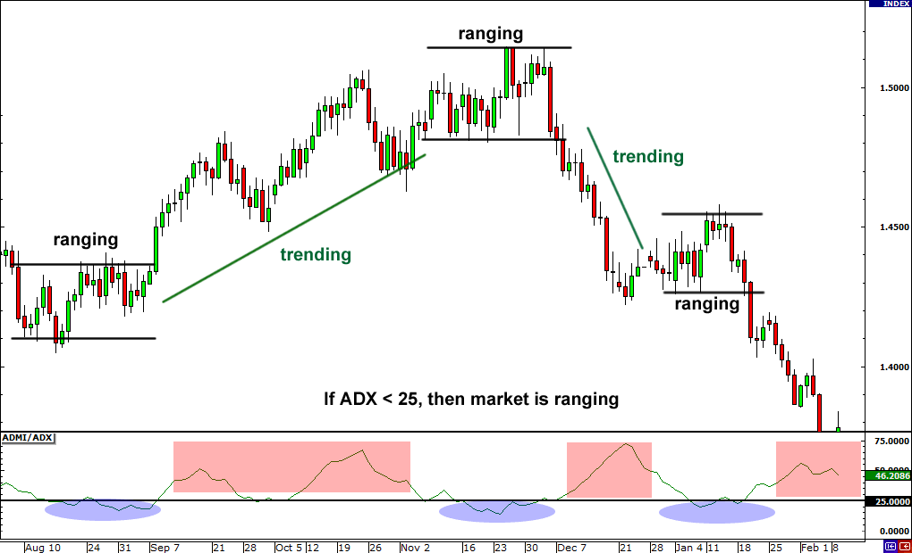

## Table of Contents

## What is Forex trading and why is it important to understand different trading strategies?

Forex trading, also known as foreign exchange trading, is the buying and selling of currencies on the foreign exchange market. It's the largest and most liquid financial market in the world, where people and organizations trade currencies to make profits or to protect themselves from currency fluctuations. For example, if someone thinks the value of the Euro will go up compared to the US Dollar, they might buy Euros now and sell them later for more Dollars. Forex trading happens all the time, 24 hours a day during the business week, because different countries have different time zones.

Understanding different trading strategies is important because the Forex market can be unpredictable and risky. Each strategy helps traders make better decisions based on their goals, how much risk they are willing to take, and how much time they can spend trading. Some strategies focus on long-term trends, while others might be about making quick profits from short-term changes in currency values. By knowing and using different strategies, traders can adapt to changing market conditions and increase their chances of making money, while also managing their risks better.

## What are trend trading strategies and how do they work in Forex markets?

Trend trading strategies in Forex markets involve identifying and following the direction of a currency pair's price movement over time. Traders using this approach believe that once a trend is established, it is likely to continue. They look for signs that a currency is moving in a consistent direction, either upward or downward, and then make trades that go along with that direction. For example, if the Euro is getting stronger against the US Dollar over several weeks, a trend trader might buy Euros, expecting the trend to keep going and the Euro to become even stronger.

To apply trend trading strategies, traders use tools like moving averages, trend lines, and other technical indicators to spot trends. A moving average smooths out price data to show the trend more clearly, while trend lines are drawn on a chart to connect the highs or lows of price movements. When these tools show that a currency pair is in a strong trend, traders might enter a trade in the direction of the trend and hold it until there are signs that the trend is ending or reversing. This method requires patience and discipline, as it involves waiting for the right moment to enter and [exit](/wiki/exit-strategy) trades based on the trend's strength and duration.

## What are range trading strategies and how do they differ from trend trading?

Range trading strategies in Forex markets focus on trading within a set price range. Traders using this approach look for times when a currency pair's price moves up and down between two levels, called support and resistance. They buy the currency when it's near the bottom of the range (support) and sell it when it's near the top (resistance). The idea is to make small profits from these repeated movements within the range. Range traders use tools like horizontal lines on charts to mark where the price has bounced back from before, helping them decide when to buy or sell.

Range trading is different from trend trading because it doesn't follow a long-term direction. While trend traders aim to catch big moves in one direction, range traders are happy with smaller, more frequent gains. Trend trading works best when the market is moving clearly up or down, but range trading is better when the market is not moving much and stays within a certain range. Both strategies need different skills and patience; trend traders wait for the right moment to join a trend, while range traders need to be quick to take advantage of the smaller price swings.

## How can a beginner identify a trend in the Forex market?

A beginner can identify a trend in the Forex market by looking at a price chart over time. If the price of a currency pair is going up and making higher highs and higher lows, it's an uptrend. This means the currency is getting stronger. On the other hand, if the price is going down and making lower highs and lower lows, it's a downtrend. This means the currency is getting weaker. A simple way to spot these trends is by drawing trend lines on the chart. Connect the lows for an uptrend or the highs for a downtrend, and if the line shows a clear direction, you've found a trend.

Another tool beginners can use is moving averages. A moving average is a line on the chart that shows the average price over a certain number of periods, like 50 days or 200 days. If the price is above the moving average and the moving average is going up, it's a sign of an uptrend. If the price is below the moving average and the moving average is going down, it's a sign of a downtrend. By using these simple methods, beginners can start to see the direction the market is moving and make better trading decisions.

## What are the key indicators used in trend trading and how are they applied?

In trend trading, moving averages are a key indicator. They help show the direction of the market by smoothing out price data over time. A moving average can be set for different time periods, like 50 days or 200 days. If the price of a currency is above the moving average and the moving average is going up, it's a sign of an uptrend. This means the currency is getting stronger. On the other hand, if the price is below the moving average and the moving average is going down, it's a sign of a downtrend. This means the currency is getting weaker. Traders use moving averages to decide when to buy or sell based on the trend.

Another important indicator is the trend line. A trend line is a simple line drawn on a price chart to connect the lows in an uptrend or the highs in a downtrend. When the price stays above the trend line in an uptrend, it shows that the trend is strong and likely to continue. If the price stays below the trend line in a downtrend, it also shows a strong trend. Traders watch these lines closely. If the price breaks through the trend line, it might mean the trend is ending or reversing. By using trend lines, traders can see the direction of the market and make trades that go along with the trend.

These indicators are applied by watching the price chart and looking for clear signs of a trend. For example, if a trader sees that the price is consistently above the 50-day moving average and the moving average is going up, they might decide to buy the currency, expecting the trend to continue. Similarly, if a trend line shows a strong uptrend and the price stays above it, a trader might enter a buy trade. By using these indicators together, traders can get a better picture of the market trend and make more informed trading decisions.

## What are the common tools and indicators used for range trading in Forex?

In range trading, traders use tools like support and resistance levels to find where the price of a currency pair might stop and turn around. Support is the price level where the currency often stops going down and starts going up again. Resistance is the price level where the currency often stops going up and starts going down again. Traders draw horizontal lines on the chart at these levels to see where the price might bounce back. When the price gets close to the support level, traders might buy the currency, expecting it to go up. When the price gets close to the resistance level, traders might sell the currency, expecting it to go down.

Another tool used in range trading is the oscillator. Oscillators are indicators that move between two extreme levels, like 0 and 100. They help traders see if a currency is overbought or oversold. If an oscillator shows that a currency is overbought, it means the price might be too high and could go down soon. If it shows the currency is oversold, it means the price might be too low and could go up soon. Common oscillators used in range trading include the Relative Strength Index (RSI) and the Stochastic Oscillator. Traders use these to find good times to buy or sell within the range, making small profits from the price moving back and forth.

## How do economic indicators and news events affect trend and range trading strategies?

Economic indicators and news events can have a big impact on both trend and range trading strategies. For trend traders, these events can either strengthen or reverse a trend. For example, if a country's unemployment rate goes down, it might make the currency stronger because it shows the economy is doing well. Trend traders might see this as a sign to keep buying the currency if it fits with the current upward trend. On the other hand, if there's bad news like a country's GDP growth is lower than expected, it can make the currency weaker and might reverse an upward trend or start a new downward trend. Trend traders need to watch these events closely to decide when to enter or exit trades based on how the trend might change.

For range traders, economic indicators and news events can cause the price to break out of the range or make the range bigger or smaller. If there's good news, the price might go up and hit the resistance level, making range traders sell the currency. If there's bad news, the price might go down and hit the support level, making range traders buy the currency. But if the news is really big, it might push the price outside the usual range, and range traders need to be ready to adjust their strategy. They might need to find a new range or switch to trend trading if the price keeps moving in one direction after the news. Both trend and range traders need to stay updated with economic news to make smart trading decisions.

## What are the risks associated with trend trading versus range trading?

Trend trading can be risky because it depends a lot on the market moving in one direction for a long time. If the trend suddenly changes or reverses, traders can lose a lot of money. For example, if a trader buys a currency thinking it will keep going up, but then bad news comes out and the price drops, the trader might have to sell at a loss. Also, trend traders often use bigger stop-loss orders to give the trade room to move, but this means they might lose more money if the trade goes against them. So, trend trading needs a lot of patience and good risk management.

Range trading also has its own risks. The main risk is that the price might break out of the range and keep going in one direction. If a trader buys near the support level thinking the price will go up, but then it breaks below the support and keeps falling, the trader could lose money. Range traders often use smaller stop-loss orders to limit their losses, but they might get stopped out more often if the price moves around a lot. Also, range trading can be tiring because traders need to watch the market closely and make quick decisions to catch the small price movements within the range.

## How can traders switch between trend and range strategies based on market conditions?

Traders can switch between trend and range strategies by watching the market closely and using tools like moving averages and support and resistance levels. If the market is moving in one direction and making higher highs or lower lows, it's a good time to switch to a trend trading strategy. Traders can use moving averages to confirm the trend and then make trades that go along with it. For example, if the price is above the 50-day moving average and the moving average is going up, a trader might decide to buy the currency, expecting the trend to continue.

On the other hand, if the market is not moving much and the price is bouncing between two levels, it's a good time to switch to a range trading strategy. Traders can use support and resistance levels to find where the price might stop and turn around. They can buy near the support level and sell near the resistance level, making small profits from the price moving back and forth. By paying attention to these market conditions and using the right tools, traders can switch strategies smoothly and increase their chances of making money.

## What advanced techniques can experts use to enhance their trend trading strategies?

Experts can use advanced techniques like multiple time frame analysis to enhance their trend trading strategies. This means looking at the same currency pair on different time frames, like daily, hourly, and 15-minute charts. If the trend looks strong on all time frames, it gives a stronger signal to trade. Experts also use technical indicators like the Average Directional Index (ADX) to measure the strength of a trend. If the ADX shows a strong trend, it can help experts feel more confident in their trades. By combining these tools, experts can find better entry and exit points and make more accurate predictions about where the market is going.

Another advanced technique experts use is Fibonacci retracement levels. These levels help traders find where the price might pull back before continuing the trend. If the price pulls back to a key Fibonacci level and then starts moving in the direction of the trend again, it's a good time to enter a trade. Experts also use [volume](/wiki/volume-trading-strategy) analysis to see if the trend is supported by a lot of trading activity. High volume during a trend can mean the trend is strong and likely to continue. By using these advanced techniques, experts can make smarter trading decisions and improve their chances of making money in the Forex market.

## What sophisticated methods can be employed to optimize range trading in volatile markets?

In volatile markets, experts can use a method called Bollinger Bands to optimize their range trading. Bollinger Bands are lines drawn on a price chart that show how much the price is moving around. The middle line is a moving average, and the top and bottom lines show how far the price usually goes from that average. When the price gets close to the top Bollinger Band, it might be a good time to sell, and when it gets close to the bottom band, it might be a good time to buy. This helps traders make quick decisions in a fast-moving market. Experts also watch for times when the bands get closer together, which can mean the market is getting ready for a big move, and they can adjust their range trading strategy accordingly.

Another way to optimize range trading in volatile markets is by using the Average True Range (ATR) indicator. The ATR shows how much the price is moving up and down over a certain time. In a volatile market, the ATR will be higher, and traders can use this information to set wider stop-loss orders to give their trades more room to move. This helps prevent them from getting stopped out too early by the big price swings. Experts also combine the ATR with support and resistance levels to find the best times to enter and exit trades within the range. By using these sophisticated methods, traders can better handle the ups and downs of a volatile market and make more profitable trades.

## How can a trader evaluate the performance of their trend versus range trading strategies?

A trader can evaluate the performance of their trend and range trading strategies by looking at how much money they make or lose over time. They should keep track of every trade, noting down the entry and exit points, the amount of profit or loss, and how long each trade lasts. By comparing these details, a trader can see which strategy works better for them. For example, if trend trading brings in more profit with fewer losses, it might be the better choice. On the other hand, if range trading results in more consistent, smaller profits, a trader might prefer that strategy. It's important to look at the overall performance, not just one or two trades, to get a clear picture.

Another way to evaluate these strategies is by looking at the risk and reward ratio. This means checking how much risk a trader takes for each trade compared to the potential reward. Trend trading often involves bigger risks because traders hold onto their trades for longer periods, waiting for the trend to continue. If the trend reverses, the losses can be big. Range trading usually has smaller risks because traders are looking for smaller, more frequent gains. By calculating the average risk and reward for both strategies, a trader can see which one fits their risk tolerance better. This helps them decide if they should stick with one strategy or switch between them based on market conditions.

## References & Further Reading

[1]: Bergstra, J., Bardenet, R., Bengio, Y., & Kégl, B. (2011). ["Algorithms for Hyper-Parameter Optimization."](https://papers.nips.cc/paper/4443-algorithms-for-hyper-parameter-optimization) Advances in Neural Information Processing Systems 24.

[2]: ["Advances in Financial Machine Learning"](https://www.amazon.com/Advances-Financial-Machine-Learning-Marcos/dp/1119482089) by Marcos Lopez de Prado

[3]: ["Evidence-Based Technical Analysis: Applying the Scientific Method and Statistical Inference to Trading Signals"](https://www.amazon.com/Evidence-Based-Technical-Analysis-Scientific-Statistical/dp/0470008741) by David Aronson

[4]: ["Machine Learning for Algorithmic Trading"](https://github.com/stefan-jansen/machine-learning-for-trading) by Stefan Jansen

[5]: ["Quantitative Trading: How to Build Your Own Algorithmic Trading Business"](https://www.amazon.com/Quantitative-Trading-Build-Algorithmic-Business/dp/1119800064) by Ernest P. Chan