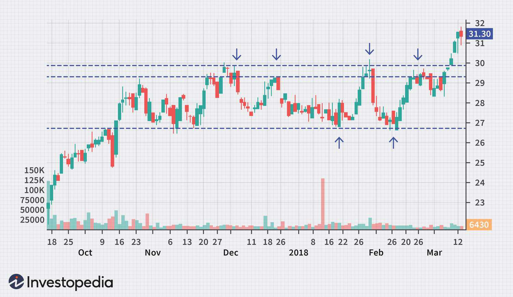

Forex trading, or foreign exchange trading, is the buying and selling of currencies on a global market. It is a decentralized market, operating 24 hours a day, five days a week, and is the largest financial market in the world, with a daily trading volume exceeding $6 trillion as of 2021. This liquidity and market size make Forex trading a critical component of global finance, influencing currency exchange rates and, consequently, international trade and economic stability.

Algorithmic trading, or algo trading, refers to the use of computer programs to automate the execution of trading strategies. This method has grown significantly in popularity due to its ability to process large amounts of data at high speeds, facilitating quicker decision-making and improved trading efficiency. In the Forex market, algo trading allows traders to implement complex strategies with minimal human intervention, reducing the emotional bias associated with manual trading.



Forex trading strategies are typically categorized into range and trend strategies. Range strategies are designed to exploit markets where prices fluctuate between defined support and resistance levels. These strategies are particularly useful in stable markets with no clear long-term trend. On the other hand, trend strategies aim to capitalize on markets where prices are moving consistently in one direction, either upwards or downwards. Identifying and leveraging trends can be lucrative, especially in volatile markets with clear directional patterns.

The purpose of this article is to explore these different trading strategies within the Forex market and examine the role of algo trading in enhancing their implementation. We aim to provide an in-depth analysis of how traders can effectively use range and trend strategies, augmented by algorithmic trading techniques, to optimize their Forex trading outcomes.

The content of this article will be structured to guide the reader through a comprehensive understanding of both range and trend strategies, followed by a detailed look at the integration and benefits of algorithmic trading in these strategies. We will also discuss real-world examples to illustrate the successful application of these methodologies. 

Through this exploration, we wish to convey actionable insights for Forex traders seeking to adapt and thrive in the ever-evolving landscape of Forex markets. By examining the synergy between traditional trading strategies and modern algorithmic enhancements, we aim to highlight the benefits and challenges associated with these approaches and encourage continuous learning and adaptation among traders.

## Table of Contents

## Understanding Range Strategies

Range strategies in Forex trading are an essential subset of trading strategies employed to exploit markets that exhibit sideways price movements, where the currency price oscillates between defined support and resistance levels. These strategies are critical for traders seeking to profit in markets that do not exhibit clear upward or downward trends.

### Definition of Range Strategies in Forex Trading

Range strategies are trading methods used when a currency pair's price remains confined within a bounded interval over a specific period. This interval is marked by levels of support and resistance, which the price generally does not surpass. Traders who use range strategies aim to buy at the support level and sell at the resistance level, capitalizing on these predictable price oscillations.

### Key Characteristics of Range-Bound Markets

Range-bound markets are characterized by the absence of significant directional movement. The price fluctuates within a horizontal band, indicating market indecision and consolidation. Key attributes of such markets include:

- **Support Level**: The price level at which a downtrend can be expected to pause due to the concentration of buying interest.
- **Resistance Level**: The price level at which an uptrend can be expected to pause due to a concentration of selling interest.
- Lack of significant news or market-moving events that could trigger a breakout.

### Identification and Capitalization on Range-Bound Conditions

Traders identify range-bound conditions by observing and confirming price bounces at established support and resistance levels. Techniques include:

- **Technical Analysis**: Evaluating currency charts to identify previous instances where the price has reversed direction.
- **Volume Analysis**: Observing the volume of trades to confirm if the support or resistance levels hold significant trading interest.

Once identified, traders capitalize on these conditions by employing strategies such as:

- **Buying at Support**: Anticipating that prices will rebound from the lower boundary.
- **Selling at Resistance**: Expecting prices to decline upon reaching the upper boundary.

### Popular Indicators and Tools Used in Range Strategies

Effective implementation of range strategies often relies on various technical indicators and tools, including:

- **Relative Strength Index (RSI)**: Used to measure momentum and highlight overbought or oversold conditions.
- **Bollinger Bands**: Evaluate price volatility and potential reversal points within the range.
- **Stochastic Oscillator**: Indicates potential price reversals by comparing a security’s closing price to its price range over a specific period.

### Pros and Cons of Using Range Strategies in Forex Trading

Range strategies offer several advantages and disadvantages:

**Pros**:
- **Predictability**: Easier to predict price movements within a defined range.
- **Low Volatility**: Ideal for traders uncomfortable with high volatility as price movements are generally calmer.
- **Consistency**: Allows traders to systematically exploit repeated patterns.

**Cons**:
- **False Breakouts**: Risk of abrupt breakout either above or below the range, potentially leading to losses.
- **Limited Profit Potential**: Constrained to small price movements, limiting profit margins.
- **Market Conditions Dependency**: Less effective in trending markets where strong directional movement occurs.

### Examples of Successful Range Strategies Implemented Using Algorithms

Algorithmic trading has enabled the automation and enhancement of range strategies, allowing traders to efficiently execute trades at precise support and resistance levels without constant manual monitoring. For instance:

```python
def range_strategy(data, support, resistance):
    position = None
    buy_price = 0
    sell_price = 0

    for price in data:
        if price <= support and position != "long":
            position = "long"
            buy_price = price
            print(f"Buying at: {buy_price}")

        elif price >= resistance and position == "long":
            position = None
            sell_price = price
            print(f"Selling at: {sell_price}, Profit: {sell_price - buy_price}")

data = [1.2, 1.18, 1.22, 1.19, 1.21, 1.20, 1.25]
range_strategy(data, support=1.18, resistance=1.22)
```

In this example, the algorithm checks prices against predefined support and resistance levels, executing buy and sell orders as appropriate. By automating these trades, the algorithm increases efficiency and can react immediately to market changes.

Range strategies in Forex trading allow traders to leverage market stability during non-trending periods, providing opportunities for profits in quieter markets. While challenges, such as false breakouts, exist, the integration of algorithmic technology can mitigate risks and enhance precision in executing trades.

## Exploring Trend Strategies

### Exploring Trend Strategies

Trend strategies in Forex trading are methodologies that aim to capitalize on market movements where the price of a currency pair consistently moves in one direction—either upwards or downwards—over a period of time. These strategies focus on identifying, entering, and exiting positions in line with these directional movements.

#### Characteristics of Trending Markets

Trending markets are characterized by sustained movements in one direction and can be classified as either uptrends, downtrends, or sideways trends. In an uptrend, prices consistently rise, making higher highs and higher lows. Conversely, a downtrend is marked by falling prices, with lower highs and lower lows. Market trends differ from range-bound markets, which oscillate within a specific price range without a clear direction. Identifying these market states is critical for the successful application of trend strategies.

#### Techniques for Identifying Market Trends

Traders commonly employ various techniques to identify market trends. One fundamental method is through the analysis of price charts, looking for patterns such as higher highs and higher lows for an uptrend or lower highs and lower lows for a downtrend. Other techniques include:

1. **Moving Averages**: These are used to smooth out price data to identify the direction of a trend. A simple moving average (SMA) or an exponential moving average (EMA) can indicate trend direction by comparing the current price to the moving average.

2. **Divergence Analysis**: Observing divergences between the price movement and indicators such as the Relative Strength Index (RSI) can signal potential reversals or continuation of trends.

3. **Trend Lines**: Drawing lines along significant highs or lows on a chart can visually highlight the trend direction and provide insight into potential breakout or breakdown points.

#### Common Indicators in Trend Strategies

Indicators play a crucial role in the design and execution of trend strategies. Some widely used indicators include:

- **Moving Averages**: Both simple and exponential moving averages help identify the trend direction and potential entry and exit points.

- **Bollinger Bands**: Comprised of a moving average and standard deviation lines, Bollinger Bands can help traders understand volatility and probable price reversals in the context of a trend.

- **MACD (Moving Average Convergence Divergence)**: This momentum indicator shows the relationship between two moving averages of a security’s price and is used to identify potential buy or sell signals.

- **ADX (Average Directional Index)**: This indicator quantifies the strength of a trend, offering insight into whether the market is trending strongly or weakly.

#### Advantages and Disadvantages of Trend Strategies

Trend strategies have several benefits and drawbacks. Key advantages include:

- **High Profit Potential**: When executed correctly, trend strategies allow traders to ride significant market moves, maximizing profit potential.

- **Simplicity and Structure**: These strategies are often based on straightforward rules and indicators, making them accessible and easy to implement for traders at various experience levels.

However, there are also inherent disadvantages:

- **Whipsaw Risk**: In volatile or range-bound markets, traders may encounter false signals, leading to potential losses.

- **Delayed Signals**: Often reliant on historical data, trend strategies may lag in identifying reversals, causing late entries or exits.

#### Case Studies of Algorithmic Implementations of Trend Strategies

Algorithmic trading has revolutionized the implementation of trend strategies. Algorithms can process vast amounts of data instantaneously, identifying potential trends and executing trades with high precision. For instance, the Moving Average Crossover strategy is a popular algorithmic trend approach where an algorithm executes buy/sell orders based on crossovers of short and long-term moving averages. Python can be used for such implementations as follows:

```python
import pandas as pd

def moving_average_crossover(data, short_window, long_window):
    data['Short_MA'] = data['Close'].rolling(window=short_window, min_periods=1).mean()
    data['Long_MA'] = data['Close'].rolling(window=long_window, min_periods=1).mean()
    data.dropna(inplace=True)

    signals = pd.DataFrame(index=data.index)
    signals['Signal'] = 0.0
    signals['Signal'][short_window:] = np.where(data['Short_MA'][short_window:] > data['Long_MA'][short_window:], 1.0, 0.0)
    signals['Positions'] = signals['Signal'].diff()

    return signals
```

In this code snippet, the algorithm calculates short and long moving averages to generate trading signals, effectively capitalizing on trend directions. Such algorithmic mechanisms are continuously refined to improve accuracy and efficiency, demonstrating significant potential within Forex trading.

## Algorithmic Trading in Forex

Algorithmic trading, commonly known as algo trading, represents a significant evolution in Forex markets, leveraging computerized systems to execute trades based on pre-defined criteria. This method relies on complex mathematical models and high-speed data analysis to make decisions at a pace and efficiency far beyond human capabilities. Algo trading's primary role in Forex is to enhance efficiency, reduce trading costs, and capture numerous short-term opportunities in the highly liquid and volatile currency markets.

One of the primary advantages of [algorithmic trading](/wiki/algorithmic-trading) over manual trading is the elimination of human emotions from the trading process. Manual trading is often influenced by emotions such as fear and greed, leading to irrational decisions, while algorithmic systems strictly adhere to predefined strategies. This can significantly improve consistency and precision in executing trades. Additionally, algo trading can perform complex calculations and spot opportunities across multiple markets instantaneously, a feat impossible for manual traders. This ability to handle vast quantities of data swiftly enables the identification of profitable trades that might otherwise go unnoticed.

The technology and infrastructure supporting algorithmic trading are robust and sophisticated. It typically involves high-speed internet connections, powerful computing hardware, and advanced software systems capable of processing large volumes of data. Forex trading platforms offer APIs (Application Programming Interfaces) that allow traders to connect their algorithms to live market data and execute trades automatically based on set conditions. The infrastructure often includes co-location services, where traders can place their servers near exchange servers to reduce latency, enhancing the speed of trade execution.

Various types of algorithms are employed in Forex trading, each designed to exploit specific market conditions. Market-making algorithms aim to provide [liquidity](/wiki/liquidity-risk-premium) by placing both buy and sell orders at different levels, capturing the spread between them. Arbitrage algorithms seek to profit from price discrepancies of the same or similar financial instruments across different markets or platforms, often requiring complex calculations to hedge positions effectively. Trend-following algorithms, widely used in Forex markets, attempt to identify and capitalize on sustained directional price movements. Such algorithms often utilize technical indicators like moving averages and [momentum](/wiki/momentum) oscillators to determine entry and [exit](/wiki/exit-strategy) points.

Algorithmic trading has a profound impact on market liquidity and [volatility](/wiki/volatility-trading-strategies). By providing continuous buy and sell orders, algo trading increases market liquidity, facilitating smoother transactions. However, the speed and [volume](/wiki/volume-trading-strategy) of algorithmic trades can also exacerbate market volatility, leading to rapid price swings. Events like the "flash crash" of May 2010 highlighted how algo trading could contribute to extreme market volatility, wiping out billions in market value within minutes due to cascading automatic sell orders.

In the context of automated trading strategies, there are varying levels of automation. Fully automated strategies involve systems that can operate independently, making all trading decisions without human intervention. These systems continuously monitor market conditions, execute trades, and adjust risk parameters based on market dynamics. Conversely, semi-automated strategies retain some level of human oversight, where traders might set the initial parameters or intervene in exceptional circumstances to adjust the automated decisions. This hybrid approach combines the speed and efficiency of algorithms with human intuition and experience.

Overall, algorithmic trading's role in Forex markets continues to grow, driven by technological advancements and its potential to deliver superior trading performance. The balance between fully automated and semi-automated systems, along with their associated benefits and risks, presents an ongoing challenge and opportunity for traders and institutional investors alike.

## Combining Range and Trend Strategies with Algo Trading

Integrating algorithmic trading with range and trend strategies presents numerous benefits for Forex traders seeking to optimize their operations and enhance profitability. This combination leverages the strengths of both strategies while employing advanced technology to ensure precision and efficiency.

One of the primary benefits of this integration is the enhanced execution efficiency algorithms provide. In fast-moving Forex markets, the ability to execute trades within milliseconds can significantly improve returns and reduce slippage. Algorithms can process vast quantities of market data instantaneously, allowing for rapid response to emerging trends or newly identified range-bound conditions. This capability helps traders capitalize on fleeting market opportunities that manual trading may miss.

### Risk Management and Optimization

Risk management is a critical component of successful trading strategies, and algorithmic trading offers sophisticated methods for managing and mitigating risks. Algorithms can be programmed to include various risk management parameters, such as stop-loss orders, take-profit targets, and position-sizing rules, tailored specifically for range and trend strategies. Optimization techniques, such as Monte Carlo simulations or genetic algorithms, can further refine these parameters based on historical data analysis, enhancing the strategy's robustness against market volatility.

```python
import numpy as np

def monte_carlo_simulation(strategy_func, num_simulations):
    returns = []
    for _ in range(num_simulations):
        returns.append(strategy_func())
    return np.mean(returns), np.std(returns)

# Example usage where `strategy_func` is a function that implements the trading logic
mean_return, std_return = monte_carlo_simulation(strategy_func=my_strategy, num_simulations=1000)
```

### Real-World Examples

Real-world examples illustrate the successful application of algorithmic trading in both range and trend strategies. For instance, some hedge funds and proprietary trading firms develop algorithms that simultaneously monitor both range and trend indicators, switching trading strategies based on real-time market condition assessments. These adaptive algorithms ensure that the strategy aligns with the prevailing market dynamics, increasing the overall efficiency and profitability of the trading system.

### Challenges

Despite the advantages, developing and maintaining algorithm-driven range and trend strategies present distinct challenges. Traders must constantly update algorithms in response to market changes and technological advances. Additionally, understanding and counteracting the complexities of execution risk, model risk, and data quality issues are critical. Ensuring the algorithm remains profitable in varying market conditions requires continuous research, [backtesting](/wiki/backtesting), and optimization.

### Future Trends

Looking ahead, innovations and emerging technologies promise to further enhance Forex algorithmic trading, particularly in range and trend strategies. Machine learning and [artificial intelligence](/wiki/ai-artificial-intelligence) (AI) are increasingly being integrated into algorithmic systems to improve pattern recognition and predictive accuracy. Quantum computing, although in its nascent stage, holds potential to revolutionize computational speed and capacity, offering unprecedented analysis capabilities for range and trend strategies. These advancements will likely drive more nuanced and adaptive trading systems, enabling traders to stay ahead in the competitive Forex market.

In conclusion, while there are challenges in creating and maintaining these strategies, the integration of algorithmic trading with range and trend strategies offers remarkable benefits, including execution efficiency and sophisticated risk management, laying the groundwork for future Forex trading innovations.

## Conclusion

Forex trading operates as a significant pillar in the global finance landscape, with range and trend strategies playing pivotal roles. Range strategies focus on profiting from markets moving between support and resistance levels, offering lucrative opportunities in relatively stable conditions. Trend strategies, on the other hand, capitalize on sustained directional movements, potentially leading to significant gains when markets show strong directional biases. Both strategies offer unique advantages, making them essential tools for traders who seek to navigate diverse market conditions effectively.

Algorithmic trading significantly enhances these strategies by providing precision, speed, and the ability to analyze vast datasets. Algorithms can quickly identify and execute trades in range-bound and trending markets, reducing the potential for human error. This automation allows traders to capitalize on fleeting opportunities and implement complex strategies that would be challenging to manage manually. Furthermore, algo trading improves the efficiency of risk management processes by applying sophisticated risk parameters consistently and accurately.

Looking to the future of Forex trading, technological advancements are likely to continue shaping market dynamics. Innovations such as [machine learning](/wiki/machine-learning) algorithms and big data analytics are becoming indispensable, offering new ways to interpret market behaviors and predict future trends. As these technologies evolve, they promise greater accuracy and profitability in executing trading strategies. Hence, traders are encouraged to embrace algo trading to stay competitive, leveraging technology to refine their approach and enhance their decision-making processes.

Continuous learning and adaptation stand as vital components for traders who wish to thrive in the ever-evolving Forex market. Keeping abreast of technological developments and market trends is imperative. By continuously updating their understanding and refining their strategies, traders can harness the full potential of algorithmic trading. This proactive approach not only optimizes trading outcomes but also ensures a sustainable competitive edge in the fast-paced world of Forex.

In conclusion, the fusion of range and trend strategies with algorithmic trading presents substantial innovations and opportunities for Forex traders. As the landscape of Forex trading continues to transform, traders who adopt a technologically savvy outlook and maintain a commitment to ongoing education are likely to unlock new possibilities and achieve lasting success.

## References & Further Reading

[1]: Bergstra, J., Bardenet, R., Bengio, Y., & Kégl, B. (2011). ["Algorithms for Hyper-Parameter Optimization."](https://papers.nips.cc/paper/4443-algorithms-for-hyper-parameter-optimization) Advances in Neural Information Processing Systems 24.

[2]: ["Advances in Financial Machine Learning"](https://www.amazon.com/Advances-Financial-Machine-Learning-Marcos/dp/1119482089) by Marcos Lopez de Prado

[3]: ["Evidence-Based Technical Analysis: Applying the Scientific Method and Statistical Inference to Trading Signals"](https://www.amazon.com/Evidence-Based-Technical-Analysis-Scientific-Statistical/dp/0470008741) by David Aronson

[4]: ["Machine Learning for Algorithmic Trading"](https://github.com/stefan-jansen/machine-learning-for-trading) by Stefan Jansen

[5]: ["Quantitative Trading: How to Build Your Own Algorithmic Trading Business"](https://www.amazon.com/Quantitative-Trading-Build-Algorithmic-Business/dp/1119800064) by Ernest P. Chan