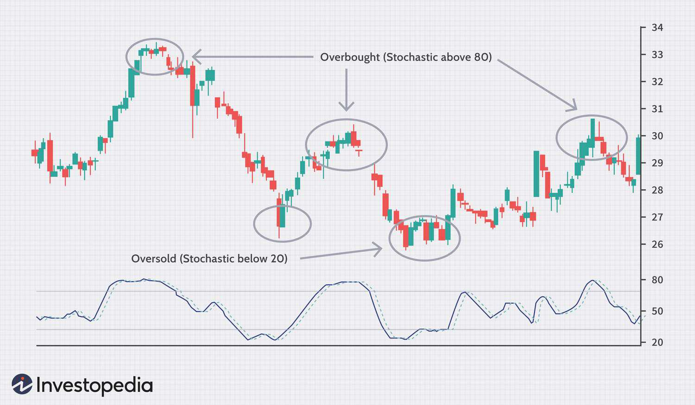

The financial trading landscape is a dynamic and intricate system that plays a pivotal role in the global economy. It encompasses a wide array of markets, instruments, and trading methods, all interconnected to facilitate the buying and selling of financial assets. One of the critical components of this landscape is the currency market, also known as the foreign exchange (Forex) market. The Forex market is the largest and most liquid financial market in the world, with an average daily trading volume exceeding $6 trillion. It serves as a backbone for international trade and investment, influencing global economic patterns by facilitating currency conversion and determining exchange rates.

In recent years, binary options and Forex trading have gained significant popularity among both novice and experienced traders. Binary options, a relatively simplified trading method, offer fixed payouts based on the outcome of a yes/no proposition, such as whether a particular asset will be above a certain price at a given time. This straightforward approach appeals to traders due to its potential for high returns and easy-to-understand mechanics. Forex trading, on the other hand, involves trading currency pairs and is renowned for its leverage, which allows traders to control large positions with comparatively small amounts of capital. Both binary options and Forex trading have experienced growth due to technological advancements, increased accessibility through online platforms, and the lure of potential profits.



Algorithmic trading has emerged as a transformative force in the modern financial markets. By harnessing the power of computer algorithms and quantitative models, traders can execute orders with speed and precision that far outstrips human capabilities. Algorithms can analyze vast datasets, identify market trends, and perform trades based on predefined criteria within milliseconds. The significance of algorithmic trading lies in its ability to enhance market efficiency, reduce transaction costs, and mitigate human error. It has become an integral part of trading strategies utilized by hedge funds, financial institutions, and individual traders alike.

The interconnectedness of the currency market, binary options, Forex trading, and algorithmic trading illustrates a complex synergy that drives today's financial ecosystem. The currency market underpins global financial operations by providing liquidity and facilitating international transactions. Binary options and Forex trading offer diverse avenues for market participation, catering to varying risk appetites and strategic preferences. Algorithmic trading, meanwhile, integrates cutting-edge technology with financial acumen, optimizing trading decisions and execution. Together, these elements shape a trading environment that is continually evolving, presenting both opportunities and challenges to market participants. Understanding these interconnected facets is crucial for navigating the financial trading landscape effectively.

## Table of Contents

## Understanding the Currency Market

The currency market, also known as the foreign exchange market (Forex or FX market), is a global decentralized platform where national currencies are traded. Its primary role is to facilitate international trade and investment by enabling currency conversion. The market is pivotal in determining exchange rates, impacting global economic stability and growth.

Major currencies such as the U.S. Dollar (USD), Euro (EUR), Japanese Yen (JPY), British Pound (GBP), and Swiss Franc (CHF) dominate trading due to their economic significance and liquidity. These currencies influence global economic dynamics, as exemplified by the USD, which acts as the world's primary reserve currency. Changes in economic conditions, interest rates, and geopolitical events can significantly affect their values, thereby impacting international trade balances and economic policy formulations.

Currency trading operates on the principles of supply and demand, with exchange rates reflecting the relative value of one currency against another. These rates are quoted in currency pairs, such as EUR/USD, where the first currency is the base and the second is the quote. A key mechanism in currency trading involves speculation on the rate movements, which allows traders to profit from fluctuations. The exchange rate $r$ between two currencies can be expressed as:

$$
r = \frac{\text{Value of Base Currency}}{\text{Value of Quote Currency}}
$$

Participants in the currency market include a wide array of players. Banks are the largest stakeholders, facilitating currency conversions for corporations and engaging in speculative trading. Governments and central banks play pivotal roles, often intervening to stabilize or influence their currency's value to maintain economic competitiveness. For example, the Federal Reserve may adjust interest rates to control inflation, indirectly affecting the USD exchange rate.

Individual traders, ranging from novice investors to professional fund managers, also participate, often leveraging Forex platforms to execute trades. These traders contribute to the daily currency turnover, which surpasses $6 trillion according to the Bank for International Settlements.

In summary, the currency market is an integral component of global finance, influencing economic policies and facilitating international commerce. Its complexities are mirrored in the diverse range of currencies and participants, making it a dynamic and constantly evolving sector.

## Binary Options: A Simplified Trading Method

Binary options are a type of financial derivative that offer traders a simple, yet structured way to speculate on various financial markets. They function by providing two possible outcomes based on whether the price of an underlying asset will be above or below a specified level at a predetermined time. This mechanism allows traders to place 'yes' or 'no' wagers on market movements, leading to the term 'binary'.

### Appeal to Traders

Binary options are particularly appealing to both novice and experienced traders due to their straightforward nature. Novice traders are drawn to the simplicity and clarity these instruments offer, enabling them to engage in market activities without the complexity often associated with traditional trading. With minimal experience, a trader can predict whether an asset's price will rise or fall, making binary options an accessible entry point into financial trading.

Experienced traders value binary options for their potential to quickly realize profits on short-term market movements. These options can be used to hedge other investments, manage risk in volatile markets, or as a speculative tool in a diversified trading strategy. The predefined risk and reward structure simplifies decision-making, as the potential loss and gain are known upfront.

### Risks and Rewards

While binary options offer a clear risk-reward profile, they encompass significant risks. The potential to lose the entire investment on a single, incorrect prediction is a stark reality. However, the appeal lies in the possibility of high returns on successful trades, often ranging from 60-90% of the staked amount, depending on the broker and specific contract conditions.

Traders must understand the speculative nature of these instruments, as well as the rapid timing required for execution, which can often compress to seconds in some contracts. This speed exacerbates risk, particularly for those unfamiliar with the nuances of market indicators and strategies.

### Regulatory Considerations

The regulation and legality of binary options trading vary significantly across different regions. In jurisdictions such as the United States, binary options trading is closely regulated by entities like the Commodity Futures Trading Commission (CFTC) to protect investors from fraudulent practices. Certain platforms are approved and monitored, providing a layer of security to traders.

Conversely, in the European Union, binary options have faced stricter regulations, including bans and tight restrictions due to concerns about their speculative nature and the potential for consumer loss. Countries such as Belgium and France have issued outright bans, while others like the United Kingdom have imposed regulatory requirements to increase transparency and protect traders.

Traders considering binary options must ensure compliance with regional laws and engage with licensed and reputable brokers. Understanding the legal landscape is crucial to avoiding illicit operations and safeguarding investments.

## The Dynamics of Forex Trading

Forex trading, also known as foreign exchange trading, involves the exchange of currencies on a global marketplace. It is a pivotal component of the currency market, with an estimated $6.6 trillion traded daily as of April 2019, according to the Bank for International Settlements (BIS). The significance of Forex trading lies in its contribution to global trade and investment, enabling businesses and governments to convert one currency to another.

At its core, Forex trading involves trading currency pairs, such as EUR/USD or USD/JPY. A currency pair functions as a single unit, where the first currency is the base currency and the second is the quote currency. The exchange rate of a currency pair indicates how much of the quote currency is needed to purchase one unit of the base currency. For example, if the EUR/USD pair is trading at 1.2000, it means 1 Euro can be exchanged for 1.2 US Dollars.

Leverage is a key feature of Forex trading that allows traders to control larger positions with a relatively small amount of capital. It is expressed as a ratio, such as 100:1, which implies that a trader can hold a position worth 100 times their initial investment. While leverage can amplify profits, it also increases the potential for losses, making risk management crucial for traders.

Major Forex trading platforms include MetaTrader 4 (MT4), MetaTrader 5 (MT5), and cTrader. These platforms provide essential tools for traders, such as charting software, technical indicators, and automated trading capabilities. Brokers offer platforms tailored to both beginner and advanced traders, facilitating market analysis and order execution.

Forex traders employ various strategies to capitalize on market fluctuations. Among them, technical analysis is widely used, involving the study of price charts and patterns to predict future movements. Indicators like moving averages, relative strength index (RSI), and Fibonacci retracement levels assist traders in identifying potential entry and [exit](/wiki/exit-strategy) points.

Fundamental analysis, another key strategy, involves assessing economic indicators, such as interest rates, inflation, and employment data, to gauge currency valuation. Traders often follow central bank announcements and geopolitical events, as these can have significant impacts on currency prices.

Finally, price action trading focuses on interpreting raw price movements without relying on indicators. It emphasizes the use of support and resistance levels, trend lines, and candlestick patterns to make trading decisions.

In summary, Forex trading is a dynamic marketplace integral to the global financial system. Its mechanics, platforms, and strategies collectively offer traders opportunities to profit, albeit with risks that require careful management and strategy implementation.

## Algo Trading: Revolutionizing Financial Markets

Algorithmic trading, often referred to as algo trading, is a pivotal development in modern financial markets. It utilizes pre-programmed software to automate trading processes, allowing for rapid execution of orders and enabling traders to exploit market inefficiencies. This approach has fundamentally transformed trading practices, offering heightened speed and efficiency compared to manual trading.

One of the primary advantages of algo trading is its ability to execute trades at unprecedented speeds. Algorithms can scan and analyze an array of market variables in real-time, making it possible to execute thousands of trades in seconds. This speed is crucial in contemporary markets, where price changes can occur in fractions of a second. Additionally, algo trading mitigates the risk of human error and emotional decision-making, leading to more consistent and objective trading outcomes.

The technology underpinning [algorithmic trading](/wiki/algorithmic-trading) is sophisticated, often encompassing advancements in [artificial intelligence](/wiki/ai-artificial-intelligence) (AI) and [machine learning](/wiki/machine-learning). These technologies enable the development of complex models that can predict market trends and optimize trading strategies. AI systems can learn from vast datasets, recognizing patterns and adapting to new market conditions with precision. Python, a popular programming language in the quantitative finance sector, is frequently used for developing and implementing trading algorithms due to its extensive libraries like NumPy, pandas, and TensorFlow, which facilitate data analysis and machine learning.

Despite its numerous benefits, algorithmic trading presents several challenges and ethical considerations. One significant challenge is the risk of systemic errors. If an algorithm malfunctions, it can lead to significant losses in a very short time. Additionally, the reliance on historical data to train algorithms may not always account for unprecedented market conditions, leading to potential inaccuracies in prediction and strategy execution.

Ethical considerations revolve around the impact of high-frequency trading (a subset of algorithmic trading) on market stability. This type of trading can create [volatility](/wiki/volatility-trading-strategies), as it often amplifies market movements. There are also concerns about market fairness, as traders with sophisticated algorithms could potentially exploit market inefficiencies to the detriment of other participants.

In conclusion, algorithmic trading is revolutionizing financial markets by providing a level of speed and efficiency unmatched by manual trading. However, the technology requires careful management to avoid systemic risks and ethical pitfalls, and it calls for ongoing development of robust models to handle dynamic market conditions.

## The Intersection of Binary Options, Forex, and Algo Trading

Binary options and Forex trading have become integral parts of the financial trading ecosystem, attracting traders due to their potential for short-term profits and dynamic market engagement. The incorporation of algorithmic trading into these domains leverages technology to augment trading strategies, optimize decision-making, and manage risks more effectively.

The enhancement of binary options and Forex trading through algorithmic systems lies in the automation of complex decision-making processes. Algorithms can process vast amounts of market data at unprecedented speeds, identifying patterns and executing trades much faster than human traders. For instance, in Forex trading, algorithms can analyze currency pair movements and macroeconomic indicators, forecasting price changes and executing trades based on pre-set criteria. This automation reduces the emotional component of trading, ensuring a more disciplined and objective approach.

Technical integration involves the development of sophisticated trading algorithms that combine binary options and Forex strategies. In Python, such integration might utilize libraries like NumPy for numerical computation, pandas for data manipulation, and scikit-learn for machine learning modeling. For example, a simple moving average crossover strategy—a popular Forex trading technique—could be employed in a binary options algorithm to decide call or put options based on currency price trends. A basic implementation might involve calculating moving averages and using them to trigger trade decisions:

```python
import pandas as pd
import numpy as np

# Example data
data = pd.DataFrame({'price': [1.301, 1.305, 1.306, 1.308, 1.310, 1.309]})

# Calculate moving averages
data['short_ma'] = data['price'].rolling(window=2).mean()
data['long_ma'] = data['price'].rolling(window=3).mean()

# Generate signals
data['signal'] = np.where(data['short_ma'] > data['long_ma'], 1, 0)
```

This simple script calculates short and long moving averages and generates a buy signal when the short-term MA is above the long-term MA. In binary options trading, a similar approach might help in predicting price movements within the expiration period of the option, thereby increasing the chances of profitable trades.

Case studies have shown successful integration of algorithms in both Forex and binary options trading. The "Bumblebee AX" algorithm, for example, synthesizes predictive analytics with automated trading strategies to optimize returns from currency trades. This algorithm uses machine learning to constantly refine its predictive models based on historical data and real-time analytics, yielding impressive results for both binary options and Forex trades.

The future of these markets lies heavily in advanced computational techniques such as artificial intelligence (AI) and machine learning. As algorithms become more sophisticated, they are expected to integrate tools like natural language processing (NLP) to interpret market news and sentiment, impacting trade decisions. Additionally, developments in blockchain technology may offer enhanced security and transparency in executing algorithmic trades.

Overall, the melding of binary options, Forex trading, and algorithmic strategies represents a new frontier in trading, characterized by enhanced efficiency, speed, and the potential for higher returns. Traders and developers alike are urged to keep abreast of technological advancements and harness these tools to remain competitive in an ever-evolving market landscape.

## Conclusion

The landscape of financial trading is rapidly evolving, driven by the adoption of new technologies and innovative trading methodologies. In this article, we've explored the crucial aspects of currency markets, binary options, Forex trading, and algorithmic trading, and how they intertwine to shape the modern trading environment. Each element plays a vital role in the global economy, influencing [liquidity](/wiki/liquidity-risk-premium), market dynamics, and investment strategies.

As trading continues to evolve, embracing technologies like algorithmic trading offers distinct advantages, such as increased speed, efficiency, and accuracy. Algorithms can process vast amounts of data in milliseconds, identify trading opportunities, and execute trades without human intervention, allowing traders to capitalize on even the smallest market fluctuations. For traders looking to integrate these methods, beginning with a solid understanding of the mechanics of each trading form is essential. Beginners can start with simulation tools and demo accounts offered by major trading platforms to test strategies without financial risk.

Staying informed about market trends and technological advancements is crucial in navigating the future of trading. Strategies that are effective today may need adaptation or reinvention tomorrow as new technologies emerge and markets evolve. Continuous learning through financial news, market analysis, and education resources is imperative for traders wishing to maintain an edge. By embracing innovation and remaining vigilant about changes and developments, traders can enhance their skill set, optimize their trading strategies, and ultimately achieve greater success in an ever-evolving marketplace.

## References & Further Reading

[1]: Bank for International Settlements. (2019). ["Triennial Central Bank Survey: Foreign exchange turnover in April 2019."](https://www.bis.org/statistics/rpfx19_fx.pdf)

[2]: Stevens, A. (2018). ["Algorithmic Trading: The Basics and the Best Practices."](https://fsc.stevens.edu/fe670-algorithmic-trading-strategies/) Nasdaq.

[3]: Forbes, N. (2016). ["The Complete Guide to the Forex Market."](https://www.forbes.com/sites/schifrin/2015/12/10/forbes-2016-investment-guide-5-must-reads/) Forbes.

[4]: Commodity Futures Trading Commission. ["Binary Options Fraud."](https://www.cftc.gov/PressRoom/PressReleases/8231-20)

[5]: Lopez de Prado, M. (2018). ["Advances in Financial Machine Learning"](https://www.amazon.com/Advances-Financial-Machine-Learning-Marcos/dp/1119482089) by Marcos Lopez de Prado.

[6]: Chan, E.P. (2009). ["Quantitative Trading: How to Build Your Own Algorithmic Trading Business"](https://github.com/ftvision/quant_trading_echan_book) by Ernest P. Chan.

[7]: Binary Options Regulations. ["Regulatory Frameworks around the World."](https://www.binaryoptions.com/countries/)