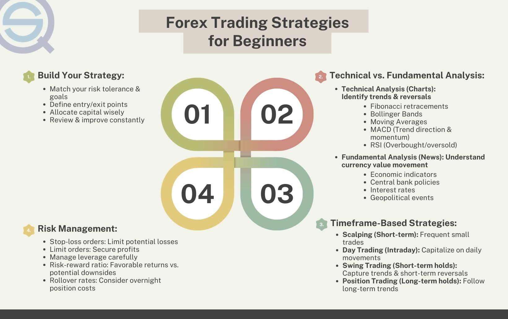

## Table of Contents

## What is Forex trading and why is it important?

Forex trading, short for foreign exchange trading, is when people buy and sell different currencies from around the world. It's like trading money from one country for money from another country. For example, you might trade US dollars for Euros. This happens all the time because people need different currencies for travel, business, or investments.

Forex trading is important because it helps the world's economy run smoothly. When people and businesses trade currencies, it makes it easier for them to buy things from other countries. This can help grow businesses and create jobs. Also, the forex market is huge and always open, so it's a big part of how global money moves around.

## How does the Forex market operate and who are the main participants?

The Forex market operates through a global network of banks, brokers, and traders who buy and sell currencies around the clock, except for weekends. It's not like a traditional stock exchange with a physical location; instead, it's a decentralized market where transactions happen electronically over-the-counter (OTC). This means that currency trading happens directly between two parties, usually through trading platforms provided by brokers. The market is open 24 hours a day because there are always different parts of the world where it's daytime, starting from the opening of the market in Australia and moving through Asia, Europe, and then North America.

The main participants in the Forex market are banks, which handle a large volume of transactions for their clients and for their own trading desks. These banks are often called market makers because they provide the liquidity needed for the market to function. Other important participants include central banks, which can influence currency values through monetary policy and interventions. Then there are businesses that need to convert currencies for international trade, hedge funds and other investment firms looking to profit from currency movements, and individual retail traders who trade through brokers. All these participants help make the Forex market the largest and most liquid financial market in the world.

## What are the basic concepts and terminology used in Forex trading?

In Forex trading, you'll hear terms like 'currency pair,' which is when you trade one currency for another. For example, if you trade US dollars for Euros, you're dealing with the EUR/USD pair. The first currency in the pair is called the 'base currency,' and the second is the 'quote currency.' The 'exchange rate' tells you how much of the quote currency you need to buy one unit of the base currency. If the exchange rate for EUR/USD is 1.20, it means you need 1.20 US dollars to buy one Euro. 'Pips' are the smallest price move that a currency pair can make, usually the fourth decimal place in most pairs. If the EUR/USD moves from 1.2000 to 1.2001, that's a one pip move.

Another important concept is 'leverage,' which lets traders control a large position with a small amount of money. It's like borrowing money to trade more than you could with just your own funds, but it can also increase your losses. 'Margin' is the money you need to put up to open a leveraged position. 'Bid' and 'ask' prices are also key; the 'bid' is the price at which you can sell the base currency, and the 'ask' is the price at which you can buy it. The difference between these two prices is called the 'spread,' and it's how brokers make money. Finally, 'long' and 'short' positions refer to whether you're betting that a currency will go up (long) or down (short) in value.

## What are the different types of Forex trading accounts and which one should a beginner start with?

There are different types of Forex trading accounts, and each one is suited for different kinds of traders. The main types are standard accounts, mini accounts, and micro accounts. A standard account usually requires a larger minimum deposit and allows you to trade in larger lot sizes, which means you can make bigger trades. A mini account lets you trade in smaller lot sizes and usually needs a smaller minimum deposit than a standard account. A micro account is even smaller, with the smallest lot sizes and the lowest minimum deposit, making it easier for new traders to start.

For a beginner, the best type of account to start with is usually a micro account. This is because it lets you trade with very small amounts of money, so you can learn without risking a lot. It's a good way to get used to how the Forex market works without feeling too much pressure. Once you get more comfortable and confident, you can move to a mini or standard account if you want to trade with more money.

## How can one select a reliable Forex broker?

Choosing a reliable Forex broker is important for a safe trading experience. Start by checking if the broker is regulated by a well-known financial authority, like the FCA in the UK or the NFA in the US. Regulation helps make sure the broker follows rules and keeps your money safe. Also, look at reviews and ratings from other traders to see if they had good experiences. It's a good idea to read what people say on different websites to get a full picture.

Another thing to think about is the trading platform the broker uses. A good platform should be easy to use and work well without problems. It should also have tools that help you make smart trades, like charts and analysis tools. Also, see if the broker offers good customer support. You might need help, so it's nice to know you can reach someone who can answer your questions quickly. Lastly, think about the fees and costs. Some brokers charge more than others, so pick one with fair prices that fit your budget.

In summary, a reliable Forex broker should be regulated, have good reviews, offer a user-friendly platform, provide helpful customer support, and have reasonable fees. By looking at these things, you can find a broker that will help you trade safely and effectively.

## What are the key technical analysis tools used in Forex trading?

In Forex trading, technical analysis tools help traders understand and predict how currency prices might move. One of the most popular tools is the moving average, which smooths out price data to show trends over time. Traders use different types of moving averages, like the simple moving average (SMA) and the exponential moving average (EMA), to spot trends and possible entry or exit points for trades. Another important tool is the Relative Strength Index (RSI), which measures how fast and how much a currency's price has changed to see if it's overbought or oversold. This can help traders decide if it's a good time to buy or sell. Candlestick charts are also widely used because they show price movements in a way that's easy to read, helping traders spot patterns like doji, hammer, and engulfing patterns.

Another key tool in technical analysis is the Fibonacci retracement, which helps traders find potential support and resistance levels based on the idea that markets move in predictable patterns. By drawing lines at the key Fibonacci levels of 23.6%, 38.2%, 50%, 61.8%, and 100%, traders can see where prices might bounce back or break through. Bollinger Bands are also useful because they show how much a currency's price is moving around its moving average. When the bands get closer together, it might mean the price will soon move a lot, and when they're far apart, it might mean the price will calm down. All these tools help traders make better guesses about where prices are headed and when to make their moves.

## What are the fundamental analysis factors that influence Forex markets?

Fundamental analysis in Forex trading looks at the big things that can change how much a country's money is worth. Things like a country's economy, its interest rates, and even big news can make a currency go up or down. For example, if a country's economy is doing well, more people might want to buy its money, making it worth more. On the other hand, if a country's economy is struggling, its money might become less valuable. Interest rates are also important because if a country raises its rates, it can attract more money from investors looking for a good return, pushing the currency's value up.

Another big factor is what the government and the central bank are doing. If a government makes rules that help the economy grow, or if the central bank does things like changing interest rates or buying and selling its own currency, it can have a big effect on the Forex market. News events, like elections or natural disasters, can also shake things up quickly. Traders keep an eye on these things because they can help them guess which way a currency might go. By understanding these big influences, traders can make smarter choices about when to buy or sell different currencies.

## How do leverage and margin work in Forex trading, and what are the risks involved?

In Forex trading, leverage lets you control a big amount of money with just a little bit of your own. It's like borrowing money from your broker to trade more than you could with just what you have. The amount you need to put up to open a leveraged position is called margin. For example, if you have a 1:100 leverage, you can control $100,000 with just $1,000 of your own money. This can make your profits bigger if the trade goes your way, but it can also make your losses bigger if it doesn't.

The main risk with leverage and margin is that you can lose more money than you put in. If the market moves against you, your losses can grow fast because you're trading with borrowed money. If your losses get too big, you might get a margin call, which means you need to put in more money or your broker might close your position to cover the losses. This can be stressful and lead to big financial problems if you're not careful. It's important to understand these risks and use leverage wisely, maybe starting with smaller amounts until you get the hang of it.

## What are some common Forex trading strategies for beginners and how can they be implemented?

One common Forex trading strategy for beginners is the trend-following strategy. This means you try to find out if a currency is going up or down and then trade in that direction. You can use tools like moving averages to see the trend. For example, if the price of a currency is above its moving average, it might be going up, so you could buy it, hoping to sell it later at a higher price. If the price is below the moving average, it might be going down, so you could sell it, hoping to buy it back later at a lower price. To use this strategy, you need to watch the market closely and be patient, waiting for clear signs of a trend before you make a trade.

Another strategy beginners might try is the breakout strategy. This is when you watch for the price to move past a certain point, called a resistance or support level. If the price breaks above resistance, it might keep going up, so you could buy it. If it breaks below support, it might keep going down, so you could sell it. To use this strategy, you need to find these key levels on a chart and then wait for the price to move past them. It's important to set clear rules for when you'll enter and exit trades, and always use stop-loss orders to limit your losses if the price moves against you. Both of these strategies can help beginners make smart trades, but they need practice and careful planning to work well.

## How can one develop and test a Forex trading strategy?

To develop a Forex trading strategy, you first need to decide what you want to achieve and how much risk you're willing to take. Think about if you want to make quick trades or hold onto currencies for a longer time. You might want to use a strategy like trend-following, where you buy when the price is going up and sell when it's going down, or a breakout strategy, where you trade when the price moves past a certain point. Once you have an idea, write down clear rules for when you'll enter a trade, when you'll get out, and how much you're willing to lose. This helps you stick to your plan and not make decisions based on feelings.

After you have your strategy, you need to test it to see if it works. A good way to do this is by using a demo account, where you can trade with fake money. This lets you try out your strategy without risking real money. You can also use historical data to see how your strategy would have done in the past. This is called backtesting. Pay attention to how well your strategy does over time and in different market conditions. If it doesn't work well, you might need to change your rules or try a different approach. Testing your strategy carefully helps you understand if it's likely to make money when you start trading for real.

## What are advanced Forex trading techniques such as algorithmic trading and how do they work?

Algorithmic trading in Forex is when you use a computer program to make trades automatically. Instead of you deciding when to buy or sell a currency, the program does it for you based on rules you set up. These rules can be based on things like price movements, trends, or even news events. The program can watch the market all the time and make trades much faster than a person could. This can help you make more trades and maybe even make more money, but it also needs a lot of planning and testing to make sure the program works well.

One popular type of algorithmic trading is called high-frequency trading (HFT). This is when the program makes a lot of trades very quickly, sometimes in just a few seconds. The idea is to take advantage of tiny price changes that happen all the time. Another type is called automated trend-following, where the program looks for trends in the market and makes trades based on those trends. To use algorithmic trading, you need to know how to code or work with someone who does. You also need to keep an eye on your program and update it to make sure it keeps working well as the market changes.

## How can one manage risk and maintain discipline in Forex trading?

Managing risk and maintaining discipline in Forex trading is super important if you want to be successful. One way to manage risk is by using stop-loss orders, which automatically close your trade if the price moves against you by a certain amount. This helps you limit how much money you could lose on a single trade. Another way is by not using too much leverage. Leverage lets you trade with more money than you have, but it can also make your losses bigger, so it's smart to use it carefully. It's also a good idea to only risk a small part of your trading money on any one trade, like 1% to 2%. This way, even if you lose, you still have plenty of money left to keep trading.

Staying disciplined means sticking to your trading plan and not letting your feelings control your decisions. Before you start trading, make a clear plan that says when you'll enter and exit trades, how much you're willing to risk, and what strategies you'll use. Then, stick to that plan no matter what. It can be tempting to make trades based on feelings like fear or excitement, but that often leads to bad decisions. Keeping a trading journal can help you stay disciplined. Write down your trades, what you were thinking, and what happened. This helps you learn from your mistakes and see if you're sticking to your plan. Over time, good risk management and discipline will help you become a better trader.

## What is Risk Management in Forex Trading?

Risk management is crucial in forex trading as it ensures the protection of capital and supports sustainable profitability over the long term. Effective risk management strategies are designed to minimize potential losses and optimize gains. Implementing stop-loss and take-profit orders is a fundamental aspect of these strategies. A stop-loss order automatically closes a trade at a predetermined price, preventing further losses beyond a trader's risk tolerance. Conversely, a take-profit order locks in profits by closing a trade when it reaches a specified favorable price level.

To illustrate, consider a forex trading scenario where a trader buys a currency pair at 1.2000. If the trader wishes to cap potential losses to 50 pips, a stop-loss order is set at 1.1950. Similarly, if the target profit is 100 pips, the take-profit order is set at 1.2100. This predefined approach helps manage emotions and reduces impulsive decisions during volatile market conditions.

Diversification is another vital component of risk management. By spreading investments across various trading strategies or currency pairs, traders can mitigate the impact of adverse movements in any single asset. This approach reduces correlation risk, where simultaneous downturns in correlated currencies could lead to significant losses.

Flexibility and adaptability are essential in risk management, given the dynamic nature of the forex market. Traders must be prepared to adjust their strategies in response to market changes, such as geopolitical events or economic reports that impact currency valuations. Regularly reviewing and updating risk management plans ensures they remain aligned with current market conditions and personal trading goals.

Moreover, risk management extends to the use of appropriate leverage, as excessive leverage can amplify losses. Maintaining a conservative leverage ratio helps manage exposure and preserve capital. The formula for calculating leverage is:

$$
\text{Leverage Ratio} = \frac{\text{Total Value of Open Positions}}{\text{Account Equity}}
$$

A leverage ratio higher than a trader's risk tolerance may necessitate reducing the size of trades or increasing account equity to maintain a sustainable risk profile.

In conclusion, robust risk management in forex trading involves a combination of strategic planning, diversification, and adaptability. By incorporating tools like stop-loss and take-profit orders, diversifying strategies, and maintaining appropriate leverage, traders can protect their capital and strive for long-term profitability in the forex market.

## References & Further Reading

[1]: Bergstra, J., Bardenet, R., Bengio, Y., & Kégl, B. (2011). ["Algorithms for Hyper-Parameter Optimization."](https://dl.acm.org/doi/10.5555/2986459.2986743) Advances in Neural Information Processing Systems 24.

[2]: ["Advances in Financial Machine Learning"](https://www.amazon.com/Advances-Financial-Machine-Learning-Marcos/dp/1119482089) by Marcos Lopez de Prado

[3]: ["Evidence-Based Technical Analysis: Applying the Scientific Method and Statistical Inference to Trading Signals"](https://www.amazon.com/Evidence-Based-Technical-Analysis-Scientific-Statistical/dp/0470008741) by David Aronson

[4]: ["Machine Learning for Algorithmic Trading"](https://github.com/stefan-jansen/machine-learning-for-trading) by Stefan Jansen

[5]: ["Quantitative Trading: How to Build Your Own Algorithmic Trading Business"](https://www.amazon.com/Quantitative-Trading-Build-Algorithmic-Business/dp/1119800064) by Ernest P. Chan