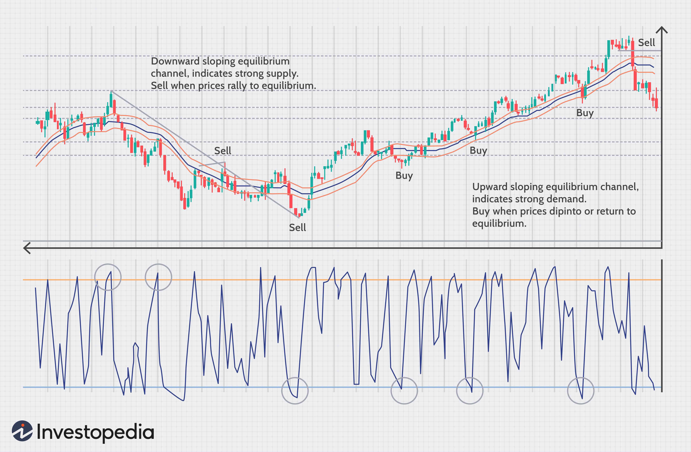

In the dynamic world of Forex trading, understanding market stages and trends is crucial for success. Forex trading, the global marketplace for buying and selling currencies, is influenced by a myriad of economic, political, and social factors that lead to fluctuating exchange rates. As the market evolves through various stages and trends, traders must possess a keen insight into these movements to execute trades effectively.

Algorithmic trading, often referred to as algo trading, has transformed the Forex industry by automating the process of making trading decisions through sophisticated algorithms. These algorithms are designed to analyze vast datasets and execute trades at speeds unattainable by human traders. The adoption of algo trading has introduced a level of precision and efficiency that significantly enhances trading operations.



This article explores the synergy between market stages, trend analysis, and algo trading in the Forex market. Market stages, which include phases such as accumulation, markup, distribution, and markdown, offer valuable insights into potential entry and exit points for traders. Understanding these stages helps traders anticipate market movements and adjust their strategies accordingly.

Trends in Forex trading influence the formulation of strategies by offering clues about the ongoing direction of currency movements. Trend analysis tools, such as moving averages and momentum indicators, assist traders in forecasting currency price behaviors. By aligning strategy with observed trends, traders can potentially limit risks and enhance profitability.

The integration of algorithmic trading with market stage and trend analysis further enhances decision-making processes. Algorithms can automate the identification of market stages and adjust strategies in real-time, reducing the influence of emotional biases and improving trading consistency. As a result, traders gain the ability to process vast amounts of data quickly, maintaining a competitive edge in the fast-paced Forex market.

Understanding market stages and trends, coupled with the strategic application of algo trading, positions traders for greater success in Forex trading. Consequently, a comprehensive understanding of these components is vital for navigating and thriving in this technologically driven financial landscape.

## Table of Contents

## Understanding Market Stages in Forex Trading

Forex markets are characterized by distinctive stages that reflect the phases of market sentiment and price movement. Recognizing these stages—accumulation, markup, distribution, and markdown—can significantly enhance a trader's ability to make informed decisions regarding entry and [exit](/wiki/exit-strategy) points.

The accumulation stage is the phase where informed investors, often referred to as "smart money," begin to analyze and accrue positions. During this stage, the price of a currency remains relatively stable, and [volume](/wiki/volume-trading-strategy) may increase subtly as these savvy investors establish their positions. This stage often serves as a precursor to trend reversals, as the careful purchase of assets by the smart money provides early signals of potential upward movements.

Once sufficient accumulation has occurred, the market transitions to the markup stage. In this phase, the currency experiences increased buying activity, which leads to a noticeable rise in its price. The driving force behind this stage is the broadening recognition of the currency's value, attracting more investors to the market. This increase in demand typically propels the price upward, signaling an ongoing bullish trend. 

The distribution stage follows and is characterized by a slowdown in the upward [momentum](/wiki/momentum). During this phase, the smart money begins to offload their positions, leading to spikes in [volatility](/wiki/volatility-trading-strategies). The trend starts to show signs of exhaustion, often indicated by fluctuations in price with relatively high volume as the invested parties aim to maximize their returns. Traders must remain vigilant during this stage, as it sets the stage for an impending reversal.

Finally, the markdown phase emerges when sellers gain control, and the price of the currency begins to decline. This bearish trend is marked by a systematic decrease in price levels, driven by widespread selling pressure. In this phase, traders who recognize the trend early can strategically position themselves to either capitalize on the declining market or protect their investments from further losses.

By understanding these market stages, traders can develop strategies that accurately anticipate changes in market conditions, thereby improving their ability to maximize profits and minimize risks.

## Trend Analysis: A Cornerstone of Forex Trading

Trend analysis is a critical component of Forex trading, primarily due to its predictive ability to infer future price movements based on historical data. This analysis serves as a guide for understanding the directional trends of currency pairs, which are vital in identifying potential trading opportunities and making informed decisions.

At its core, trend analysis is fundamental in determining the stages of the Forex market. These stages are often categorized into three primary types: uptrends, downtrends, and sideways (or range-bound) trends. By identifying these patterns, traders align their strategies to capitalize on price movements rather than work against them. This alignment is achieved through integrating both technical and [fundamental analysis](/wiki/fundamental-analysis), providing a comprehensive approach to trend evaluation.

Forex traders employ a range of tools and techniques in trend analysis. Among the most commonly used are moving averages, which help smooth out price data to identify the direction over a specific period. The simple moving average (SMA) and the exponential moving average (EMA) are frequently utilized, with EMA giving more weight to recent prices, thus reacting more significantly to recent price changes.

Trend lines, another essential tool, are drawn to connect successive higher lows in an uptrend or lower highs in a downtrend. Such visual aids enable traders to identify patterns and potential [breakout](/wiki/breakout-trading) points. Momentum indicators, such as the Relative Strength Index (RSI) and the Moving Average Convergence Divergence (MACD), further enrich trend analysis by measuring the speed and change of price movements. These tools help in assessing whether a currency is overbought or oversold, which can signal potential reversal points.

Accurate trend analysis significantly influences trading strategy development. By forecasting currency movements, traders are better equipped to devise strategies that align with the current market direction. This proactive approach allows traders to set entry and exit points more precisely, optimizing trade outcomes by adapting to market conditions.

Identifying the underlying direction of a trend is not merely about potential profit; it also serves as a risk management tool. By trading in the direction of the trend, traders can minimize exposure to adverse price movements. This alignment with the prevailing trend reduces the likelihood of experiencing significant losses and enhances overall profitability.

In summary, trend analysis is indispensable for Forex trading, providing insight into future market behavior and aiding in the formulation of effective trading strategies. By employing analytical tools such as moving averages, trend lines, and momentum indicators, traders can extract valuable information from historical price data, limit risks, and optimize profitability in a dynamic trading environment.

## The Role of Algorithmic Trading in Forex

Algorithmic trading, commonly referred to as algo trading, utilizes advanced technological solutions to execute trades with a speed and volume that surpass human capabilities. This method has become a transformative force in the Forex market by automating the complex processes of trade analysis and decision-making. By employing sophisticated algorithms, traders can analyze market stages and trends more efficiently, resulting in enhanced trading strategies and improved financial outcomes.

Forex algorithms primarily rely on statistical models and [machine learning](/wiki/machine-learning) techniques to generate trading signals. These tools analyze historical and real-time data to identify trading opportunities, often using indicators like moving averages, momentum indicators, and trend lines. Machine learning techniques, such as supervised learning methods, can be applied to predict currency price movements based on past patterns. For instance, algorithms might employ regression models to forecast future price changes or use classification models to determine whether a market is in a bullish or bearish phase.

One of the key advantages of algo trading lies in its ability to manage risks and optimize trade execution. Forex algorithms constantly monitor market conditions, adjusting trading parameters based on real-time data to minimize potential losses. They can incorporate risk management strategies like stop-loss orders or take-profit orders to ensure that trades are executed within predefined risk thresholds. This allows for more consistent trading performance, as the algorithm can swiftly respond to abrupt market changes without human intervention.

Additionally, by eliminating emotional biases, algo trading enables traders to adhere to well-defined trading strategies. Human traders are often influenced by emotions such as fear and greed, which can lead to irrational decision-making. Algo trading mitigates this by strictly following programmed instructions, ensuring that trades are executed according to the pre-established strategy regardless of market volatility.

To summarize, the integration of [algorithmic trading](/wiki/algorithmic-trading) in Forex offers numerous benefits, including enhanced speed and volume of trade execution, improved risk management, and the elimination of emotional biases. As technology continues to advance, the role of algorithmic trading in Forex is expected to expand further, offering traders more sophisticated tools to navigate the complexities of the global currency markets.

## Integrating Market Stages and Algo Trading

Successful integration of market stage analysis with algorithmic trading necessitates a deep understanding of both market dynamics and technological proficiency. This integration is key for traders to capitalize effectively on Forex market opportunities.

The ability of algorithms to accurately identify and adapt to different market stages is critical. Market stages—accumulation, markup, distribution, and markdown—come with their own set of characteristics and behaviors that algorithms must recognize. By embedding specific rules and patterns that correspond to each stage, traders can ensure that the algorithms respond appropriately to market signals. For instance, during the accumulation phase, algorithms can be programmed to detect subtle signs of accumulation, such as increased volume without a significant price change, using volume-weighted moving averages or other technical indicators.

Dynamic adjustment of algorithmic parameters is another essential component. As market stages transition, the parameters governing algorithmic trading strategies must also adapt to maintain performance. This can involve recalibrating thresholds for entry and exit signals or adjusting risk tolerance settings. In Python, such dynamic adjustments can be implemented as follows:

```python
def adjust_parameters(stage, parameters):
    if stage == 'accumulation':
        parameters['entry_threshold'] = 0.02
    elif stage == 'markup':
        parameters['trailing_stop'] = 0.03
    elif stage == 'distribution':
        parameters['exit_threshold'] = 0.05
    elif stage == 'markdown':
        parameters['stop_loss'] = 0.01
    return parameters
```

Risk management protocols are paramount, particularly in navigating volatile market phases. Algorithms should be equipped with robust risk management strategies that include stop-loss orders, position sizing, and diversification to mitigate potential losses. Implementing such protocols can be the difference between sustained profitability and significant loss during unpredictable market conditions.

Continuous refinement of algorithms is crucial for developing adaptive trading systems. This involves [backtesting](/wiki/backtesting) strategies against historical data, iterating on the algorithm design, and employing machine learning techniques to enhance predictive capabilities. By doing so, traders create algorithms that evolve with the market, adjusting to new patterns and anomalies.

In summary, the successful combination of market stage analysis with algorithmic trading hinges on precise recognition of market phases, dynamic adaptation of algorithmic parameters, rigorous risk management, and continuous enhancement of trading systems. This synergy empowers traders to harness the full potential of both market analysis and technological advancement, optimizing their overall trading strategy in the Forex market.

## Conclusion

Market stages and trend analysis play a vital role in successful Forex trading, particularly when complemented by algorithmic trading. A robust grasp of market dynamics allows traders to devise strategies that are responsive to shifts in market trends. This adaptability ensures that traders can anticipate movements and position themselves advantageously. Algorithmic trading further augments these strategies by offering unmatched precision and speed, coupled with the ability to handle and analyze vast quantities of data that would be unmanageable manually. 

As the Forex market continues to develop, the combination of market stage analysis with advanced algorithmic techniques will remain essential to sophisticated trading methodologies. This synergy not only facilitates more accurate predictions of market trends but also provides a systematic framework for executing trades efficiently. Therefore, traders are encouraged to continuously educate themselves about emerging technologies and market theories to refine their trading systems. By doing so, they will maintain a competitive edge in a landscape that is increasingly shaped by technological advancements and data-driven decisions.

## References & Further Reading

[1]: Bergstra, J., Bardenet, R., Bengio, Y., & Kégl, B. (2011). ["Algorithms for Hyper-Parameter Optimization."](https://proceedings.neurips.cc/paper/2011/file/86e8f7ab32cfd12577bc2619bc635690-Paper.pdf) Advances in Neural Information Processing Systems 24.

[2]: ["Advances in Financial Machine Learning"](https://www.amazon.com/Advances-Financial-Machine-Learning-Marcos/dp/1119482089) by Marcos Lopez de Prado

[3]: ["Evidence-Based Technical Analysis: Applying the Scientific Method and Statistical Inference to Trading Signals"](https://www.amazon.com/Evidence-Based-Technical-Analysis-Scientific-Statistical/dp/0470008741) by David Aronson

[4]: ["Machine Learning for Algorithmic Trading"](https://github.com/stefan-jansen/machine-learning-for-trading) by Stefan Jansen

[5]: ["Quantitative Trading: How to Build Your Own Algorithmic Trading Business"](https://www.amazon.com/Quantitative-Trading-Build-Algorithmic-Business/dp/1119800064) by Ernest P. Chan