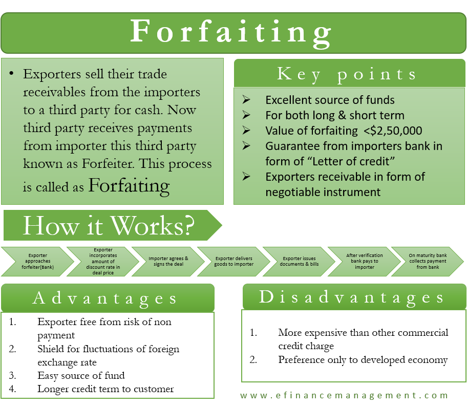

## Table of Contents

## What is forfaiting?

Forfaiting is a way for businesses to get money quickly by selling their future payments from exports. Imagine a company in one country sells goods to a buyer in another country. Instead of waiting to get paid over time, the company can sell these future payments to a bank or a forfaiter right away. The forfaiter then collects the money from the buyer when it's due.

This method helps businesses manage their cash flow better because they don't have to wait for payments that might take months or even years. It's especially useful for companies doing business internationally, where getting paid can be tricky. By using forfaiting, a company can focus on making and selling more products without worrying about when they will get paid.

## How does the forfaiting process work?

When a company wants to use forfaiting, it starts by making a deal to sell its products to a buyer in another country. Instead of waiting for the buyer to pay over time, the company goes to a forfaiter, which is usually a bank or a special financial company. The company sells the future payments it will get from the buyer to the forfaiter. The forfaiter gives the company money right away, but it's less than what the buyer will pay in total because the forfaiter needs to make a profit.

After the company gets the money from the forfaiter, it's the forfaiter's job to collect the payments from the buyer when they are due. The forfaiter takes on the risk that the buyer might not pay, so they check the buyer's creditworthiness before agreeing to the deal. This way, the company doesn't have to worry about getting paid and can use the money it got from the forfaiter to grow its business or make more products.

## What are the key components involved in forfaiting?

Forfaiting involves a few main parts. First, there's the exporter, which is the company selling the products. They want to get paid quickly instead of waiting for the buyer to pay over time. Second, there's the importer or buyer, who agrees to pay for the products in the future. They sign a contract with the exporter saying when and how much they will pay. The third part is the forfaiter, usually a bank or financial company. The forfaiter buys the future payments from the exporter and gives them money right away.

The process works like this: The exporter and importer agree on a deal. Then, the exporter goes to the forfaiter and sells the future payments from the importer. The forfaiter checks if the importer is likely to pay and, if everything looks good, gives the exporter money right away. Now, the forfaiter waits to get paid by the importer according to the schedule in the contract. This way, the exporter gets money quickly and doesn't have to worry about collecting payments from the importer.

## Who are the typical parties involved in a forfaiting transaction?

The main parties in a forfaiting deal are the exporter, the importer, and the forfaiter. The exporter is the company that sells goods to a buyer in another country. They want to get paid quickly instead of waiting for the buyer to pay over time. The importer, or buyer, agrees to pay for the goods in the future. They sign a contract with the exporter that says when and how much they will pay.

The forfaiter is usually a bank or a special financial company. The exporter goes to the forfaiter and sells the future payments they are supposed to get from the importer. The forfaiter checks if the importer is likely to pay and, if everything looks good, gives the exporter money right away. Now, the forfaiter waits to get paid by the importer according to the schedule in the contract. This way, the exporter gets money quickly and doesn't have to worry about collecting payments from the importer.

## What types of transactions are suitable for forfaiting?

Forfaiting works best for big sales where the buyer will pay over time. These are often called medium or long-term transactions. Imagine a company selling big machines or building projects to another country. These sales can take months or years to get fully paid. Forfaiting lets the selling company get money right away instead of waiting.

The transactions that fit forfaiting usually have a few things in common. They involve selling things to other countries, and the payments are spread out over time. Also, the selling company needs to be sure the buyer will pay. Forfaiting helps the seller by taking away the worry of waiting for and collecting those payments. It's like getting a big part of the money now instead of later.

## What are the advantages of forfaiting for exporters?

Forfaiting helps exporters get money quickly. When a company sells something to another country, they might have to wait a long time to get paid. But with forfaiting, they can sell the future payments to a forfaiter and get money right away. This is good because the company can use that money to make more products or grow their business without waiting.

Another advantage is that forfaiting takes away the worry of collecting payments. When a company sells to another country, it can be hard to make sure they get paid on time. By using forfaiting, the forfaiter deals with collecting the money, so the exporter doesn't have to. This makes things easier and less risky for the exporter, letting them focus on making and selling more products.

## How does forfaiting benefit importers?

Forfaiting can help importers by making it easier for them to buy things. When an importer wants to buy big machines or other expensive items, they might not have all the money right away. Forfaiting lets them pay over time, which can make big purchases more doable. This way, importers can get what they need without having to save up all the money first.

Also, forfaiting can help importers build better relationships with exporters. When an exporter knows they can get paid quickly through forfaiting, they might be more willing to sell to the importer. This can lead to better deals and more trust between the two companies. So, forfaiting not only helps importers manage their money better but also helps them work more closely with their suppliers.

## What are the risks associated with forfaiting and how can they be mitigated?

Forfaiting has some risks, but they can be handled. One risk is that the importer might not pay on time or at all. This can be a problem for the forfaiter because they have already given money to the exporter. Another risk is that the exporter might not deliver the goods as promised, which could make the importer refuse to pay. There's also the risk of changes in currency exchange rates, which can affect how much money the forfaiter gets back.

To reduce these risks, forfaiters do a lot of checking before they agree to a deal. They look at the importer's credit history to see if they are likely to pay. They might also ask for guarantees or insurance to make sure they get their money back if something goes wrong. For the risk of the exporter not delivering, the forfaiter might ask for proof that the goods have been sent before they give the money. And to handle currency risks, they might use financial tools to protect against big changes in exchange rates. By being careful and using these methods, forfaiters can make forfaiting safer for everyone involved.

## How does forfaiting compare to other trade finance instruments like factoring and letters of credit?

Forfaiting, factoring, and letters of credit are all ways to help companies do business, but they work a bit differently. Forfaiting is when an exporter sells their future payments to a forfaiter and gets money right away. It's mostly used for big sales to other countries where the payments are spread out over time. Factoring is similar, but it's used for selling all kinds of invoices, not just big ones from other countries. In factoring, a company sells its invoices to a [factor](/wiki/factor-investing) and gets money quickly, but the factor might still ask the company to help collect the money if the buyer doesn't pay. Letters of credit, on the other hand, are like promises from a bank. The bank says it will pay the exporter if the importer doesn't, as long as the exporter follows the rules of the letter of credit.

Each of these methods has its own benefits and risks. Forfaiting is great for exporters because it lets them get money quickly and not worry about collecting payments from far away. But it can be risky if the importer doesn't pay, so the forfaiter needs to check carefully. Factoring is more flexible because it can be used for all sorts of invoices, but it might mean the company still has to help if there are problems with payment. Letters of credit are very safe for exporters because the bank promises to pay, but they can be more complicated to set up and might cost more. So, choosing between forfaiting, factoring, and letters of credit depends on what the company needs and what kind of business they are doing.

## Can you explain the role of forfaiting in international trade finance?

Forfaiting plays an important role in international trade finance by helping exporters get money quickly. When a company in one country sells something big to a buyer in another country, they might have to wait a long time to get paid. Forfaiting lets the exporter sell those future payments to a forfaiter, like a bank, and get money right away. This is really helpful because the exporter can use that money to make more products or grow their business without waiting for the buyer to pay.

Forfaiting also makes international trade easier and safer for both exporters and importers. The exporter doesn't have to worry about collecting payments from far away, which can be tricky and risky. The forfaiter takes on that job, checking if the buyer is likely to pay and making sure everything goes smoothly. For the importer, forfaiting means they can buy big things and pay over time, which can make big purchases more manageable. This way, forfaiting helps companies work together across countries, making international trade smoother and more secure.

## What are some real-world examples of forfaiting transactions?

A company in Germany sells heavy machinery to a buyer in Brazil. The deal says the Brazilian buyer will pay over the next three years. Instead of waiting, the German company goes to a forfaiter, like a bank, and sells those future payments. The forfaiter checks the Brazilian buyer's credit and then gives the German company money right away. Now, the German company can use that money to make more machines or grow their business, while the forfaiter waits to get paid by the Brazilian buyer over the next three years.

Another example is when a company in India sells a big building project to a buyer in the United Arab Emirates. The payment plan is spread out over five years. The Indian company doesn't want to wait that long, so they use forfaiting. They sell the future payments to a forfaiter, who gives them money immediately. The forfaiter then collects the payments from the buyer in the UAE over the next five years. This way, the Indian company gets money quickly and can start on new projects without worrying about when they will get paid.

## How has the practice of forfaiting evolved with modern financial technology?

The way forfaiting works has changed a lot thanks to modern financial technology. Before, forfaiting involved a lot of paperwork and checking by hand. Now, with computers and the internet, it's much easier and faster. Companies can use special software to manage their forfaiting deals. This software helps them keep track of all the payments and makes it easier to check if buyers are likely to pay. Also, online platforms let exporters and forfaiters connect from anywhere in the world, making the whole process smoother and quicker.

Another big change is how forfaiters use technology to handle risks. They use data and computer programs to better understand the chances of a buyer not paying. This helps them make smarter decisions about which deals to take. Plus, blockchain and other new technologies are starting to be used in forfaiting. They make transactions more secure and transparent, so everyone can trust that the deal will go as planned. All these changes mean that forfaiting is now easier, faster, and safer than ever before.

## What is the Mechanism of Forfaiting?

Forfaiting is a financial mechanism that facilitates international trade by providing exporters with immediate cash while mitigating payment risks. This financial tool involves the purchase of an exporter's receivables, typically debts or promissory notes, by a forfaiter, who assumes the risk of non-payment. By converting these receivables into cash, forfaiting helps exporters maintain [liquidity](/wiki/liquidity-risk-premium) and focus on their core business operations without the burden of awaiting long payment terms.

The operational mechanism of forfaiting begins when an exporter ships goods and receives a promise of payment, usually in the form of a bill of exchange or promissory note. These instruments are often guaranteed by a bank in the importer's country, adding an extra layer of security for the forfaiter. Once in possession of these, the exporter approaches a forfaiting company that purchases the receivables at a discount. The forfaiter then collects the due amount from the importer at maturity, thus bearing the risk of default.

Here's a simplified formula to illustrate the discounting process in forfaiting:

$$
\text{Discounted Cash Value} = \frac{\text{Face Value}}{(1 + \text{Discount Rate})^{\text{Time}}}
$$

Where:
- $\text{Discounted Cash Value}$ is the amount paid to the exporter.
- $\text{Face Value}$ is the amount to be received by the forfaiter at maturity.
- $\text{Discount Rate}$ is determined by the creditworthiness of the importer, the currency, and the tenor.
- $\text{Time}$ represents the maturity period of the receivable.

Forfaiting has been successfully implemented in various sectors, such as heavy machinery, aerospace, and large-scale infrastructure projects. For instance, an exporter of industrial equipment to a developing country, where credit ratings might be less than ideal, can utilize forfaiting to secure payments. In such scenarios, the forfaiter's acceptance of the repayment risk allows the exporter to operate confidently, despite potential delays or disputes in payment.

Real-world applications underscore forfaiting's value. A notable example is a European aerospace firm that secured its cash flow by forfaiting its sales receivables to Asian clients amidst uncertain economic conditions. This arrangement ensured that the firm's capital was not tied up in lengthy payment negotiations, thus enabling it to reinvest in innovation and growth strategies.

Forfaiting demonstrates a robust method for exporting businesses to enhance their financial stability and reduce exposure to credit risk. By converting future receivables into immediate capital, it serves as a critical tool in accelerating trade flows and fostering international commerce.

## References & Further Reading

[1]: Freude, J., & Kim, G. (2019). ["Forfaiting: An International Perspective."](https://psycnet.apa.org/record/2018-21031-001) International Finance Corporation

[2]: ["Trade Financing and the Forfaiting Option"](https://www.credlix.com/blogs/exploring-forfaiting-financing-in-international-trade) Business Finance BNA

[3]: Ulrich, M. (2003). ["The Handbook of International Trade and Finance."](https://archive.org/details/handbookofintern0000grat) Kogan Page Publishers

[4]: Narayanan, A., Bonneau, J., Felten, E., Miller, A., & Goldfeder, S. (2016). ["Bitcoin and Cryptocurrency Technologies."](https://press.princeton.edu/books/hardcover/9780691171692/bitcoin-and-cryptocurrency-technologies) Princeton University Press

[5]: Grosse-Rueschkamp, B., & Schoenmaker, D. (2018). ["Banks and blockchain: Ready for prime time?"](https://www.semanticscholar.org/author/Benjamin-Grosse-Rueschkamp/1466550917) VoxEU.org