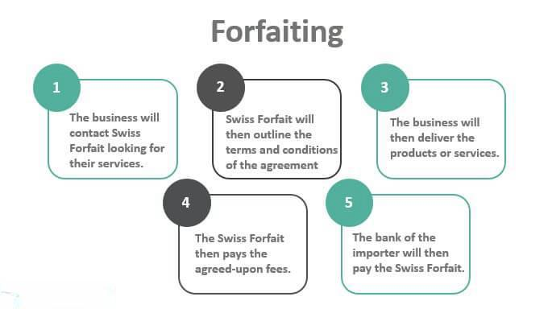

Trade finance and export financing are pivotal mechanisms in the global marketplace, designed to facilitate international trade by assisting firms in navigating complex financial landscapes. Trade finance refers to the suite of financial instruments and products that banks and financial institutions provide to companies to ensure seamless trade flow, including lines of credit, documentary collections, and guarantees. This domain significantly mitigates risks associated with cross-border trade, such as currency fluctuations, political instability, and credit risks.

Export financing, a subset of trade finance, provides businesses with the necessary capital to operate in international markets, optimizing their cash flows. It encompasses various forms, such as lending, factoring, and forfaiting, each tailored to suit the exporter’s needs. Factoring involves selling receivables at a discount to gain immediate cash, whereas forfaiting involves the sale of medium to long-term receivables without recourse, offering liquidity and risk mitigation. Forfaiting, in particular, is crucial for exporters operating in markets with high transaction risks, allowing them to convert future payment obligations into immediate cash.



Algorithmic trading, although traditionally associated with stock markets, has gained ground in the context of trade finance by enhancing efficiency and precision through computer algorithms that execute trades at high speed and frequency. By leveraging algorithmic trading in financial markets, traders optimize investment strategies, enhance risk management, and derive actionable insights from vast data amounts, thus providing a crucial edge in decision-making.

Collectively, trade finance, export financing, forfaiting, and algorithmic trading are indispensable in supporting global commerce. They work synergistically to reduce transactional risks, cut costs, and enhance the fluidity of financial operations across borders. These tools not only provide financial protection and facilitate smoother transactions but also empower exporters through improved financial fluency and capability in today’s highly competitive global markets. As international trade continues to evolve, these financial tools will play an increasingly vital role in enabling businesses to thrive against a backdrop of dynamic economic conditions.

## Table of Contents

## Understanding Trade Finance and Export Financing

Trade finance is a pivotal component of international trade, facilitating the smooth operation and expansion of global markets. It encompasses various financial products and services that reduce the risks associated with cross-border transactions. At its core, trade finance functions to alleviate the challenges vendors and purchasers face due to the time lag between product shipment and payment receipt.

Export financing is a subset of trade finance that primarily focuses on providing the necessary capital and liquidity for businesses engaged in exporting goods or services. This type of financing serves to optimize a company's cash flow by ensuring that exporters are not left waiting for payment, which can at times be deferred by several months. Proper cash flow management is critical for maintaining business operations and pursuing growth opportunities.

Export financing manifests in several forms, each designed to cater to specific needs and scenarios. Traditional financing methods like lending allow businesses to borrow against their future cash flows. Factoring provides immediate funds by purchasing the exporter’s accounts receivable at a discount; this method accelerates cash flow but may come with higher costs. Additionally, forfaiting, an off-balance sheet option, involves the sale of medium to long-term receivables at a discount, offering exporters immediate cash while transferring the risk of non-payment to the forfaiter.

Engaging in export finance deals, however, is not without challenges. Businesses must navigate complex financial documentation and regulatory compliance requirements. The costs associated with export financing, such as interest rates and service fees, can impact profit margins. Additionally, risks like currency fluctuations and political instability in foreign markets can pose significant threats to financial stability.

Despite these challenges, there are substantial benefits to adopting export financing solutions. They provide businesses with the ability to enter new markets with confidence, thanks to the reduced financial risk. Export finance instruments also improve competitiveness by allowing businesses to offer more favorable payment terms to international buyers. By leveraging a mix of these tools, exporters can create robust strategies tailored to specific opportunities and threats in the global market. 

Overall, trade finance and export financing are integral to sustaining and enhancing international trade by bridging the gap between buyers' and sellers' needs and ensuring a fluid trade cycle.

## The Mechanism of Forfaiting

Forfaiting is a financial mechanism that facilitates international trade by providing exporters with immediate cash while mitigating payment risks. This financial tool involves the purchase of an exporter's receivables, typically debts or promissory notes, by a forfaiter, who assumes the risk of non-payment. By converting these receivables into cash, forfaiting helps exporters maintain [liquidity](/wiki/liquidity-risk-premium) and focus on their core business operations without the burden of awaiting long payment terms.

The operational mechanism of forfaiting begins when an exporter ships goods and receives a promise of payment, usually in the form of a bill of exchange or promissory note. These instruments are often guaranteed by a bank in the importer's country, adding an extra layer of security for the forfaiter. Once in possession of these, the exporter approaches a forfaiting company that purchases the receivables at a discount. The forfaiter then collects the due amount from the importer at maturity, thus bearing the risk of default.

Here's a simplified formula to illustrate the discounting process in forfaiting:

$$
\text{Discounted Cash Value} = \frac{\text{Face Value}}{(1 + \text{Discount Rate})^{\text{Time}}}
$$

Where:
- $\text{Discounted Cash Value}$ is the amount paid to the exporter.
- $\text{Face Value}$ is the amount to be received by the forfaiter at maturity.
- $\text{Discount Rate}$ is determined by the creditworthiness of the importer, the currency, and the tenor.
- $\text{Time}$ represents the maturity period of the receivable.

Forfaiting has been successfully implemented in various sectors, such as heavy machinery, aerospace, and large-scale infrastructure projects. For instance, an exporter of industrial equipment to a developing country, where credit ratings might be less than ideal, can utilize forfaiting to secure payments. In such scenarios, the forfaiter's acceptance of the repayment risk allows the exporter to operate confidently, despite potential delays or disputes in payment.

Real-world applications underscore forfaiting's value. A notable example is a European aerospace firm that secured its cash flow by forfaiting its sales receivables to Asian clients amidst uncertain economic conditions. This arrangement ensured that the firm's capital was not tied up in lengthy payment negotiations, thus enabling it to reinvest in innovation and growth strategies.

Forfaiting demonstrates a robust method for exporting businesses to enhance their financial stability and reduce exposure to credit risk. By converting future receivables into immediate capital, it serves as a critical tool in accelerating trade flows and fostering international commerce.

## Algorithmic Trading: Enhancing Trade Finance

Algorithmic trading has revolutionized financial markets by enabling transactions based on pre-set rules and complex algorithms. This method utilizes computer systems to execute trades at speeds and frequencies that are impossible for human traders. By leveraging vast datasets, [algorithmic trading](/wiki/algorithmic-trading) systems identify patterns and trends to make rapid and informed decisions. Key components of algorithmic trading include statistical [arbitrage](/wiki/arbitrage), [market making](/wiki/market-making), and [trend following](/wiki/trend-following) strategies, each designed to maximize returns while minimizing risk.

The integration of algorithmic trading in trade finance processes plays a crucial role in enhancing efficiency and decision-making. Algorithms can be employed to analyze historical trade data, helping institutions predict future market behaviors and optimize trading strategies. For instance, algorithms detect micro-trends by calculating market indicators such as moving averages and relative strength indexes. In Python, a simple moving average can be calculated as follows:

```python
def simple_moving_average(data, window):
    return data.rolling(window=window).mean()
```

Such analyses provide valuable insights that can inform trade finance decisions, allowing financial institutions to better manage resources and deploy capital efficiently.

Incorporating algorithmic trading into export financing offers a competitive advantage through data-driven insights. Export financiers can utilize algorithms to assess credit risks, optimize currency exchanges, and ensure compliance with international financial regulations. Algorithms can sift through global economic indicators, geopolitical events, and historical data, providing a nuanced understanding of potential risks and opportunities.

Connecting algorithmic trading with export financing processes ensures optimal results by enhancing predictive accuracy and operational effectiveness. For example, real-time data analytics facilitated by algorithms can predict fluctuations in currency exchange rates, thereby reducing the cost of international transactions. Additionally, algorithm-driven platforms enable automated documentation processing, risk assessment, and contract management, further streamlining operations.

Trade finance involves complex variables and significant risk exposure, necessitating precise and timely information. The integration of algorithmic trading mechanisms mitigates these challenges by providing dynamic and scalable solutions, allowing exporters and financial institutions to remain agile in global markets. As technology advances, the synergy between algorithmic trading and export financing continues to offer substantial promise for enhancing trade finance operations worldwide.

## Benefits of Combining Forfaiting with Algo Trading in Trade Finance

Combining forfaiting with algorithmic trading in trade finance offers a synergistic advantage, enhancing the efficiency and effectiveness of international trade transactions. Forfaiting, which involves the purchase of receivables from exporters by forfaiters, provides immediate cash flow and mitigates payment risks. When integrated with algorithmic trading, which employs automated and sophisticated algorithms for financial transactions, businesses can achieve greater liquidity, improved risk management, and cost-effectiveness.

**Enhanced Liquidity**

Forfaiting liberates exporters from the constraints of deferred payment cycles by offering immediate liquidity. By adding algorithmic trading, companies expedite their financial operations, using algorithms to optimize the timing of transactions and cash positions. This dynamic duo allows exporters to maintain a smooth and continuous flow of capital, which is critical for meeting operational needs and seizing new business opportunities swiftly.

**Risk Management**

The integration of forfaiting with algorithmic trading also strengthens risk management practices. Forfaiting reduces risks related to credit and country instability by transferring them to the forfaiter. Algorithmic trading enhances this capability by employing data analytics and [machine learning](/wiki/machine-learning) to predict market trends and mitigate financial risks. With algorithms, companies can automate risk assessments and make data-driven decisions rapidly, enhancing overall financial security.

**Cost-Effectiveness**

Cost reduction is another significant benefit realized through the combination of forfaiting and algorithmic trading. Forfaiting, by its nature, reduces the costs associated with managing receivables and their associated risks. Algorithmic trading further cuts costs related to manual trade processing and decision-making errors, potentially implementing real-time pricing models and minimizing transaction fees by choosing optimal trading paths.

**Innovations and Digital Advancements**

Digital tools have significantly advanced trade finance operations. With technologies such as blockchain, the transparency and security of forfaiting transactions are enhanced. Algorithms can leverage blockchain's immutable ledgers to verify transaction legitimacy, reducing fraud and human error. Furthermore, with big data analytics, algorithmic trading systems can fine-tune strategies based on comprehensive market insights, adjusting to fluctuations with unprecedented speed and accuracy.

**Case Studies**

Consider a global electronics exporter based in Germany using both forfaiting and algorithmic trading systems. By forfaiting its medium-term receivables, the company secures immediate capital to invest in its supply chain, purchasing raw materials without delay. Simultaneously, the firm’s algorithmic trading system monitors foreign exchange markets in real-time, automatically executing currency trades that protect against adverse fluctuations. As a result, the company not only boosts its liquidity but also strategically manages currency risk without manual intervention.

In another instance, an agricultural producer in Brazil leverages forfaiting to mitigate buyer default risk, while also employing algorithmic trading to hedge against commodity price [volatility](/wiki/volatility-trading-strategies). This integrated approach allows the producer to achieve stable cash flow and sustain competitive pricing, increasing its market share globally.

In conclusion, the strategic convergence of forfaiting with algorithmic trading delivers transformative benefits for businesses engaged in global trade. It fosters enhanced liquidity, refined risk management, and cost reductions while embracing technological advancements to bolster competitiveness in an ever-evolving financial ecosystem.

## Comparative Analysis with Other Financing Methods

Forfaiting, traditional financing methods, and digital finance each possess unique characteristics that make them suitable for various business scenarios. 

**Forfaiting** is a financial transaction involving the purchase of receivables from exporters. These are generally long-term receivables secured with a promissory note or a bill of exchange, allowing exporters to convert a deferred payment into an immediate cash flow. This method is beneficial in situations where exporters seek protection against credit risks and prefer not to burden their balance sheets with slow-paying foreign receivables. The advantage of forfaiting lies in its facilitation of immediate liquidity without recourse to the exporter, effectively transferring the risk of non-payment to the forfaiter. However, it is typically more expensive than traditional methods due to the risk premiums involved.

**Traditional Financing Methods**, such as bank loans, trade credit, and letters of credit (LCs), remain popular due to their structured nature and widespread acceptance. Loans can offer lower interest rates for businesses with strong credit ratings, making them a cost-effective option for those maintaining good financial health. LCs, issued by banks on behalf of the buyer, provide a bridge of trust and are particularly useful for transactions between new trading partners. On the downside, these methods often involve stringent credit checks and may not offer the flexibility that some businesses require. Additionally, they can tie up collateral and affect the company's borrowing capacity.

**Digital Finance** incorporates technologically advanced solutions like blockchain, peer-to-peer lending, and digital-only banks, which aim to enhance the efficiency and transparency of financial transactions. Digital finance products are increasingly beneficial for startups and small-to-medium enterprises (SMEs) due to their often lower entry barriers and potential for faster processing times. However, challenges remain in the areas of cybersecurity and regulatory compliance, and there may be difficulties in integrating new technologies with existing systems.

Forfaiting is most suited for exporters engaging in high-value trade in emerging markets or where political and economic instability may pose a risk to payments. It can also be advantageous in countries where capital controls make traditional financing cumbersome. In contrast, digital finance is particularly advantageous in rapidly shifting markets where agility is crucial, or in regions with established digital infrastructure. 

An effective financing strategy will often involve a hybrid approach. For example, a business might use forfaiting to manage the risk of a few high-value deals while utilizing digital finance platforms to manage day-to-day liquidity needs. Combining these tools requires a detailed understanding of each instrument's implications and a strategy that aligns with the company's risk tolerance, financial health, and strategic goals.

In conclusion, while each financing method has its strengths and limitations, the choice largely depends on the specific business needs, market environment, and risk management strategies. As digital finance continues to evolve, it likely will become increasingly integrated with traditional and forfaiting methods, creating a multifaceted approach to trade finance.

## Challenges in Forfaiting and Algorithmic Trading

Adopting forfaiting and algorithmic trading in modern trade finance presents several challenges that need careful consideration. These challenges stem from regulatory, technological, and financial domains and must be addressed to ensure sustainable growth in the finance sector.

### Regulatory Challenges

Forfaiting and algorithmic trading operate within stringent regulatory environments. The dynamic and international nature of forfaiting requires compliance with varying regulations across different jurisdictions, potentially leading to conflicts and complications. For example, differing national regulations on credit terms or anti-money laundering (AML) standards can impose significant operational burdens on financial institutions.

Algorithmic trading, on the other hand, is under increased scrutiny due to concerns about market stability and fairness. The potential for algorithms to exacerbate market volatility or manipulate prices has led regulators to introduce rules focused on transparency and oversight. Compliance with regulations like the Market Abuse Regulation (MAR) in Europe or the Dodd-Frank Act in the United States demands significant resource allocation and could constrain operational flexibility.

### Technological Challenges

The integration of technology in trade finance through forfaiting and algorithmic trading necessitates robust and secure IT infrastructure. Forfaiting transactions rely on digital platforms for data exchange, requiring advanced cybersecurity measures to protect sensitive financial information from breaches and fraud. 

Algorithmic trading systems must be safeguarded against technological failures, such as hardware malfunctions or software errors, which could result in substantial financial losses. Furthermore, the sophistication of algorithms calls for continuous development and testing to keep up with rapidly evolving markets.

### Financial Risks

The financial risks associated with forfaiting include counterparty risk, where the financial stability of the parties involved might lead to default. Market conditions like currency fluctuations or [interest rate](/wiki/interest-rate-trading-strategies) changes can also affect the profitability of forfaiting transactions.

Algorithmic trading carries risks related to market impact and liquidity. Rapid execution can lead to significant market movements, affecting asset prices. This calls for strategies to minimize adverse market impacts while ensuring optimal liquidity.

### Solutions and Best Practices

Addressing these challenges requires a multi-faceted approach. Ensuring compliance with regulatory frameworks can be facilitated by investing in legal expertise and adopting comprehensive compliance programs. Technological solutions can include enhancing cybersecurity protocols and adopting robust risk management systems that include stress testing and contingency planning.

In algorithmic trading, utilizing advanced analytics and machine learning can improve algorithm accuracy and adaptability, helping to mitigate financial pitfalls. Developing customizable algorithms that adjust trading strategies based on real-time data analytics can offer a competitive edge while reducing risk exposure.

### Long-term Sustainability

For sustainable finance growth, there's a need for continuous innovation and adaptation. Developing partnerships between technology providers and financial institutions can enhance the integration of new solutions. Encouraging industry-wide collaboration and standardization can address regulatory and technological challenges more effectively.

Investing in emerging technologies like blockchain and [artificial intelligence](/wiki/ai-artificial-intelligence) (AI) presents significant opportunities for innovation, allowing more efficient and secure trading environments. By staying at the forefront of technological advancements and regulatory changes, financial institutions can ensure long-term growth and maintain competitiveness in the trade finance sector.

## The Future of Trade Finance: Innovations and Trends

Trade finance is undergoing transformative changes as innovations and trends increasingly shape its landscape. Two notable areas where these changes are evident are forfaiting and algorithmic trading.

**Emerging Trends in Trade Finance**

Recent developments in technology are significantly altering the methods and efficiency of trade finance. Digitalization, blockchain, and artificial intelligence (AI) stand out as pivotal technologies driving these advancements.

1. **Digital Platforms**: New digital platforms are streamlining and automating processes, reducing paperwork, and expediting transaction times. This digitization enhances documentation efficiency and fraud detection capabilities, offering improved transparency and security in trade finance operations.

2. **Blockchain Technology**: Blockchain offers the potential to revolutionize trade finance by providing immutable and decentralized transaction records. This technology facilitates secure and transparent transactions, reducing counterparty risks and enhancing transaction confidence. Companies like IBM and Maersk have been pioneering blockchain-based supply chain solutions that could extend to trade finance.

3. **Artificial Intelligence and Machine Learning**: AI and machine learning algorithms allow for enhanced data analysis and risk management. These technologies enable predictive analytics, offering insights into credit risks, trade patterns, and market fluctuations, thereby aiding better decision-making in complex trade finance environments.

4. **Supply Chain Finance (SCF) Innovations**: SCF solutions are evolving to provide integrated financing options that improve liquidity and cash flow management. These innovations enable companies to unlock working capital more efficiently, fostering better supply chain resilience.

**The Role of Technology in Shaping Trade Finance**

Technology is playing a crucial role in reshaping trade finance, particularly in enhancing efficiency, reducing costs, and minimizing risks. The integration of real-time data analytics, coupled with blockchain's trustworthiness, provides a robust framework for conducting international transactions with minimal friction.

For instance, algorithmic trading algorithms can sift through extensive datasets to identify optimal trading strategies and hedging opportunities, minimizing exposure to currency volatility and other financial risks faced by exporters.

**Future Innovations and Their Impact**

The future of trade finance will likely see further integration of advanced technologies such as quantum computing and advanced analytics. This integration can lead to unprecedented levels of transaction speed and security. Additionally, the adoption of smart contracts, facilitated by blockchain, could automate terms execution, further reducing reliance on intermediaries.

These innovations have significant potential impacts on exporters and financial institutions, including improved liquidity management, enhanced customer satisfaction due to faster processing, and increased competitiveness in global markets.

**Concluding Thoughts**

Staying competitive in the rapidly evolving financial world demands embracing these technological innovations. Companies and financial institutions need to remain agile, investing in technology that enhances trade finance mechanisms while also navigating associated risks and regulatory requirements. By leveraging the full spectrum of digital tools available, stakeholders can achieve a highly optimized, transparent, and secure trade finance environment. This not only benefits individual businesses but also supports broader economic stability and growth in international trade.

## References & Further Reading

[1]: Freude, J., & Kim, G. (2019). ["Forfaiting: An International Perspective."](https://psycnet.apa.org/record/2018-21031-001) International Finance Corporation

[2]: ["Trade Financing and the Forfaiting Option"](https://www.credlix.com/blogs/exploring-forfaiting-financing-in-international-trade) Business Finance BNA

[3]: Ulrich, M. (2003). ["The Handbook of International Trade and Finance."](https://archive.org/details/handbookofintern0000grat) Kogan Page Publishers

[4]: Narayanan, A., Bonneau, J., Felten, E., Miller, A., & Goldfeder, S. (2016). ["Bitcoin and Cryptocurrency Technologies."](https://press.princeton.edu/books/hardcover/9780691171692/bitcoin-and-cryptocurrency-technologies) Princeton University Press

[5]: Grosse-Rueschkamp, B., & Schoenmaker, D. (2018). ["Banks and blockchain: Ready for prime time?"](https://www.semanticscholar.org/author/Benjamin-Grosse-Rueschkamp/1466550917) VoxEU.org