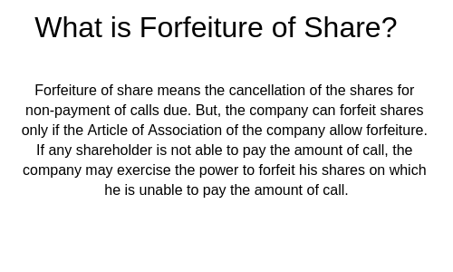

## Table of Contents

## What are forfeited shares?

Forfeited shares are shares that a company takes back from a shareholder because certain conditions were not met. These conditions might include not paying for the shares on time or not meeting performance targets if the shares were given as part of an employee incentive program. When shares are forfeited, they go back to the company, and the shareholder loses any rights and money they put into those shares.

Companies can then decide what to do with these forfeited shares. They might reissue them to other employees, sell them to new investors, or cancel them altogether. This process helps companies manage their share structure and maintain control over who owns parts of the business. It also serves as a way to ensure that shareholders meet their obligations or performance goals.

## Why do companies issue forfeited shares?

Companies issue forfeited shares mainly to keep control over who owns their business and to make sure shareholders follow certain rules. When someone wants to buy shares, they might have to pay for them in parts over time. If they don't pay on time, the company can take the shares back. This helps the company make sure that only people who can afford the shares end up owning them.

Another reason companies use forfeited shares is to motivate employees. Sometimes, companies give shares to employees as a reward if they meet certain goals, like working at the company for a certain time or reaching sales targets. If the employee doesn't meet these goals, the company can take the shares back. This encourages employees to work hard and stay with the company longer.

## How does the process of share forfeiture work?

When a company gives out shares, it might set some rules that the person getting the shares has to follow. These rules could be about paying for the shares in parts over time or doing certain things at work. If the person doesn't follow these rules, the company can take the shares back. This is called share forfeiture. For example, if someone is supposed to pay for their shares in three payments but misses the second payment, the company might take the shares back.

Once the shares are taken back, they become forfeited shares. The company can then decide what to do with them. They might give the shares to someone else, sell them to new investors, or just cancel them. This helps the company keep control over who owns parts of the business and makes sure that only people who meet the rules get to keep their shares. It's a way for the company to manage its shares and make sure everyone plays by the rules.

## What are the common reasons for shares to be forfeited?

Shares can be taken back by a company for a few main reasons. One common reason is if someone doesn't pay for their shares on time. When people buy shares, they might have to pay for them in parts over time. If they miss a payment, the company might take the shares back because they want to make sure only people who can afford the shares own them.

Another reason shares get taken back is if they were given to employees as a reward and the employees don't meet the goals set by the company. For example, a company might give shares to an employee if they stay with the company for a certain number of years or reach certain sales targets. If the employee leaves early or doesn't meet the targets, the company can take the shares back to encourage employees to work hard and stay longer.

## What happens to the shareholder when their shares are forfeited?

When a shareholder's shares are taken back by the company, they lose the shares and any money they paid for them. This means they no longer own any part of the company through those shares. It can be upsetting because they might have been hoping to make money from those shares or just wanted to be part of the company.

If the shares were given as part of a work reward, the shareholder, who is often an employee, might feel disappointed because they didn't meet the goals set by the company. This can make them feel less motivated at work. It also means they lose a chance to gain more from the company in the future through those shares.

## Can forfeited shares be reissued, and if so, how?

Yes, forfeited shares can be reissued by the company. When shares are taken back because someone didn't follow the rules, like not paying on time or not meeting work goals, the company can decide to give those shares to someone else. They might offer them to other employees as a reward or sell them to new investors who want to own part of the company. This helps the company keep control over who owns their business and can also be a way to motivate other employees.

The process of reissuing forfeited shares usually involves the company's board of directors deciding what to do with them. They might choose to reissue the shares at the same price they were originally offered or at a new price, depending on what makes sense for the company at that time. Once the decision is made, the shares can be given out or sold again, and the new owners will have all the rights that come with owning those shares, like voting at company meetings or getting part of the company's profits.

## What are the financial implications of share forfeiture for a company?

When a company takes back shares because someone didn't follow the rules, it can affect the company's money situation. If the shares were given to employees as a reward and then taken back, the company doesn't have to give out as much money in the future. This can save the company money because they don't have to pay out as many rewards. Also, if the company sells the forfeited shares to new investors, they can get more money to use for their business.

On the other hand, if the company cancels the forfeited shares instead of reissuing them, it might mean less money coming in because there are fewer shares to sell. This can also change how much of the company is owned by other shareholders, which might affect the value of their shares. So, the company needs to think carefully about what to do with the forfeited shares to make sure it helps their financial situation.

## How do forfeited shares affect a company's share capital?

When a company takes back shares, it can change the company's share capital. Share capital is the total amount of money a company gets from selling its shares. If the company decides to cancel the forfeited shares, the share capital goes down because there are fewer shares out there. This means the company has less money from shares overall. It can also make the value of the remaining shares go up because there are fewer shares to go around.

On the other hand, if the company decides to reissue the forfeited shares, it can keep the share capital the same or even make it go up. If they sell the shares to new investors, they get more money, which can increase the share capital. This can help the company have more money to use for its business. So, what the company decides to do with the forfeited shares can really affect how much money they have from shares.

## What are the legal considerations and regulations surrounding forfeited shares?

When a company decides to take back shares, there are some legal rules they have to follow. These rules can be different depending on where the company is located and what kind of company it is. Usually, the rules are written in the company's own rules, called the Articles of Association, and also in the country's company laws. The company has to make sure they follow these rules when they take back shares, or they could get in trouble. They also need to tell the shareholders what is happening and why the shares are being taken back, so everyone knows what's going on.

Another thing to think about is what happens to the money the shareholder paid for the shares. If someone paid for the shares but didn't finish paying, the company might have to give back some of that money, depending on the rules. Also, if the shares were given as part of a work reward, there might be tax rules to think about. The company has to make sure they are following all the tax laws when they take back shares and reissue them. It's important for the company to talk to lawyers to make sure they are doing everything right and not breaking any laws.

## How do forfeited shares impact the market value of remaining shares?

When a company takes back shares, it can change the value of the shares that are still out there. If the company decides to cancel the shares they took back, there will be fewer shares overall. This can make the remaining shares more valuable because there are fewer of them to go around. People might be willing to pay more for each share, which can push up the price of the shares on the market.

On the other hand, if the company decides to sell the shares they took back to new investors, it can also affect the value of the shares. If a lot of new shares are sold, it might make people think there are too many shares, which can make the price go down. But if the company gets a good price for the new shares, it might make the company look more valuable, which can help the price of the remaining shares go up. It all depends on what the company decides to do with the shares they took back and how the market reacts to those decisions.

## What are some real-world examples of share forfeiture?

One real-world example of share forfeiture happened at a company called Uber. In 2019, Uber went public and offered shares to its employees as part of their pay. These shares came with rules that said employees had to stay with the company for a certain time before they could keep the shares. If an employee left Uber before that time was up, they would lose their shares. This happened to some employees who decided to leave the company early, and Uber took back their shares.

Another example is from the company Tesla. Tesla also gives shares to its employees as part of their pay, but with conditions. For instance, some employees get shares that they can only keep if they meet certain performance goals. If they don't meet these goals, Tesla can take the shares back. This happened to some employees who didn't meet the targets set by the company, and as a result, they lost their shares.

## How can investors protect themselves from the risk of share forfeiture?

Investors can protect themselves from the risk of share forfeiture by understanding the rules that come with the shares they buy or are given. If they are buying shares, they should make sure they know all the payment deadlines and pay on time. If they get shares as part of their job, they should know what goals they need to meet to keep the shares. Reading the company's rules carefully and asking questions if anything is unclear can help investors avoid losing their shares.

Another way to protect against share forfeiture is to keep an eye on the company's performance and news. If the company is doing well, it might be easier to meet any performance goals tied to the shares. Also, staying informed can help investors decide if they should stay with the company or look for other opportunities. By being proactive and understanding the terms of their shares, investors can reduce the chance of their shares being taken back.

## What is the process and what are the implications of stock cancellation?

Stock cancellation takes place when a company voids or annuls certain shares, commonly as part of restructuring or other corporate actions. This strategic decision has significant implications both for the company and its investors.

Primarily, stock cancellation can alter the way a company is perceived in the market. When shares are cancelled, it reduces the total number of shares outstanding, which can lead to changes in financial metrics. For instance, the earnings per share (EPS) metric, a critical indicator for investors, is calculated as:

$$
\text{EPS} = \frac{\text{Net Income}}{\text{Number of Outstanding Shares}}
$$

A reduction in the number of outstanding shares, assuming the net income remains constant, can increase the EPS. This can potentially enhance the company's attractiveness to investors, as a higher EPS might reflect increased profitability. However, this is contingent on the underlying reasons for the cancellation and the market's perception of those reasons.

Stock cancellation also impacts dividends. With fewer shares in circulation, the same dividend payout results in a higher dividend per share, assuming the company maintains its overall dividend distribution. Nonetheless, this benefit is hypothetical if the company decides to alter its dividend policy in tandem with the stock cancellation.

Legal and accounting treatments must be meticulously managed when cancelling stock. Compliance with corporate laws is non-negotiable, and companies often engage in thorough reviews to navigate the complexities involved. Companies must ensure that the cancellation aligns with shareholder agreements and other regulatory requirements, avoiding potential legal entanglements.

Moreover, stockholders engaged in manual or [algorithmic trading](/wiki/algorithmic-trading) must understand the nuances of stock cancellation to assess risks and returns accurately. For those employing algorithmic trading, adjustments in their trading algorithms may be necessary to account for the updated market dynamics post-cancellation. By refining these algorithms, traders can potentially enhance their trading strategies to capitalize on the situation effectively.

In conclusion, understanding stock cancellation is essential for investors to make informed decisions. The implications on market metrics, compliance, and trading strategies highlight the need for a comprehensive analysis before engaging with affected stocks.

## References & Further Reading

[1]: ["Corporate Governance and Shareholder Value"](https://journals.sagepub.com/doi/10.1177/097215090500700101) by Per Jenster and David Hussey  

[2]: Stevenson, C., & Sheppard, S. (2013). ["Algorithmic Trading"](https://personal.stevens.edu/~syang14/fe670/presentation-fe670-lecture01.pdf) in Business Analytics & Statistics.

[3]: ["Understanding Employee Stock Purchase Plans"](https://www.investopedia.com/terms/e/espp.asp) on Investopedia  

[4]: Chincarini, L. B., & Kim, D. (2006). ["Quantitative Equity Portfolio Management: An Active Approach to Portfolio Construction and Management"](https://archive.org/details/quantitativeequi0000chin_c9d6) 

[5]: Woolridge, J. R. (1995). ["Stock Market Reaction to Strategic Investment Decisions."](https://onlinelibrary.wiley.com/doi/10.1002/smj.4250110503) Harvard Business Review Press.