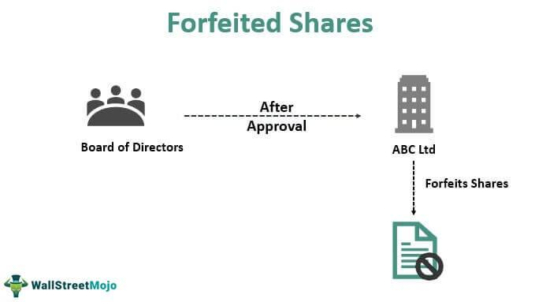

In the world of investing and trading, the concepts of share forfeiture, forfeited shares, and stock cancellation are pivotal yet often overlooked. These financial mechanisms can significantly influence the dynamics between investors and publicly-traded companies. Share forfeiture occurs when shareholders fail to meet purchase commitments, leading to a retraction of their ownership rights, which can be reissued to new investors. Stock cancellation, on the other hand, involves a company's decision to annul shares, typically as part of a strategic restructuring or corporate action. 

The implications of these actions extend beyond mere ownership changes. They can impact market perception, stock value, and investor strategies. Understanding these processes is essential for both manual and algorithmic traders. Algorithmic trading, which utilizes computer algorithms to automate trading decisions, can play a significant role in managing forfeited shares and stock cancellation. By providing speed and efficiency, algorithmic trading assists investors in making informed decisions amidst these complex corporate actions. 

This article aims to provide a comprehensive understanding of these terms, facilitating informed decision-making in today's intricate financial markets. As such, grasping the nuances of share forfeiture, forfeited shares, and stock cancellation is crucial not only for those engaging in direct investment but also for those leveraging automated trading systems.

## Table of Contents

## Understanding Share Forfeiture and Forfeited Shares

A forfeited share is a stock in a publicly-traded company that the owner loses due to an inability to meet purchase requirements, primarily the non-payment of call money. The occurrence of share forfeiture begins with the shareholder's failure to pay either the full or installment price of the shares. Subsequently, the issuing company sends a notice demanding payment within a specified period. If the shareholder fails to comply, the company proceeds to cancel the individual's rights to the shares.

Once forfeited, the shares revert to the issuing company. The company holds the authority to reissue these shares to new investors, often at a price that ensures recoupment of the unpaid amount. The return of these shares to the company allows for the potential to stabilize or enhance financial positioning, as new shares issued can contribute to capital accumulation.

Share forfeiture may stem from several reasons including non-payment, regulatory non-compliance, or breach of agreement terms. From a regulatory perspective, companies adhering to corporate governance policies and legal frameworks ensure a structured process for share forfeiture, avoiding potential disputes and maintaining transparency.

Understanding the legal and procedural intricacies of share forfeiture is critical for investors. It ensures protection against the loss of investment and highlights the importance of fulfilling financial obligations tied to share acquisition. Investors should be vigilant in monitoring their compliance with payment schedules and relevant regulatory requirements to safeguard their interests in publicly traded entities.

## The Process and Implications of Stock Cancellation

Stock cancellation takes place when a company voids or annuls certain shares, commonly as part of restructuring or other corporate actions. This strategic decision has significant implications both for the company and its investors.

Primarily, stock cancellation can alter the way a company is perceived in the market. When shares are cancelled, it reduces the total number of shares outstanding, which can lead to changes in financial metrics. For instance, the earnings per share (EPS) metric, a critical indicator for investors, is calculated as:

$$
\text{EPS} = \frac{\text{Net Income}}{\text{Number of Outstanding Shares}}
$$

A reduction in the number of outstanding shares, assuming the net income remains constant, can increase the EPS. This can potentially enhance the company's attractiveness to investors, as a higher EPS might reflect increased profitability. However, this is contingent on the underlying reasons for the cancellation and the market's perception of those reasons.

Stock cancellation also impacts dividends. With fewer shares in circulation, the same dividend payout results in a higher dividend per share, assuming the company maintains its overall dividend distribution. Nonetheless, this benefit is hypothetical if the company decides to alter its dividend policy in tandem with the stock cancellation.

Legal and accounting treatments must be meticulously managed when cancelling stock. Compliance with corporate laws is non-negotiable, and companies often engage in thorough reviews to navigate the complexities involved. Companies must ensure that the cancellation aligns with shareholder agreements and other regulatory requirements, avoiding potential legal entanglements.

Moreover, stockholders engaged in manual or [algorithmic trading](/wiki/algorithmic-trading) must understand the nuances of stock cancellation to assess risks and returns accurately. For those employing algorithmic trading, adjustments in their trading algorithms may be necessary to account for the updated market dynamics post-cancellation. By refining these algorithms, traders can potentially enhance their trading strategies to capitalize on the situation effectively.

In conclusion, understanding stock cancellation is essential for investors to make informed decisions. The implications on market metrics, compliance, and trading strategies highlight the need for a comprehensive analysis before engaging with affected stocks.

## Algorithmic Trading and Its Role in Managing Forfeited Shares

Algorithmic trading is a sophisticated approach to automating trading decisions using computer algorithms that operate based on predefined criteria. Its utility can be especially pronounced in scenarios involving forfeited shares, where these algorithms can significantly enhance the efficiency and effectiveness of trading activities.

One of the primary advantages of algorithmic trading in managing forfeited shares is its ability to optimize trade executions. Algorithms can automatically execute trades at optimal prices by analyzing market data in real-time, which is particularly useful in volatile market conditions that may follow share cancellations or forfeitures. They help in minimizing the market impact of large trades, which might otherwise lead to adverse price movements if executed manually.

Moreover, algorithms can swiftly adjust trading positions and rebalance portfolios in response to market conditions resulting from corporate actions like share forfeiture and stock cancellation. By continuously monitoring market indicators and corporate announcements, these programs can realign investment strategies to maintain portfolio targets and mitigate potential losses.

A key feature of algorithmic trading is its ability to incorporate data-driven insights into decision-making processes. For instance, algorithms can evaluate vast datasets to determine the most advantageous times to reinvest in reissued forfeited shares. They can assess factors such as trading [volume](/wiki/volume-trading-strategy), price trends, and company fundamentals, providing a comprehensive analysis that informs reinvestment decisions.

Investors using algorithmic trading must ensure that their algorithms are designed to [factor](/wiki/factor-investing) in the implications of forfeited shares and other related corporate actions. This involves programming algorithms to recognize and respond to corporate disclosures, regulatory filings, and changes in stock ownership patterns. For example, an algorithm might include a function to trigger a portfolio review if a certain percentage of shares within a company are forfeited or reissued, thereby maintaining the strategic alignment of the investment portfolio.

In conclusion, algorithmic trading stands as a powerful tool for managing forfeited shares, offering advantages in trade execution, portfolio rebalancing, and data-driven decision-making. Investors need to ensure their algorithms are robust and adaptable, capable of integrating the nuances of corporate actions to optimize trading outcomes effectively.

## Real-World Examples and Case Studies

In the financial ecosystem, real-world examples of share forfeiture and stock cancellation illustrate how these mechanisms function and their strategic advantages. For instance, technology companies like Facebook and Google maintain robust employee stock purchase plans (ESPPs) that may involve forfeited shares. These plans allow employees to purchase company stock at a discounted rate, reinforcing both retention and loyalty. When employees leave the company before a vesting period concludes, their shares may be forfeited, subsequently reverting to the company. Facebook and Google often reallocate these shares, maintaining optimal [liquidity](/wiki/liquidity-risk-premium) and facilitating new employee acquisitions.

A case study of Facebook demonstrates a structured approach through its ESPP. The program is designed to boost engagement by allowing employees to purchase shares at a discounted price, with forfeited shares from departing employees providing a reservoir to fulfill such commitments. This practice serves dual purposes: it preserves cash flow while enhancing workforce stability.

For investors, acquiring forfeited shares reissued at a discount presents both risks and potential rewards. These shares often re-enter the market at reduced prices, offering opportunity for investors to gain an entry position into high-performing companies. However, due diligence is critical; the reasons behind forfeiture and timing reissuance can significantly impact potential returns.

An example illustrating this dynamic is evident when shares once forfeited due to unpaid call money become available again post-cancellation. Investors who successfully assess and seize these chances at discounts can potentially realize substantial returns. However, those who overlook underlying risks, such as pending regulatory scrutiny, may face losses.

These real-world scenarios underscore valuable lessons: aligning investment strategies with corporate actions involving share forfeiture and stock cancellation requires a nuanced understanding of both market dynamics and corporate governance. Sophisticated tools like algorithmic trading further enhance this alignment, offering investors a means to efficiently evaluate and react to the implications of forfeited shares, ensuring decisions are data-informed and strategic.

## Conclusion

Share forfeiture, forfeited shares, and stock cancellation hold significant implications for both investors and issuing companies. These complex mechanisms must be understood thoroughly to facilitate informed decision-making as financial markets evolve. As stock markets become more sophisticated, recognizing the dynamics of these corporate actions is essential for anyone involved in trading. A clear grasp of these concepts allows investors to better foresee how their portfolios might be affected by unforeseeable developments such as a company restructuring or failing to meet regulatory requirements.

Algorithmic trading has emerged as a critical tool in navigating the intricacies of forfeited shares and stock cancellation. It enables swift and efficient response to market changes, optimizing trade executions while minimizing adverse price impacts. By leveraging pre-programmed criteria, algorithmic trading allows for quick adjustments to portfolios that may be affected by share forfeitures, thus enhancing the adaptability and resilience of investment strategies.

Investors must be attentive to the potential risks and benefits associated with forfeited shares. These shares can sometimes be acquired at reduced prices upon reissuance, presenting unique opportunities for portfolio management. However, the inherent risks, such as the potential dilution of ownership, necessitate a careful and strategic approach to their inclusion in investment portfolios.

Being proactive and well-informed, alongside possessing technological know-how, is crucial for success in the domain of stock trading affected by forfeiture and cancellation. Investors equipped with knowledge of these processes and who utilize advanced trading systems, like algorithmic trading, are better positioned to optimize their investment outcomes. In conclusion, integrating an understanding of share forfeiture and stock cancellation with advanced trading technologies forms the foundation for strategic, informed investing in contemporary financial markets.

## References & Further Reading

[1]: ["Corporate Governance and Shareholder Value"](https://journals.sagepub.com/doi/10.1177/097215090500700101) by Per Jenster and David Hussey  

[2]: Stevenson, C., & Sheppard, S. (2013). ["Algorithmic Trading"](https://personal.stevens.edu/~syang14/fe670/presentation-fe670-lecture01.pdf) in Business Analytics & Statistics.

[3]: ["Understanding Employee Stock Purchase Plans"](https://www.investopedia.com/terms/e/espp.asp) on Investopedia  

[4]: Chincarini, L. B., & Kim, D. (2006). ["Quantitative Equity Portfolio Management: An Active Approach to Portfolio Construction and Management"](https://archive.org/details/quantitativeequi0000chin_c9d6) 

[5]: Woolridge, J. R. (1995). ["Stock Market Reaction to Strategic Investment Decisions."](https://onlinelibrary.wiley.com/doi/10.1002/smj.4250110503) Harvard Business Review Press.