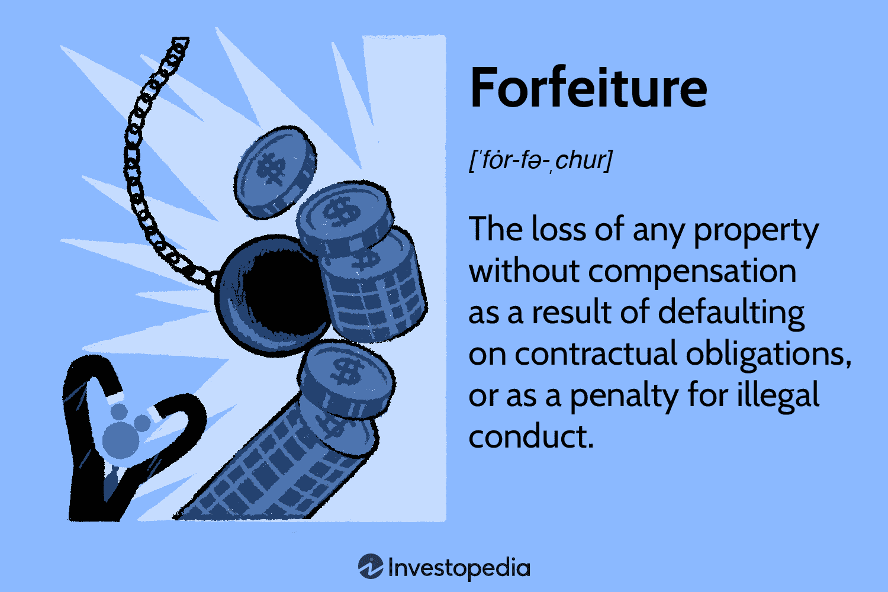

In the rapidly evolving financial landscape, the integration of technology and finance has ushered in a plethora of sophisticated investing strategies and concepts. This article explores the complex world of investing, emphasizing the significance of forfeiture, key financial terms, and algorithmic trading.

Investing today extends beyond traditional stocks and bonds, encompassing advanced methodologies like algorithmic trading. To successfully navigate the complexities of modern finance, a comprehensive understanding of these elements is essential. Financial forfeiture and algorithmic trading, in particular, are significantly reshaping the financial sector. Forfeiture pertains to the loss of assets often caused by contractual breaches or involvement in illegal activities, whereas algorithmic trading uses computer algorithms to execute trades based on predefined criteria for optimal performance.

The exploration of these components will offer insights into their impact on investing and the broader financial markets. This article will begin with an overview of crucial financial terms, setting the stage for a detailed examination of algorithmic trading, illustrated through case studies and an analysis of its strategic implementation.

## Table of Contents

## Understanding Financial Forfeiture

Financial forfeiture refers to the involuntary loss of assets, which can arise from either a failure to fulfill contractual obligations or engagement in illegal activities. This concept is pivotal in legal and financial processes, serving as both a deterrent and a remedy for breaches or misconduct.

In contractual settings, forfeiture may occur when an entity does not meet the stipulated obligations, leading to the loss of assets as outlined in the agreement. For example, if a borrower defaults on a loan, the lender may seize the collateral specified in the loan agreement. Such forfeiture clauses are designed to protect the interests of parties by providing a mechanism to compensate for breaches.

Beyond contract enforcement, forfeiture can also be mandated by law, particularly in cases involving illicit activities. Regulatory bodies such as the U.S. Securities and Exchange Commission (SEC) and the Department of Justice (DOJ) often implement forfeiture to confiscate assets obtained or utilized through illegal means. This practice is common in combating fraud, money laundering, and other financial crimes. By seizing assets linked to illegal activities, authorities aim to disrupt criminal operations and deter future offenses.

Specific examples of forfeiture in financial markets include the loss of shares if call options are not exercised or the inability to trade restricted shares, leading to their forfeiture under certain conditions. These instances highlight how forfeiture functions as a risk management tool, ensuring compliance and accountability within financial systems.

Understanding forfeiture's implications is crucial for managing risk and enforcing contracts. Organizations and individuals engaged in finance must be aware of the conditions and consequences associated with forfeiture to navigate the complex legal and contractual landscape effectively. This knowledge assists in mitigating potential losses and ensuring adherence to regulatory and contractual norms, thereby sustaining the integrity of financial transactions and relationships.

## Key Financial Terms and Their Relevance

Navigating the financial landscape requires a comprehensive understanding of various financial terms and their practical applications, each influencing market operations and investment strategies. One such term is "[algorithmic trading](/wiki/algorithmic-trading)," a process that utilizes pre-programmed trading instructions to execute trades. These algorithms process market data and execute buy or sell orders at incredible speeds, outperforming human capabilities. This strategy is integral to market efficiency, allowing for large volumes of trades with reduced transaction costs and optimizing trade executions.

"Statistical arbitrage" is another crucial concept. It involves simultaneously buying and selling securities in different markets to exploit price differentials. By using statistical models to predict price movements, traders can identify pricing inefficiencies and capitalize on temporary market mispricings. This strategy enhances liquidity and contributes to market stability.

"High-frequency trading" (HFT) is a subset of algorithmic trading characterized by high-speed order execution and frequent trading. HFT firms deploy algorithms that analyze market conditions to make swift trading decisions within microseconds. The sheer speed of these transactions enables capturing short-lived arbitrage opportunities, providing liquidity, and narrowing bid-ask spreads.

"Market liquidity" refers to the ease with which assets can be bought or sold in the market without causing significant price changes. It is essential for market stability, as high liquidity typically results in smaller price fluctuations and allows investors to execute large transactions smoothly. Algorithmic and high-frequency trading significantly contribute to market liquidity by providing a constant stream of buy and sell orders.

In corporate finance, "accelerated vesting" and "value engineering" are pivotal. Accelerated vesting involves shortening the vesting schedule of a financial instrument, often used as an employee retention strategy, granting them quicker access to stock options. This can incentivize performance and increase employee loyalty. "Value engineering" is a systematic approach to improving the value of products or projects by optimizing function and cost, which is crucial in enhancing profitability and competitiveness.

A solid understanding of these terms is foundational for analyzing financial strategies, market behaviors, and the broader economic landscape. As we transition to exploring algorithmic trading, recognizing these concepts' interplay sets the stage for a more in-depth discussion on its significance in shaping financial markets.

## The Rise of Algorithmic Trading

Algorithmic trading, sometimes referred to as algo-trading, utilizes pre-programmed trading instructions that consider various variables such as time, price, and [volume](/wiki/volume-trading-strategy), to execute trades. This technological innovation in the financial markets has significantly altered the trading landscape by harnessing computational power to perform tasks beyond the capabilities of individual traders.

The increasing reliance on algorithmic trading is largely attributed to its ability to optimize trading strategies using speed and precision. Algorithms can process vast amounts of data in real-time, enabling them to make informed trading decisions within nanoseconds, a feat impossible for human traders. This speed advantage allows traders to capitalize on fleeting market opportunities, often executing numerous trades within seconds.

Algorithms are used in a variety of trading strategies, each influencing market dynamics in unique ways. For example, [arbitrage](/wiki/arbitrage) strategies exploit price discrepancies across different markets or instruments, aligning prices to improve market efficiency. Market-making strategies provide [liquidity](/wiki/liquidity-risk-premium) by continuously quoting buy and sell prices, thus stabilizing market fluctuations. Statistical arbitrage involves complex quantitative models to identify trading opportunities based on historical data correlations, contributing to market efficiency.

The advancements in technology have dramatically decreased transaction costs, partly due to the automation and scalability of trading operations provided by algorithms. Automation mitigates the need for manual intervention, reducing errors and the costs associated with human trading. Additionally, by automating strategies, market participants can engage in high-frequency trading ([HFT](/wiki/high-frequency-trading-strategies)), where high-speed algorithms can initiate thousands of orders in a single second, further enhancing market liquidity.

Sophisticated models and algorithms are integral to achieving optimal execution of trades. Techniques such as [machine learning](/wiki/machine-learning) and [artificial intelligence](/wiki/ai-artificial-intelligence) allow algorithms to adapt to changing market conditions, improving their decision-making process over time. By continuously learning from market data, these systems can refine trading strategies, enhance accuracy, and increase profitability. For example, an algorithm might leverage natural language processing to analyze news sentiment and predict market movements, incorporating these insights into its trading decisions.

Given these capabilities, algorithmic trading has become an indispensable component of modern financial markets. As trading volumes increase and markets grow more complex, the role of algorithms in ensuring efficient market operations and boosting profitability remains crucial. This advancement reflects a broader trend of technological integration and innovation within the financial sector, continually reshaping how trades are executed and markets are structured.

## Case Studies and Real-World Applications

Algorithmic trading plays an integral role in modern financial markets, significantly shaping the trading landscape through a diverse array of applications. High-frequency trading (HFT) firms exemplify algorithmic trading's dominance, accounting for a substantial portion of trading volume across global stock exchanges. These firms utilize algorithms to execute trades at incredibly high speeds, often in milliseconds, allowing them to capitalize on micro-market movements. Strategies employed by these firms include [statistical arbitrage](/wiki/statistical-arbitrage), [market making](/wiki/market-making), and price-improvement algorithms.

One notable incident highlighting both the capabilities and potential risks of algorithmic trading is the 2010 Flash Crash. During this event, the Dow Jones Industrial Average plummeted about 1,000 points, nearly 9%, within minutes, only to recover most of those losses shortly after. The crash underscored the risks of high-speed trading, revealing vulnerabilities in market infrastructure and prompting regulatory scrutiny. The event demonstrated how algorithmic trading could exacerbate market [volatility](/wiki/volatility-trading-strategies), particularly in the absence of adequate risk management protocols.

Beyond equities, algorithmic trading extends its influence to [forex](/wiki/forex-system) (foreign exchange), commodity markets, and fixed-income securities. In the forex market, algorithms facilitate rapid responses to currency fluctuations, enhancing liquidity and narrowing spreads. For commodities, algorithms optimize order execution for futures contracts, improving trade efficiency and minimizing transaction costs. In fixed-income markets, algorithmic strategies assist in navigating the complexities of bond pricing, offering real-time analysis and execution capabilities.

These diverse applications underscore algorithmic trading's significant impact on financial markets. By leveraging technology to process vast amounts of data and execute trades with precision, algorithmic trading increases market efficiency and liquidity. However, it also introduces challenges, such as algorithmic transparency and systemic risk, necessitating careful oversight and continuous advancement of trading technologies and regulations.

## Strategies in Algorithmic Trading

Algorithmic trading employs an array of strategies designed to optimize returns, manage risks, and ensure efficient participation in financial markets. These strategies utilize computer algorithms to execute trades based on predefined criteria, allowing for precision and speed beyond human capability.

**Pairs Trading** is a strategy involving matched pairs of securities whose prices are statistically correlated. When the correlation temporarily weakens, a trader will short the outperforming security while going long on the underperforming one, expecting the historical correlation to return. The core premise here is statistical arbitrage, where the expectation is that prices will revert to their historical mean. Pairs trading relies heavily on quantitative analysis and historical data to identify potential pairs and entry points.

**Arbitrage** exploits price differentials of the same asset across different markets or in different forms. An example is triangular arbitrage in foreign exchange markets, where discrepancies in cross-currency conversion rates create opportunities to capitalize on the difference. Mathematical models such as the Black-Scholes formula might be used to identify mispriced options relative to the underlying asset.

**Mean Reversion** postulates that the price of a security will return to its average value over time. This strategy identifies when an asset's price deviates significantly from its historical average and capitalizes on the correction. Several indicators, such as moving averages and Bollinger Bands, assist in determining entry and exit points for trades. 

**Scalping** aims to profit from small price changes, often executing hundreds of trades within a single day. It requires advanced technology to capture the best bid and ask prices and often relies on the funnelling of market data with minimal latency. This strategy necessitates a deep understanding of market microstructure and requires precise timing due to the small margins involved.

Technological advancements enable more sophisticated algorithmic trading strategies like **Market Timing** and **Event-Driven Trading**. Market timing involves entering or exiting trades at strategic points based on predictive analytics and econometric models. Event-driven trading responds to specific events such as earnings announcements, mergers, or geopolitical developments that may influence asset prices. Such strategies require algorithms capable of processing news quickly and making near-instantaneous trading decisions.

With the continuous evolution of technology, the speed, efficiency, and capability of algorithmic trading have greatly expanded. Algorithms can manage and execute thousands of trades simultaneously and react to market conditions in fractions of a second, significantly reducing transaction costs and enhancing market liquidity.

Understanding these diverse strategies equips investors and traders to navigate complex market scenarios effectively. By leveraging the capabilities of algorithmic trading, they can optimize their trading operations, maximize profitability, and mitigate the inherent risks present in volatile markets.

## Conclusion

The intersection of investing, financial forfeiture, and algorithmic trading signifies a crucial and ever-changing component of today's financial landscape. As technology rapidly advances, it reshapes how financial markets operate and underscores the necessity for investors, regulators, and businesses to understand these complex elements. This understanding is essential not just for capitalizing on opportunities but also for managing potential risks that arise from these developments.

Financial forfeiture, with its focus on the risks and legal implications associated with the loss of assets, stresses the importance of compliance and risk management in investment activities. Investors must be aware of potential forfeiture clauses in contracts and the legal frameworks governing asset recovery in cases of illegal conduct or contractual breaches. This concept serves as a reminder of the critical balance between opportunity and risk within financial markets.

On the other hand, algorithmic trading exemplifies the transformative power of technology in enhancing market operations. By utilizing complex algorithms, it enables trades to be executed with unparalleled speed and precision, thus optimizing market efficiency. This strategy-driven approach capitalizes on computational prowess to implement sophisticated trading strategies that were once impractical for human traders to execute at such speeds. As a result, algorithmic trading not only boosts market liquidity but also opens up new avenues for strategic investment.

In an ever-evolving financial world, keeping up-to-date with the latest developments in these areas is imperative. Education and awareness play pivotal roles in preparing stakeholders to seize emerging opportunities while effectively mitigating associated risks. As regulatory environments continue to change and technological innovations advance, staying informed and adaptable becomes a competitive advantage in the financial sector.

The continuous evolution of financial forfeiture, investing, and algorithmic trading highlights the need for ongoing education and the ability to adapt swiftly in response to new challenges and innovations. Awareness of regulatory shifts, technological advances, and market dynamics ensures that individuals and organizations can effectively navigate and thrive amidst the complexities of modern finance.

## References & Further Reading

[1]: Bergstra, J., Bardenet, R., Bengio, Y., & Kégl, B. (2011). ["Algorithms for Hyper-Parameter Optimization."](https://dl.acm.org/doi/10.5555/2986459.2986743) Advances in Neural Information Processing Systems 24.

[2]: ["Advances in Financial Machine Learning"](https://www.amazon.com/Advances-Financial-Machine-Learning-Marcos/dp/1119482089) by Marcos Lopez de Prado

[3]: ["Evidence-Based Technical Analysis: Applying the Scientific Method and Statistical Inference to Trading Signals"](https://www.amazon.com/Evidence-Based-Technical-Analysis-Scientific-Statistical/dp/0470008741) by David Aronson

[4]: ["Machine Learning for Algorithmic Trading"](https://github.com/stefan-jansen/machine-learning-for-trading) by Stefan Jansen

[5]: ["Quantitative Trading: How to Build Your Own Algorithmic Trading Business"](https://www.amazon.com/Quantitative-Trading-Build-Algorithmic-Business/dp/1119800064) by Ernest P. Chan