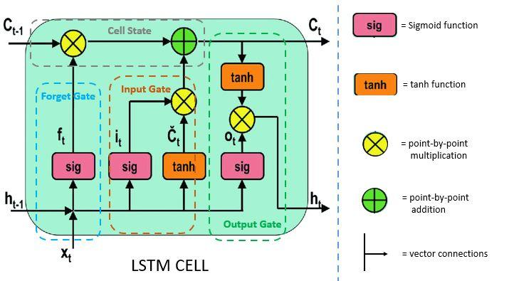

## Table of Contents

## What is a Forget Gate in the context of machine learning?

A Forget Gate is a part of a type of neural network called Long Short-Term Memory (LSTM). LSTMs are used in machine learning to help computers remember information over long periods of time. The Forget Gate is like a decision maker inside the LSTM. It looks at the current input and the previous state of the network, and decides what information from the past should be forgotten or kept. This helps the network to focus on what's important and not get overwhelmed by too much old data.

Imagine you are reading a long book and need to remember the important parts. The Forget Gate helps by deciding which parts of the story to keep in mind and which parts to let go of. For example, if you are trying to predict the next word in a sentence, the Forget Gate might decide to forget less relevant words from earlier in the sentence and keep the more relevant ones. This way, the network can make better predictions by focusing on the most useful information.

## How does a Forget Gate function within a Long Short-Term Memory (LSTM) network?

A Forget Gate in an LSTM network helps decide what information from the past should be kept or thrown away. It looks at the current input and the previous state of the network. Imagine you're reading a book and need to remember important parts. The Forget Gate is like a helper that decides which parts of the story to keep in mind and which to forget. It does this by using a special function called a sigmoid function, which outputs a number between 0 and 1. If the output is close to 0, it means "forget this," and if it's close to 1, it means "keep this."

The Forget Gate works by taking the previous hidden state and the current input, and passing them through the sigmoid function. The formula for the Forget Gate can be written as $$ f_t = \sigma(W_f \cdot [h_{t-1}, x_t] + b_f) $$, where $$ f_t $$ is the output of the Forget Gate, $$ \sigma $$ is the sigmoid function, $$ W_f $$ are the weights, $$ h_{t-1} $$ is the previous hidden state, $$ x_t $$ is the current input, and $$ b_f $$ is the bias. This output is then multiplied with the previous cell state to decide what to keep or forget. For example, if the Forget Gate decides to keep information about a character's name from earlier in the story, it will help the network remember that name when predicting what might happen next.

## Why are Forget Gates important in neural networks?

Forget Gates are important in neural networks because they help the network decide what information to keep and what to forget. This is especially useful in Long Short-Term Memory (LSTM) networks, which are designed to remember things over long periods. Without a Forget Gate, the network might get confused by too much old information and not focus on what's important right now. For example, when reading a long story, you don't need to remember every single detail, just the important parts that help you understand the plot.

The Forget Gate works by looking at the current input and the previous state of the network. It uses a special function called a sigmoid function, which gives a number between 0 and 1. If the number is close to 0, it means "forget this," and if it's close to 1, it means "keep this." The formula for the Forget Gate is $$ f_t = \sigma(W_f \cdot [h_{t-1}, x_t] + b_f) $$. This helps the network focus on the most useful information, making it better at tasks like predicting the next word in a sentence or understanding a long sequence of events.

## Can you explain the mathematical formula used in a Forget Gate?

The mathematical formula for a Forget Gate in an LSTM network is $$ f_t = \sigma(W_f \cdot [h_{t-1}, x_t] + b_f) $$. This formula helps the network decide what information to keep or forget. The sigmoid function, written as $$ \sigma $$, gives a number between 0 and 1. If the number is close to 0, it means "forget this," and if it's close to 1, it means "keep this." The weights, written as $$ W_f $$, and the bias, written as $$ b_f $$, are numbers that the network learns to make the right decisions. The previous hidden state, written as $$ h_{t-1} $$, and the current input, written as $$ x_t $$, are used to help make these decisions.

This formula is important because it helps the network focus on what's important. Imagine you're reading a long story. You don't need to remember every single detail, just the important parts that help you understand the plot. The Forget Gate helps the network do the same thing. By deciding what to keep and what to forget, the network can better predict what might happen next or understand a long sequence of events. This makes the network more effective at tasks like language understanding and time series prediction.

## What is the role of the sigmoid function in a Forget Gate?

The sigmoid function in a Forget Gate helps decide what information to keep or forget. It's like a special tool that looks at the current input and the previous state of the network. The sigmoid function gives a number between 0 and 1. If the number is close to 0, it means "forget this," and if it's close to 1, it means "keep this." This helps the network focus on what's important and not get overwhelmed by too much old data.

The formula for the Forget Gate is $$ f_t = \sigma(W_f \cdot [h_{t-1}, x_t] + b_f) $$. In this formula, $$ \sigma $$ is the sigmoid function. It takes the previous hidden state $$ h_{t-1} $$ and the current input $$ x_t $$, along with weights $$ W_f $$ and bias $$ b_f $$, to make its decision. By using the sigmoid function, the Forget Gate can help the network remember important information over long periods, which is useful for tasks like understanding a long story or predicting what might happen next.

## How does a Forget Gate help in managing long-term dependencies in sequences?

A Forget Gate helps manage long-term dependencies in sequences by deciding what old information to keep and what to forget. Imagine you're reading a long story and need to remember important details to understand the plot. The Forget Gate does something similar in an LSTM network. It uses a special function called a sigmoid function, which gives a number between 0 and 1. If the number is close to 0, it means "forget this," and if it's close to 1, it means "keep this." The formula for the Forget Gate is $$ f_t = \sigma(W_f \cdot [h_{t-1}, x_t] + b_f) $$. This helps the network focus on what's important and not get overwhelmed by too much old data.

By using the Forget Gate, the network can remember important information over long periods. This is useful for tasks like predicting the next word in a sentence or understanding a long sequence of events. For example, if you're reading a book and need to remember a character's name from earlier in the story, the Forget Gate helps by deciding to keep that information. This way, the network can make better predictions by focusing on the most useful information and not getting distracted by less relevant details.

## What are the common challenges faced when implementing Forget Gates?

Implementing Forget Gates in LSTM networks can be tricky because they need to balance what to keep and what to forget. One common challenge is finding the right weights and biases for the Forget Gate. These numbers, written as $$ W_f $$ and $$ b_f $$ in the formula $$ f_t = \sigma(W_f \cdot [h_{t-1}, x_t] + b_f) $$, help the network decide what information to keep or throw away. If these numbers are not set right, the network might forget important details or keep too much old information, which can make it hard for the network to learn and make good predictions.

Another challenge is that training LSTM networks with Forget Gates can take a long time and need a lot of data. The network needs to see many examples to learn how to use the Forget Gate properly. If there isn't enough data, the network might not learn well, and the Forget Gate might not work as it should. This means that people working on these networks need to be patient and make sure they have enough good data to help the network learn.

## How do Forget Gates compare to other gating mechanisms in neural networks?

Forget Gates are a part of Long Short-Term Memory (LSTM) networks and help decide what information to keep or forget. They use a special function called a sigmoid function, which gives a number between 0 and 1. If the number is close to 0, it means "forget this," and if it's close to 1, it means "keep this." The formula for the Forget Gate is $$ f_t = \sigma(W_f \cdot [h_{t-1}, x_t] + b_f) $$. This helps the network focus on what's important and not get overwhelmed by too much old data. In comparison, other gating mechanisms, like Input Gates and Output Gates in LSTMs, also use sigmoid functions but serve different purposes. Input Gates decide what new information to add to the network's memory, while Output Gates control what information is used to make predictions.

Another gating mechanism is the Gated Recurrent Unit (GRU), which is simpler than LSTM but still effective. GRUs use an Update Gate and a Reset Gate instead of separate Forget, Input, and Output Gates. The Update Gate in a GRU decides how much of the past information to keep and how much of the new input to add, similar to the combined function of Forget and Input Gates in an LSTM. The Reset Gate helps determine how much of the past information to forget. While GRUs are less complex and can be faster to train, they might not capture long-term dependencies as well as LSTMs with their Forget Gates. Both types of gating mechanisms are important tools in neural networks, each with their own strengths and challenges.

## Can you provide an example of a practical application where Forget Gates are crucial?

Forget Gates are crucial in language translation systems. Imagine you're using a computer to translate a long sentence from English to Spanish. The computer needs to remember the beginning of the sentence to make the translation correct. The Forget Gate helps by deciding what parts of the sentence to keep in mind and what to forget. For example, if the sentence starts with "Yesterday, I went to the store," the Forget Gate might decide to keep "yesterday" and "store" because they are important for the translation, but forget less relevant details. This way, the computer can focus on the key information and make a better translation.

Another practical application where Forget Gates are important is in speech recognition. When you speak to your phone or a smart device, it needs to understand your words over time. The Forget Gate helps by deciding what sounds and words to remember and what to forget. For instance, if you say "Set an alarm for tomorrow at 7 AM," the Forget Gate might decide to keep "tomorrow" and "7 AM" because they are crucial for setting the alarm correctly, while forgetting less important words. This helps the device understand your speech better and respond accurately.

## What are the latest research developments related to Forget Gates?

Recent research has focused on improving how Forget Gates work in LSTM networks. One interesting development is the use of adaptive Forget Gates, where the network can change how it decides what to forget based on the task it's doing. This means the network can be more flexible and work better for different kinds of problems. For example, researchers have been looking at ways to make the Forget Gate learn from the data more effectively, using formulas like $$ f_t = \sigma(W_f \cdot [h_{t-1}, x_t] + b_f + \alpha \cdot \text{task-specific term}) $$, where $$ \alpha $$ is a parameter that adjusts the gate's behavior based on the task.

Another area of research is exploring how Forget Gates can help with understanding long sequences of data, like videos or long documents. Scientists are working on making Forget Gates more efficient so they can handle bigger and more complicated data sets. They are also trying to make the networks learn faster by using techniques like transfer learning, where a network trained on one task can be used to help it learn another task more quickly. This can make the network better at remembering important information over long periods, which is useful for things like predicting what might happen next in a video or understanding a long story.

## How can the performance of Forget Gates be optimized in LSTM models?

To optimize the performance of Forget Gates in LSTM models, one key approach is to fine-tune the weights and biases used in the Forget Gate's formula, $$ f_t = \sigma(W_f \cdot [h_{t-1}, x_t] + b_f) $$. This can be done through careful training with large datasets, which helps the network learn the right values for $$ W_f $$ and $$ b_f $$. Another method is to use regularization techniques to prevent overfitting, ensuring that the Forget Gate generalizes well to new data. Researchers have also explored adaptive Forget Gates, where the gate's behavior can be adjusted based on the specific task, using formulas like $$ f_t = \sigma(W_f \cdot [h_{t-1}, x_t] + b_f + \alpha \cdot \text{task-specific term}) $$, where $$ \alpha $$ is a parameter that helps the gate adapt.

Another way to boost the performance of Forget Gates is by using advanced optimization algorithms during training. Techniques like Adam or RMSprop can help the network learn more efficiently by adjusting the learning rate dynamically. Additionally, transfer learning can be used to pre-train the LSTM on a related task before fine-tuning it for the specific task at hand. This can help the Forget Gate learn better from the start. Finally, experimenting with different architectures, such as stacked LSTMs or combining LSTMs with other types of neural networks, can also enhance the effectiveness of Forget Gates in managing long-term dependencies.

## What future advancements might we see in the use of Forget Gates in machine learning?

Future advancements in the use of Forget Gates in [machine learning](/wiki/machine-learning) might focus on making them even smarter and more adaptable. Researchers could develop new ways for Forget Gates to learn from data more effectively, perhaps by using formulas like $$ f_t = \sigma(W_f \cdot [h_{t-1}, x_t] + b_f + \alpha \cdot \text{task-specific term}) $$ where $$ \alpha $$ is a parameter that helps the gate adjust based on the task. This could make the network better at remembering important information over long periods, which is useful for understanding long stories, videos, or other complex data.

Another exciting possibility is that Forget Gates might become more efficient at handling bigger and more complicated datasets. Scientists might find ways to make the training process faster and more accurate, perhaps by using new optimization techniques or by combining Forget Gates with other types of neural networks. This could lead to machines that can understand and predict things in ways that are closer to how humans do, making them even more helpful in our daily lives.