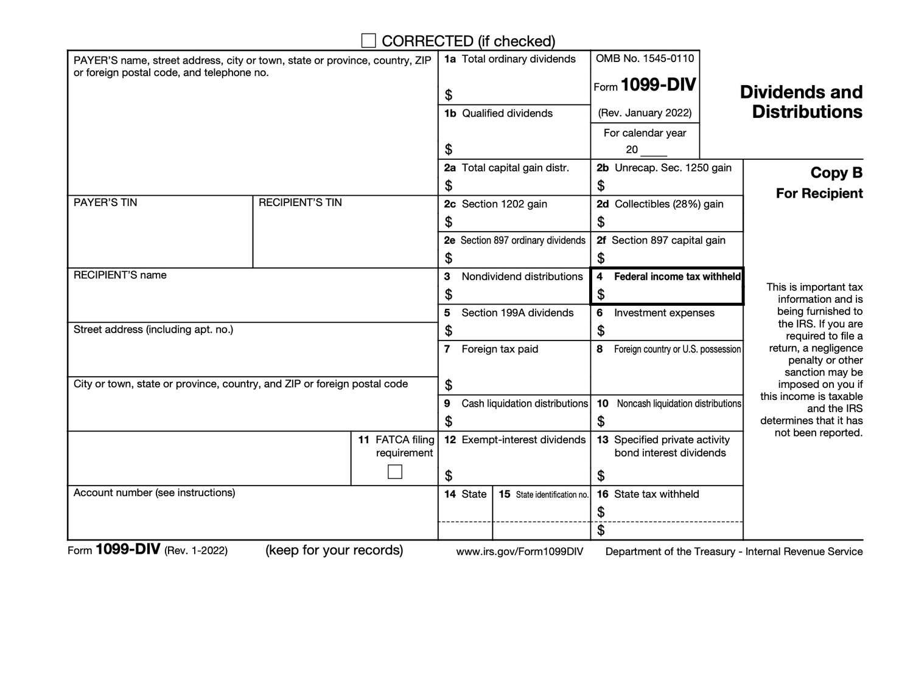

Dividends are an integral component of the returns shareholders receive from their investments. Understanding how dividends are taxed, particularly through the lens of Form 1099-DIV, is crucial for investors. For those engaged in algorithmic trading, where dividend income can vary considerably due to high-frequency trades, this understanding becomes even more significant. 

Form 1099-DIV, used by financial institutions to report dividends and distributions to the Internal Revenue Service (IRS) and investors, serves as a key document in the tax filing process. This article aims to comprehensively explain the nuances of dividend tax filing with Form 1099-DIV, focusing on investors employing algorithmic trading strategies. We'll cover the purpose and key components of Form 1099-DIV, identify who needs to file it, and illustrate how it integrates into the tax filing system.



Algorithmic trading, characterized by its rapid transactions and sophisticated strategies, can result in significant fluctuations in dividend income. Understanding how these different incomes are taxed, considering both ordinary and qualified dividends, is crucial for traders. By examining how algorithmic trading influences dividend taxation and identifying key considerations for algo traders when preparing their taxes, investors can better navigate the complexities of tax filing.

Recognizing the importance of accurate tax filing, this examination of Form 1099-DIV is designed to provide clarity and guidance, helping algo traders optimize their tax outcomes and focus on perfecting their trading methodologies.

## Table of Contents

## Understanding Dividends and Form 1099-DIV

Dividends represent income distributed to shareholders from a corporation’s earnings, typically derived from its profits. These payments serve as a return on investment for those holding stocks or other security instruments. Dividends are typically distributed on a per-share basis, meaning that each shareholder receives an amount proportional to their stockholding in the company. The primary forms of dividends include cash dividends and stock dividends, with the former being the most common. 

To facilitate the reporting of these dividend earnings to the Internal Revenue Service (IRS), Form 1099-DIV, referred to as Dividends and Distributions, is utilized. This tax form is provided by financial institutions or brokers to investors who have received more than $10 in dividends and distributions within the calendar year. The information on this form is essential for investors to accurately report their income during tax filing.

Form 1099-DIV includes several key sections to capture the comprehensive dividend activity of an investor. These sections include:

1. **Ordinary Dividends**: This encompasses most cash dividends paid out by companies. Ordinary dividends are taxed at the individual's ordinary income tax rate, making it critical for investors to report accurately.

2. **Qualified Dividends**: These dividends are taxed at a lower capital gains tax rate rather than the higher income tax rate applied to ordinary dividends. To qualify, the dividends must meet certain criteria set by the IRS, such as the holding period for the stock that paid the dividend. This distinction underscores the importance of accurate tracking and reporting.

3. **Total Capital Gain Distributions**: This section of the form details any distributions paid by mutual funds or real estate investment trusts (REITs) that derive from the sale of a portion of their holdings. These are treated as long-term capital gains, which often enjoy a tax rate lower than that applied to regular income.

4. **Foreign Taxes Paid**: In cases where the dividends are from foreign investments, this section records any foreign taxes that were paid or accrued. Investors might be eligible for a foreign tax credit or deduction on their tax return for these taxes.

For investors involved in activities like [algorithmic trading](/wiki/algorithmic-trading), the timely and accurate reporting of these components is crucial given the potential for high-frequency transactions and numerous dividend payments. The proper comprehension and utilization of Form 1099-DIV help facilitate a smooth tax filing process, ensuring investors remain compliant with tax regulations while optimizing their financial returns.

## Filing Requirements for Form 1099-DIV

Form 1099-DIV is a critical document within the tax filing ecosystem, particularly for those involved in investing, as it must be filed by financial institutions or brokers to both the investor and the Internal Revenue Service (IRS) by January 31 each year. This timeline ensures that investors have adequate time to incorporate their dividend income into their tax returns, aligning with the broader tax filing calendar set forth by the IRS.

For investors, the information reported on Form 1099-DIV must be reflected in their individual tax returns. This can be achieved through either directly inserting the dividend data into Form 1040 or, if the dividend income exceeds certain thresholds, incorporating it into an additional form known as Schedule B. Specifically, when an investor has more than $1,500 in taxable interest or ordinary dividends, Schedule B becomes a mandatory requirement. This form serves as a supplement to the standard tax return, providing a detailed account of all interest and dividend income, thereby enhancing the transparency and accuracy of the overall tax filing.

Algorithmic trading, characterized by its high [volume](/wiki/volume-trading-strategy) and frequency of transactions, presents unique challenges in the context of reporting dividends. As these trading strategies often involve the frequent purchase and sale of shares, investors engaged in algorithmic trading may receive numerous 1099-DIV forms from different brokers throughout the year. This multiplicity of forms necessitates meticulous tracking and organization to ensure that all relevant dividend income is duly reported. Failure to consistently and accurately track each form could result in underreporting income, leading to potential issues with tax compliance and penalties.

In managing these complexities, investors are encouraged to implement structured financial records and consider leveraging technology to aid in the precise tracking of all dividend transactions. Such practices not only facilitate accurate reporting on Form 1040 and Schedule B as needed but also ensure alignment with IRS requirements, thus mitigating the risks associated with complex algorithmic trading activities.

## Tax Implications for Algo Traders

Algorithmic trading (algo trading) is characterized by the use of complex algorithms to execute trades rapidly. This trading strategy frequently results in multiple transactions, impacting the types and frequency of dividend payments received by traders. 

Dividends from algo trading can be categorized into two main types: ordinary dividends and qualified dividends. Each type carries different tax implications:

1. **Ordinary Dividends**: These are taxed at the individual's regular income tax rate. Ordinary dividends are the most common type and are reported in Box 1a of the Form 1099-DIV.

2. **Qualified Dividends**: These benefit from preferential tax treatment, as they are taxed at the lower capital gains tax rates. To qualify for this reduced rate, specific criteria must be met, which primarily includes a minimum holding period for the shares. Shares must be held for more than 60 days during the 121-day period that begins 60 days before the ex-dividend date, which is the day after which new buyers are not entitled to receive the next dividend.

The reduced tax rates for qualified dividends offer distinct advantages to algo traders who can structure their holdings to meet the qualifying criteria. For many, this can result in significant tax savings compared to ordinary income tax rates. The tax rates on qualified dividends are typically 0%, 15%, or 20%, depending on the taxpayer's income level.

However, the rapid turnover inherent in high-frequency trading used in algo strategies can complicate the ability to meet the holding period requirements necessary for a dividend to be considered qualified. In Python, tracking the holding periods could involve a logic similar to the following:

```python
def is_qualified_dividend(purchase_date, ex_dividend_date):
    from datetime import timedelta

    holding_period_start = ex_dividend_date - timedelta(days=60)
    holding_period_end = ex_dividend_date + timedelta(days=60)

    return holding_period_start <= purchase_date <= holding_period_end

# Example usage
purchase_date = '2023-06-01'
ex_dividend_date = '2023-08-01'

qualified = is_qualified_dividend(purchase_date, ex_dividend_date)
print("Qualified Dividend:", qualified)
```

Additionally, algorithmic traders must consider potential complications such as increased complexity in tracking the multiple dividend payments received and the necessity of maintaining accurate records. This is vital to ensure that all dividend earnings are correctly classified and leveraged for tax efficiency.

Overall, understanding these tax dynamics helps traders better manage their portfolios with tax considerations in mind, optimizing both trading strategies and tax outcomes. By adhering to the regulations governing dividend taxation, algo traders can enhance their trading success while ensuring compliance with applicable tax laws.

## Common Mistakes and Best Practices

One common mistake investors make is neglecting to account comprehensively for all 1099-DIV forms, particularly if they receive multiple forms from different brokers. Each form represents dividend income or other distributions, which must be reported accurately on the taxpayer's return to avoid discrepancies that could trigger an audit.

Algo traders, who often engage in numerous transactions, might receive various 1099-DIV forms, each reporting different amounts of dividends or distributions. Failing to consolidate this data can lead to incorrect tax reporting. To mitigate this, investors should ensure that every form received is accounted for and the data cross-verified against their records.

Another critical aspect is the correct reporting of any backup withholding and foreign taxes paid. U.S. tax law requires that any withholding (backup or otherwise) be reported accurately. For example, if a broker withholds a percentage of dividends for tax purposes, this amount must be explicitly accounted for on the tax return. Similar attention should be paid to foreign taxes if investments include international securities. Tax treaties between countries can influence the final tax obligations, and misreporting these can lead to over- or underpayment of taxes.

Implementing best practices is essential for efficient tax filing. Maintaining a comprehensive log of trades and corresponding dividend income is pivotal. Special software tailored for algo traders can be beneficial, providing features like automatic import of trading data, real-time tracking of dividends, and tax-reporting tools. Software solutions not only simplify the process but also enhance the accuracy of recorded data.

Constant vigilance regarding updates in tax regulations is crucial for compliance. Tax laws governing dividends and investment income can change, impacting the tax obligations of investors. It is imperative to stay informed about any legislative changes or new IRS guidelines to optimize tax outcomes accordingly. Engaging with professional tax advisors familiar with algorithmic trading can also provide valuable insights, ensuring that investors are both compliant with existing laws and strategically positioned to take advantage of tax benefits.

## Conclusion

Accurate tax filing is crucial for investors, especially algorithmic traders handling numerous dividend payments throughout the year. Properly managing these obligations ensures that traders remain compliant with tax regulations and avoid potential penalties. Understanding Form 1099-DIV and its requirements is fundamental to streamlining the tax filing process. This form helps report dividends and distributions, and knowing how to utilize it correctly can prevent errors and complications during tax season.

Diligence and staying well-informed are key components for traders aiming to maximize tax efficiency. By maintaining comprehensive records of their trades and corresponding dividends, traders can ensure all relevant information is accurately reported. This disciplined approach not only aids in tax filing but also facilitates ongoing trading strategy optimization.

Consulting with a tax professional, particularly one experienced in algorithmic trading, can provide valuable, tailored guidance. They can help navigate the complexities of dividend taxation and identify opportunities for tax optimization. It's essential that traders treat tax considerations as a critical aspect of their overall trading strategy, ensuring their operations remain both profitable and compliant.

## References & Further Reading

[1]: ["Taxation of U.S. Investment Income: Dividends and Interest"](https://www.thestreet.com/taxes/how-interest-income-dividends-and-capital-gains-are-taxed) - Internal Revenue Service (IRS)

[2]: ["Form 1099-DIV and the Reporting of Dividend Income"](https://www.irs.gov/forms-pubs/about-form-1099-div) - TurboTax

[3]: ["A Guide to Investment Income: Dividends, Interest, and Royalties"](https://www.investopedia.com/terms/i/investmentincome.asp) - Investopedia

[4]: ["Publication 550 (2020), Investment Income and Expenses"](https://www.irs.gov/publications/p550) - Internal Revenue Service (IRS)

[5]: ["Algorithmic Trading: Winning Strategies and Their Rationale"](https://www.amazon.com/Algorithmic-Trading-Winning-Strategies-Rationale-ebook/dp/B00CY5HC0U) by Ernie Chan

[6]: ["Tax Implications of Algorithmic and High-Frequency Trading"](https://www.economicsreview.org/post/should-high-frequency-trading-be-regulated) - U.S. Department of the Treasury

[7]: ["The Basics of Algorithmic Trading"](https://www.investopedia.com/articles/active-trading/101014/basics-algorithmic-trading-concepts-and-examples.asp) - Investopedia