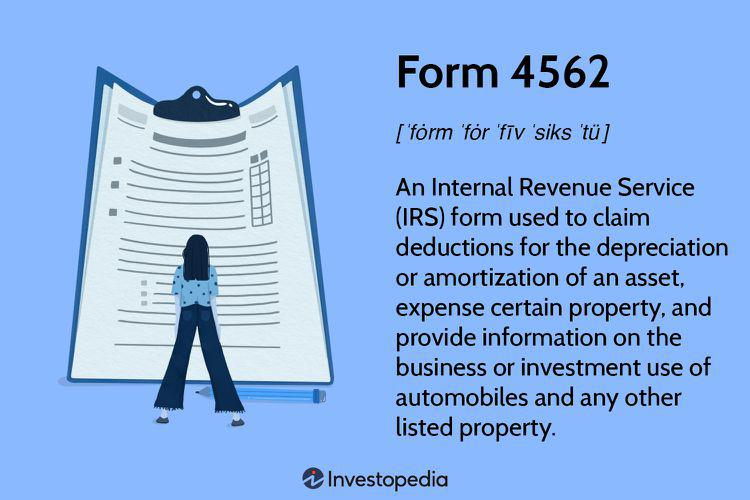

## Table of Contents

## What is Form 4562 used for?

Form 4562 is a tax form used by businesses and self-employed individuals to report depreciation and amortization of assets. This form helps taxpayers calculate the deduction they can claim for the wear and tear or obsolescence of their business property, such as vehicles, machinery, and furniture. By filling out Form 4562, taxpayers can ensure they are taking advantage of all the tax benefits available to them for their business expenses.

The form is divided into several sections, each dealing with different types of property and methods of depreciation. Taxpayers need to list each asset, its cost, and the method of depreciation they are using. This can include the Modified Accelerated Cost Recovery System (MACRS), which is the most common method, or other methods like the Section 179 deduction, which allows businesses to deduct the full cost of certain assets in the year they are purchased. Properly completing Form 4562 can help reduce a business's taxable income, thereby lowering its tax liability.

## Who needs to file Form 4562?

Anyone who owns a business or is self-employed and wants to claim a deduction for depreciation or amortization on their business assets needs to file Form 4562. This includes things like cars, machinery, furniture, and other property used in the business. If you're claiming these deductions, you have to report them on this form.

Even if you're not actively claiming a depreciation deduction, you might still need to file Form 4562. For example, if you've claimed depreciation in the past and you're now selling the asset, you need to report any gain or loss on the sale. This form helps you figure out how much you can deduct and ensures you're following the tax rules correctly.

## What is the difference between depreciation and amortization?

Depreciation and amortization are both ways to spread out the cost of an asset over time, but they apply to different types of assets. Depreciation is used for tangible assets, which are physical things you can touch, like vehicles, machinery, and office furniture. When a business buys these items, they don't count the full cost as an expense right away. Instead, they spread it out over the years the asset is expected to be useful. This way, the business can match the cost of the asset with the income it helps generate.

Amortization, on the other hand, is used for intangible assets, which are things you can't touch, like patents, copyrights, and trademarks. Just like with depreciation, the cost of these intangible assets is spread out over their useful life. This means a business can deduct a part of the cost each year, instead of all at once. Both depreciation and amortization help businesses manage their finances better by matching expenses with the revenue they produce over time.

## How do I calculate depreciation for Form 4562?

Calculating depreciation for Form 4562 can be done in a few ways, depending on the method you choose. The most common method is the Modified Accelerated Cost Recovery System (MACRS). To use MACRS, you need to know the cost of the asset, the date you started using it for your business, and its recovery period, which is how long the IRS says you can depreciate it. You then use IRS tables to find the percentage of the asset's cost you can deduct each year. For example, if you bought a computer for your business for $1,000 and it has a 5-year recovery period, you might be able to deduct 20% of the cost, or $200, in the first year.

Another way to calculate depreciation is the Section 179 deduction, which lets you deduct the full cost of certain assets in the year you buy them, up to a limit set by the IRS. This can be useful if you want to get a big tax break right away. For example, if you bought a $50,000 truck for your business and it qualifies for the Section 179 deduction, you might be able to deduct the whole $50,000 in the year you bought it, instead of spreading it out over several years. Always make sure to check the current IRS rules and limits for these methods when you're filling out Form 4562.

## What types of property can be depreciated using Form 4562?

Form 4562 is used to depreciate property that you use in your business or to produce income. This includes tangible assets like cars, trucks, machinery, furniture, and equipment. These are things you can touch and use in your daily business activities. For example, if you own a restaurant, you can depreciate the ovens, refrigerators, and tables you use to serve customers.

You can also depreciate certain intangible assets like patents, copyrights, and trademarks. These are things you can't touch but still have value to your business. For instance, if you invent a new product and get a patent for it, you can spread the cost of that patent over its useful life. Remember, the property must have a determinable useful life and be expected to last more than one year to qualify for depreciation.

## What are the different methods of depreciation available on Form 4562?

Form 4562 allows you to use different methods to calculate depreciation for your business assets. The most common method is the Modified Accelerated Cost Recovery System (MACRS). With MACRS, you can choose between the General Depreciation System (GDS) and the Alternative Depreciation System (ADS). GDS is the default method and allows for faster depreciation, while ADS is used in special cases and spreads the cost over a longer period. To use MACRS, you need to know the cost of the asset, when you started using it for your business, and its recovery period, which is how long the IRS says you can depreciate it. Then, you use IRS tables to figure out the percentage of the asset's cost you can deduct each year.

Another method available on Form 4562 is the Section 179 deduction. This lets you deduct the full cost of certain assets in the year you buy them, up to a limit set by the IRS. It's a way to get a big tax break right away instead of spreading it out over several years. For example, if you buy a $50,000 truck for your business and it qualifies for the Section 179 deduction, you might be able to deduct the whole $50,000 in the year you bought it. This can be really helpful if you need to reduce your taxable income quickly. Always check the current IRS rules and limits for these methods when filling out Form 4562.

## How do I report listed property on Form 4562?

Listed property on Form 4562 includes things like cars, computers, and cell phones that you use for both business and personal purposes. To report these, you need to figure out how much you use them for business. You do this by keeping a log or record of your business use. For example, if you use your car for business 75% of the time, you can only claim depreciation on 75% of its cost.

Once you know the business use percentage, you report this on Form 4562. You fill out Part V of the form, where you list each piece of listed property, its cost, and the percentage of business use. Then, you calculate the depreciation based on that business use percentage. If you use the car example again, you would multiply the car's cost by 75% and then use the depreciation method you choose, like MACRS or Section 179, to figure out your deduction.

## What is the Section 179 deduction and how is it reported on Form 4562?

The Section 179 deduction lets you deduct the full cost of certain business assets in the year you buy them, instead of spreading it out over time. This can be a big help if you want to lower your taxes right away. There's a limit to how much you can deduct, and it changes every year, so you need to check the current IRS rules. You can use this deduction for things like equipment, vehicles, and some kinds of software, as long as you use them mostly for your business.

To report the Section 179 deduction on Form 4562, you fill out Part I of the form. Here, you list the cost of each asset you want to deduct and make sure the total doesn't go over the IRS limit. You also need to write down how much of each asset's cost you're deducting under Section 179. After that, you subtract the Section 179 deduction from the asset's cost before you calculate any other kind of depreciation, like MACRS, on the rest of the form.

## How does the de minimis safe harbor election affect Form 4562?

The de minimis safe harbor election lets businesses treat small purchases as expenses instead of assets. If you choose this, you don't have to depreciate these items on Form 4562. You can just deduct the full cost of things like office supplies or small tools right away. This makes your taxes simpler because you don't have to keep track of these small items for years.

To use the de minimis safe harbor, you need to have a written accounting policy that says you'll treat these small purchases as expenses. You also need to make sure the cost of each item is under a certain amount set by the IRS. If you do this, you won't need to report these small items on Form 4562 at all, which can save you time and make your tax filing easier.

## What are the implications of bonus depreciation on Form 4562?

Bonus depreciation lets you deduct a big part of the cost of certain new business assets right away, instead of spreading it out over time. If you choose to use bonus depreciation, you report it on Form 4562. This means you can take an extra deduction in the year you buy the asset, which can lower your taxes a lot that year. You need to check the current IRS rules because the percentage you can deduct and the types of assets that qualify can change.

After you take the bonus depreciation, you still need to figure out regular depreciation for the rest of the asset's cost. You do this on the same Form 4562, but you only calculate depreciation on what's left after the bonus deduction. This can make your tax filing a bit more complicated, but it can also save you a lot of money in taxes in the year you buy the asset. Always make sure to follow the IRS guidelines carefully when you're filling out Form 4562 with bonus depreciation.

## How do I amend a previously filed Form 4562?

If you need to change something on a Form 4562 you already sent to the IRS, you'll need to file an amended tax return. You do this by filling out Form 1040X if you're an individual, or Form 1120X if you're a corporation. On this form, you'll explain what you're changing and why. You'll also need to attach a new Form 4562 that shows the corrected information. Make sure you clearly mark the new form as "Amended" at the top so the IRS knows it's a change to what you filed before.

When you're filling out the new Form 4562, you need to go through all the parts again, even if you're only changing one thing. This means you'll recalculate everything based on the corrected information. For example, if you're changing the cost of an asset or the method of depreciation, you'll need to show how that affects the rest of your calculations. It's important to be thorough and accurate so the IRS can process your amended return correctly.

## What are common errors to avoid when completing Form 4562?

When filling out Form 4562, a common mistake is not keeping good records of your business assets. You need to know when you bought each item, how much it cost, and how you use it for your business. If you don't have this information, you might miss out on deductions or make mistakes on the form. Another error is mixing up the different methods of depreciation, like MACRS and Section 179. Each method has its own rules, and you need to follow them carefully to get your deductions right.

Also, people often forget to update their depreciation calculations every year. The amount you can deduct changes over time, so you need to keep track of that. Another mistake is not reporting listed property correctly, like cars or computers you use for both business and personal use. You need to figure out the business use percentage and report it accurately on the form. By avoiding these common errors, you can make sure you're getting all the tax benefits you deserve without running into trouble with the IRS.

## What is the role of amortization in financial strategy?

Amortization is a critical financial concept that plays an integral role in financial planning. It refers to the systematic distribution of the cost of an intangible asset over its useful life. This process not only aids in understanding the actual cost of an asset but also influences a business's financial outlook and strategic decisions.

In financial planning, amortization is important for several reasons. First, it enables entities to spread out payments over an extended period, thus preserving cash flow. By allocating the cost of an asset over its useful life, businesses can match expenses with revenues generated by the asset, providing a clearer picture of financial performance. For instance, when a company invests in a patent, it doesn't bear the full financial impact in a single year. Instead, the company amortizes the patent cost over the duration it is expected to generate value, typically the patent's legal life.

Amortization significantly affects cash flow. By reducing the immediate impact of expenses, businesses can maintain healthier cash reserves, which can be essential for operational flexibility and investment opportunities. This effect on cash flow is particularly beneficial in asset acquisition; for instance, when a business purchases expensive software, amortization enables it to divide this cost over multiple years. This spreading of cost aligns expenses with the software's utility, hence stabilizing cash flows and supporting more accurate financial forecasting and budgeting.

In debt repayment, amortization also holds substantial importance. It determines how loan payments are structured over time, affecting both the size and interest of periodic payments. Typical examples include mortgages and business loans, where amortization schedules outline how each payment contributes to both the principal amount and interest. The formula used to calculate the monthly payment in an amortizing loan can be expressed as:

$$
M = \frac{P \times r \times (1 + r)^n}{(1 + r)^n - 1}
$$

where:
- $M$ is the total monthly payment,
- $P$ is the principal loan amount,
- $r$ is the monthly interest rate (annual interest rate divided by 12),
- $n$ is the number of payments (loan term in months).

This formula helps businesses and individuals understand the financial commitment involved in loans and can assist in planning repayment strategies. By recognizing the implications of amortization, firms can effectively plan for capital expenditures and debt management, leading to improved financial stability and growth potential.

## How can tax strategies be integrated into algorithmic trading?

Tax considerations play a crucial role in shaping effective trading strategies within [algorithmic trading](/wiki/algorithmic-trading). Understanding and leveraging depreciation and amortization are key elements in optimizing tax implications, ultimately enhancing financial outcomes.

### Tax Considerations in Trading Strategies

In algorithmic trading, recognizing the tax implications of various financial strategies can significantly alter net returns. Taxes can erode profits if not carefully managed, making it essential for traders to [factor](/wiki/factor-investing) taxation into their algorithms. Traders often incorporate these tax considerations by adjusting algorithms to account for [carry](/wiki/carry-trading)-forward losses, tax-loss harvesting, and capital gains management.

### Using Depreciation and Amortization to Optimize Tax Implications

Depreciation and amortization are powerful tools that traders can use to optimize tax implications in their trading activities. These accounting methods allow traders to spread the cost of an asset over its useful life, reducing taxable income on an annual basis and improving cash flow.

**Depreciation** pertains to tangible assets, permitting the allocation of an asset's cost over its lifespan. Conversely, **amortization** applies to intangible assets, spreading their cost similarly. In a trading context, these tools can be applied to software purchased for algorithmic trading, servers, and other necessary technological infrastructure.

#### Example Calculation

Consider an algorithmic trader who invests in a software package worth $10,000, with an expected useful life of five years. Using straight-line depreciation, the annual depreciation expense would be:

$$
\text{Annual Depreciation} = \frac{\text{Initial Cost}}{\text{Useful Life}} = \frac{\$10,000}{5} = \$2,000
$$

This $2,000 annual reduction in taxable income can be leveraged to reduce tax liabilities, thereby freeing up capital for further investments.

### Managing Trading Portfolios with a Focus on Tax Efficiency

Portfolio management that emphasizes tax efficiency involves strategic planning to minimize tax burdens. Traders often align their trading schedules and asset acquisitions in ways that maximize tax advantages. This includes:

1. **Timing of Asset Acquisition**: Purchasing assets before year-end can allow for immediate depreciation or amortization claims, offering a reduction in annual taxable income.
2. **Section 179 Deductions**: For certain qualified property, traders can opt for Section 179 deductions, allowing for the immediate expense of an asset, thereby accelerating depreciation benefits.
3. **Tax-Loss Harvesting**: This involves the tactical selling of securities at a loss to offset capital gains, which can be quantitatively analyzed and executed using algorithms.

#### Example of Trading Portfolio Management

A fund manager might execute trades that realize losses strategically at the end of a fiscal year to offset gains from other investments. By doing so, the taxable income is reduced, which can result in substantial tax savings and a more robust tax strategy over time.

In conclusion, integrating tax optimization strategies such as depreciation and amortization within algorithmic trading frameworks can lead to enhanced financial efficiency and improved net trading outcomes. By crafting strategies that consider tax implications, traders can optimize their portfolio returns and support long-term profitability.

## What are some practical cases and scenarios?

### Case Studies of Businesses Effectively Using Form 4562 in Trading Operations

Form 4562 is instrumental for many businesses in optimizing their tax strategies through depreciation and amortization deductions. Consider a medium-sized asset management firm, XYZ Investments, which actively engages in purchasing specialized trading software and technology infrastructure. XYZ Investments files Form 4562 annually to claim depreciation deductions on these assets. By strategically scheduling the depreciation schedules of their significant capital investments, the firm effectively reduces its taxable income, thereby enhancing its cash flow. This approach allows XYZ Investments to reinvest the saved capital into expanding its trading operations and improving its algorithmic trading strategies.

### Real-World Examples of Algorithmic Traders Leveraging Amortization Strategies

Algorithmic traders also utilize amortization to optimize their operational frameworks. Trader Alpha LLC, a proprietary trading firm specializing in high-frequency trading, considers initial software development costs as intangible assets. These costs are then amortized over the useful life of the software, which typically ranges from three to five years. This method reduces the immediate financial burden, allowing the company to allocate funds efficiently across additional algorithmic trading developments. Consequently, Trader Alpha LLC maintains high [liquidity](/wiki/liquidity-risk-premium) levels which are crucial for sustaining its rapid trading operations.

### Analysis of Financial Outcomes from Integrating Tax Strategies into Trading

Integrating tax strategies such as depreciation and amortization into trading operations results in measurable financial outcomes. For instance, imagine a scenario where Algorithmic Trading Corp invests in a data center to enhance its trading capabilities. By depreciating the data center over its useful life, the company reduces its taxable income significantly over several years. The periodic tax savings translates into increased cash reserves, facilitating the scaling of Algorithmic Trading Corp's operations and providing a competitive edge in acquiring advanced trading algorithms.

Mathematically, the tax savings can be modeled through the depreciation tax shield concept: 

$$
\text{Tax Shield} = \text{Depreciation Expense} \times \text{Tax Rate}
$$

Applying this formula, if Algorithmic Trading Corp records a depreciation expense of $500,000 in a given year and the corporate tax rate is 25%, the tax shield produced would be $125,000. These savings could directly fund further investment into technological upgrades, thereby enhancing the firm's market positioning.

By effectively managing their tax liabilities through tools like Form 4562 and adopting strategic amortization approaches, trading businesses can bolster their financial health and sustain enhanced investment capabilities. This synergy of tax strategy and trading operations not just fosters growth but also ensures adaptability in the volatile financial markets.

## References & Further Reading

[1]: ["IRS Form 4562 Instructions"](https://www.irs.gov/instructions/i4562) - Official IRS documentation on how to use Form 4562 for reporting depreciation and amortization.

[2]: ["Advances in Financial Machine Learning"](https://www.amazon.com/Advances-Financial-Machine-Learning-Marcos/dp/1119482089) by Marcos Lopez de Prado - A comprehensive guide to applying machine learning tools and techniques to the financial markets.

[3]: ["Quantitative Trading: How to Build Your Own Algorithmic Trading Business"](https://www.amazon.com/Quantitative-Trading-Build-Algorithmic-Business/dp/1119800064) by Ernest P. Chan - Insightful book on setting up an algorithmic trading business and developing quantitative trading strategies.

[4]: ["The Basics of Algorithmic Trading"](https://www.investopedia.com/articles/active-trading/101014/basics-algorithmic-trading-concepts-and-examples.asp) - An article on Investopedia covering the fundamental aspects and strategies of algorithmic trading.

[5]: ["Depreciation: Analyzing the Impact on Investment"](https://accountinginsights.org/economic-depreciation-in-financial-statements-and-investment-decisions/) - A research paper published in the Financial Analyst Journal focusing on how depreciation affects investment decisions.

[6]: ["Machine Learning for Algorithmic Trading"](https://github.com/stefan-jansen/machine-learning-for-trading) by Stefan Jansen - A book exploring how machine learning techniques can be applied to develop sophisticated trading algorithms.