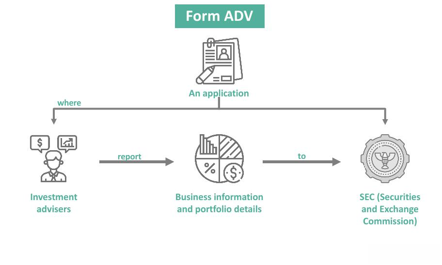

The financial industry operates under a complex regulatory framework designed to maintain market integrity and protect investors. This framework is shaped by a multitude of regulations and compliance requirements that govern the behavior of market participants, including investment advisers. Investment advisers play a critical role in managing investment portfolios and providing financial advice, making them essential to the financial ecosystem.

Form ADV-E is a pivotal document within this regulatory landscape. It is specifically used by investment advisers who have custody of client funds or securities. This form ensures that advisers undergo an annual surprise examination by an independent public accountant to verify the assets they claim to manage, thereby protecting clients from potential fraud or mismanagement. Non-compliance with Form ADV-E can result in significant penalties, emphasizing its relevance in the regulatory framework.

Investment advisers are obligated to uphold fiduciary duties, which require them to act in the best interest of their clients, making transparency and disclosure paramount. This obligation is central to maintaining trust and confidence in the financial markets. The effectiveness of financial regulation in this context is crucial, as it deters fraudulent activities and ensures fair trading practices, which are essential for a stable market environment.

The rise of algorithmic trading has introduced new dimensions to financial markets, characterized by the increased use of complex algorithms to execute trading strategies at high speeds. While algorithmic trading has enhanced market efficiency and liquidity, it also presents unique regulatory challenges. These include the potential for market manipulation, technical failures, and systemic risk. Consequently, regulatory bodies must continually adapt and implement measures to oversee these activities effectively, balancing innovation with investor protection. This dynamic interplay between technology and regulation underscores the ongoing evolution of the financial industry.

## Table of Contents

## Understanding Form ADV-E

Form ADV-E is a mandatory form utilized by investment advisers registered with the Securities and Exchange Commission (SEC) to facilitate the examination of investment funds' financial records. It is specifically designed to accompany the report prepared by the independent public accountant after an audit of client assets held in custody. This form plays a crucial role in ensuring the integrity and transparency of financial operations within advisory services by mitigating the risk of misappropriation of client assets.

### The Filing Process of Form ADV-E

Filing Form ADV-E involves several steps. Investment advisers subject to custody rules must engage an independent public accountant to conduct an annual surprise examination of client assets. Upon completion of the audit, the accountant is responsible for filing Form ADV-E with the SEC. The form includes critical information such as the date of the surprise examination, the extent to which the independent examination was conducted, and any discrepancies or findings. This process ensures that advisers adhere to the regulatory standards set by the SEC and maintain accurate and honest financial records.

### Who Needs to Complete Form ADV-E and Under What Circumstances

Form ADV-E must be completed by all SEC-registered investment advisers who have custody of client funds or securities, suggesting that they hold, directly or indirectly, client funds or securities, or have any authority to obtain possession of them. This requirement ensures that the advisers are subjected to regular scrutiny, thereby protecting client interests. The circumstances necessitating the completion of this form arise when an adviser takes on a custodial role, fundamentally altering their obligations under financial regulations.

### Impact of Non-Compliance with Form ADV-E Requirements

Non-compliance with Form ADV-E requirements can have significant repercussions for investment advisers. Failure to submit the form following a surprise examination, or inaccuracies within the form, can result in enforcement actions by the SEC. These actions may include fines, penalties, or more severe sanctions such as suspension or revocation of the adviser's registration. This illustrates the SEC’s commitment to maintaining strict adherence to regulatory protocols and underscores the importance of compliance for safeguarding investor interests.

### The Role of the Securities and Exchange Commission (SEC) in Form ADV-E Regulation

The SEC plays a fundamental role in the regulation of Form ADV-E by establishing and enforcing the guidelines under which investment advisers operate. It ensures that advisers with custodial access to client assets are subject to regular and rigorous checks to prevent fraudulent activities. The SEC not only mandates the surprise examination required for Form ADV-E submission but also reviews the findings reported through these examinations to identify potential violations or areas of concern. By overseeing Form ADV-E regulation, the SEC aims to maintain the integrity and stability of the financial markets, fostering a trustworthy environment for investors and stakeholders alike.

In conclusion, Form ADV-E serves as a pivotal regulatory tool within the financial advisory sector, ensuring that investment advisers maintain transparency and accountability in their custodial duties. Compliance with these regulations protects client interests and supports the broader aim of sustaining ethical standards in the financial industry.

## Investment Advisers and Their Regulatory Obligations

Investment advisers play a critical role in the financial markets, providing guidance on investment strategies and asset management to clients ranging from individuals to large institutions. Their responsibilities are governed by a robust regulatory framework designed to ensure integrity, transparency, and fiduciary duty in the execution of their services.

A key responsibility of investment advisers is their fiduciary duty to clients. This duty mandates that advisers act in the best interests of their clients, placing the clients’ interests above their own. The fiduciary standard requires advisers to provide advice that is fair, transparent, and well-informed by analyzing all relevant information that could impact their clients’ decision-making processes. This is crucial in maintaining trust between advisers and their clients, which is foundational in the financial advisory relationship.

Transparency and disclosure are equally important in investment advising. Regulations, such as those enforced by the Securities and Exchange Commission (SEC), require advisers to disclose material information that could influence investment decisions. This includes disclosing conflicts of interest, compensation arrangements, and the methodologies employed in investment strategies. Transparency allows clients to make informed decisions and fosters a sense of accountability among investment advisers.

Regulatory oversight significantly influences how investment advisers make decisions and provide advice. Regulations set the boundaries within which advisers must operate, dictating how products are marketed, sold, and managed. Regulations aim to minimize risks associated with fraudulent activities and market abuse, thereby upholding market stability. Compliance with these regulations is not optional; non-adherence can lead to legal penalties and damage to the adviser’s reputation.

Recent trends in regulatory obligations for investment advisers have centered around enhanced reporting standards, increased scrutiny of cybersecurity practices, and greater emphasis on environmental, social, and governance ([ESG](/wiki/esg-investing)) factors. For instance, the rise of ESG investing has prompted regulators to develop guidelines that ensure the claims made by advisers regarding ESG strategies are accurate and substantiated. Additionally, the evolution of technology and [algorithmic trading](/wiki/algorithmic-trading) has introduced new regulatory challenges, necessitating updated compliance strategies to address the risks posed by sophisticated investment tools and platforms.

Overall, the regulatory expectations for investment advisers are constantly evolving to adapt to new market developments and emerging risks. Advisers must stay informed about changes in the regulatory landscape and implement compliance best practices to efficiently navigate their obligations. This proactive approach not only safeguards their legal standing but also enhances their reputation as trustworthy and client-centric professionals in the financial markets.

## Algorithmic Trading: An Overview

Algorithmic trading refers to the use of computer algorithms to execute trading decisions in financial markets, optimizing the speed and precision of transactions. Over recent years, it has gained significant importance due to its ability to process vast amounts of data and execute trades at speeds and frequencies beyond human capability.

Algorithmic trading has profoundly transformed financial markets by enhancing [liquidity](/wiki/liquidity-risk-premium) and narrowing bid-ask spreads, thereby reducing transaction costs. It enables market participants to implement complex trading strategies with high efficiency, contributing to the overall market efficiency. The automation of trading activities reduces human biases and emotions, providing a methodical approach to executing trades.

Technology plays a crucial role in the development of trading algorithms. Advances in computing power and data analytics have enabled the design of sophisticated models capable of analyzing multiple market variables in real time. High-frequency trading ([HFT](/wiki/high-frequency-trading-strategies)), a subset of algorithmic trading, exemplifies these advancements, allowing thousands of transactions to be executed within microseconds.

However, algorithmic trading presents both benefits and challenges. Benefits include improved market liquidity, increased transaction speed, and reduced costs. Additionally, algorithms can process diverse data sets to derive insights that inform trading strategies, facilitating risk management and decision-making. Conversely, challenges include the risk of market manipulation, increased [volatility](/wiki/volatility-trading-strategies) due to rapid trade execution, and the potential for systemic risks arising from algorithmic failures. These challenges necessitate robust risk management and regulatory oversight.

Common algorithmic trading strategies encompass various techniques. **Market-making strategies** involve placing simultaneous buy and sell orders to capture the bid-ask spread. **Trend-following strategies** identify price trends and execute trades in the direction of the trend. **Arbitrage strategies** exploit price discrepancies across different markets or instruments to capture riskless profits. Another approach, **statistical [arbitrage](/wiki/arbitrage)**, relies on statistical models to identify temporary mispricings in securities. **Mean reversion strategies** are based on the assumption that asset prices tend to revert to their historical averages over time.

In summary, algorithmic trading has revolutionized financial markets, introducing efficiencies and complexities that continue to shape the industry. It remains essential for stakeholders to balance technological advancements with the mitigation of associated risks through effective regulation and oversight.

## Regulating Algorithmic Trading: Key Considerations

Algorithmic trading, a method of executing orders using automated and pre-programmed trading instructions, has become a prevalent practice within financial markets. The need for regulation in algorithmic trading emerges due to several factors. Its high-speed nature and the complex algorithms involved pose risks, including market manipulation, systemic risk, and the potential for significant financial losses. Without proper oversight, these risks could disrupt market stability and investor confidence.

### Potential Risks and Issues Associated with Unregulated Algorithmic Trading

Unregulated algorithmic trading can lead to various challenges, primarily due to its automated and often opaque nature. Some of these risks include:

1. **Market Manipulation**: Algorithmic trading systems can engage in strategies like spoofing or layering, where orders are placed with the intention of being canceled to manipulate market prices.

2. **Systemic Risk**: The high-frequency nature of algorithmic trading can lead to rapid market movements, exacerbating volatility and potentially triggering systemic market crashes, such as the Flash Crash of 2010.

3. **Operational Failures**: Technical glitches or faults in the software can lead to unintended orders and trades, causing substantial financial losses and market disturbances.

### How Form ADV-E Interacts with Algorithmic Trading Regulations

Form ADV-E is primarily related to the custody rule under the Investment Advisers Act of 1940. Although it does not directly regulate algorithmic trading, investment advisers utilizing algorithmic trading strategies must ensure compliance with all reporting and disclosure requirements, including those pertaining to Form ADV-E. This form certifies that an entity's financial statements have been audited, which is essential for maintaining transparency and trust with clients.

While Form ADV-E itself does not govern algorithmic trading, its compliance mechanisms indirectly ensure that investment advisers employing algorithmic strategies adhere to broader regulatory standards, maintaining the integrity of their fiduciary responsibilities.

### Key Regulatory Bodies Overseeing Algorithmic Trading Practices

Multiple regulatory bodies play pivotal roles in overseeing algorithmic trading activities. In the United States, the **Securities and Exchange Commission (SEC)** and the **Commodity Futures Trading Commission (CFTC)** are two primary agencies responsible for regulating securities and futures markets, respectively. These bodies ensure that algorithmic trading adheres to established market rules and transparency standards.

Globally, other entities such as the **European Securities and Markets Authority (ESMA)** oversee algorithmic trading practices within the European Union. These organizations set guidelines and enforce compliance to mitigate risks associated with high-frequency trading.

### Current Regulations Specific to Algorithmic Trading and Their Implications

Several regulations address algorithmic and high-frequency trading. In the U.S., the SEC's **Regulation National Market System (Reg NMS)** aims to improve fairness in price execution and transparency. The CFTC's **Reg AT** (Regulation Automated Trading) proposal seeks to enhance oversight of algorithmic trading in the futures market, though it remains under consideration and debate.

In Europe, the **Markets in Financial Instruments Directive II (MiFID II)** imposes stringent requirements on algorithmic trading, including pre- and post-trade transparency, risk controls, and reporting obligations.

These regulations aim to synthesize technology's advantages with necessary safeguards, ensuring that algorithms operate within controlled, ethical, and transparent frameworks. Failure to comply with these regulations can result in significant penalties, loss of trading privileges, and reputational damage.

In conclusion, the regulation of algorithmic trading is crucial to maintain market integrity, protect investors, and ensure operational stability in the financial markets. Through rigorous oversight and the enforcement of comprehensive rules, regulatory bodies strive to mitigate the risks inherent in automated trading practices.

## Compliance and Best Practices for Investment Advisers

Compliance with financial regulations is crucial for investment advisers as it ensures the integrity of financial markets and protects investor interests. Adhering to regulatory standards such as those outlined in Form ADV-E helps investment advisers maintain transparency and trust with their clients and regulatory bodies like the Securities and Exchange Commission (SEC).

Best practices for maintaining regulatory compliance involve implementing a robust compliance program tailored to the specific operations of the investment firm. This includes regular audits, adherence to ethical standards, and continuous education for staff about current regulations. Documenting compliance efforts and decisions is essential to demonstrate adherence in the event of an audit or investigation.

Technology plays a vital role in aiding compliance with Form ADV-E and other regulatory requirements. Investment advisers leverage software that automates data collection, reporting, and monitoring of compliance metrics. This ensures accuracy and reduces the administrative burden associated with manual reporting. For example, software solutions can track changes in regulations, provide alerts for filing deadlines, and facilitate secure documentation management.

In managing risk, especially with algorithmic trading strategies, it is imperative for investment advisers to implement rigorous testing and validation protocols. Algorithmic strategies should undergo [backtesting](/wiki/backtesting) using historical data to evaluate their performance under different market conditions. Additionally, continuous monitoring of algorithmic performance and trade execution is necessary to identify and mitigate potential risks promptly.

Successful compliance within the investment advisory industry can be seen in firms that have effectively integrated compliance functions with their operational framework. These firms often conduct regular training sessions, have open communication channels between compliance officers and trading teams, and utilize technology to streamline compliance processes. For instance, a case study of a large investment advisory firm demonstrated how implementing a comprehensive compliance management system reduced their risk of non-compliance incidents by 30% and enhanced their operational efficiency.

In conclusion, maintaining regulatory compliance is not only a legal obligation for investment advisers but also a strategic component of building and sustaining client trust. Through best practices, technological tools, and effective risk management, investment advisers can navigate the complexities of financial regulations and enhance their service delivery in the evolving landscape of investment advising.

## The Future of Financial Regulation and Algorithmic Trading

The landscape of financial regulation continues to evolve in response to the rapid advancements in technology and the growing complexity of financial markets. Specifically, for investment advisers, these changes present both challenges and opportunities as they navigate shifting regulatory frameworks.

Algorithmic trading, a segment that has seen substantial growth, is poised for further expansion. Its evolution is fueled by advancements in [machine learning](/wiki/machine-learning), data analytics, and computing power. These innovations are transforming how trading strategies are developed and executed. Algorithmic trading systems leverage large datasets to identify patterns and execute trades at speeds far beyond human capability. This growing reliance on technology raises important regulatory considerations aimed at ensuring market stability and integrity.

Regulators will face significant challenges in adapting their frameworks to address the complexities of algorithmic trading. Key areas of focus include ensuring transparency, preventing market manipulation, and safeguarding against systemic risks posed by high-frequency trading activities. Regulatory bodies like the Securities and Exchange Commission (SEC) must strike a balance between fostering innovation and protecting market participants.

One potential area of regulation is the imposition of stricter reporting and disclosure requirements. Investment advisers engaged in algorithmic trading may have to provide detailed insights into their algorithms, including their decision-making processes and risk management strategies. This transparency could enhance investor confidence while aiding regulators in monitoring market activities.

As algorithms become more sophisticated, regulators might also explore the establishment of testing and certification processes for trading software. This would ensure algorithms meet certain standards for quality and compliance. Additionally, there could be further development of "kill switches" to halt or slow trading operations in case of malfunctioning algorithms, preventing potential market crises.

Looking forward, the intersection of financial regulation and algorithmic trading will likely see enhanced collaboration between regulators and industry leaders to develop adaptive policies that promote innovation while mitigating risks. Developers and traders must focus on creating algorithms that are not only efficient but also compliant with existing and future regulations. 

In conclusion, the future of financial regulation and algorithmic trading necessitates a comprehensive understanding of regulatory obligations, such as those outlined by Form ADV-E. The continuous advancement of technology in trading practices requires a dynamic regulatory landscape that can evolve to maintain market integrity, offering both challenges and opportunities for investment advisers and regulators alike.

## References & Further Reading

[1]: Securities and Exchange Commission. ["Investment Adviser Regulation."](https://www.sec.gov/about/offices/oia/oia_investman/rplaze-042012.pdf) Accessed October 2023.

[2]: Securities and Exchange Commission. ["Custody of Funds or Securities of Clients by Investment Advisers – Form ADV-E."](https://www.sec.gov/rules-regulations/2009/12/custody-funds-or-securities-clients-investment-advisers) SEC Release No. IA-2968.

[3]: Hasbrouck, J. (2019). ["High Frequency Trading and the New Market Makers."](https://www.sciencedirect.com/science/article/pii/S1386418113000281) Oxford University Press.

[4]: Aldridge, I., & Krawciw, S. (2017). ["Real-time Risk: What Investors Should Know About Fintech, High-Frequency Trading, and Flash Crashes."](https://ijmrset.com/upload/86_The.pdf) Wiley.

[5]: European Securities and Markets Authority (ESMA). ["Guidelines on MiFID II Requirements for Algorithmic Trading."](https://www.esma.europa.eu/publications-and-data/interactive-single-rulebook/mifid-ii) 2018.