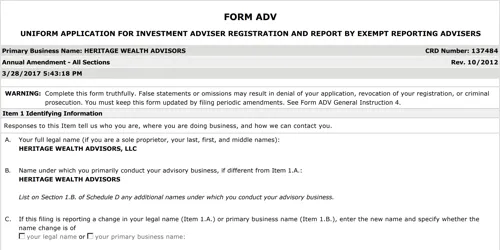

## Table of Contents

## What is Form ADV-E?

Form ADV-E is a document that investment advisers use when they work with a certain type of company called a "custodian." This form helps make sure that the investment adviser is following the rules and keeping the custodian's money safe. It's like a report card that shows if the adviser is doing a good job.

The form has different parts that the adviser needs to fill out. They have to say how much money they are managing, what kind of investments they are making, and if there have been any problems. The custodian then checks this information to make sure everything is okay. It's an important tool to help keep investments safe and honest.

## Who needs to file Form ADV-E?

Investment advisers who work with custodians need to file Form ADV-E. A custodian is a company that holds onto money and other assets for people. When an investment adviser manages these assets, they have to follow special rules to make sure the money is safe. Form ADV-E helps the custodian check that the adviser is doing everything right.

The adviser fills out the form with information about how much money they are managing, what kinds of investments they are making, and if there have been any problems. This helps the custodian see if the adviser is following the rules. It's important for keeping investments safe and making sure everyone is honest.

## What is the purpose of Form ADV-E?

Form ADV-E is a special form that investment advisers use when they work with a company called a custodian. The main purpose of this form is to help make sure that the investment adviser is following all the rules and keeping the custodian's money safe. It's like a report card that shows if the adviser is doing a good job.

The form has different parts that the adviser needs to fill out. They have to write down how much money they are managing, what kind of investments they are making, and if there have been any problems. The custodian then looks at this information to make sure everything is okay. This helps keep investments safe and honest.

## How often must Form ADV-E be filed?

Investment advisers need to file Form ADV-E every year. This form helps make sure they are following the rules when they work with a company called a custodian, which holds onto money and other assets for people.

The adviser fills out the form with information about how much money they are managing, what kinds of investments they are making, and if there have been any problems. The custodian then checks this information to make sure everything is okay. Filing Form ADV-E every year helps keep investments safe and honest.

## What information is required on Form ADV-E?

Form ADV-E is a document that investment advisers need to fill out when they work with a company called a custodian. The form asks for basic information about the adviser's business. This includes the name of the adviser, their address, and the date the form is being filled out. It also requires the adviser to list the name and address of the custodian they are working with.

The form also asks for details about the money the adviser is managing. They need to write down how much money they are in charge of and what kinds of investments they are making with that money. The adviser also has to report if there have been any problems or if anything went wrong with the investments. This information helps the custodian check if the adviser is following the rules and keeping the money safe.

## What are the deadlines for filing Form ADV-E?

Form ADV-E needs to be filed every year. The deadline for filing this form is within 120 days after the end of the adviser's fiscal year. The fiscal year is like a special calendar year that a business uses for its money and taxes.

If an adviser's fiscal year ends on December 31, they would need to file Form ADV-E by April 30 of the next year. This form helps make sure the adviser is doing a good job and following the rules when they work with a custodian, which is a company that holds onto money and other assets for people.

## How does Form ADV-E relate to the custody rule?

Form ADV-E is closely related to the custody rule, which is a set of rules that investment advisers must follow when they have control over their clients' money or assets. The custody rule is there to make sure that the adviser keeps the clients' money safe and doesn't misuse it. When an adviser works with a custodian, which is a company that holds onto money and other assets for people, they need to follow these rules very carefully.

Form ADV-E is a special form that helps the custodian check if the adviser is following the custody rule. The adviser fills out the form with information about how much money they are managing, what kinds of investments they are making, and if there have been any problems. By filing Form ADV-E every year, the adviser shows the custodian that they are doing everything right and keeping the clients' money safe. This helps make sure that the investments are honest and secure.

## What are the consequences of not filing Form ADV-E on time?

If an investment adviser does not file Form ADV-E on time, they could get into trouble. The custodian, which is the company that holds onto the clients' money, might not trust the adviser anymore. This could lead to the custodian ending their relationship with the adviser, which means the adviser would lose the chance to manage that money.

Also, not filing Form ADV-E on time could lead to problems with the law. The Securities and Exchange Commission (SEC), which is like a big boss that makes sure everyone follows the rules, might start looking into why the form was not filed on time. If they find out that the adviser did something wrong, the adviser could get fined or even lose their license to work as an investment adviser. It's really important to file Form ADV-E on time to avoid these problems.

## Can Form ADV-E be amended, and if so, how?

Yes, Form ADV-E can be amended if something changes or if there is a mistake that needs to be fixed. If an investment adviser needs to make changes to the form, they have to fill out a new Form ADV-E with the updated information. This new form should be sent to the custodian, which is the company that holds onto the clients' money.

The adviser should explain why they are amending the form in a clear way. They can write a short note or letter to go along with the new form, saying what has changed and why. It's important to do this quickly so that the custodian always has the right information and can make sure the adviser is following the rules.

## What are the differences between Form ADV and Form ADV-E?

Form ADV and Form ADV-E are two different forms that investment advisers use, but they serve different purposes. Form ADV is a main form that all investment advisers have to file with the Securities and Exchange Commission (SEC) or state securities authorities. It gives a lot of information about the adviser's business, like who they are, what services they offer, how they get paid, and if they have any legal problems. It's like a big report that helps regulators keep an eye on advisers and make sure they are following the rules.

On the other hand, Form ADV-E is a special form that only some advisers need to fill out. It's used when an adviser works with a company called a custodian, which holds onto money and other assets for people. Form ADV-E helps the custodian check if the adviser is doing a good job and following the rules about managing the money. It's filed every year and includes details about how much money the adviser is managing, what kinds of investments they are making, and if there have been any problems. While Form ADV is about giving a broad picture of the adviser's business, Form ADV-E is more focused on ensuring the safety and honesty of the money they manage.

## How does the SEC use the information from Form ADV-E?

The Securities and Exchange Commission (SEC) uses the information from Form ADV-E to make sure that investment advisers are following the rules when they work with custodians. A custodian is a company that holds onto money and other assets for people. The SEC looks at the form to see how much money the adviser is managing, what kinds of investments they are making, and if there have been any problems. This helps the SEC check if the adviser is keeping the clients' money safe and not doing anything wrong.

By reviewing Form ADV-E, the SEC can spot any issues or red flags that might need more looking into. If they find something that doesn't seem right, they might start an investigation to make sure the adviser is following the law. This helps keep the investment world honest and protects people's money.

## What are best practices for ensuring compliance with Form ADV-E requirements?

To make sure you follow the rules for Form ADV-E, it's important to keep good records. Write down everything about the money you manage, the investments you make, and any problems that come up. This way, when it's time to fill out the form, you have all the information you need. Also, set reminders for the deadline, which is 120 days after the end of your fiscal year. This helps you file the form on time and avoid any trouble.

It's also a good idea to double-check your work. Before you send Form ADV-E to the custodian, read it over carefully to make sure everything is correct. If you find any mistakes, fix them right away. If something changes after you file the form, fill out a new one with the updated information and send it to the custodian quickly. This shows that you are honest and careful, which helps build trust with the custodian and keeps you in line with the rules.

## References & Further Reading

[1]: Securities and Exchange Commission. ["Investment Adviser Regulation."](https://www.sec.gov/about/offices/oia/oia_investman/rplaze-042012.pdf) Accessed October 2023.

[2]: Securities and Exchange Commission. ["Custody of Funds or Securities of Clients by Investment Advisers – Form ADV-E."](https://www.sec.gov/rules-regulations/2009/12/custody-funds-or-securities-clients-investment-advisers) SEC Release No. IA-2968.

[3]: Hasbrouck, J. (2019). ["High Frequency Trading and the New Market Makers."](https://www.sciencedirect.com/science/article/pii/S1386418113000281) Oxford University Press.

[4]: Aldridge, I., & Krawciw, S. (2017). ["Real-time Risk: What Investors Should Know About Fintech, High-Frequency Trading, and Flash Crashes."](https://ijmrset.com/upload/86_The.pdf) Wiley.

[5]: European Securities and Markets Authority (ESMA). ["Guidelines on MiFID II Requirements for Algorithmic Trading."](https://www.esma.europa.eu/publications-and-data/interactive-single-rulebook/mifid-ii) 2018.