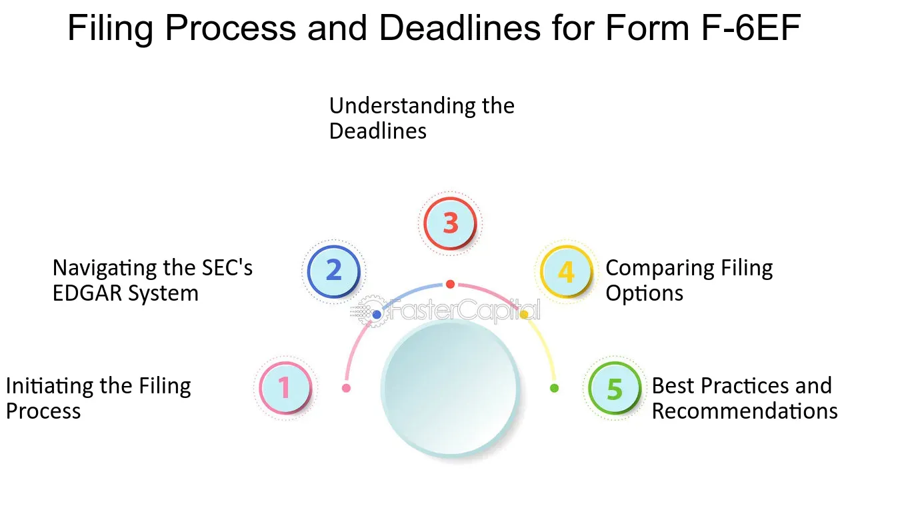

## Table of Contents

## What is Form F-6EF?

Form F-6EF is a document used by companies to register securities that are part of American Depositary Receipts (ADRs) with the U.S. Securities and Exchange Commission (SEC). ADRs are certificates issued by American banks that represent shares in a foreign company, making it easier for Americans to invest in foreign stocks. By filing Form F-6EF, a company can ensure that its ADRs comply with U.S. regulations and can be traded on American stock exchanges.

The form is specifically designed to be an electronic filing, which means it is submitted online through the SEC's Electronic Data Gathering, Analysis, and Retrieval (EDGAR) system. This electronic process makes it easier and faster for companies to get their ADRs registered. Companies need to provide detailed information about the securities, the deposit agreement, and the foreign company itself when they fill out Form F-6EF. This helps the SEC make sure that everything is transparent and follows the rules.

## Who needs to file Form F-6EF?

Form F-6EF needs to be filed by companies that want to offer American Depositary Receipts (ADRs) in the United States. ADRs are a way for Americans to invest in foreign companies. The company that wants to offer these ADRs has to register them with the U.S. Securities and Exchange Commission (SEC) using Form F-6EF.

This form is used to make sure that the ADRs follow U.S. rules. It's an electronic form, which means it's filed online through the SEC's system called EDGAR. Any company, no matter where it's from, that wants its ADRs to be traded on American stock exchanges, needs to fill out and submit this form.

## What is the purpose of filing Form F-6EF?

The purpose of filing Form F-6EF is to register American Depositary Receipts (ADRs) with the U.S. Securities and Exchange Commission (SEC). ADRs are certificates that represent shares in a foreign company and allow Americans to invest in those companies easily. By filing this form, a company makes sure its ADRs follow U.S. rules and can be traded on American stock exchanges.

Form F-6EF is important because it helps keep everything clear and fair for investors. When a company fills out this form, they have to give detailed information about the securities, the deposit agreement, and the foreign company itself. This helps the SEC check that everything is transparent and follows the rules, making it safer for people to invest in ADRs.

## What are the key components of Form F-6EF?

Form F-6EF has several important parts that help the SEC understand what the company is doing with their American Depositary Receipts (ADRs). The first key component is information about the securities themselves. This includes details like the type of securities, how many are being offered, and any special features they might have. The form also needs to include information about the deposit agreement, which is the contract between the foreign company and the bank that issues the ADRs. This part of the form explains the rights and responsibilities of everyone involved.

Another important part of Form F-6EF is information about the foreign company issuing the ADRs. This includes the company's name, where it is located, and what kind of business it does. The form also asks for details about the bank that will be issuing the ADRs, like its name and contact information. All of this information helps the SEC make sure that the ADRs are legitimate and that they follow U.S. rules.

## How does one obtain Form F-6EF?

To get Form F-6EF, you need to visit the website of the U.S. Securities and Exchange Commission (SEC). The SEC's website is easy to use, and you can find the form by searching for "Form F-6EF" in their search bar. Once you find it, you can download the form directly from their site. It's important to make sure you are on the official SEC website to avoid any mistakes or scams.

After downloading Form F-6EF, you will need to fill it out with all the necessary information about your company and the American Depositary Receipts (ADRs) you want to offer. This includes details about the securities, the deposit agreement, and information about your company. Once you have filled out the form, you will need to submit it electronically through the SEC's EDGAR system. This system is designed to make the filing process quick and easy, ensuring that your ADRs can be registered and traded in the U.S.

## What are the deadlines for filing Form F-6EF?

There is no specific deadline for filing Form F-6EF. You can file it whenever you want to register your American Depositary Receipts (ADRs) with the U.S. Securities and Exchange Commission (SEC). The important thing is to make sure you file it before you start offering the ADRs to people in the U.S.

Once you file Form F-6EF, the SEC will review it. They usually take about 30 days to look it over. If everything is okay, your ADRs can start being traded on American stock exchanges. If there are problems, the SEC will let you know, and you might need to fix things before your ADRs can be traded.

## What are the common mistakes to avoid when filing Form F-6EF?

When filling out Form F-6EF, one common mistake is not providing all the necessary information about the securities and the deposit agreement. You need to make sure you include details about the type of securities, how many are being offered, and any special features they might have. Also, the deposit agreement part is important because it explains the rights and responsibilities of everyone involved. If you miss any of this information, the SEC might ask you to fix it, which can delay the process.

Another mistake to watch out for is not giving complete and accurate information about your company and the bank issuing the ADRs. The SEC needs to know the company's name, where it is located, and what kind of business it does. The bank's name and contact information are also important. If any of this information is wrong or missing, it can cause problems with the registration of your ADRs.

Lastly, make sure you file the form through the SEC's EDGAR system correctly. Sometimes, people make mistakes when they submit the form electronically. It's important to follow the instructions carefully to avoid technical errors that could delay the approval of your ADRs.

## How can Form F-6EF be submitted?

Form F-6EF needs to be submitted online using the SEC's EDGAR system. EDGAR stands for Electronic Data Gathering, Analysis, and Retrieval. To submit the form, you first need to visit the SEC's website and download Form F-6EF. After filling it out with all the necessary information about your company and the American Depositary Receipts (ADRs) you want to offer, you can upload it to the EDGAR system. Make sure you follow the instructions carefully to avoid any technical errors that could delay the process.

Once you have uploaded the form, the SEC will review it. They usually take about 30 days to look over everything. If everything is correct, your ADRs can start being traded on American stock exchanges. If there are any mistakes or missing information, the SEC will let you know, and you will need to fix those issues before your ADRs can be approved. It's important to double-check all the information you provide to make sure it is complete and accurate.

## What are the fees associated with filing Form F-6EF?

When you file Form F-6EF with the SEC, you have to pay a fee. The fee is based on how much money you are trying to raise with your American Depositary Receipts (ADRs). The SEC uses a formula to figure out the fee, which is usually a small percentage of the total amount of money you want to raise. You can find the exact fee amount on the SEC's website or by using their fee calculator tool.

It's important to pay the fee when you submit your form through the EDGAR system. If you don't pay the fee, the SEC won't process your Form F-6EF, and your ADRs won't be able to be traded on American stock exchanges. Make sure you include the fee payment with your filing to avoid any delays in getting your ADRs approved.

## What happens after Form F-6EF is filed?

After you file Form F-6EF with the SEC, they will start reviewing it. This usually takes about 30 days. During this time, the SEC checks all the information you provided about your company and the American Depositary Receipts (ADRs) you want to offer. They make sure everything follows the rules and that all the details are correct. If the SEC finds any problems or missing information, they will let you know, and you'll need to fix those issues before your ADRs can be approved.

Once the SEC is happy with everything on your Form F-6EF, they will approve it. After approval, your ADRs can start being traded on American stock exchanges. This means people in the U.S. can buy and sell your ADRs, making it easier for them to invest in your foreign company. If you did everything right and paid the required fee, the whole process should go smoothly, and you'll be able to offer your ADRs to American investors.

## How does Form F-6EF relate to other SEC filings?

Form F-6EF is one of many forms that companies use when they want to follow U.S. rules for selling their stocks. It's special because it's used just for registering American Depositary Receipts (ADRs). ADRs let Americans buy shares in foreign companies easily. When a company files Form F-6EF, it's like telling the SEC, "We want to sell these ADRs in the U.S., and here's all the info you need." This form works together with other SEC filings to make sure everything is clear and follows the rules.

Other SEC filings that might be related to Form F-6EF include Form 20-F, which is used by foreign companies to report their financial information annually, and Form F-1, which is used to register securities for the first time. These forms help the SEC keep track of what companies are doing and make sure investors have all the information they need. By filing Form F-6EF along with these other forms, a company can make sure its ADRs are fully compliant and can be traded on American stock exchanges.

## What are the recent changes or updates to Form F-6EF requirements?

There have been no major changes to the Form F-6EF requirements in recent years. The SEC keeps the rules for filing this form pretty much the same to make sure companies can easily register their American Depositary Receipts (ADRs). The form still needs all the important information about the securities, the deposit agreement, and the foreign company, just like before. If there are any small updates or changes, the SEC usually puts them on their website, so it's a good idea to check there for the latest information.

The main thing to remember is that the process of filing Form F-6EF is still done online through the SEC's EDGAR system. Companies need to make sure they fill out the form correctly and pay the fee based on how much money they want to raise with their ADRs. The SEC reviews the form in about 30 days, and if everything is okay, the ADRs can start being traded on American stock exchanges. Keeping up with any minor updates from the SEC can help make sure the filing goes smoothly.

## References & Further Reading

[1]: Bergstra, J., Bardenet, R., Bengio, Y., & Kégl, B. (2011). ["Algorithms for Hyper-Parameter Optimization."](https://dl.acm.org/doi/10.5555/2986459.2986743) Advances in Neural Information Processing Systems 24.

[2]: ["Advances in Financial Machine Learning"](https://www.amazon.com/Advances-Financial-Machine-Learning-Marcos/dp/1119482089) by Marcos Lopez de Prado

[3]: ["Evidence-Based Technical Analysis: Applying the Scientific Method and Statistical Inference to Trading Signals"](https://www.amazon.com/Evidence-Based-Technical-Analysis-Scientific-Statistical/dp/0470008741) by David Aronson

[4]: ["Machine Learning for Algorithmic Trading"](https://github.com/stefan-jansen/machine-learning-for-trading) by Stefan Jansen

[5]: ["Quantitative Trading: How to Build Your Own Algorithmic Trading Business"](https://www.amazon.com/Quantitative-Trading-Build-Algorithmic-Business/dp/1119800064) by Ernest P. Chan