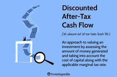

In the modern workplace, ensuring compliance with employment laws is crucial for businesses of all sizes. A critical component in this compliance landscape is the I-9 Employment Verification form, which plays a pivotal role in verifying the employment eligibility of potential hires. This document is mandated by the United States Citizenship and Immigration Services (USCIS) and is required for all new employees, serving as a safeguard against unauthorized employment and maintaining the integrity of the workforce.

Simultaneously, another significant transformation is occurring within financial markets through algorithmic trading, or algo trading. This technology-driven approach to trading involves the use of computer algorithms to automate the process of evaluating market data and executing trades. The rise of algo trading has not only transformed how market transactions occur but also introduced new efficiencies and complexities in trade execution. Its rapid execution capabilities provide liquidity and enable more efficient trading strategies, reshaping the landscape of financial markets.

This article explores the intersection of employment verification and algo trading, highlighting their importance and differences. While both areas emphasize compliance, they involve distinct regulatory frameworks that businesses must navigate. Understanding both concepts is essential for businesses operating in industries affected by labor and financial regulations. The I-9 form ensures compliance with employment laws, whereas algo trading stands at the forefront of financial innovation and technology. Both require a thorough understanding of compliance requirements to mitigate risks and enhance operational effectiveness.

## Table of Contents

## What is the I-9 Employment Verification Form?

The Form I-9, issued by the United States Citizenship and Immigration Services (USCIS), is an essential document for employers to establish the identity and employment eligibility of individuals they intend to hire in the United States. This form is a pivotal compliance tool that supports immigration laws aimed at preventing unauthorized employment.

Employers are obligated to ensure that the Form I-9 is completed for each new employee, irrespective of their citizenship status. The process involves both the employee and employer, where the employee must attest to their employment authorization and present valid documentation as evidence. Acceptable documents are categorized into three lists: List A, which verifies both identity and employment eligibility; List B, which verifies identity only; and List C, which verifies employment eligibility only. Employees need to present either one document from List A or one document each from both List B and List C.

The employer is responsible for physically examining these documents to ensure they appear genuine and applicable to the particular employee. Once examined, employers complete the relevant sections of the Form I-9, verifying on record the presented documentation.

Employers are required by law to retain the completed I-9 forms for each employee for either three years after the date of hire or one year after the date the employee's employment ended, whichever is later. This stipulation allows for authorized officials to inspect these records if necessary. Non-compliance with this requirement can lead to substantial fines and legal challenges.

HR professionals and business owners must be well-versed with the components and submission processes of the Form I-9 to mitigate risks associated with hiring practices. This comprehension includes understanding legislative changes and digital updating processes, which are increasingly becoming a part of the I-9 form management to enhance efficiency and security in verification practices.

## Understanding Algo Trading

Algorithmic trading, often abbreviated as algo trading, employs computer algorithms to facilitate the decision-making process in financial trading. These algorithms autonomously analyze complex data sets, identify trading opportunities, and execute trades, often at speeds and frequencies that far exceed human capabilities. This technological advancement has significantly transformed financial markets, contributing to increased [liquidity](/wiki/liquidity-risk-premium) and more efficient trading mechanisms.

The core advantage of algo trading lies in its ability to handle vast amounts of market data in real-time, applying pre-set quantitative parameters to make trading decisions. This is achieved through the implementation of mathematical models and statistical analyses that aim to exploit market inefficiencies and price differentials. For instance, an algorithm might be designed to execute a trade when a stock is undervalued according to historical pricing data or when [arbitrage](/wiki/arbitrage) opportunities arise between different markets.

Despite its benefits, algo trading presents notable challenges. A key concern is the regulatory scrutiny it attracts. Financial regulators, such as the U.S. Securities and Exchange Commission (SEC) and the European Securities and Markets Authority (ESMA), impose stringent compliance requirements on [algorithmic trading](/wiki/algorithmic-trading) to mitigate risks such as market manipulation and systemic failures. For example, the 2010 "Flash Crash" highlighted how algorithmic trading could rapidly exacerbate market [volatility](/wiki/volatility-trading-strategies), resulting in significant financial distortions.

Moreover, traders and financial institutions utilize algorithmic trading to gain competitive edges, leveraging these systems to optimize trade execution and minimize transaction costs. However, they must adeptly navigate a complex compliance landscape characterized by evolving regulations and technological standards. This necessitates robust risk management frameworks and continuous monitoring to ensure adherence to regulatory guidelines and maintain market stability.

In conclusion, while algo trading revolutionizes trading efficiency and market liquidity, it also demands precise regulation and strategic oversight to prevent potential disruptions and maintain the integrity of financial markets.

## The Importance of Compliance

Compliance with legal requirements in employment verification and financial markets is essential to avoid penalties and maintain operational integrity. In the context of employment verification, the Form I-9 is a critical document that U.S. employers must complete and retain for each employee. Non-compliance in this area can lead to significant fines and legal repercussions. For instance, businesses that fail to properly complete or retain I-9 forms can face penalties ranging from monetary fines to criminal charges, depending on the severity and nature of the violation [source](https://www.uscis.gov/i-9-central/about-form-i-9).

In algorithmic trading, the situation is comparably stringent. Algo trading systems, characterized by their speed and complexity, must adhere to multiple layers of regulatory standards. Failures in compliance can result in substantial financial losses and damage to the firm's reputation. Regulatory bodies like the U.S. Securities and Exchange Commission (SEC) and the European Securities and Markets Authority (ESMA) have established strict guidelines to oversee trading activities and prevent market manipulation [source](https://www.sec.gov/).

Both employment verification and algo trading highlight the necessity of continuously monitoring and updating compliance procedures to meet evolving regulations. This monitoring involves not only staying updated on regulatory changes but also understanding their implications for existing practices. Organizations should actively revise their protocols to reflect any regulatory updates or changes in legal interpretations.

Effective tools and strategies for maintaining compliance are integral to organizational governance frameworks. In employment, businesses can implement audit mechanisms to regularly review I-9 forms and related documentation, ensuring that any discrepancies are quickly addressed. In the case of algorithmic trading, firms often deploy advanced software tools for real-time trade monitoring and automated compliance reporting. The use of technology can significantly enhance the accuracy and efficiency of compliance efforts, reducing the risk of errors and ensuring prompt responses to potential issues.

Ultimately, a proactive approach to compliance helps businesses minimize risks and maintain operational integrity. By making compliance a central component of their governance frameworks, organizations can safeguard their operations against legal challenges and cultivate a culture of accountability and transparency.

## The Intersection of HR Compliance and Technology

The intersection of HR compliance and technology demonstrates how advancements in digital tools are transforming traditional processes. In the context of employment verification, digital verification tools are revolutionizing the I-9 process. These tools allow for electronic completion and storage of Form I-9, enhancing accessibility and security while ensuring that documentation is complete and error-free. For instance, e-verify systems can automatically cross-reference data with governmental databases to authenticate the eligibility of a potential employee swiftly, reducing the risk of non-compliance with immigration laws.

In the domain of algorithmic trading, technology plays a crucial role by enhancing the precision and efficiency of trade executions. Algorithms can analyze massive datasets to identify profitable trading opportunities, executing trades at a speed unattainable by human traders. However, this increased efficiency comes with the necessity for rigorous compliance frameworks to monitor and regulate market activities. Algorithm-driven trading systems must align with financial regulations to prevent market manipulation and ensure transparency. Here, technology aids by providing real-time monitoring and automated reporting capabilities, allowing traders to adhere to regulatory standards effectively.

The synergy between HR compliance and algorithmic trading highlights a unifying theme: the reliance on technology to improve accuracy and minimize risks associated with compliance failures. Businesses can learn from both fields by integrating technologies that provide automated checks, real-time data analysis, and robust security measures. Implementing such technologies requires an organizational change, ensuring that all departments, including HR, legal, compliance, and IT, collaborate closely. This interdisciplinary approach fosters a more cohesive understanding of compliance requirements, leading to a more robust compliance culture.

As technology continues to evolve, the future of compliance will increasingly depend on the seamless integration of advanced systems across various business functions. For instance, blockchain technology might offer new avenues for secure data sharing and verification, while [artificial intelligence](/wiki/ai-artificial-intelligence) can provide predictive analytics for identifying potential compliance risks. Consequently, businesses must remain agile, continuously adapting to technological advancements to maintain their compliance and competitive edge in a rapidly changing regulatory environment.

## Best Practices for Businesses

Implementing routine audits of I-9 forms is a critical practice for ensuring compliance with employment verification laws and preventing potentially costly mistakes. Regular audits allow businesses to identify and rectify discrepancies in documentation promptly, thereby reducing the risk of non-compliance penalties. These audits should be part of a comprehensive compliance strategy that includes staying informed about any updates or changes in employment verification policies. By doing so, employers can ensure that their processes are aligned with the latest legal requirements, mitigating the risk of legal pitfalls associated with outdated or incorrect practices.

In the context of algorithmic trading, the rigorous testing and continuous monitoring of algorithms are essential to safeguard against market anomalies and ensure trades are executed as intended. This involves running simulations, back-testing strategies with historical data, and employing real-time monitoring systems to detect and respond to suspicious activities or unexpected behaviors. Such practices help maintain the integrity of trading operations and protect against potential financial disruptions.

To create a holistic compliance culture within organizations, collaboration between legal, HR, and technical departments is key. By fostering interdepartmental communication and collaboration, businesses can ensure that compliance responsibilities are understood and shared across the organization. This integrated approach promotes a comprehensive understanding of compliance obligations and enhances the organization's ability to respond to regulatory changes.

Training and development programs focused on compliance in both employment practices and trading technology are also crucial. These programs help employees stay informed about their compliance responsibilities and provide them with the skills necessary to navigate complex regulatory landscapes. By investing in ongoing education and training, businesses can equip their workforce with the knowledge to effectively manage compliance risks and contribute to overall organizational success.

Establishing best practices for compliance not only reduces risks but also enhances the credibility and operational efficiency of businesses. By adopting these strategies, companies can effectively navigate and thrive in today’s increasingly regulated and technologically advanced landscape.

## Conclusion

Navigating the complexities of employment verification and algo trading compliance is a critical task for modern businesses. Both areas demand a keen understanding of regulatory requirements and the adoption of effective strategies to ensure adherence. For example, the I-9 form serves as a foundational element in employment law, ensuring that companies comply with immigration regulations and verify the eligibility of their workforce. Failure to adhere to these requirements can result in severe penalties, including fines and reputational damage.

Similarly, algorithmic trading represents a cutting-edge sector in the financial markets. It requires meticulous attention to compliance guidelines and robust risk management to prevent market anomalies and ensure trading integrity. Regulatory bodies frequently update standards, reflecting the dynamic nature of global markets and technological advancements. Thus, staying informed about these changes is crucial.

Ensuring compliance across both employment verification and algo trading not only reduces risks but also enhances the credibility and efficiency of operations. Companies that prioritize compliance are better positioned to sustain long-term success, as they foster trust with regulators, employees, and investors. Additionally, by implementing best practices such as routine audits and continuous training programs, businesses can create a proactive compliance culture.

Embracing a holistic approach to compliance—leveraging technological innovations and cross-departmental collaboration—will enable businesses to thrive in an increasingly regulated and technological landscape. By integrating advanced verification tools and sophisticated trading algorithms with comprehensive compliance frameworks, companies can navigate any challenges that arise, securing their competitive advantage in the marketplace.

## References & Further Reading

[1]: ["Instructions for Form I-9, Employment Eligibility Verification."](https://www.uscis.gov/sites/default/files/document/forms/i-9instr.pdf) United States Citizenship and Immigration Services (USCIS).

[2]: Securities and Exchange Commission (SEC). ["Algorithmic Trading and Market Dynamics."](https://www.sec.gov/file/Algo_Trading_Report_2020.pdf)

[3]: Lopez de Prado, M. (2018). ["Advances in Financial Machine Learning."](https://www.amazon.com/Advances-Financial-Machine-Learning-Marcos/dp/1119482089) John Wiley & Sons.

[4]: Aronson, D. (2006). ["Evidence-Based Technical Analysis: Applying the Scientific Method and Statistical Inference to Trading Signals."](https://www.amazon.com/Evidence-Based-Technical-Analysis-Scientific-Statistical/dp/0470008741) John Wiley & Sons.

[5]: Chan, E. P. (2008). ["Quantitative Trading: How to Build Your Own Algorithmic Trading Business."](https://github.com/ftvision/quant_trading_echan_book) John Wiley & Sons.