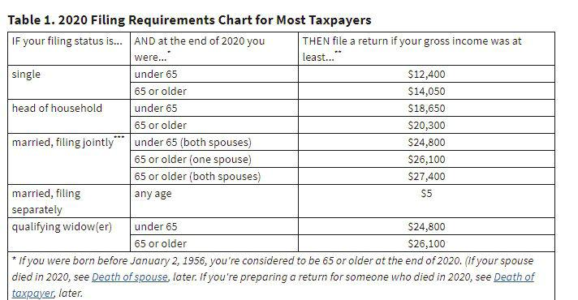

In the rapidly evolving world of finance, algorithmic trading has gained significant traction due to its potential for increased efficiency and precision in the trading process. This innovative approach leverages computer algorithms to automatically execute trades based on pre-defined criteria, thereby reducing human intervention and the possibility of human error. As a result, algorithmic trading can facilitate high-frequency trading, improve liquidity, and narrow bid-ask spreads within the financial markets.

However, with the proliferation of algorithmic trading, there arises a critical need for regulatory oversight to ensure that trading activities are conducted transparently and ethically. Regulatory bodies, such as the Financial Industry Regulatory Authority (FINRA) in the United States, have introduced various guidelines and reporting requirements to uphold market integrity. These measures are designed to prevent market manipulation, reduce systemic risks, and protect investors' interests.



One essential regulatory requirement is the Form T filing. Form T is crucial for reporting certain types of equity trades, specifically those executed outside regular market hours. This ensures that such trades are transparently documented and accessible for regulatory review. Algorithmic traders, whose operations often span beyond standard trading hours, must be acutely aware of, and compliant with, these reporting obligations to maintain market credibility and avoid potential penalties.

This article provides an overview of the Form T filing guidelines, particularly in the context of algorithmic trading. It will explore what Form T entails, identify the parties required to file it, and outline the steps involved in its submission process. Understanding these elements is vital for algorithmic traders and firms aiming to adhere to regulatory standards while harnessing the benefits of automated trading strategies.

## Table of Contents

## Understanding Form T

Form T is an electronic form mandated by the Financial Industry Regulatory Authority (FINRA) for reporting equity trades that occur outside of regular market hours. It plays a crucial role in ensuring transparency and integrity within the financial markets, particularly in scenarios where algorithmic trading is involved. Regular market hours typically refer to the period during which stock exchanges are officially open for trading. However, many trades, especially those executed algorithmically, occur outside these hours, necessitating the need for Form T.

Apart from reporting trades executed during extended hours, Form T is also utilized for the submission of last sale reports of over-the-counter (OTC) transactions that cannot be electronically submitted through standard automated systems. OTC transactions refer to trades conducted directly between two parties without the supervision of an exchange, making a reporting mechanism like Form T essential to capture such transactions.

The primary goal of requiring Form T submissions is to uphold market transparency and integrity, ensuring that all trades, regardless of when or how they are executed, are accurately reported and reflected in the marketplace. This is particularly pertinent for algorithmic traders, whose operations may often lead to trades being executed outside of conventional hours. As these trades can impact market dynamics, timely and accurate reporting through Form T helps in maintaining a clear and transparent view of market activity for regulators, investors, and other market participants.

Understandably, algorithmic traders need to be well-acquainted with the requirements associated with Form T to ensure compliance with FINRA regulations. Failure to report such trades could lead to regulatory scrutiny and potential penalties, underscoring the importance of incorporating Form T submissions into the operational workflows of [algorithmic trading](/wiki/algorithmic-trading) systems.

## Who Needs to File Form T?

Filing Form T is essential for various market participants, particularly those engaged in trading activities that occur outside regular market hours. This requirement is especially pertinent for investors executing trades during extended hours or those involved in over-the-counter (OTC) securities that do not accommodate electronic reporting. In such instances, form T becomes a pivotal component of regulatory compliance, helping maintain transparency in otherwise opaque transaction settings.

Algorithmic trading, inherently adaptable to operate at any time, often necessitates meticulous attention to Form T submissions. Since these trading strategies can execute transactions within milliseconds and across non-standard trading hours, fulfilling the obligation of filing Form T ensures compliance with financial regulations. An algorithmic trader must recognize the significance of timely and accurate submission of trade reports to prevent legal and operational repercussions.

Additionally, overseas investors conducting transactions in U.S. markets during their local non-business hours are required to submit Form T. This ensures that all trades affecting U.S. securities are transparently reported, regardless of the geographical and temporal origins of the transaction. Consequently, such mandatory reporting reaffirms the integrity of the financial systems, providing critical oversight in cross-border trading activities between different time zones.

## Key Guidelines for Form T Filing

FINRA has established specific guidelines for the submission of Form T to enhance market transparency. These guidelines emphasize the prompt reporting of over-the-counter (OTC) transactions, particularly those last sale reports that cannot be executed electronically. Firms are required to submit these reports as soon as practicable to ensure that trading activities are accurately reflected in the market data.

The technological advancements in electronic submission processes have provided firms with efficient avenues for compliance. Now, firms can utilize FINRA's online submission portal to file Form T, significantly streamlining the reporting process. This electronic method reduces paperwork, minimizes errors associated with manual submissions, and ensures timely updates to the market, thereby supporting transparency and regulatory compliance.

To facilitate the implementation of these guidelines, firms should integrate technological solutions capable of managing Form T submissions efficiently. This integration involves the development of automated systems that can detect trades requiring Form T filing and ensure their accurate and prompt submission through FINRA's portal. Additionally, firms should maintain robust audit trails and data records to verify compliance with reporting obligations. These measures are vital to uphold market integrity and meet regulatory standards in today's fast-paced trading environment.

## Practical Tips for Algorithmic Traders

To effectively navigate the complexities of Form T submissions, algorithmic traders should prioritize the configuration and capability of their trading systems. These systems must be adept at handling Form T submissions promptly and accurately. Ensuring that your trading platform is equipped with automatic data capturing mechanisms can streamline this process significantly. This involves configuring the system to trigger reports immediately following trade execution during extended hours, thus reducing the risks of non-compliance and late submissions.

Developing robust processes for monitoring trades executed outside regular market hours is essential for maintaining compliance with regulatory requirements. Traders should implement real-time tracking systems that monitor all aspects of off-hours trading activity. This can be achieved by integrating advanced alert systems and audit trails that provide complete visibility over trades. Such systems can be programmed to flag anomalies or compliance risks, allowing traders to address potential issues swiftly.

Technological advancements play a crucial role in ensuring efficient trade tracking and reporting. Leveraging state-of-the-art software solutions can automate many aspects of trade monitoring and Form T submission. For instance, traders can use algorithms to parse and compile data, ensuring all necessary trade details are documented thoroughly. Machine learning models can also be employed to enhance predictive analytics, helping traders forecast potential compliance issues before they arise.

Below is a basic Python example illustrating how an automated system might be set up to handle Form T submissions:

```python
import datetime

class Trade:
    def __init__(self, trade_id, time_executed):
        self.trade_id = trade_id
        self.time_executed = time_executed

def is_after_hours(trade_time):
    market_close = datetime.time(16, 0)  # 4:00 PM
    return trade_time.time() > market_close

def submit_form_t(trade):
    # Mock function to submit Form T
    print(f"Submitting Form T for trade {trade.trade_id}")

def process_trades(trades):
    for trade in trades:
        if is_after_hours(trade.time_executed):
            submit_form_t(trade)

# Example usage
trades = [
    Trade(trade_id=1, time_executed=datetime.datetime(2023, 10, 1, 16, 30)),
    Trade(trade_id=2, time_executed=datetime.datetime(2023, 10, 1, 15, 45))
]

process_trades(trades)
```

In this example, trades executed after market hours (set at 4:00 PM) are programmatically identified and scheduled for Form T submission. By integrating such automated processes into their trading systems, algorithmic traders can enhance compliance, reduce manual oversight, and focus on strategic activities.

## Conclusion

Form T filing plays a vital role in ensuring transparency within the financial markets, particularly with the advent of algorithmic trading. This type of trading, characterized by high speed and [volume](/wiki/volume-trading-strategy), often operates beyond conventional market hours, making compliance with regulatory standards like Form T essential. By thoroughly understanding and strictly adhering to the guidelines set forth for Form T submissions, traders not only ensure compliance but also enhance the overall integrity of the markets. As algorithmic trading continues its rapid development, remaining informed about evolving regulatory requirements, such as those associated with Form T, becomes imperative for all participants in the market. This proactive approach not only mitigates the risk of non-compliance but also promotes a fair and transparent trading environment, benefiting the entire financial ecosystem.

## References & Further Reading

[1]: ["Trade Reporting FAQ"](https://www.finra.org/filing-reporting/market-transparency-reporting/trade-reporting-faq), Financial Industry Regulatory Authority (FINRA).

[2]: Southall, M. (2011). ["Algorithmic Trading and Regulation."](https://academic.oup.com/book/27407/chapter/197229790) Journal of Securities Operations & Custody.

[3]: Lopez de Prado, M. (2018). ["Advances in Financial Machine Learning."](https://www.amazon.com/Advances-Financial-Machine-Learning-Marcos/dp/1119482089) Wiley Finance.

[4]: Aldridge, I. (2013). ["High-Frequency Trading: A Practical Guide to Algorithmic Strategies and Trading Systems."](https://books.google.com/books/about/High_Frequency_Trading.html?id=8QpIsVUMhmEC) Wiley Finance Series.

[5]: Hendershott, T., Jones, C. M., & Menkveld, A. J. (2011). ["Does Algorithmic Trading Improve Liquidity?"](https://onlinelibrary.wiley.com/doi/full/10.1111/j.1540-6261.2010.01624.x) The Review of Financial Studies, 24(4), 1269-1299.