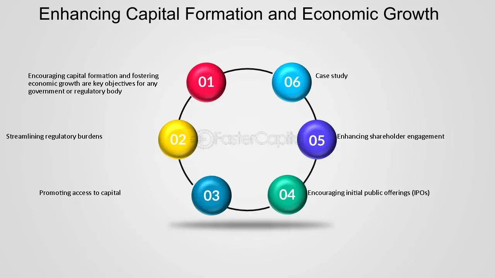

## Table of Contents

## What is an economy?

An economy is all about how people in a place make, share, and use things they need or want. It includes everything from growing food and making clothes to building houses and creating services like healthcare or education. Money is a big part of it because it's what people use to buy and sell these things. Governments, businesses, and individuals all play a role in how an economy works.

In an economy, people have jobs to earn money, and they use that money to buy things they need or want. Businesses make products or offer services to sell to people. The government helps by making rules to keep things fair and by providing services like roads and schools. Sometimes, the economy grows, which means more people have jobs and can buy more things. Other times, it might slow down, and people might have a harder time finding work or buying what they need.

## How do economies form?

Economies start forming when people live together and need to work out how to get what they need. Long ago, people might have traded things like food or tools directly with each other. This is called bartering. As more people came together in villages and towns, they started to specialize in different jobs. Some people became farmers, others made pottery, and others might have been builders. This specialization meant that people needed a way to exchange their goods and services more easily, leading to the creation of money.

Over time, as communities grew into larger societies, economies became more complex. Governments started to play a bigger role by making rules about trade and money. They also began to provide services like roads, schools, and defense, which helped the economy grow. As trade expanded beyond local areas to other regions or countries, economies became even more interconnected. This growth and connection helped form the diverse and complex economies we see today, where goods and services are produced and exchanged on a global scale.

## What are the key factors that influence the growth of an economy?

Several key factors help an economy grow. One big [factor](/wiki/factor-investing) is how much people can produce. This depends on things like technology, which makes work faster and easier, and education, which helps people learn new skills. Another factor is how much people want to buy things. When people feel confident about their jobs and money, they spend more, which helps businesses grow and hire more workers. The government also plays a role by making rules and spending money on things like roads and schools, which can help the economy grow.

Another important factor is how easily goods and money can move around. This includes having good transportation like roads and ports, and a strong financial system where people can borrow money to start businesses or buy homes. Trade with other countries can also help an economy grow by giving businesses more customers and helping them get materials they need. All these factors work together to make an economy bigger and stronger over time.

Lastly, the overall stability of a country matters a lot. If people feel safe and the government is stable, they are more likely to invest and spend money. On the other hand, if there is a lot of uncertainty or conflict, people might hold onto their money, which can slow down the economy. So, keeping things stable and predictable is crucial for economic growth.

## What are the different stages of economic development?

Economic development goes through different stages as countries grow and change. In the beginning, a country might be in the traditional stage, where most people live in the countryside and work in farming or fishing. They might not use a lot of modern technology, and their economy grows very slowly. As the country starts to change, it moves into the pre-conditions for take-off stage. This is when new ideas and technology start to come in, and some people begin to move to cities to work in factories or offices. The government might start to build roads and schools to help the economy grow faster.

The next stage is the take-off stage, where the economy starts to grow quickly. More people move to cities, and industries like manufacturing become more important. The country starts to trade more with other countries, and more people have jobs that pay well. After take-off comes the drive to maturity stage, where the economy keeps growing, but at a slower pace. The country has more industries and services, and people's lives get better as they earn more money and have more things. Finally, in the age of high mass consumption stage, most people have enough money to buy a lot of things they want, not just what they need. The economy is very strong, and the country might focus on things like technology and services.

These stages don't happen in the same way or at the same speed for every country. Some countries might skip stages, or they might go back and forth between stages. But understanding these stages can help us see how economies grow and change over time.

## How do natural resources impact economic formation and growth?

Natural resources like oil, minerals, forests, and water can have a big impact on how an economy forms and grows. When a country has a lot of natural resources, it can use them to make things like energy, food, and products that people need. This can help the economy grow because it gives people jobs and brings in money from selling these resources to other countries. For example, a country with a lot of oil might build factories to turn the oil into gasoline, which creates jobs and helps the economy.

But having a lot of natural resources can also cause problems. Sometimes, countries that rely too much on selling their resources might not focus on other parts of the economy, like making new things or providing services. This can make the economy less strong because if the price of the resource goes down, the whole economy can suffer. Also, fighting over who gets to use or sell the resources can lead to conflicts, which can slow down economic growth. So, while natural resources can help an economy grow, it's important for a country to use them wisely and not depend on them too much.

## What role does technology play in the development of economies?

Technology plays a big role in helping economies grow. It makes it easier for people to do their jobs and make things faster. For example, machines in factories can make more products in less time than people working by hand. Computers and the internet help businesses talk to customers and sell things all over the world. This can make the economy bigger because more people can buy things and more jobs are created.

Technology also helps people learn new skills and find new ways to solve problems. When people use technology to come up with new ideas, like making better medicines or building greener cars, it can make the economy stronger. But technology can also change the economy in ways that are hard for some people. Jobs that used to be done by people might be done by machines instead, which can be tough for those workers. So, while technology can help the economy grow, it's important to think about how to help everyone as things change.

## How do government policies affect economic growth?

Government policies can really help or hurt how an economy grows. When the government makes rules that help businesses start up and grow, like giving them money or making it easier to get loans, it can make the economy bigger. The government can also spend money on things like roads, schools, and hospitals, which helps people get to work and learn new skills. These things can make people feel more sure about spending money and starting businesses, which helps the economy grow.

But sometimes, government policies can slow down the economy. If the government makes too many rules or taxes businesses too much, it can make it hard for them to grow. Also, if the government spends too much money and has to borrow a lot, it might make people worried about the future, and they might spend less. So, it's important for the government to find a good balance in its policies to help the economy grow without causing problems.

## What is the impact of globalization on the formation and growth of economies?

Globalization has a big impact on how economies form and grow. It means that countries are more connected with each other, and they trade more goods and services across the world. This can help economies grow because businesses can sell to more people in different countries. For example, a company in one country can make things and sell them to customers all over the world, which creates more jobs and brings in more money. Also, globalization helps spread new ideas and technology faster, which can make businesses more efficient and help the economy grow.

But globalization can also cause problems. Sometimes, big companies from rich countries can come into smaller countries and take over local businesses, which can hurt the local economy. Also, if a country depends too much on selling things to other countries, it can be in trouble if the global economy slows down. For example, if people in other countries stop buying as much, the country might lose jobs and money. So, while globalization can help economies grow, it's important for countries to be careful and make sure they don't rely too much on other countries.

## How do financial systems contribute to economic development?

Financial systems help economies grow by making it easier for people and businesses to save and borrow money. When people save money in banks, the banks can lend that money to others who want to start a business or buy a house. This helps the economy because new businesses create jobs and people buying homes help the construction industry. Also, financial systems let people invest their money in things like stocks and bonds, which can help companies grow and create more jobs.

But financial systems can also cause problems if they are not managed well. If banks lend too much money to people who can't pay it back, it can lead to a financial crisis. This happened in 2008 when many people couldn't pay their home loans, and it caused a big problem for the whole economy. So, it's important for governments to make rules to keep the financial system safe and stable. When the financial system works well, it can really help the economy grow and make people's lives better.

## What are the challenges faced by developing economies?

Developing economies face many challenges that can make it hard for them to grow. One big challenge is not having enough money to build things like roads, schools, and hospitals. Without these, it's harder for people to get to work, learn new skills, and stay healthy. Another challenge is that many people in developing countries might not have good jobs. They might work in farming or small businesses that don't pay much. This can make it hard for people to buy things they need and for the economy to grow.

Another problem is that developing economies can be hurt by things happening in other parts of the world. If big countries have a financial crisis or if the price of things like oil goes up a lot, it can make life harder for people in developing countries. Also, these countries might not have strong governments or laws to help businesses grow and keep the economy stable. This can make it hard for them to attract money from other countries to help them grow.

But there are also ways to overcome these challenges. By working together with other countries and getting help from international organizations, developing economies can get the money and support they need to build important things and create better jobs. It's also important for these countries to make good rules and have strong governments to help their economies grow. With the right help and planning, developing economies can face their challenges and grow stronger over time.

## How can economies transition from developing to developed status?

Economies can transition from developing to developed status by focusing on improving their infrastructure and education systems. Building good roads, reliable electricity, and clean water systems helps businesses run more smoothly and attracts more investment. At the same time, investing in education helps people learn new skills and get better jobs. When people are educated, they can work in industries that pay more and create new businesses, which helps the economy grow. Governments can also help by making rules that encourage businesses to start and grow, and by working with other countries to get the money and support they need.

Another important part of transitioning to a developed economy is diversifying what the country makes and sells. Many developing countries rely a lot on selling natural resources like oil or minerals. But if they can start making more things like cars, electronics, or providing services like banking and healthcare, their economy can become stronger and less dependent on just one thing. This can be helped by technology and innovation, which can make businesses more efficient and create new opportunities. It's a long process, but with the right policies and support, developing economies can become developed and improve the lives of their people.

## What advanced economic theories explain the dynamics of economic growth?

One important theory about how economies grow is called the Solow-Swan model. It says that economic growth comes from having more workers, more capital like machines and buildings, and better technology. The model shows that as a country gets richer, it gets harder to keep growing at the same fast pace because the easy improvements have already been made. But if a country can keep coming up with new technology and ideas, it can keep growing. This theory helps explain why some countries grow faster than others and why rich countries might grow more slowly than poor ones.

Another theory is the endogenous growth theory, which focuses on how new ideas and technology help the economy grow. This theory says that things like education, research, and innovation are really important for growth. When people learn more and come up with new ideas, it can help the whole economy. For example, if a company invents a new way to make cars, it can create jobs and help other businesses that make parts for those cars. This theory shows that investing in education and research can help an economy keep growing over time, even if it's already rich.

A third theory is the Schumpeterian growth model, named after economist Joseph Schumpeter. This model talks about "creative destruction," which means that new businesses and ideas can replace old ones. When new companies come up with better products or ways of doing things, they can push out older companies that aren't as good. This can be hard for people who lose their jobs, but it helps the economy grow by making everything more efficient and innovative. Schumpeter's idea shows that change and competition are important for keeping an economy strong and growing.

## What is the difference between Economic Development and Economic Growth?

Understanding the distinction between economic growth and economic development is crucial for policymakers. Economic growth primarily refers to an increase in a country's output of goods and services, typically quantified by the Gross Domestic Product (GDP). GDP is often represented as:

$$
\text{GDP} = C + I + G + (X - M)
$$

where $C$ stands for consumer spending, $I$ is investment by businesses, $G$ represents government spending, $X$ is exports, and $M$ is imports. This formula emphasizes the aggregate value of goods and services produced over a specific period, providing a snapshot of economic activity.

However, economic growth does not encompass the full spectrum of a nation's progress. Economic development includes, but is not limited to, improvements in living standards, education, health, and environmental sustainability. It reflects qualitative measures that capture the overall well-being and quality of life in a society. For instance, indicators such as the Human Development Index (HDI) offer a more comprehensive perspective by combining data on life expectancy, education, and per capita income levels.

The relationship between economic growth and economic development is complex. While economic growth can provide resources necessary for development, it does not automatically lead to improved living conditions for all residents. Enhanced production might elevate GDP [statistics](/wiki/bayesian-statistics), but if the benefits are not equitably distributed, poverty and inequality may persist. Moreover, growth driven by unsustainable practices can deplete natural resources and harm the environment, counteracting developmental gains.

Policymakers must navigate this intricate relationship by crafting strategies that promote sustainable growth while ensuring equitable development. Investment in human capital, infrastructure, and technology, along with sound governance, can bridge the gap between growth and development, fostering a resilient and inclusive economy.

## References & Further Reading

[1]: Aghion, P., & Howitt, P. (1998). ["Endogenous Growth Theory."](https://archive.org/details/endogenousgrowth0000aghi) The MIT Press.

[2]: Friedman, B. M., & Schultze, C. L. (Eds.). (1977). ["The Costs and Benefits of Price Stability."](https://www.sciencedirect.com/science/article/pii/S0304393208000044) North Holland.

[3]: Gomber, P., Arndt, B., Lutat, M., & Uhle, T. (2011). ["High-Frequency Trading."](https://papers.ssrn.com/sol3/papers.cfm?abstract_id=1858626) Business & Information Systems Engineering, 3(2), 93-96.

[4]: Sra, S., Nowozin, S., & Wright, S. J. (Eds.). (2011). ["Optimization for Machine Learning."](https://www.semanticscholar.org/paper/Optimization-for-Machine-Learning-Sra-Nowozin/26b342333376fd7bf162f24f2e9a9de062f41d36) MIT Press.

[5]: Piketty, T. (2014). ["Capital in the Twenty-First Century."](https://www.jstor.org/stable/j.ctt6wpqbc) Harvard University Press.

[6]: Taleb, N. N. (2007). ["The Black Swan: The Impact of the Highly Improbable."](https://archive.org/details/10.1.1.695.4305) Random House. 

[7]: Shleifer, A. (2000). ["Inefficient Markets: An Introduction to Behavioral Finance."](https://academic.oup.com/book/27761) Oxford University Press.