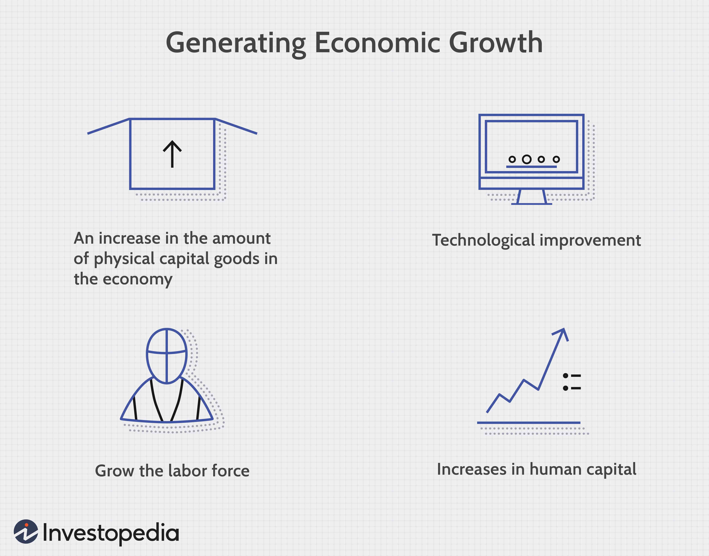

The concept of economic growth and development is integral to understanding the progression of modern societies. As nations and regions evolve, the metrics of economic growth—such as Gross Domestic Product (GDP) increases—serve as indicators of a country's expanding capacity to produce and consume goods and services. However, economic development encompasses a broader spectrum, highlighting improvements in quality of life, education, healthcare, and the equitable distribution of economic gains. Understanding this distinction is essential for creating effective economic policies.

In contemporary discussions, the intersection of economic development, economic growth, and economy formation has garnered significant attention. The creation and evolution of economies rest upon complex interactions among households, businesses, governments, and financial institutions, all of which contribute to distinct economic landscapes and outcomes across regions.



Amidst these dynamics, algorithmic trading, or algo trading, has emerged as a critical tool in financial markets, influencing economic growth. Algorithmic trading utilizes computer algorithms to execute trading orders at speeds and volumes far beyond human capabilities. By optimizing resource allocation and reducing transaction costs, it offers increased market liquidity and efficiency, contributing to economic growth.

This article explores the relationship between these key topics and their collective impact on the global economy. We will specifically look into how economic policies and technological advancements like algo trading contribute to economic development and growth. By examining these factors, the aim is to illuminate pathways for nations to achieve both growth and development while addressing challenges such as inequality, sustainability, and financial stability.

## Table of Contents

## Economic Development vs. Economic Growth

Understanding the distinction between economic growth and economic development is crucial for policymakers. Economic growth primarily refers to an increase in a country's output of goods and services, typically quantified by the Gross Domestic Product (GDP). GDP is often represented as:

$$
\text{GDP} = C + I + G + (X - M)
$$

where $C$ stands for consumer spending, $I$ is investment by businesses, $G$ represents government spending, $X$ is exports, and $M$ is imports. This formula emphasizes the aggregate value of goods and services produced over a specific period, providing a snapshot of economic activity.

However, economic growth does not encompass the full spectrum of a nation's progress. Economic development includes, but is not limited to, improvements in living standards, education, health, and environmental sustainability. It reflects qualitative measures that capture the overall well-being and quality of life in a society. For instance, indicators such as the Human Development Index (HDI) offer a more comprehensive perspective by combining data on life expectancy, education, and per capita income levels.

The relationship between economic growth and economic development is complex. While economic growth can provide resources necessary for development, it does not automatically lead to improved living conditions for all residents. Enhanced production might elevate GDP [statistics](/wiki/bayesian-statistics), but if the benefits are not equitably distributed, poverty and inequality may persist. Moreover, growth driven by unsustainable practices can deplete natural resources and harm the environment, counteracting developmental gains.

Policymakers must navigate this intricate relationship by crafting strategies that promote sustainable growth while ensuring equitable development. Investment in human capital, infrastructure, and technology, along with sound governance, can bridge the gap between growth and development, fostering a resilient and inclusive economy.

## Understanding Economy Formation

Economy formation involves a complex interplay among various key actors, including households, businesses, governments, and financial institutions. This intricate process emerges from the collective actions of individuals and entities, leading to a spontaneous order that facilitates productive interactions. Such interactions are pivotal in shaping the economic fabric of a society, allowing for the dynamic allocation of resources and responding to the changing demands of the market.

Households, as primary consumers and providers of labor, form the foundation of economic activities. Their consumption choices influence production patterns and drive demand for goods and services. Businesses respond by aligning their production strategies to cater to these demands, fostering innovation and competitiveness. Entrepreneurs, in particular, play a crucial role by introducing new products and services, thereby stimulating economic dynamism and growth.

Governments contribute to economy formation by setting the legal and institutional framework within which economic activities occur. Through policies and regulations, they influence the behavior of economic [agents](/wiki/agents), impacting areas such as investment, trade, and employment. Policy interventions can range from fiscal measures, like taxation and government spending, to monetary policies that control the money supply and interest rates. These actions can either spur economic growth or act as a brake on excessive economic overheating.

Financial institutions, including banks and stock markets, facilitate the efficient allocation of resources by channeling savings into investments. They provide the necessary capital for businesses to expand and innovate, playing an essential role in supporting economic activities. The availability of financial services, such as credit and insurance, helps in managing risks and smoothing consumption, contributing to economic stability and growth.

Regional distinctions substantially impact the way economies develop, influenced by factors such as geography, culture, natural resources, and existing infrastructure. Different regions may adopt distinct economic models and growth strategies, reflecting their unique circumstances and comparative advantages. For instance, resource-rich regions might focus on primary sector activities, while those with advanced technological capabilities could emphasize innovation-driven growth.

Policy and governance are central to shaping the economic landscape of a region. Effective governance ensures the implementation of sound policies that promote economic welfare, addressing issues like poverty, inequality, and environmental sustainability. Transparent and accountable institutions are crucial for building investor confidence and fostering a favorable business environment.

In summary, economy formation is a multidimensional process shaped by the interactions between households, businesses, governments, and financial institutions. These interactions are governed by regional characteristics and the overarching policy framework, collectively impacting the developmental trajectory of economies. Understanding this complex interdependency is essential for formulating policies that enhance economic resilience and ensure sustainable growth.

## The Role of Algorithmic Trading in Economics

Algorithmic trading employs sophisticated computer algorithms to execute a large number of trading orders with exceptional speed, efficiency, and precision. These algorithms are designed to leverage market opportunities that may be imperceptible to human traders, due to their capability to analyze vast amounts of data quickly and make decisions in real-time. Their influence on the economic landscape is significant, extending from increased market [liquidity](/wiki/liquidity-risk-premium) and efficiency to concerns over market stability.

One of the primary contributions of [algorithmic trading](/wiki/algorithmic-trading) is the enhancement of market liquidity. By facilitating rapid and continuous trading, algo trading ensures that markets remain operationally efficient. This increase in market liquidity can lead to smaller bid-ask spreads, thereby reducing transaction costs for all market participants. Efficient markets create a more stable environment for investors and can lead to a more optimal distribution of resources, positively influencing overall economic growth.

Apart from improving liquidity, algorithmic trading contributes to resource optimization by efficiently allocating capital. By analyzing complex datasets and considering numerous market variables, algorithms can identify mispriced assets and correct inefficiencies more swiftly than human traders. This capability not only increases market efficiency but also aids in the effective deployment of capital resources across various sectors, which is central to fostering economic growth.

Despite these advantages, algorithmic trading presents challenges, particularly regarding market [volatility](/wiki/volatility-trading-strategies) and financial stability. The [high frequency](/wiki/high-frequency-trading) and [volume](/wiki/volume-trading-strategy) of trades executed by algorithms can sometimes lead to unintended market conditions, such as flash crashes—extremely rapid market declines followed by swift recoveries. These events can severely disrupt normal market operations and erode investor confidence if not adequately managed. 

To mitigate these risks, regulatory bodies impose specific rules and frameworks governing the deployment and operation of trading algorithms. These regulations may include circuit breakers to halt trading during extreme volatility, and requirements for greater transparency and auditability of algorithmic trades. Such measures aim to balance the benefits of technological advancement with the need to maintain market stability and protect against systemic risks.

In conclusion, while algorithmic trading brings substantial benefits to economic systems through enhanced liquidity and efficient resource allocation, it also requires rigorous regulatory oversight to manage its potential downsides. The integration of technology into economic processes necessitates ongoing adaptation of regulatory frameworks to safeguard market integrity and financial stability.

## Case Studies of Economic Growth

Historical case studies provide valuable insights into the mechanisms that drive economic growth and highlight the diversity in strategies and outcomes. One of the most notable examples is the economic expansion of the United States following World War II. This period, often referred to as the "Golden Age of Capitalism," was characterized by rapid industrial growth, a surge in consumer demand, and substantial government investment in infrastructure and education. The implementation of the GI Bill, which provided educational benefits to returning veterans, resulted in a more skilled workforce, thereby boosting productivity. Additionally, the construction of the Interstate Highway System facilitated efficient transportation, further enhancing economic activity.

In more recent times, China serves as a contemporary case study of rapid economic growth. The country's transformation began with the economic reforms initiated by Deng Xiaoping in the late 20th century, which transitioned the economy from a centrally planned system to a more market-oriented structure. Key policies included the establishment of Special Economic Zones (SEZs) that attracted foreign direct investment by offering tax incentives and allowing greater export-oriented industrialization. China's accession to the World Trade Organization in 2001 played a pivotal role in integrating the country into the global economy, accelerating trade and economic growth.

Both the United States and China illustrate different pathways to economic growth, emphasizing the role of strategic policy decisions and innovation. The U.S. model highlights the importance of infrastructure and education, while China's experience underscores the significance of policy reforms and global integration. These case studies demonstrate that economic growth can be achieved through various means, depending on the unique circumstances and choices of different nations. Analyzing these examples helps to understand the multifaceted nature of economic development and informs future policy strategies.

## Challenges to Sustainable Economic Growth

Despite considerable progress in economic development, several persistent challenges continue to hinder sustainable economic growth across global economies. 

Income inequality remains a prominent issue, as economic advancements are not evenly distributed, often benefiting select segments of the population or particular regions while leaving others behind. According to the World Inequality Report, the top 10% of the global population captures approximately 52% of total income, whereas the bottom 50% accounts for merely 8%. Such disparities can result in social tensions and hinder overall economic stability.

Environmental concerns are equally pressing. The increasing industrialization and economic activities have led to significant ecological degradation, including issues like climate change, pollution, and loss of biodiversity. The Kuznets Curve hypothesizes that environmental degradation initially increases with economic growth until a turning point is reached — after which improvements occur as societies prioritize environmental regulations. However, this turning point varies widely among countries, often delaying necessary interventions.

Resource scarcity is another formidable challenge. As economies expand, the demand for natural resources escalates, leading to overexploitation. The concept of “peak oil” exemplifies this, predicting a point where global oil production will hit its maximum rate, after which production will decline. This underscores the urgent need for sustainable resource management and the development of alternative energy sources to avoid potential crises.

Economic policies can sometimes exacerbate these issues. Policies focused on rapid growth may lead to unbalanced development, disproportionately benefiting high-growth sectors such as technology or finance, while neglecting traditional industries like agriculture or manufacturing. This can create economic imbalances and exacerbate regional inequalities.

Technological disruptions present both opportunities and challenges. Innovations can drive efficiency and growth, but they often disrupt existing labor markets. Automation and [artificial intelligence](/wiki/ai-artificial-intelligence) (AI), for instance, may render certain jobs obsolete while creating demand for new skills. Consequently, economies must adapt by investing in education and reskilling programs to equip workers for the evolving job landscape.

Python's capabilities can further illustrate these challenges. The following code snippet uses Python to simulate economic disparities across sectors:

```python
import numpy as np
import matplotlib.pyplot as plt

# Simulating income distribution across sectors
np.random.seed(0)
sectors = ['Tech', 'Finance', 'Manufacturing', 'Agriculture']
growth = [np.random.normal(10, 2) if sector in ['Tech', 'Finance'] else np.random.normal(3, 1) for sector in sectors]

plt.bar(sectors, growth)
plt.title('Sectoral Growth Disparities')
plt.xlabel('Sectors')
plt.ylabel('Growth Rate (%)')
plt.show()
```

This code generates a bar chart that visualizes potential disparities in growth rates across different sectors, reflecting uneven economic benefits. Addressing the challenges posed by income inequality, environmental concerns, resource scarcity, unbalanced policies, and technological disruptions requires coordinated efforts from governments, the private sector, and society. By fostering inclusive growth strategies and sustainable practices, economies can aim for more resilient and equitable development paths.

## Conclusion

The dynamic interaction between economic development, growth, and technological innovations such as algorithmic trading is pivotal in shaping the trajectory of global economies. Technological advancements introduce efficiencies and democratize access to financial tools, yet they also pose challenges that require careful navigation. In the context of economic policy, there exists the dual necessity for fostering growth through innovative practices while simultaneously safeguarding sustainable development objectives. 

Policymakers face the complex task of calibrating economic strategies that harness the potential of technological innovation to drive growth without compromising equity and environmental sustainability. This balance calls for nuanced policy interventions that can stimulate economic activities while addressing the potential negative externalities associated with rapid technological progression, notably market volatility and systemic risk in financial markets associated with algorithmic trading.

Furthermore, ongoing research and investment in technology and education emerge as critical drivers of economic resilience. By equipping the workforce with necessary skills and fostering an environment conducive to innovation, economies can better adapt to technological disruptions and leverage emerging opportunities. This includes adopting policies that encourage research and development, support educational reforms, and incentivize continuous learning and skill development.

Ultimately, understanding and effectively utilizing the interconnected dynamics of growth, development, and technological advancements enable nations to progress toward economic goals that are inclusive, equitable, and sustainable. By strategically managing these elements, countries can enhance their economic competitiveness and ensure that growth translates into improved living standards and broader developmental outcomes for all segments of society. This holistic approach promises a pathway to a resilient and thriving global economy positioned to meet future challenges and opportunities.

## References & Further Reading

[1]: Aghion, P., & Howitt, P. (1998). ["Endogenous Growth Theory."](https://archive.org/details/endogenousgrowth0000aghi) The MIT Press.

[2]: Friedman, B. M., & Schultze, C. L. (Eds.). (1977). ["The Costs and Benefits of Price Stability."](https://www.sciencedirect.com/science/article/pii/S0304393208000044) North Holland.

[3]: Gomber, P., Arndt, B., Lutat, M., & Uhle, T. (2011). ["High-Frequency Trading."](https://papers.ssrn.com/sol3/papers.cfm?abstract_id=1858626) Business & Information Systems Engineering, 3(2), 93-96.

[4]: Sra, S., Nowozin, S., & Wright, S. J. (Eds.). (2011). ["Optimization for Machine Learning."](https://www.semanticscholar.org/paper/Optimization-for-Machine-Learning-Sra-Nowozin/26b342333376fd7bf162f24f2e9a9de062f41d36) MIT Press.

[5]: Piketty, T. (2014). ["Capital in the Twenty-First Century."](https://www.jstor.org/stable/j.ctt6wpqbc) Harvard University Press.

[6]: Taleb, N. N. (2007). ["The Black Swan: The Impact of the Highly Improbable."](https://archive.org/details/10.1.1.695.4305) Random House. 

[7]: Shleifer, A. (2000). ["Inefficient Markets: An Introduction to Behavioral Finance."](https://academic.oup.com/book/27761) Oxford University Press.