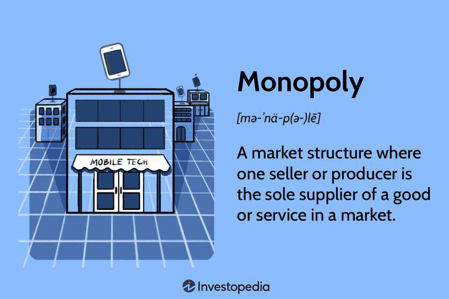

A business monopoly is characterized by a single entity's dominance over an entire industry or market sector, effectively exerting significant control over product availability, pricing, and consumer choice. This control leads to market dominance, a scenario where a company holds a dominant position, commanding a considerable share of market revenue and exerting influence over market trends. Market dominance, while not as absolute as a monopoly, occurs when a firm has substantial power to set competitive barriers, regulate supply chains, and dictate terms to consumers.

In the context of algorithmic trading, corporate monopolies manifest as large financial institutions or technology firms establishing control over trading mechanisms and infrastructure. Algorithmic trading, the use of advanced mathematical models and high-speed computer systems to make trading decisions, has revolutionized the financial markets by enhancing trading efficiency, liquidity, and accuracy. However, it also fosters environments where monopoly-like conditions can arise. A select few corporations may dominate the provisioning of algorithms and trading platforms, thereby influencing market actions and creating entry barriers for competitors. 



Studying monopolies in financial markets, particularly within algorithmic trading, is critical due to their far-reaching implications on economic efficiency, market stability, and consumer fairness. Understanding these monopolistic structures allows stakeholders to assess repercussions on trade practices, market liquidity, and systemic risks. Furthermore, analyzing these dynamics aids in crafting regulations that curb anti-competitive behaviors, ensuring a fair and open financial ecosystem.

This article examines several core facets: the foundational aspects of business monopolies, the distinction and factors contributing to market dominance, the rapid ascent of algorithmic trading, and the presence of monopolistic corporations within this sphere. It will also assess the broader implications of these entities on financial markets, considering both regulatory challenges and ethical considerations.

The primary aim of this article is to explore how business monopolies and market dominance intersect with the rapidly evolving domain of algorithmic trading, emphasizing the necessity of fostering innovation while maintaining competitive market practices.

## Table of Contents

## Understanding Business Monopolies

A business monopoly occurs when a single company or entity dominates a particular industry or sector, effectively eliminating or significantly reducing competition. This dominance allows the monopoly to control prices, dictate terms, and create high barriers to entry for other businesses. Monopolies often form through strategic practices such as mergers and acquisitions, gaining control over essential resources, or leveraging intellectual property rights to outpace competitors.

Historically, monopolies have played a significant role in shaping economic landscapes. The late 19th and early 20th centuries in the United States witnessed the emergence of prominent monopolies, such as John D. Rockefeller’s Standard Oil and Andrew Carnegie’s U.S. Steel. These entities gained substantial control over their respective industries by consolidating operations, acquiring competitors, and optimizing production costs, which allowed them to lower prices temporarily to drive competitors out of the market.

Monopolies present both advantages and disadvantages within the business ecosystem. On the positive side, monopolies can lead to efficiencies in production and distribution due to economies of scale, resulting in lower prices for consumers in the short term. They can also afford to invest heavily in research and development, potentially driving innovation within their sectors. Conversely, monopolies can stifle competition, which may result in higher prices and limited choices for consumers over time. The lack of competitive pressure can lead to complacency, reduced quality of products or services, and minimal innovation in the long run.

Regulatory frameworks are crucial in addressing the power of monopolies to ensure a fair and competitive market environment. Antitrust laws, such as the Sherman Antitrust Act of 1890 in the United States, were enacted to prevent monopolistic practices and promote competition. These laws enable regulatory bodies to investigate and prosecute companies that engage in anti-competitive conduct. Additionally, regulatory agencies can impose measures such as break-ups or fines and enforce rules to prevent monopolistic behavior that harms market competition and consumer welfare.

Monopolies significantly impact consumer choice and market competition. With few or no alternatives available, consumers are often at the mercy of monopolies regarding pricing, product variety, and service quality. This lack of competition can also lead to innovation stagnation, as monopolies lack the incentive to improve their offerings. However, some argue that monopolies, when properly regulated, can contribute positively to an economy by achieving efficiencies and making substantial investments in innovation.

In conclusion, monopolies are a double-edged sword in the business world, offering both potential benefits and significant drawbacks. Their impact extends beyond the confines of a single industry, influencing broader economic and social dynamics. Adequate regulation and oversight are essential to balance these effects, ensuring that monopolies do not undermine market health and consumer interests.

## Market Dominance Explained

Market dominance is a pivotal concept in economic and business strategies, distinct from a complete monopoly. A company exhibits market dominance when it has substantial influence over a market, often becoming a price-setter rather than a price-taker. Unlike a monopoly, where a single company controls the entire market, a dominant firm may face competition but still exerts significant control over the market due to its size, resources, or brand.

Several factors contribute to a company's market dominance:

1. **Scale and Scope Economies**: Larger firms benefit from reduced costs per unit via increased production scale or diversified product lines. This efficiency enables them to offer competitive pricing and reinvest in further growth, reinforcing their market position.

2. **Network Effects**: Companies offering products or services that become more valuable as more people use them, like social media platforms or online marketplaces, often achieve market dominance due to this increased utility.

3. **Brand Loyalty and Reputation**: A strong brand can encourage consumer preference, leading to higher sales and market influence. Companies with established reputations can maintain customer loyalty and fend off competition.

4. **Access to Capital and Resources**: Dominant firms often have better access to financing and resources, enabling them to invest in innovation, marketing, and expansion, further entrenching their market position.

5. **Regulatory Environment**: In some cases, the regulatory framework can create barriers to entry for smaller competitors, unintentionally solidifying the dominance of larger firms.

Market dominance impacts innovation and pricing strategies significantly. Dominant firms can invest heavily in research and development, leading to pioneering innovations. However, their market position might also allow them to set higher prices, reducing competitive pressure on innovation. Conversely, dominant companies might employ aggressive pricing strategies, such as predatory pricing, to undermine competitors, creating entry barriers and maintaining their position.

Case studies of companies with significant market dominance include:

- **Microsoft**: During the late 1990s and early 2000s, Microsoft held predominant market share in personal computer operating systems with Windows. Its dominance allowed it to dictate market standards, although it eventually faced antitrust actions.

- **Google**: With its search engine, Google has maintained market dominance by continuously improving its algorithm, creating a substantial barrier to entry for others trying to compete at the same level of efficiency and accuracy.

- **Amazon**: In the e-commerce sector, Amazon's dominance is fortified by extensive product offerings, superior logistics, and customer-oriented services like Prime, which create a formidable challenge for new entrants.

Challenges and opportunities coexist with market dominance. Dominant companies must navigate antitrust scrutiny and economic pressures to maintain their status. They are challenged by the need to continuously innovate to satisfy customers and fend off emerging competitors. However, opportunities abound in their ability to shape industry standards, influence customer trends, and capitalize on synergies across their product lines.

In summary, while market dominance provides companies with substantial advantages in terms of pricing power, brand recognition, and innovation potential, it also incurs challenges related to maintaining that dominance and adhering to regulatory expectations. Understanding these dynamics is crucial for companies aiming to sustain their market positions ethically and effectively.

## The Rise of Algorithmic Trading

Algorithmic trading, often termed algo trading, involves the use of computer algorithms to manage the process of buying and selling financial instruments. These algorithms, employing predefined sets of rules, automate trading strategies by measuring elements such as timing, price, and [volume](/wiki/volume-trading-strategy) across platforms, increasing both speed and efficiency.

Technological advancements have been pivotal in the growth of [algorithmic trading](/wiki/algorithmic-trading). High-frequency trading technology, for instance, enables the execution of a large number of orders within fractions of a second. Improvements in computational power and data processing capabilities have facilitated rapid analysis and decision-making processes. Machine learning and [artificial intelligence](/wiki/ai-artificial-intelligence) play transformative roles by enhancing pattern recognition and predictive analytics, allowing traders to optimize and adjust strategies in real time. These technologies have expanded the feasible scale and complexity of trading strategies, making algo trading widely accessible to both institutional and retail traders.

Algorithmic trading presents numerous benefits for investors and financial institutions. One significant advantage is reduced transaction costs, which arise from the efficient processing of trades and decreased need for human intervention. This efficiency is crucial in volatile markets where timing is essential. Algo trading also greatly enhances market [liquidity](/wiki/liquidity-risk-premium) by ensuring that trading activities are conducted consistently over time. Furthermore, the automation of trading strategies minimizes human errors and emotional biases that can impede judgement, thereby increasing the precision and reliability of trading operations.

Despite these benefits, algorithmic trading introduces several risks and ethical concerns. Market manipulations, such as spoofing or front-running, can occur when algorithms are designed to deceive other market participants, artificially influencing prices or liquidity. Additionally, algorithms might react to market anomalies or incorrect data, leading to flash crashes or other unintended consequences. Regulatory bodies scrutinize these risks to mitigate adverse impacts on financial markets, with increased emphasis on monitoring algorithmic practices and compliance.

Different algorithmic trading strategies include the use of statistical [arbitrage](/wiki/arbitrage), trend-following, and market-making algorithms. Statistical arbitrage involves exploiting price inefficiencies among correlated assets. Trend-following strategies capitalize on market [momentum](/wiki/momentum) by detecting and acting on market trends. Market-making algorithms enhance liquidity by continuously issuing buy and sell orders, profiting from the bid-ask spread. For example, a basic moving average crossover strategy can be implemented in Python as follows:

```python
import numpy as np
import pandas as pd

# Sample data for closing prices
data = {'Close': [100, 102, 105, 103, 104, 108, 107]}
df = pd.DataFrame(data)

# Calculate moving averages
short_window = 3
long_window = 5
df['Short_MA'] = df['Close'].rolling(window=short_window).mean()
df['Long_MA'] = df['Close'].rolling(window=long_window).mean()

# Generate signals: 1 (buy), -1 (sell), 0 (hold)
df['Signal'] = 0
df['Signal'][short_window:] = np.where(df['Short_MA'][short_window:] > df['Long_MA'][short_window:], 1, -1)

print(df)
```

These algorithms, adaptable to various market conditions, demonstrate the diverse capacities and strategic possibilities within algorithmic trading, emphasizing its role as an integral component of modern financial markets.

## Corporate Monopolies in Algo Trading

Certain corporations have attained dominance in algorithmic trading by leveraging advanced technology, capital, and strategic positioning. This dominance, often resembling a monopoly, can significantly influence market trends and operations. Such corporations often include large financial institutions and specialized trading firms that exert control over algo trading markets.

Large financial institutions, including investment banks and hedge funds, wield significant power in shaping algorithmic trading markets. Their influence is largely a result of substantial financial resources, proprietary trading algorithms, and extensive data access. These institutions can afford to invest in cutting-edge technology and skilled personnel, which are critical for developing sophisticated trading algorithms. For example, firms like Goldman Sachs and JP Morgan have been at the forefront of integrating algorithmic strategies into their trading operations, utilizing their capital and expertise to optimize trades and manage risks effectively.

The competitive landscape of algorithmic trading presents significant barriers to entry for new players. Developing effective trading algorithms requires substantial initial capital investment, access to large datasets for analysis, and expertise in both finance and technology. Additionally, high-frequency trading, a key component of algorithmic trading, demands ultra-low latency in communication networks and execution venues, further elevating the costs and technical challenges for newcomers. As a result, only well-established firms with ample resources can compete effectively, often stifling smaller or newer entrants.

Information asymmetry plays a crucial role in enabling corporate monopolies within algorithmic trading. Firms with advanced technology can capture and analyze market data faster and more accurately than competitors, capitalizing on fleeting trading opportunities. This asymmetry not only provides a competitive edge but also creates an environment where dominant firms can disproportionately influence market prices and liquidity. For instance, high-frequency traders use their superior speed to predict and react to market movements before other participants, securing profits from arbitrage opportunities unavailable to less equipped traders.

Several firms have achieved significant influence in the area, serving as case studies of corporate dominance in algorithmic trading. One notable example is Renaissance Technologies, which manages the Medallion Fund. Renowned for its [quantitative trading](/wiki/quantitative-trading) strategies, the firm has consistently outperformed markets, demonstrating the power of proprietary algorithms and data. Similarly, Citadel Securities has become one of the largest market makers globally, leveraging its algorithmic trading prowess to provide liquidity across various asset classes. These firms illustrate how advanced technological infrastructure, coupled with substantial financial backing, can lead to market dominance.

In conclusion, corporate monopolies in algorithmic trading arise from the interplay of financial resources, technological advancements, and strategic barriers. Large financial institutions exploit their advantages to shape trading markets, while information asymmetry and high entry barriers consolidate their dominance. By examining these elements, one gains critical insights into the mechanisms that drive market control and the challenges faced by new entrants.

## Implications for the Financial Markets

Monopolies and market dominance in financial markets have far-reaching implications, notably affecting liquidity, [volatility](/wiki/volatility-trading-strategies), and overall market structure. When a single firm or a group of firms wield significant influence over market mechanisms, markets may experience decreased liquidity. This scenario arises because dominant players can control the bid-ask spread, potentially leading to less competitive pricing, which diminishes the willingness of smaller firms to engage actively. Consequently, markets can become more volatile, as the presence of fewer participants may amplify price swings in reaction to large trades or external shocks.

Regulatory bodies such as the Securities and Exchange Commission (SEC) or the European Securities and Markets Authority (ESMA) are pivotal in managing monopoly power within the financial sector. Their role involves ensuring that market practices do not stifle competition unfairly or lead to systemic risks. By enforcing antitrust laws and fostering transparency, regulators aim to balance the power distribution across market participants. This regulation is crucial as it prevents excessive concentration of market power that may challenge the robustness of financial systems and lead to crises if dominant entities fail.

Monopolistic practices in algorithmic trading raise ethical concerns and potential risks, particularly regarding fairness and transparency. Algorithmic trading at scale can exploit information asymmetries and technological advantages to gain disproportionate profits, potentially disadvantaging smaller firms and retail investors. These practices can erode trust in financial markets and magnify systemic risk if not adequately managed. Ensuring equitable access to technology and information, along with stringent regulation of algorithmic practices, is vital to mitigate these risks.

Looking to the future, financial markets may witness further consolidation as technology and data analytics advance, potentially intensifying monopolistic practices. This trend might lead to increased reliance on a few dominant algorithmic trading firms capable of operating at scales and speeds unattainable by smaller competitors. As such consolidation progresses, it is imperative for regulatory bodies to adapt their frameworks continuously to protect market integrity, prevent abuse, and encourage a competitive environment that fosters innovation and resilience. Policymakers must remain vigilant and proactive, using technological tools and cross-border cooperation to address the transnational nature of trading and its oversight.

Understanding and addressing the implications of monopolies and market dominance is critical for ensuring a fair and resilient financial market structure. The balance between fostering innovation through algorithmic trading and maintaining competitive equity is delicate but necessary to uphold the principles of efficient and transparent markets.

## Conclusion

Business monopolies and market dominance exert significant influence in modern financial markets, with algorithmic trading (algo trading) standing at the intersection of technology and finance. The interplay among these elements is pivotal in shaping competitive landscapes, guiding innovations, and establishing regulatory frameworks. Understanding the nuances of monopolistic power within these domains helps in appreciating the complex dynamics that govern financial systems.

A balance must be maintained between fostering innovation and ensuring healthy competition. While monopolies can drive innovation through resource concentration and resulting technological advancements, they also risk stifling competition and restricting new entrants. This balance necessitates a careful regulatory approach ensuring that dominant players do not exploit their position, thereby undermining market fairness.

Algorithmic trading, with its rapid growth, presents a unique set of challenges. Monopolistic behaviors in this context can lead to information asymmetry and market manipulation, potentially impacting liquidity and volatility. These risks underline the importance of vigilant monitoring and regulation. Ensuring transparency, fairness, and equitable access to data is critical in preventing undue monopolistic control in algo trading.

Ongoing research and dialogue are essential among policymakers, industry experts, and the public. This discourse should focus on evolving regulatory measures that align with technological progress and market needs. Encouraging a collaborative environment will aid in identifying best practices and mitigating monopolistic threats.

In conclusion, promoting fair and competitive practices in finance requires concerted action. By continually assessing and addressing the implications of monopolistic behaviors, stakeholders can foster a financial ecosystem that supports innovation while protecting consumer interests and maintaining market stability.

## References & Further Reading

[1]: Bergstra, J., Bardenet, R., Bengio, Y., & Kégl, B. (2011). ["Algorithms for Hyper-Parameter Optimization."](https://papers.nips.cc/paper/4443-algorithms-for-hyper-parameter-optimization) Advances in Neural Information Processing Systems 24.

[2]: ["Advances in Financial Machine Learning"](https://www.amazon.com/Advances-Financial-Machine-Learning-Marcos/dp/1119482089) by Marcos Lopez de Prado

[3]: ["Evidence-Based Technical Analysis: Applying the Scientific Method and Statistical Inference to Trading Signals"](https://www.amazon.com/Evidence-Based-Technical-Analysis-Scientific-Statistical/dp/0470008741) by David Aronson

[4]: ["Machine Learning for Algorithmic Trading"](https://github.com/stefan-jansen/machine-learning-for-trading) by Stefan Jansen

[5]: ["Quantitative Trading: How to Build Your Own Algorithmic Trading Business"](https://www.amazon.com/Quantitative-Trading-Build-Algorithmic-Business/dp/1119800064) by Ernest P. Chan