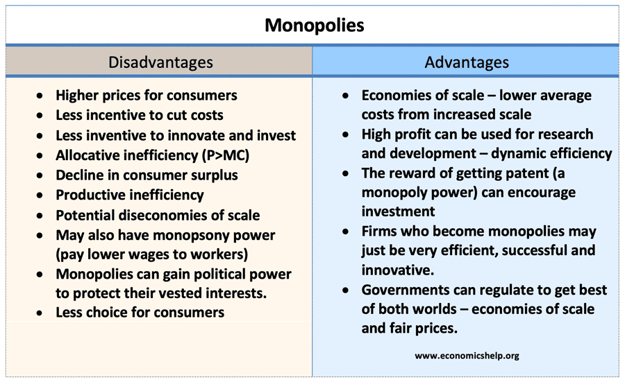

## Table of Contents

## What is a corporate monopoly?

A corporate monopoly happens when one company controls a whole market. This means they are the only ones selling a certain product or service. Because they have no competition, they can set high prices and make a lot of rules. People have to buy from them because there are no other choices.

Sometimes, monopolies can be bad for customers. They might pay more money for things and have fewer choices. But, some people think monopolies can be good because they can make things more efficiently. Governments often watch monopolies closely to make sure they don't hurt people or break laws.

## How do corporate monopolies form?

Corporate monopolies can form in different ways. One way is through a company growing big and strong enough to push out all its competitors. They might do this by making their products better or cheaper, or by buying other companies. Over time, they become the only choice for customers, turning into a monopoly.

Another way monopolies can happen is when the government gives a company special rights. This could be through a patent, which lets a company be the only one to sell a new invention for a while. Or, the government might decide that having just one company is better for certain services, like electricity or water. In these cases, the government might even help the company stay a monopoly.

Sometimes, monopolies form because it's really hard for new companies to start up in a certain market. This could be because it costs a lot of money to get started, or because the existing company has made it tough for others to come in. When it's too hard for new businesses to compete, the big company stays the only one, creating a monopoly.

## What are the historical examples of corporate monopolies?

One famous example of a corporate monopoly is Standard Oil. In the late 1800s, John D. Rockefeller built Standard Oil into a giant company that controlled almost all the oil refining in the United States. They bought out or crushed smaller oil companies, making it hard for anyone else to compete. By the early 1900s, Standard Oil was so big that the government decided to break it up into smaller companies because it was too powerful.

Another example is the American Telephone and Telegraph Company (AT&T). For much of the 20th century, AT&T had a monopoly on telephone services in the United States. The government allowed this because they thought it was important for one company to make sure phone services worked well across the country. But in 1982, the government decided to break up AT&T too, because they thought it was better for customers to have more choices and lower prices.

## What are the economic theories behind the formation of monopolies?

One economic theory about how monopolies form is called "natural monopoly." This happens when it makes more sense for just one company to provide a service because it's cheaper or more efficient. For example, it might cost a lot of money to build the pipes and wires needed for water or electricity. If there are many companies doing this, it could be wasteful and expensive. So, it's better to have one big company do it. This company can then charge higher prices because no one else can easily start competing.

Another theory is about "barriers to entry." This means there are things that make it hard for new companies to start up in a market. These barriers can be high start-up costs, like needing a lot of money to build factories or buy equipment. Or, they can be legal barriers, like patents that give one company the right to make something for a while. When these barriers are high, the existing big company can keep being the only one, turning into a monopoly. This can lead to them having a lot of power over prices and what they offer to customers.

## What role does government regulation play in the formation of monopolies?

Government regulation can help create monopolies by giving special rights to one company. For example, the government might give a company a patent, which lets them be the only one to sell a new invention for a while. Or, the government might decide that it's better for one company to provide certain services, like electricity or water, because it's more efficient. When the government does this, it can make it hard for other companies to start up and compete, leading to a monopoly.

On the other hand, government regulation can also stop monopolies from forming or break them up if they already exist. If a company gets too big and powerful, the government might step in to protect customers. They might break up the big company into smaller ones, like what happened with Standard Oil and AT&T. By doing this, the government tries to make sure there's more competition, which can lead to lower prices and more choices for people.

## How do monopolies affect market competition?

Monopolies hurt market competition a lot. When one company controls everything, other companies can't easily start up or grow. This is because the big company can set prices and rules that make it hard for anyone else to compete. If you want to sell something new, you might need a lot of money to even try to challenge the big company. And if the big company has special rights from the government, like a patent, it's even harder for others to get in the game.

Because of this, customers often end up with fewer choices. They have to buy from the big company, even if the prices are high or the service isn't great. Without competition, the big company doesn't have to worry about making things better or cheaper. This can make life harder for customers, who might have to pay more money for less. But, some people think that having one big company can be good if it makes things more efficient and saves money in the long run.

## What are the potential benefits of corporate monopolies for consumers?

One possible benefit of corporate monopolies for consumers is that they can make things more efficient. When one big company runs everything, they might be able to do it better and cheaper than if there were many smaller companies. For example, it might cost less to build one big network of pipes for water instead of many small ones. This can save money, and those savings might be passed on to customers in the form of lower prices.

Another benefit is that monopolies can spend a lot of money on research and development. Because they are big and have a lot of money, they can try to make new and better products. This can lead to new inventions and improvements that make life better for everyone. For example, a big company might be able to create a new medicine that helps a lot of people. So, even if there's only one company selling it, the new medicine can be a big help.

## What are the potential drawbacks of corporate monopolies for consumers?

One big problem with corporate monopolies is that they can make things more expensive for customers. When there's only one company selling something, they can set the prices as high as they want. People have to pay those prices because they don't have any other choices. This can make life harder for customers, especially if they can't afford to pay more. Also, without competition, the big company doesn't have to try hard to make their products better or cheaper. They can just keep things the same, even if customers aren't happy.

Another issue is that monopolies can limit choices for customers. When one company controls everything, it's hard for new companies to start up and offer different products or services. This means customers might not get to try new things or find something that fits their needs better. If the big company decides to stop selling something, customers might be out of luck. This can make life less convenient and less fun for people, who like having options and being able to choose what they want.

## How do monopolies justify their existence and practices?

Monopolies often say they help people by making things more efficient. They say that having one big company can be cheaper and better than having lots of small ones. For example, it might cost less to have one big network of pipes for water instead of many small ones. This can save money, and the big company might pass those savings on to customers with lower prices. Monopolies also say they can spend a lot of money on making new things because they are big and have a lot of money. They might create new inventions that help a lot of people, like new medicines.

But, monopolies also say they need to be big to stay strong and keep doing good things. They say that if they have to break up into smaller companies, they might not be able to spend as much on making new things. Also, they say that being big helps them keep prices stable and make sure everyone can get what they need. They might argue that having one company in charge can make things simpler and easier for everyone, even if it means customers have fewer choices.

## What legal frameworks exist to regulate or prevent monopolies?

Governments use laws to watch over and stop monopolies from hurting people. One big law in the United States is the Sherman Antitrust Act. This law says that companies can't do things that stop other companies from competing fairly. If a company gets too big and starts to control everything, the government might step in and break it up into smaller pieces. This happened with big companies like Standard Oil and AT&T. The goal is to make sure there's competition, so customers can have more choices and pay fair prices.

Another important law is the Clayton Act, which helps stop companies from doing things that could lead to a monopoly. It says companies can't do things like buying up all their competitors or making deals that make it hard for new companies to start up. The government also uses the Federal Trade Commission (FTC) to watch over companies and make sure they follow these rules. If a company breaks the rules, the FTC can make them stop and even make them pay money. All these laws and rules help keep the market fair and protect customers from big companies getting too much power.

## What are the current debates surrounding the justification of corporate monopolies?

People argue a lot about whether big companies that control everything, called monopolies, are good or bad. Some say monopolies are bad because they can make things more expensive and give customers fewer choices. When there's only one company selling something, they can set high prices and people have to pay them. Also, it's hard for new companies to start up and offer different things, so customers might not get to try new products or find something that fits their needs better. This can make life harder and less fun for people.

On the other hand, some people think monopolies can be good because they can make things more efficient. It might be cheaper to have one big company run everything instead of many small ones. This can save money, and the big company might pass those savings on to customers with lower prices. Also, big companies can spend a lot of money on making new things because they have a lot of money. They might create new inventions that help a lot of people, like new medicines. So, even if there's only one company selling it, the new medicine can be a big help.

## How can technological advancements influence the future of corporate monopolies?

Technology can change the way big companies that control everything, called monopolies, work. New technology can make it easier for new companies to start up and compete with the big ones. For example, the internet lets small companies sell things all over the world without needing a big store. This can break the power of big companies and give customers more choices. Also, new technology can help make things cheaper and faster, so even if a big company is still around, they might have to lower their prices to keep up with the new competition.

But, technology can also help big companies stay big and powerful. Big companies can use new technology to make their products even better and more efficient. They can use data and computers to learn about what customers want and make things just for them. This can make it hard for new companies to compete, because the big company knows so much and can do things so well. So, while technology can help break up monopolies, it can also help them stay strong and keep controlling the market.

## References & Further Reading

[1]: Bergstra, J., Bardenet, R., Bengio, Y., & Kégl, B. (2011). ["Algorithms for Hyper-Parameter Optimization."](https://papers.nips.cc/paper/4443-algorithms-for-hyper-parameter-optimization) Advances in Neural Information Processing Systems 24.

[2]: ["Advances in Financial Machine Learning"](https://www.amazon.com/Advances-Financial-Machine-Learning-Marcos/dp/1119482089) by Marcos Lopez de Prado

[3]: ["Evidence-Based Technical Analysis: Applying the Scientific Method and Statistical Inference to Trading Signals"](https://www.amazon.com/Evidence-Based-Technical-Analysis-Scientific-Statistical/dp/0470008741) by David Aronson

[4]: ["Machine Learning for Algorithmic Trading"](https://github.com/stefan-jansen/machine-learning-for-trading) by Stefan Jansen

[5]: ["Quantitative Trading: How to Build Your Own Algorithmic Trading Business"](https://www.amazon.com/Quantitative-Trading-Build-Algorithmic-Business/dp/1119800064) by Ernest P. Chan