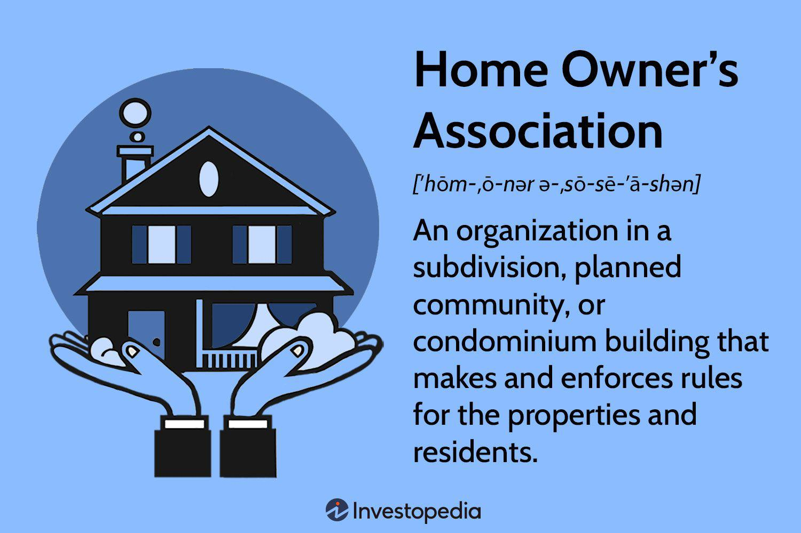

Homeowners Associations (HOAs) have become a significant component of the modern real estate market, playing a crucial role in the governance and maintenance of residential communities. As urbanization progresses and residential areas evolve, the necessity for structured management becomes paramount to uphold community standards and property values. HOAs represent an organizational framework through which these objectives are achieved, ensuring that common areas are maintained, rules are enforced, and property aesthetics are preserved.

The formation and efficient management of HOAs are key factors in their success. By establishing clear rules and guidelines, HOAs help ensure that neighborhoods remain desirable places to live. Community management, often spearheaded by professional managers, is integral to the daily operations of HOAs. These managers orchestrate essential tasks such as budgeting, communications, and enforcement of the community's Covenants, Conditions, and Restrictions (CC&Rs), which form the bedrock of HOA governance.



In recent years, the application of advanced technologies has permeated various domains, including property management. Among these technologies, algorithmic trading (algo trading) has emerged as an innovative tool for optimizing financial management within HOAs. By automating investment strategies and enhancing financial decision-making, algo trading offers potential improvements in the way HOAs handle reserve funds and plan for future expenditures, although it does require careful oversight to mitigate associated risks.

Understanding these elements of HOA management—formation, community management, and the integration of technology such as algo trading—provides homeowners and association board members with the knowledge needed to effectively navigate community living. By appreciating the intricacies of how an HOA functions and evolves, stakeholders can actively participate in fostering a thriving and well-maintained community environment.

## Table of Contents

## What is a Homeowners Association?

Homeowners Associations (HOAs) are formal organizations created within residential communities to manage communal areas and enforce guidelines to uphold community quality and property values. Typically, an HOA is established through the development process of a community by a real estate developer, who drafts a set of governing documents called Covenants, Conditions, and Restrictions (CC&Rs). These documents outline the community standards and guidelines that homeowners must adhere to, focusing on maintaining a consistent aesthetic and preventing property value depreciation.

Membership in an HOA is usually automatic for property owners within the community, who are then subject to its rules and regulations. HOAs are primarily responsible for the upkeep of shared community features such as pools, clubhouses, parks, and landscaping, ensuring that these common areas are maintained to a high standard. This is achieved through the collection of regular assessments or dues from homeowners, which fund the association's activities and maintenance responsibilities.

The governance structure of a typical HOA includes a board of directors elected by the community's members. This board is responsible for the day-to-day decision-making processes, enforcing the CC&Rs, managing the association's finances, and liaising with homeowners. The board also has the authority to levy fines for rule violations and can make significant decisions such as altering rules with the community's approval. The composition and powers of an HOA board can vary, but they typically include a president, vice president, secretary, and treasurer, who together ensure that the association runs smoothly.

## Functions of Community Management in HOAs

Community managers are integral to the efficient operation of Homeowners Associations (HOAs), responsible for a variety of administrative, financial, and operational tasks. Their primary function is to ensure the seamless functioning of the community, which is realized through several key responsibilities.

One of the major roles of community managers is facilitating communication. They act as the liaison between the HOA board of directors and the homeowners, ensuring clear, timely, and effective communication. This includes disseminating information regarding meetings, policy changes, and community events, thereby fostering a sense of inclusivity and transparency among the residents.

In addition to communication, community managers are tasked with maintaining and overseeing the HOA's financial health. This involves managing the association's funds, which includes the collection of HOA fees, preparation of financial statements, and budget planning. They ensure that the association's finances are aligned with its objectives, such as funding shared amenities and preparing for unforeseen expenses. Budget management often requires setting reserve funds aside for significant future expenditures, ensuring the financial stability and sustainability of the HOA.

Another crucial responsibility is the enforcement of the community's Covenants, Conditions, and Restrictions (CC&Rs). These governing documents are vital for preserving the desired aesthetic and standard of living within the community. Community managers supervise compliance with these regulations, addressing any violations and implementing necessary actions to resolve disputes. This helps maintain property values and contributes to a harmonious living environment.

Moreover, community managers play a critical role in the operational aspects of the HOA. This includes maintenance of common areas, coordination of repairs, and contract management for services such as landscaping and security. By ensuring these operations are conducted efficiently and cost-effectively, community managers directly contribute to the community's quality of life.

Overall, the multifaceted role of community managers is essential in maintaining property values and ensuring a high standard of living within HOA-governed communities. Their expertise in administration, finance, and operations, along with their ability to communicate and enforce regulations, are pivotal in fostering vibrant, well-managed neighborhoods.

## Homeowners Association Fees and Budgeting

Homeowners Association (HOA) fees are essential financial contributions collected from homeowners to support the maintenance and operation of shared amenities and community services. These fees enable the smooth functioning of residential communities by covering various expenses such as landscaping, security, pool maintenance, and general upkeep of communal areas. Fees are typically determined annually and vary depending on the size and needs of the community.

Budgeting within an HOA context involves a strategic approach to financial planning, which includes anticipating maintenance requirements and setting aside reserve funds for major projects. Reserve funds are critical in safeguarding the community’s financial health, as they provide a buffer for large-scale repairs or unforeseen expenditures. An effective budget accounts for both expected operating costs and long-term capital expenditures, ensuring the community remains financially stable and well-maintained.

In certain situations, unforeseen expenses may arise that exceed the planned budget. In such cases, the HOA board may impose special assessments, which are additional charges levied on homeowners to cover specific financial shortfalls. These assessments highlight the importance of prudent financial management and planning within the HOA. To minimize the frequency and severity of special assessments, it is crucial to conduct regular reserve studies. These studies help identify potential future expenses and adjust budgeting strategies accordingly.

To manage this complex financial environment effectively, HOA boards often rely on financial experts or community managers. They ensure compliance with legal requirements and best practices in financial governance, reinforcing transparency and accountability. By maintaining sound financial management practices, HOAs can sustain community operations, preserve property values, and ensure a high quality of life for residents.

## Advantages and Challenges of HOAs

Homeowners Associations (HOAs) offer numerous advantages that contribute to both the physical environment of a community and the financial wellbeing of homeowners. One significant benefit is the access to shared amenities, such as swimming pools, parks, and community centers, which are maintained collectively through HOA fees. This communal approach not only enhances the living experience but also often leads to higher property values due to the attractively maintained neighborhood aesthetics and facilities.

Standardized rules set by HOAs aim to preserve property values and maintain a uniform community appearance. These rules help prevent situations where individual property neglect could negatively affect the overall neighborhood appeal. By ensuring compliance with these standards, HOAs can effectively safeguard and potentially increase the value of properties within the community.

However, HOAs are not without challenges. One primary concern for homeowners is the fee obligations required for the upkeep of community amenities and common areas. These fees can be a financial strain for some residents, particularly if they escalate due to increasing maintenance costs or additional community projects. Moreover, special assessments may be imposed to cover unforeseen expenses, adding to the financial burden.

Additionally, the rules and regulations imposed by HOAs can sometimes be perceived as overly restrictive, limiting homeowners' autonomy over their own properties. Decisions made by the HOA board can impact the community in significant ways, leading to conflicts if the decisions do not align with the majority's preferences. Transparency and open communication between the HOA board and residents are essential to mitigate these issues and foster a collaborative community atmosphere.

To address and overcome the challenges associated with HOAs, effective management and proactive communication are paramount. Ensuring that homeowners are aware of the governance processes and maintaining open dialogue about community developments can build trust and cooperation. By involving residents in decision-making processes and fairly enforcing rules, HOAs can strike a balance between regulating community standards and respecting individual property rights.

## The Role of Algo Trading in Property Management

Algorithmic trading, commonly referred to as algo trading, has become a significant [factor](/wiki/factor-investing) in various financial sectors, including property management within Homeowners Associations (HOAs). By leveraging algorithms and data-driven decisions, HOAs can optimize financial strategies, particularly in the management of reserve funds. The integration of such advanced technologies introduces both opportunities and challenges, necessitating a sophisticated understanding of financial governance.

### Enhancement of Reserve Fund Management

Reserve funds are crucial in an HOA's financial health, covering major expenses like repairs and upgrades. Algo trading offers HOAs a method to enhance the management of these funds through the use of automated systems that can analyze vast amounts of financial data and execute trades at optimal times. The use of these algorithms can help in:
- **Market Analysis:** Identifying favorable trading opportunities based on historical data and market trends.
- **Risk Management:** Employing quantitative models to evaluate potential risks and adjust investment strategies accordingly.
- **Transaction Timing:** Executing trades autonomously to take advantage of minute-to-minute changes in the financial markets.

A simple Python script for monitoring market data might look like this:

```python
import numpy as np
import pandas as pd

# Example function to simulate market data analysis
def analyze_market_data(data):
    # Calculate moving averages
    short_window = 40
    long_window = 100

    signals = pd.DataFrame(index=data.index)
    signals['signal'] = 0.0

    # Create short simple moving average
    signals['short_mavg'] = data['price'].rolling(window=short_window, min_periods=1, center=False).mean()

    # Create long simple moving average
    signals['long_mavg'] = data['price'].rolling(window=long_window, min_periods=1, center=False).mean()

    # Create signals
    signals['signal'][short_window:] = np.where(signals['short_mavg'][short_window:] > signals['long_mavg'][short_window:], 1.0, 0.0)

    # Generate trading orders
    signals['positions'] = signals['signal'].diff()

    return signals

# Simulated price data
market_data = pd.DataFrame({'price': np.random.normal(100, 1, 200)})

# Analyze the data
signals = analyze_market_data(market_data)
```

### Risks and Governance

While the benefits of algo trading are substantial, there are inherent risks associated with algorithms, such as programming errors, unexpected market conditions, and overfitting (where a model performs well on historical data but poorly in real-time scenarios). To mitigate these risks, HOAs need robust governance frameworks, which include:
- **Regular Audits:** Comprehensive reviews of algorithmic strategies and outcomes.
- **Compliance Checks:** Ensuring adherence to legal and regulatory standards.
- **Transparency:** Clear documentation and reporting to HOA boards and stakeholders.

### Challenges and Opportunities

The challenge for HOAs lies in the balancing act between leveraging algo trading for enhanced financial performance and maintaining rigorous risk management. The opportunity resides in the potential for improved reserve fund growth and sustainability. Algo trading demands an ongoing commitment to education and adaptation by HOA board members and managers to harness these tools effectively.

The integration of technology like algo trading in real estate can transform HOA management, offering new dimensions of efficiency and insight into financial strategy execution. For homeowners and HOA boards, the challenge is to stay informed and proactive in adopting these innovations to foster a financially stable and thriving community.

## Conclusion

Homeowners Associations (HOAs) play a crucial role in contemporary residential communities, significantly influencing property values and residents' quality of life. As entities responsible for upholding community standards and managing shared amenities, HOAs are integral to the stability and appeal of neighborhood environments. Their operations ensure that community aesthetics are preserved and that amenities function effectively, ultimately contributing to sustained property values.

Integrating advanced technologies such as [algorithmic trading](/wiki/algorithmic-trading) into HOA management presents transformative possibilities. Algo trading offers a sophisticated approach to managing financial resources, potentially enhancing the efficiency with which reserve funds are allocated and utilized. By applying such technologies, HOAs can optimize their financial strategies, ensuring that the community's financial health is robust and secure. This technological evolution requires thoughtful implementation and governance to mitigate risks, but it opens up new avenues for economic efficiency.

Moreover, the active involvement of homeowners within HOAs is essential for nurturing a dynamic and flourishing community. Engaged residents can provide valuable insights and feedback, ensuring that management practices align with the community’s evolving needs. Collaborative efforts between board members and residents enhance transparency, build trust, and promote a sense of collective ownership of community affairs. Through such participation, homeowners can drive positive changes and contribute to creating a vibrant, cohesive community environment.

## References & Further Reading

### References & Further Reading

1. **Homeowners Association Basics and Governance**
   - "Understanding Homeowners Associations: A Guide to the Essentials" - This guide covers the basic structure and purpose of HOAs, including governance practices and the roles of board members. It provides insights into the legal framework governing HOAs. [Link: Community Associations Institute](https://www.caionline.org)

2. **Community Management Practices**
   - "The Community Manager's Handbook" - This comprehensive resource outlines best practices for managing residents and facilities within an association. It emphasizes effective communication strategies and financial management skills essential for maintaining community standards.

3. **Financial Management and Budgeting in HOAs**
   - "Managing Association Finances: From Fees to Reserve Funds" - This guide investigates into the intricacies of budgeting, highlighting strategies for maintaining reserve funds and planning for future expenditures in a community setting. [Link: HOALeader.com](https://www.hoaleader.com)

4. **Legal Aspects of HOAs**
   - "HOA Law and You: Navigating Legal Responsibilities and Rights" - This resource offers homeowners and boards an overview of the legal responsibilities of HOAs, covering Covenant Conditions and Restrictions (CC&Rs) and relevant state laws. It outlines how legal frameworks can impact management decisions. [Link: NOLO Legal Encyclopedia](https://www.nolo.com)

5. **Algorithmic Trading and Technology in Property Management**
   - "Algorithmic Trading: Concepts and Applications" by Ernest P. Chan - Although focused on financial markets, this book introduces the principles of algorithmic trading, which can be applied to managing HOA reserve funds for optimized financial strategies.
   - "Property Management in the Digital Era" - This article explores the role of advanced technologies, including algorithmic applications, in streamlining property management tasks and improving financial oversight within residential communities.

These resources provide foundational and advanced insights into managing and understanding the dynamics of Homeowners Associations, offering strategies for effective governance, financial management, and the integration of technology in property management. The shifting landscape of HOAs requires both traditional management strategies and modern technological interventions, making continued education and resource exploration essential for board members and residents alike.

