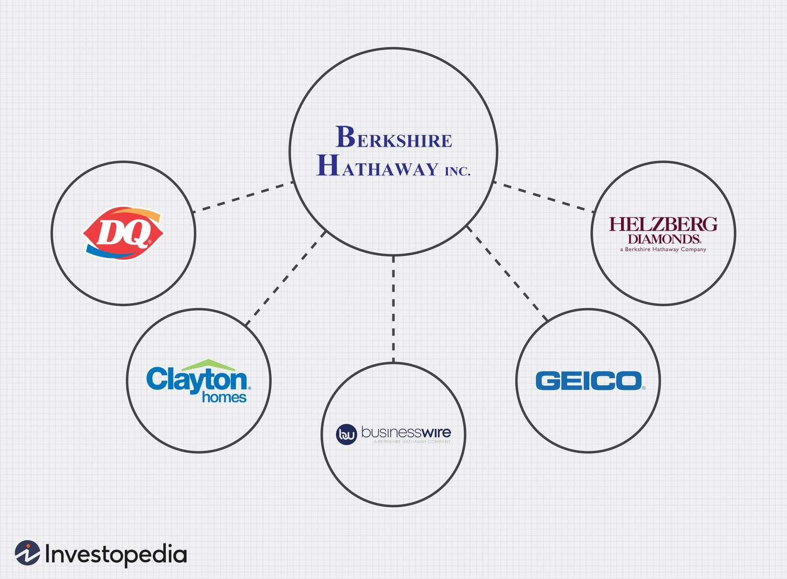

L Brands, established in 1963 as The Limited by Leslie Wexner, evolved into a formidable entity within the retail sector. It garnered acclaim for its extensive and diverse portfolio of apparel and beauty brands. Over the decades, L Brands adeptly navigated the complexities of the market through a series of strategic acquisitions, including iconic brands like Victoria's Secret and Bath & Body Works. These moves not only expanded its market presence but also bolstered its reputation as a leader in the industry.

However, the ever-changing retail landscape required L Brands to continuously adapt its business strategies. This led to significant transformations within the organization, notably through the process of acquisitions and divestitures. To adapt to market dynamics and unlock greater shareholder value, L Brands ultimately decided to separate into two independent companies: Bath & Body Works, Inc. and Victoria's Secret & Co., each focusing on their respective strengths.

This article investigates into the evolution of L Brands, detailing how its strategic decisions shaped the company's trajectory. It also examines the role of acquisitions in expanding its reach and the influence of algorithmic trading strategies in optimizing its subsidiary management. Through this lens, we gain insights into the intricate balance of growth, divestment, and modern financial strategies employed by L Brands in a market marked by constant evolution.

## Table of Contents

## The Rise of L Brands

L Brands, initially established as The Limited by Leslie Wexner in 1963, began as a single store in Columbus, Ohio, focusing on fashionable women's apparel. The business strategies implemented by Wexner were pivotal in shaping the company’s trajectory towards a retail empire. One of the key strategies was the aggressive pursuit of strategic acquisitions, which became a hallmark of L Brands’ expansion blueprint.

The acquisition of Victoria's Secret in 1982 marked a significant turning point for the company. At the time, Victoria’s Secret was a relatively small operation with a unique appeal centered around transforming the perception of lingerie shopping. Under the leadership of L Brands, Victoria’s Secret experienced rapid growth, becoming synonymous with high-quality lingerie and setting a standard that influenced the industry globally. This acquisition was complemented by a distinctive marketing approach, characterized by glamorous fashion shows and consumer catalogs, which amplified brand visibility and consumer engagement.

Another notable acquisition was Lane Bryant in 1982, which enabled L Brands to tap into the plus-sized apparel market, thereby broadening its consumer demographics. Lane Bryant's integration into the L Brands portfolio reflected a strategic diversification effort, aligning with the evolving preferences of a wider audience while enhancing the company's market reach.

The success of these acquisitions was underscored by an innovative approach to marketing and brand positioning. L Brands effectively utilized multimedia advertising platforms to craft aspirational brand images, fostering a strong emotional connection with consumers. This strategy was instrumental in establishing L Brands as an industry leader, capable of influencing consumer trends and driving robust sales growth.

Through these calculated acquisitions and marketing ingenuity, L Brands transitioned from a single-store operation to a formidable enterprise, reshaping the retail industry's landscape and setting benchmarks for strategic growth in apparel and beauty products.

## Key Acquisitions and Their Impact

L Brands, established by Leslie Wexner, strategically expanded its business operations through a series of key acquisitions that significantly shaped its trajectory. The most prominent acquisition was Victoria’s Secret, purchased in 1982 for approximately $1 million. This acquisition proved to be transformative, as Victoria’s Secret rapidly grew into a leading global lingerie retailer, renowned for its annual fashion shows and influential brand identity. The integration of Victoria's Secret played a pivotal role in enhancing L Brands' market presence and significantly contributing to its revenue stream over the decades.

In 1982, L Brands broadened its demographic appeal by acquiring Lane Bryant, a chain specializing in plus-sized apparel. This move diversified L Brands' market reach by catering to a previously under-served customer base. By incorporating Lane Bryant, L Brands capitalized on a growing demand for plus-sized fashion, illustrating its strategic expansion into varied apparel sectors. Although Lane Bryant was eventually sold in 2002, its inclusion in L Brands' portfolio was a critical step in the company's development.

Further expanding its retail dominance, L Brands acquired Bath & Body Works in 1987. This acquisition was strategically aligned with the growing consumer interest in personal care products and fragrances. Bath & Body Works capitalized on this trend to become one of the leading specialty retailers in the personal care industry, driving substantial revenue for L Brands.

L Brands’ portfolio also included La Senza, acquired in 2006. As a Canadian-based lingerie retailer, La Senza allowed L Brands to strengthen its international footprint, particularly in the Canadian market. Despite its later divestiture, La Senza's inclusion underscored L Brands’ strategic efforts to diversify geographically and bolster its competitive positioning.

Henri Bendel, a luxury boutique brand acquired in 1985, represented L Brands' foray into high-end retail. The brand contributed to L Brands' prestige, although it primarily served as a niche market offering. Despite its eventual closure in 2018, Henri Bendel highlighted L Brands’ strategy in exploring various market segments to optimize growth potential.

Through strategic acquisitions, L Brands not only diversified its product offerings but also established a stronghold across diverse market segments. Each acquisition was meticulously chosen to enhance brand synergy and market dominance, establishing L Brands as a formidable entity in the retail industry.

## Challenges and Divestitures

L Brands, despite its initial success and expansion, encountered significant challenges as market conditions evolved. Market saturation became a formidable obstacle for the company, with an increasing number of competitors entering the apparel and beauty sectors, leading to heightened pressure on sales and profit margins. Concurrently, consumer preferences were shifting, particularly in fashion and retail, with growing demand for more diverse and inclusive product offerings, as well as a focus on sustainability and digital shopping experiences.

These industry changes forced L Brands to reassess its portfolio and operational strategy. The pressure to streamline operations and refocus on core competencies led to notable divestitures. Lane Bryant, recognized for its plus-sized apparel, was sold in an effort to concentrate on more profitable segments. Similarly, L Brands divested Henri Bendel and La Senza, as these brands either failed to align with evolving consumer demands or no longer fit within the company's strategic goals.

The divestiture of these brands was part of a broader effort to address the changing retail landscape and improve financial performance. By shedding underperforming or non-core assets, L Brands aimed to redirect resources and attention to brands with higher growth potential and stronger market positions.

Additionally, external market pressures culminated in the decision to separate Victoria's Secret and Bath & Body Works into independent entities in 2021. The separation was a strategic response to unlock shareholder value and allow each business to pursue tailored market strategies. Victoria's Secret, facing criticisms over its brand image, was poised to embark on a journey of revitalization amidst a competitive intimates market. Meanwhile, Bath & Body Works, with a robust product line and loyal customer base, sought to capitalize on its strong positioning in the personal care market.

In conclusion, these strategic divestitures and separations reflected L Brands’ adaptability to industry transformations. By focusing on core brands and revitalization efforts, the company aimed to maintain competitiveness in a dynamic retail environment.

## L Brands' Transformation with Victoria's Secret and Bath & Body Works

In 2021, L Brands executed a significant corporate restructuring by dividing itself into two separate publicly traded entities: Bath & Body Works, Inc. and Victoria's Secret & Co. This strategic decision was primarily driven by the need to unlock shareholder value and to enable each company to concentrate on their distinct market sectors and growth prospects.

The split was designed to provide each business with the operational focus and agility necessary to thrive in an increasingly competitive and fast-evolving retail landscape. Bath & Body Works, known for its extensive range of personal care and home fragrance products, could concentrate on expanding its offerings and market presence. With the separation, the company aimed to solidify its standing in the personal care market and harness its long-standing brand strength to foster innovation and expand its customer base.

Victoria's Secret & Co., on the other hand, embarked on a revitalization journey focusing on brand repositioning and enhanced customer engagement. By becoming an independent entity, Victoria's Secret sought to address past controversies and adapt to evolving consumer expectations, such as increased demands for body positivity and inclusivity. This approach allowed for a sharper focus on strategic marketing, product development, and global expansion, which were seen as crucial for sustaining the brand's leadership in the intimate apparel and lingerie market.

The separation of operational activities also facilitated better financial transparency and accountability for both companies. Each entity now had the autonomy to implement distinct capital allocation strategies, tailored to their specific business needs and growth objectives. This autonomy in financial management empowered Bath & Body Works and Victoria's Secret & Co. to pursue bespoke strategies for investment and profitability without the constraints of being part of a more extensive conglomerate.

Overall, the division into two focused companies provided both Bath & Body Works and Victoria's Secret & Co. the independence necessary to adapt quickly to market changes and consumer preferences, ensuring their resilience and competitive edge in their respective industries.

## Algorithmic Trading and Financial Implications

Algorithmic trading emerged as a transformative tool for L Brands, significantly influencing its financial strategies in the later years. By leveraging sophisticated algorithms, the company was able to optimize trading decisions, thereby enhancing efficiency in its operations. These algorithms, which are mathematical models programmed into computer systems, facilitated rapid data analysis and high-frequency trading, allowing L Brands to respond swiftly to market changes. 

A fundamental aspect of [algorithmic trading](/wiki/algorithmic-trading) is its ability to process vast datasets, identifying patterns and trends that might elude traditional analysis. For L Brands, this capability led to more informed decision-making processes, particularly when managing its extensive portfolio of fashion and beauty brands. The automation of trades not only reduced transaction costs but also minimized human errors, providing a competitive edge in the fast-paced financial markets.

Moreover, algorithmic trading informed L Brands’ strategic divestitures and acquisitions. By analyzing market signals, algorithms could predict potential growth opportunities and flag underperforming assets. This insight allowed L Brands to streamline its operations, focusing resources on high-potential areas while divesting non-core assets. The use of algorithmic intelligence in these strategic decisions underscored the evolving nature of financial management within the retail sector.

Implementing such technology required a solid technical infrastructure and skilled personnel capable of maintaining and updating the algorithms. The initial setup costs were significant, yet the long-term financial benefits justified the investment. This move toward a tech-driven financial strategy highlighted a broader trend in corporate finance where technology and finance intersect to drive efficiency and profitability.

In summary, algorithmic trading provided L Brands with a robust framework for managing its financial operations, securing its position in a competitive market. This technologically advanced approach not only optimized trading activities but also served as a cornerstone for its strategic decisions, marking a pivotal evolution in how retail giants like L Brands manage financial challenges and opportunities.

## The Future of L Brands’ Legacy Companies

Post-split, Bath & Body Works, Inc. and Victoria's Secret & Co. have embarked on distinct trajectories, each focusing on capitalizing their respective market positions and strategic strengths. Bath & Body Works continues to assert its dominance in the personal care and home fragrance market. Leveraging its extensive network of retail outlets and a strong digital presence, the company prioritizes innovation in product development and consumer engagement strategies. This focus on maintaining a trend-responsive product lineup allows Bath & Body Works to adapt swiftly to changing consumer preferences, ensuring sustained market leadership.

Victoria's Secret, on the other hand, is undergoing a comprehensive brand revitalization. Historically celebrated as a global leader in lingerie retail, the brand is now addressing past criticisms and shifting consumer expectations by emphasizing inclusivity and diversity in its product offerings and marketing campaigns. This strategic shift aims to reconnect with its core demographic while attracting new customers.

Both Bath & Body Works and Victoria's Secret are increasingly integrating algorithmic trading strategies into their financial operations. By using sophisticated algorithms for trading decisions, these companies can optimize their financial portfolios, contributing to cost-efficiency and enhanced profitability. Algorithmic trading aids in managing complex investment strategies, enhancing decision-making processes, and providing real-time insights into market dynamics.

The financial agility provided by algorithmic trading, combined with deep-seated market expertise, positions Bath & Body Works and Victoria's Secret well for future growth. By continuing to align strategic planning with technological advancements in financial management, both entities are equipped to navigate the evolving economic landscape effectively, thus perpetuating the legacy of L Brands in innovative and adaptive corporate practices.

## Conclusion

L Brands' evolution illustrates the dynamic and challenging nature of the retail industry. The company effectively harnessed acquisitions to build a diverse and influential retail empire, underscoring how strategic expansion can cement a firm's position as a market leader. Through this journey, L Brands experienced significant transformations, adapting to market pressures and realigning its brand portfolio to meet changing consumer preferences. This adaptive strategy culminated in the 2021 division into two independent entities, Bath & Body Works, Inc. and Victoria's Secret & Co., allowing each to leverage their distinct strengths in specific market segments.

Moreover, L Brands' incorporation of algorithmic trading into its corporate strategy is indicative of the broader integration of finance and technology in contemporary business practices. Algorithmic trading enhanced L Brands' capabilities in making data-driven financial decisions, optimizing investment portfolios, and clearly exemplifies the impact of technological innovations on traditional business models. These advanced trading strategies informed both acquisition and divestiture decisions, showcasing the dynamic interplay between technological advancements and strategic business operations.

Overall, the narrative of L Brands offers a compelling case study in corporate growth and adaptation within a fluctuating retail landscape. The company's journey reflects a proactive engagement with market demands and technological innovations, providing valuable insights into effective corporate strategy and the potential of algorithmic tools in enhancing operational efficiency. Through strategic foresight and innovation, L Brands set a benchmark for resilience and forward-thinking in the ever-evolving world of retail.

## References & Further Reading

[1]: ["Quantitative Trading: How to Build Your Own Algorithmic Trading Business"](https://www.amazon.com/Quantitative-Trading-Build-Algorithmic-Business/dp/0470284889) by Ernest P. Chan

[2]: ["Machine Learning for Algorithmic Trading"](https://github.com/PacktPublishing/Machine-Learning-for-Algorithmic-Trading-Second-Edition) by Stefan Jansen

[3]: ["Evidence-Based Technical Analysis: Applying the Scientific Method and Statistical Inference to Trading Signals"](https://www.amazon.com/Evidence-Based-Technical-Analysis-Scientific-Statistical/dp/0470008741) by David Aronson

[4]: ["Advances in Financial Machine Learning"](https://www.wiley.com/en-us/Advances+in+Financial+Machine+Learning-p-9781119482086) by Marcos Lopez de Prado

[5]: ["Algorithms for Hyper-Parameter Optimization"](https://papers.nips.cc/paper/4443-algorithms-for-hyper-parameter-optimization.pdf) by J. Bergstra, R. Bardenet, Y. Bengio, & B. Kégl, Advances in Neural Information Processing Systems 24 (2011).