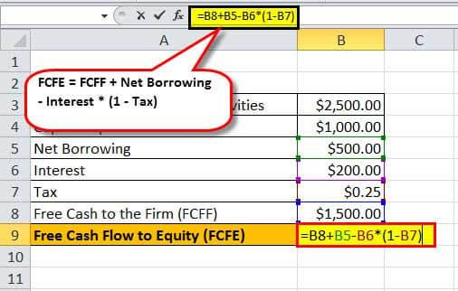

Free Cash Flow (FCF) is a vital financial metric that conveys the cash generated by a company after accounting for operating expenses and capital expenditures. Unlike net income, which is based on accrual accounting and may not reflect the actual cash position of a company, FCF provides a clearer picture of the real cash a business has at its disposal. This surplus cash is essential for funding operations, expanding business activities, paying dividends, or reducing debt, all without relying on external funding sources.

Understanding how companies calculate FCF can provide crucial insights into their financial health and investment possibilities. For investors, a company's ability to generate positive FCF is often a key indicator of its financial stability and growth potential. It demonstrates the entity's capacity to generate more cash than needed for sustaining its operations, signaling effective cost management and revenue-generating strategies. Furthermore, a strong FCF suggests a company's potential to pursue new projects, enhance its technology, or acquire other businesses, thereby potentially increasing shareholder value.



This article explores the calculations of FCF, its implications for financial analysis, and its role in algorithmic trading. By dissecting the methodologies used to derive FCF from financial statements, we aim to present a comprehensive understanding of how this metric can influence investment decision-making and corporate strategy. Additionally, the integration of FCF into algorithmic trading systems highlights its significance in providing a data-driven approach to evaluating and forecasting company performance in financial markets.

## Table of Contents

## Understanding Free Cash Flow

Free Cash Flow (FCF) represents a crucial indicator of a company's financial performance, measuring the cash surplus generated after covering operating expenses and capital requirements. Unlike net income, which can be influenced by non-cash accounting entries such as depreciation and amortization, FCF provides a clearer picture of a company's liquidity by focusing on actual cash flows. 

FCF is calculated using the formula:  
$$
\text{Free Cash Flow} = \text{Operating Cash Flow} - \text{Capital Expenditures} \]  

This metric is significant because it reflects a company's capacity to generate cash that can be used for expansion, reducing debt, distributing dividends, or other investments. A high FCF indicates robust financial health and suggests that a company has the financial flexibility to pursue growth opportunities without relying on external financing sources. In contrast, firms with low or negative FCF may struggle to sustain operations or invest in future growth strategies, potentially requiring additional equity or debt financing to meet their obligations. 

Therefore, FCF serves as a reliable measure of a company's operational efficiency and financial flexibility, providing stakeholders with insights into the prospective returns and inherent risks associated with investment decisions. Investors and analysts often prioritize this metric to assess the sustainability of a company's growth and its ability to reward shareholders over time.

## How to Calculate Free Cash Flow

Free Cash Flow (FCF) is an essential metric for assessing a company's ability to generate cash after fulfilling its capital expenditure requirements. Calculating FCF involves several methods, each based on accessible financial data points. The most prevalent approach is subtracting capital expenditures from operating cash flow, represented by the formula:

$$
\text{FCF} = \text{Operating Cash Flow} - \text{Capital Expenditures}
$$

Operating cash flow, typically found in a company's cash flow statement, signifies the cash generated from regular business operations. Capital expenditures, also listed in financial statements, reflect the funds invested in maintaining or expanding the company's physical assets.

Alternative methods for calculating FCF may utilize sales revenue or net operating profits as starting points. However, these typically need adjustments to ensure non-cash expenses, changes in working capital, and capital investments are accurately reflected.

Tools like Microsoft Excel and specialized financial software can streamline FCF calculations. Excel provides various financial functions and templates, allowing users to create automated spreadsheets for regularly updating and analyzing FCF. Here's a simple example of an Excel formula for FCF:

```excel
=Operating_Cash_Flow - Capital_Expenditures
```

Similarly, financial software often includes built-in functions and features to facilitate detailed FCF analysis. These tools automate data retrieval from financial statements, apply necessary adjustments, and generate FCF figures promptly.

Investors and analysts often rely on such tools to ensure consistent and error-free calculations, enabling better informed financial decisions. Understanding the mechanics of FCF calculations not only aids in assessing a company's financial health but also ensures the accuracy and reliability of financial analyses.

## Interpreting Free Cash Flow Trends

Positive Free Cash Flow (FCF) trends are a critical indicator of financial health for a company, reflecting its capability to generate cash beyond its current capital needs. When a company consistently reports positive FCF, it suggests efficient cash management and the potential for growth. Such trends imply that the company is adept at producing sufficient revenue to cover operational expenses and still have surplus cash for other strategic purposes like expansion or paying dividends. This ability to generate additional cash can be a precursor to potential growth opportunities, enabling the company to invest in projects without needing to secure external funding, thus avoiding additional debt.

Stable FCF, on the other hand, is indicative of operational consistency. A company with stable FCF typically maintains a predictable pattern of cash generation, which might imply that it has reached a steady state of operations where costs and revenues are balanced. This stability can be particularly appealing to conservative investors who favor companies with predictable performance metrics and minimal risk of financial fluctuations. Consistent FCF suggests a reliable operating environment, reflecting the company’s efficient management and predictable income generation capacity.

Conversely, declining FCF can be a red flag for potential financial distress or could highlight strategic investments in growth. A reduction in FCF can indicate that a company is experiencing financial difficulties, such as increased operational costs or declining revenue, which might threaten its [liquidity](/wiki/liquidity-risk-premium) and operational sustainability. However, a decline in FCF does not always signal negative performance. It might also reflect significant capital investments aimed at promoting future growth. For instance, expenditures on research and development, expansion into new markets, or upgrading technology can temporarily reduce FCF while potentially setting the stage for future profitability and improved cash flows. Therefore, understanding the context behind FCF trends is crucial for stakeholders to make informed assessments of a company’s financial trajectory and growth prospects.

## Free Cash Flow in Algorithmic Trading

Free Cash Flow (FCF) is essential in [algorithmic trading](/wiki/algorithmic-trading), serving as a metric to evaluate a company's financial fundamentals. Algorithms incorporate FCF data to assess trends and identify potential investment opportunities. By analyzing FCF trends, automated systems can generate signals for buying or selling assets, based on the cash flow dynamics of a company.

Automated trading systems leverage FCF to create comprehensive financial models that weigh cash generation capability against capital expenses. Incorporating these models, algorithms can execute trades with minimal human intervention. For instance, a trading system might flag a company as a buy if its FCF is increasing consistently, indicating potential for growth and financial stability.

Python, a predominant language in algorithmic trading, facilitates the integration of FCF data into trading algorithms. Here's an example using Python to calculate FCF and screen stocks:

```python
# Import necessary libraries
import pandas as pd

# Sample data for demonstration
data = {
    'company': ['A', 'B', 'C'],
    'operating_cash_flow': [150000, 95000, 120000],
    'capital_expenditures': [50000, 30000, 40000]
}

df = pd.DataFrame(data)

# Calculate FCF
df['free_cash_flow'] = df['operating_cash_flow'] - df['capital_expenditures']

# Screening condition
fcf_threshold = 50000  # Define a threshold for investment decision
df['investment_opportunity'] = df['free_cash_flow'] > fcf_threshold

print(df)
```

This script demonstrates how stocks are screened based on FCF, highlighting companies that may offer lucrative investment opportunities.

Integrating FCF trends into algorithmic trading allows traders to make informed, data-driven decisions, maximizing returns and minimizing risk by focusing on a company’s ability to generate cash.

## Real-World Applications of Free Cash Flow

Companies utilize strong Free Cash Flow (FCF) for various strategic decisions, including mergers, acquisitions, and dividend policies. The presence of robust FCF indicates that a company possesses excess cash beyond its operational needs. This surplus can be strategically leveraged to pursue growth opportunities without resorting to additional financing. For instance, companies with substantial FCF are well-positioned to undertake mergers or acquisitions, allowing them to expand their market presence or acquire new technologies and capabilities. Additionally, consistent FCF can support stable or even increasing dividend payouts, which can attract and retain investors seeking reliable income.

FCF analysis serves as a guiding [factor](/wiki/factor-investing) for financial strategies by providing insights into a company's capacity for capital investments and expansions. Companies with high FCF can afford to reinvest in their operations, upgrade infrastructure, and develop new products, thereby fostering long-term growth. This reinvestment capability is vital in maintaining competitive advantage and ensuring sustainable business operations. By scrutinizing FCF trends, businesses can make informed decisions regarding the allocation of resources toward capital projects, ensuring that their investments yield favorable returns without jeopardizing liquidity.

Ignoring FCF can lead to significant financial challenges, particularly when companies accumulate high levels of debt despite insufficient cash flows. The disparity between cash availability and debt obligations can strain a company's financial structure, potentially leading to insolvency. Historical examples demonstrate how businesses that focused solely on revenue growth, while disregarding FCF, faced dire consequences when their cash flows could not support their debt repayment schedules. By prioritizing FCF analysis, organizations can avoid these pitfalls, ensuring that they possess the necessary financial flexibility to meet both current and future obligations.

## Conclusion

Free Cash Flow (FCF) is critical for assessing a company's financial robustness and potential for strategic decision-making. It serves as a key indicator of a company’s capacity to generate cash beyond its immediate operating and capital expense needs. This cash surplus provides the flexibility needed for growth opportunities, such as investments in new projects, acquisitions, or returning capital to shareholders through dividends and buybacks.

A comprehensive understanding of FCF calculation is vital for investors and corporate strategists. Unlike net income, FCF focuses on actual cash availability rather than accounting profits, providing a clearer view of a company's financial position. The fundamental calculation of FCF, which is typically stated as:

$$
\text{FCF} = \text{Operating Cash Flow} - \text{Capital Expenditures}
$$

highlights the cash remaining after a company has met its essential expenditure requirements. This cash flow measurement assists in determining the viability of funding new projects or sustaining current operations without resorting to external financing sources.

Incorporating FCF into financial analysis equips investors and corporate decision-makers with an essential tool for informed investment strategies and corporate policies. By analyzing FCF trends, stakeholders can better understand a company's growth potential and ability to navigate market challenges effectively. Therefore, mastering the dynamics of Free Cash Flow not only facilitates prudent financial management but also enhances strategic foresight, making it a crucial component in the toolkit of any investor or corporate strategist.

## References & Further Reading

Chris B. Murphy's contributions provide expansive insights into the calculation and interpretation of Free Cash Flow (FCF). Murphy emphasizes the significance of FCF as a measure of a company's financial health and its ability to generate surplus cash after necessary expenditures. His work outlines different methodologies for calculating FCF, with the most commonly used formula being:

$$
\text{FCF} = \text{Operating Cash Flow} - \text{Capital Expenditures}
$$

Murphy illustrates how this fundamental metric can be utilized to assess the operational efficiency of a company beyond mere profit figures. He explains that FCF serves as a crucial indicator for potential investors regarding a company's capability to manage its financial obligations and pursue growth opportunities. His insights highlight the importance of comprehensive FCF analysis to avoid financial pitfalls, especially in companies burdened with high debt and low cash flows, which can misleadingly appear prosperous based on profit metrics alone. 

For deeper understanding and practical applications, Murphy's analyses can be explored further through his discussions and publications on financial websites and resources dedicated to investment education.