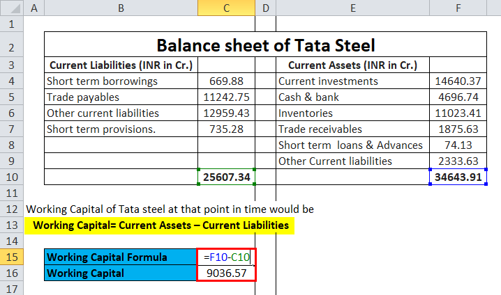

In the fast-paced world of finance, managing working capital effectively is crucial for maintaining a company's short-term financial health and liquidity. As an indicator of a company’s operational efficiency, working capital, defined as the difference between current assets and current liabilities, provides insights into a business’s ability to meet short-term obligations. A positive working capital suggests that a company can readily pay off its short-term debts and potentially invest in new opportunities, whereas a negative working capital may indicate liquidity challenges that could necessitate financial restructuring.

Simultaneously, algorithmic trading, or algo trading, has transformed financial markets by leveraging complex algorithms for executing trades at speeds and frequencies that are impossible for human traders. These algorithms rely heavily on financial calculations and data analysis to optimize trading strategies and enhance execution efficiency. As technology continues to evolve, integrating algorithmic trading into financial processes has become imperative for maintaining competitiveness in the market.



This article bridges these two topics by exploring how Excel formulas can be utilized for essential financial calculations, particularly in determining working capital and supporting algorithmic trading strategies. Excel, with its versatile formulas and data management capabilities, serves as a powerful tool for these purposes. It allows users to input, manipulate, and analyze data efficiently, enabling quick computations and scenario analyses that are vital for informed decision-making.

In this context, we explore the significance of working capital, the essential role of Excel in financial calculations, and the application of these calculations in supporting algorithmic trading. By leveraging Excel’s functionalities, including logical and statistical functions, both investors and traders can enhance their operational effectiveness and gain valuable insights that can aid in sustaining a competitive advantage in the financial industry.

## Table of Contents

## Understanding Working Capital

Working capital is a fundamental financial metric that reveals a company's operational efficiency and ability to meet short-term obligations. It is calculated by subtracting current liabilities from current assets. This straightforward formula serves as a crucial measure of liquidity, indicating the financial health required to cover immediate debts.

Mathematically, working capital can be expressed as:

$$
\text{Working Capital} = \text{Current Assets} - \text{Current Liabilities}
$$

Current assets typically include cash, accounts receivable, inventory, and other assets expected to be converted into cash within a year. Current liabilities, on the other hand, encompass obligations a company is expected to settle in the short term, such as accounts payable, short-term loans, and other similar debts.

A high working capital indicates robust [liquidity](/wiki/liquidity-risk-premium), suggesting that a company can comfortably settle its short-term liabilities and potentially allocate resources towards growth opportunities or capital investments. This capability is often a sign of effective management and sound operational practices. 

Conversely, low working capital could raise red flags regarding a company's financial health. It may signal potential liquidity challenges, where the company might struggle to meet its debts as they come due. This situation often necessitates financial restructuring, cost-cutting measures, or refinancing efforts to stabilize the company's financial standing.

In summary, working capital is a vital barometer for financial analysts and investors assessing a company's short-term solvency and operational efficiency. It provides insights not only into a company’s ability to manage its resources but also into its potential capacity for growth and development.

## Calculating Working Capital in Excel

Excel provides a robust platform for financial calculations, including working capital computation, thanks to its flexible formulas and data management capabilities. Working capital is a measure of a company's liquidity and operational efficiency, determined by subtracting current liabilities from current assets. To calculate working capital in Excel, the basic formula is:

```
=Current Assets - Current Liabilities
```

Using Excel, users can efficiently input and manipulate data for quick calculations and conduct scenario analyses. Here's a step-by-step guide to setting up data and formulas in Excel for comparing the working capital of two companies:

1. **Data Entry**: Begin by organizing the current assets and current liabilities of each company in a spreadsheet. For instance, you can create columns labeled "Company A Current Assets," "Company A Current Liabilities," "Company B Current Assets," and "Company B Current Liabilities."

2. **Formula Application**: Use the working capital formula for each company. In a new column, enter the formula to calculate the working capital. For Company A, you might input the formula in cell C2:
   ```
   =A2 - B2
   ```
   For Company B, use:
   ```
   =A3 - B3
   ```

3. **Scenario Analysis**: Excel's features allow for quick scenario analyses by adjusting the figures in the current assets or liabilities fields to see how changes affect working capital. This is particularly useful for financial planning and stress testing.

4. **Chart Options**: Visualizing data can be an effective means of analysis. Use Excel's chart tools to create a visual comparison of working capital over time or between different companies. 

5. **Enhanced Functionality**: Incorporate Excel functions like `SUM`, `AVERAGE`, and `IF` to handle more complex financial data or to provide additional insights. For example, you can track average working capital over several periods:
   ```
   =AVERAGE(C2:C10)
   ```

6. **Automation and Templates**: Create templates and automate repetitive tasks to improve efficiency. Use Excel's macro functionality to automate the process of data input or calculation tasks across multiple sheets or files.

By setting up these formulas and utilizing Excel's capabilities, users can effectively manage and analyze working capital data, allowing for informed financial decision-making.

## Excel Features for Algorithmic Trading

Algorithmic trading, also known as algo trading, fundamentally depends on the efficient processing and analysis of large datasets. Excel emerges as a potent tool in this domain due to its array of built-in features that offer robust data analysis and calculation capabilities. The platform facilitates the development, testing, and refinement of trading strategies, thus empowering traders to gain insights and improve performance.

One of the key features of Excel that makes it indispensable for [algorithmic trading](/wiki/algorithmic-trading) is its ability to connect to external data sources for live updates. This capability allows traders to incorporate real-time market data into their spreadsheets, enabling dynamic decision-making. Utilizing the Data Connection feature, traders can establish links to various financial data providers and automate data refreshing at predetermined intervals. This seamless integration ensures that trading strategies are based on the latest available information, enhancing their accuracy and reliability.

Moreover, Excel offers logical functions such as IF, AND, and OR, which are crucial for algorithm development. These functions allow users to implement conditional operations and decision-making processes within trading algorithms. For instance, a trader might use the IF function to create a condition-based trading rule, such as: 

$$
\text{IF(Closing\_Price} > \text{Moving\_Average, "Buy", "Hold")}
$$

This function dictates that a buying signal is generated if the closing price exceeds the moving average, else the recommendation is to hold. 

In addition to logical functions, Excel provides a suite of mathematical functions like SUM and AVERAGE, which are essential for calculating performance metrics and further refining trading strategies. The AVERAGE function, for instance, can be employed to compute moving averages, a critical component in technical analysis and strategy formulation:

$$
\text{AVERAGE(B2:B21)}
$$

This formula calculates the average of the data in cells B2 to B21, allowing traders to identify trends and potential entry or [exit](/wiki/exit-strategy) points in the market.

For statistical analysis, functions like STANDARD DEVIATION (STDEV.P or STDEV.S) can be used to assess the [volatility](/wiki/volatility-trading-strategies) of stocks, thus informing risk management decisions. Through such statistical measures, traders can better understand and mitigate potential risks associated with specific trading algorithms.

Overall, Excel's array of functions and connectivity features make it a versatile and powerful tool in the workflow of algorithmic trading, allowing traders to harness data effectively and optimize their strategies for improved financial outcomes.

## Implementing Financial Algorithms in Excel

Excel serves as a versatile tool for developing and [backtesting](/wiki/backtesting) financial algorithms due to its comprehensive range of functions and ease of use. One of the key advantages is its ability to connect to real-time data sources, allowing users to access up-to-date market information. Excel's capability to incorporate live data facilitates prompt decision-making and live signal generation, essential features for executing timely trades in the fast-paced finance environment.

To implement a basic trading strategy in Excel, users can utilize a combination of its built-in functions. For instance, a moving average crossover strategy—where a short-term moving average crosses above a long-term moving average, indicating a potential buy signal—can be implemented using simple Excel functions. Here is how you can set up such a strategy:

1. **Data Importation and Preparation**: Start by importing historical price data, either by manually loading a CSV file or via a data connection to a financial data provider. Ensure the data includes dates and closing prices.

2. **Calculating Moving Averages**: Use the `AVERAGE` function to calculate the moving averages. For a short-term moving average (say 5 days):
$$
   \text{Short\_MA} = \text{AVERAGE}(B2:B6)

$$
   And for a long-term moving average (e.g., 20 days):
$$
   \text{Long\_MA} = \text{AVERAGE}(B2:B21)

$$
   Drag these formulas down the column to calculate moving averages for each date.

3. **Generating Buy/Sell Signals**: Implement an `IF` statement to generate buy or sell signals. For instance:
$$
   \text{Signal} = \text{IF}(\text{Short\_MA} > \text{Long\_MA}, "Buy", "Sell")

$$
   This logic specifies that when the short-term moving average exceeds the long-term average, a buy signal is triggered.

4. **Backtesting the Strategy**: Once the signals are generated, performance analysis can be conducted by computing returns based on these signals. Calculate potential profits or losses by comparing the entry and exit points determined by the signals. Utilize Excel functions such as `SUMPRODUCT` to aggregate total returns over a specific period.

Excel's ability to automate trading signals through its logical and mathematical functions makes it a powerful platform for financial modeling. By setting up these automated processes, traders can create dynamic and adaptable models that react promptly to market conditions, thereby improving the efficacy of their trading strategies. Furthermore, Excel supports integration with advanced programming languages like Python for more complex algorithmic trading models, enhancing its utility for sophisticated users.

## Real-World Applications and Case Studies

Excel's role in financial activities extends beyond basic calculations, showcasing its utility in practical applications across various industry sectors. One notable application of Excel is in calculating working capital, a crucial metric for financial management that helps companies assess their operational efficiency and financial health. Many firms leverage Excel to conduct comparative financial analyses between market competitors. By inputting financial data such as current assets and current liabilities, companies can utilize Excel formulas to compute working capital and analyze trends over time. This capability not only allows for the monitoring of a company's liquidity position but also aids in strategic decision-making based on competitive comparisons.

Moreover, Excel's application extends to the world of algorithmic trading, where traders and hedge funds develop and implement trading strategies. Hedge funds, in particular, utilize Excel for its robust data manipulation features and the ability to connect to real-time data sources. Excel’s platform allows for the seamless backtesting of trading strategies using historical data, enabling the refinement of algorithms before deploying them in live environments. A common approach used by traders in Excel involves leveraging its array of built-in functions like `IF`, `AND`, `OR`, and statistical functions to create rule-based trading systems.

For instance, a [hedge fund](/wiki/hedge-fund-trading-strategies) might employ a moving average crossover strategy, where trade signals are generated when a short-term moving average crosses above or below a long-term moving average. This can be implemented in Excel by importing historical price data and using formulas like `=AVERAGE()` to calculate the moving averages. An example cell formula might look like:

```excel
=IF(SHORT_MA_ROW_CELL > LONG_MA_ROW_CELL, "Buy", "Sell")
```

This setup allows traders to simulate thousands of scenarios to evaluate the potential success rate of their strategies under different market conditions.

Case studies illustrate the effectiveness of Excel in these roles. For example, a mid-market manufacturing company might use Excel to compare its working capital to that of larger competitors to determine areas for improvement and investment. Likewise, a small algorithm-driven trading firm might use Excel as a cost-effective solution to prototype and refine its trading algorithms before investing in more sophisticated software platforms.

These case studies highlight Excel's versatility across sectors, showing how it serves as a critical tool for both strategic financial management and the development of complex trading models. Excel's user-friendly interface combined with its powerful computational capabilities continues to make it an invaluable resource for financial professionals seeking to gain an edge in a competitive market landscape.

## Conclusion

Excel remains a powerful tool in the financial industry for performing complex calculations and developing trading algorithms. Its diverse functionalities provide essential support for calculating working capital and implementing algorithmic trading strategies. By using Excel, financial professionals can simplify decision-making processes and improve operational efficiency.

The calculation of working capital using Excel's straightforward formula `=Current Assets - Current Liabilities` allows companies to assess their short-term financial health efficiently. This capability is crucial for determining a company's ability to meet its obligations and plan for future growth. Excel's robust data management and scenario analysis features enable users to explore various financial strategies with ease, offering insights into potential liquidity issues or investment opportunities.

In algorithmic trading, Excel's vast array of built-in functions—such as logical operators (IF, AND, OR) and statistical functions (SUM, AVERAGE)—facilitates the development and refinement of trading strategies. Through real-time data connections, Excel can access live financial data, allowing traders to generate and test trading signals dynamically. This functionality is crucial for developing responsive and effective financial models that adapt to market conditions.

By leveraging the full potential of Excel, both investors and traders can gain significant insights, enabling them to maintain a competitive edge. Whether through assessing working capital efficiency or crafting sophisticated algorithmic strategies, Excel offers the tools needed to navigate the complex landscape of modern finance successfully.

## References & Further Reading

[1]: Bergstra, J., Bardenet, R., Bengio, Y., & Kégl, B. (2011). ["Algorithms for Hyper-Parameter Optimization."](https://dl.acm.org/doi/10.5555/2986459.2986743) Advances in Neural Information Processing Systems 24.

[2]: ["Advances in Financial Machine Learning"](https://www.amazon.com/Advances-Financial-Machine-Learning-Marcos/dp/1119482089) by Marcos Lopez de Prado

[3]: ["Evidence-Based Technical Analysis: Applying the Scientific Method and Statistical Inference to Trading Signals"](https://www.amazon.com/Evidence-Based-Technical-Analysis-Scientific-Statistical/dp/0470008741) by David Aronson

[4]: ["Machine Learning for Algorithmic Trading"](https://github.com/stefan-jansen/machine-learning-for-trading) by Stefan Jansen

[5]: ["Quantitative Trading: How to Build Your Own Algorithmic Trading Business"](https://www.amazon.com/Quantitative-Trading-Build-Algorithmic-Business/dp/1119800064) by Ernest P. Chan