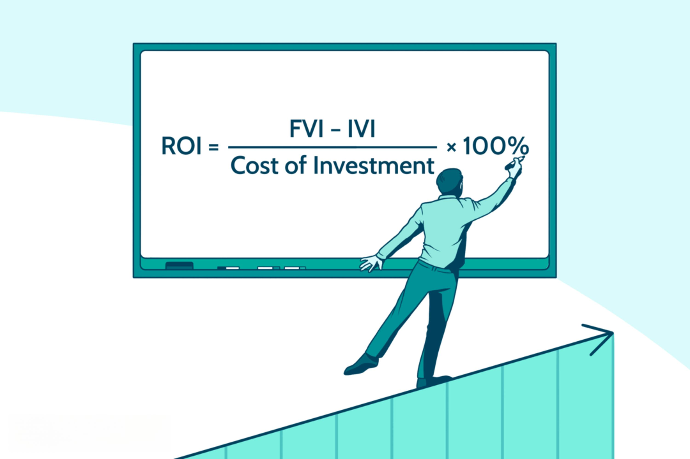

In today's fast-paced financial markets, selecting the right investment strategies is crucial for achieving financial goals. The dynamic nature of these markets demands an approach that not only seeks returns but also manages risks efficiently. This article will explore various investment strategies, including formula investing, financial planning formulas, and algorithmic trading, each of which plays a significant role in optimizing financial outcomes.

Formula investing involves a systematic approach to buying and selling securities based on predetermined rules, thus removing emotional biases from decision-making. This method can be particularly effective in volatile market conditions, providing consistency and discipline in investment practices. Financial planning formulas are analytical tools that help evaluate investment options, project potential returns, and plan for future financial needs. Examples of these formulas include the time-weighted rate of return and the compound annual growth rate, which offer investors structured methodologies for achieving long-term financial goals.



Algorithmic trading leverages computer algorithms to automate trading decisions based on set criteria, significantly enhancing trade execution speed and precision. This strategy allows investors to capitalize on short-term market opportunities while minimizing human errors and emotional influences. Understanding these strategies and their integration can provide investors with a competitive edge in managing their portfolios effectively.

By combining these investment strategies, investors can minimize risks and maximize returns, especially in the face of market volatility. The ability to adapt and integrate these strategies is critical for financial success, emphasizing the importance of continuous learning and strategic planning. A thorough understanding of these concepts can empower investors to navigate the complexities of financial markets with greater confidence and effectiveness.

## Table of Contents

## Understanding Investment Strategies

Investment strategies are essential components in the financial planning toolkit, each uniquely designed to assist both individual and institutional investors in achieving their specific financial aspirations. Central to these strategies are asset allocation, diversification, and risk management. Asset allocation involves distributing investments across various asset classes, such as stocks, bonds, and real estate, to optimize the balance between risk and return. Diversification further mitigates risk by spreading investments across different sectors, geographic regions, or asset types, reducing the impact of a poor performance from any single investment. Risk management strategies are vital in safeguarding an investment portfolio from market volatility, focusing on identifying, analyzing, and responding to risk factors.

Key investment strategies may involve decisions between active and passive investing. Active investing entails frequent buying and selling decisions by portfolio managers in an attempt to outperform market indices. This strategy demands higher fees and deep market analysis but offers the potential for substantial returns. Passive investing, on the other hand, seeks to replicate the performance of a specific market index, fostering a long-term, low-cost, and hands-off approach with potentially lower returns but reduced risk. 

Further, investors often face the choice between long-term and short-term strategies. Long-term investing focuses on buy-and-hold principles, capitalizing on the gradual appreciation of assets over several years. This approach aligns with the power of compound growth. In contrast, short-term investing is characterized by rapid buying and selling based on short-term market fluctuations, demanding constant attention but providing quicker returns.

Investors also evaluate growth versus value investing strategies. Growth investing targets stocks predicted to increase in value at an above-average rate, often at higher valuations, implying higher potential returns alongside greater risk. Value investing, contrarily, focuses on undervalued stocks with strong fundamentals, potentially offering stable returns with reduced risk of loss.

The choice of investment strategy should be informed by a careful assessment of its respective advantages and disadvantages. Active investing may offer high returns but at higher costs and risks, while passive investing offers stability at a potentially lower return rate. Similarly, long-term strategies provide gradual growth potential for those with patience, whereas short-term strategies may benefit those keen on rapid gains. Finally, growth investing suits investors willing to embrace risk for high rewards, whereas value investing attracts those focused on steady returns.

Overall, the evaluation and understanding of different investment strategies, aligned with an individual's financial goals and risk tolerance, are imperative for effective financial planning and portfolio management.

## The Role of Financial Planning Formulas

Financial planning formulas serve as essential tools in assessing investment opportunities, estimating potential returns, and organizing future financial needs. These formulas are integral to developing a structured investment approach, especially for setting and pursuing long-term financial objectives. They provide a methodological framework that can enhance decision-making and optimize financial outcomes.

One of the significant formulas is the **time-weighted rate of return (TWRR)**. This metric is pivotal in evaluating the performance of an investment portfolio by negating the impact of cash flows within the period. It is especially useful for comparing the historical performances of portfolio managers. The formula for calculating the time-weighted rate of return is expressed as follows:

$$
TWRR = \prod_{i=1}^{n} (1 + R_i) - 1
$$

Where $R_i$ is the return for period $i$, and $n$ is the number of periods.

Another crucial formula is the **compound annual growth rate (CAGR)**, which measures the mean annual growth rate of an investment over a specified time longer than one year. It provides a smoothed annual rate of return, which can facilitate comparisons across different types of investments. The formula for CAGR is:

$$
CAGR = \left( \frac{V_f}{V_i} \right)^{\frac{1}{t}} - 1
$$

Where $V_f$ is the final value, $V_i$ is the initial value, and $t$ is the time in years.

**Asset allocation models** play a vital role in diversifying investment portfolios to balance risk and return according to an investor's objectives, risk tolerance, and time horizon. A common model used is the Modern Portfolio Theory (MPT), which suggests that an optimal portfolio is one that has the highest expected return for a given level of risk. The formula to determine the expected return of a portfolio is given by:

$$
E(R_p) = \sum_{i=1}^{n} w_i E(R_i)
$$

Where $w_i$ is the proportion of the total investment in asset $i$, and $E(R_i)$ is the expected return of asset $i$.

Employing these formulas in investment strategies not only structures the approach but also sharpens focus on long-term financial targets. They enable a systematic assessment of decisions and performance, consequently heightening financial planning's accuracy and success rate. Through continuous application, investors can refine their understanding and execution of wealth management strategies, ultimately enhancing financial health and security.

## An Introduction to Algorithmic Trading

Algorithmic trading, commonly referred to as algo trading, represents a significant innovation in financial markets, where computer algorithms are deployed to automate trading processes based on pre-defined criteria. This method leverages the power of computing to execute trades at speeds and frequencies that are impossible for a human trader to match. The core advantage of [algorithmic trading](/wiki/algorithmic-trading) lies in its ability to execute high-speed trade operations, thereby enhancing market efficiency and optimizing trade execution time.

One of the primary benefits of algorithmic trading is its capacity to mitigate emotional bias in trading decisions. Algorithms operate based on logic and mathematical models, removing the emotional component that often leads to impulsive trading decisions. This objectivity helps in optimizing market timing, ensuring that transactions occur at the most favorable conditions possible.

The popularity of algorithmic trading has surged due to its precise execution and efficiencies, enabling traders to exploit short-term market opportunities more effectively. From [arbitrage](/wiki/arbitrage) opportunities, where price discrepancies across markets can be leveraged, to real-time data analysis that informs trading decisions, algorithmic trading capitalizes on these opportunities with unmatched speed and accuracy.

Three main types of strategies characterize algorithmic trading: trend-following algorithms, mean reversion strategies, and [machine learning](/wiki/machine-learning)-based predictive models.

1. **Trend-following Algorithms**: These algorithms are designed to identify and follow market trends. They typically involve indicators such as moving averages and channel breakouts. By capturing the momentum of market trends, these algorithms can generate signals that trigger buy or sell actions.

2. **Mean Reversion Strategies**: Mean reversion is based on the concept that asset prices will revert to their mean or average value over time. Algorithms employing this strategy monitor deviations from a stock’s historical average price, buying when it falls below the average and selling when it rises above. This approach requires extensive historical data to accurately define the mean.

3. **Machine Learning-based Predictive Models**: These models use complex algorithms to identify patterns and relationships in data that may not be visible to the human eye. By training on historical data, machine learning algorithms can forecast future price movements, optimizing trading strategies with advanced predictive capabilities. Python libraries such as scikit-learn and TensorFlow are often employed for developing these sophisticated models.

```python
from sklearn.ensemble import RandomForestRegressor
import numpy as np

# Sample code to illustrate the use of a predictive model
# X is the feature set (e.g., historical stock prices) and y is the target variable (future price)

# Create a random forest regression model
model = RandomForestRegressor(n_estimators=100)

# Fit the model with data
model.fit(X_train, y_train)

# Predict future prices
predictions = model.predict(X_test)

# Evaluate the model's performance
performance = model.score(X_test, y_test)
```

Overall, algorithmic trading has transformed the landscape of financial markets, offering traders the tools to execute strategies with greater precision and reduced risk. By integrating advances in computing and machine learning, algorithmic trading continues to evolve, providing traders a significant advantage in an increasingly competitive market environment.

## Integrating Strategies: A Holistic Approach

Combining investment strategies, financial planning formulas, and algorithmic trading creates a comprehensive investment approach, offering substantial advantages in today's financial markets. The integration of these strategies ensures a balanced portfolio, adeptly leveraging the strengths inherent in each to mitigate risks and enhance potential returns.

A diversified portfolio is fundamental to this approach, as it spreads investments across various asset classes, industries, or geographical regions, reducing the impact of poor performance in any single investment. This diversification is often guided by a strategic combination of long-term and short-term positions, balancing stable growth with opportunities for immediate gain. Further, continuously monitoring market trends is crucial. This involves analyzing financial data, economic indicators, and market sentiment to adapt strategies promptly. Regular adjustments based on quantitative analysis allow investors to optimize portfolio performance more effectively.

Quantitative models can aid this process by identifying investment opportunities and assessing risk metrics. For instance, the Sharpe ratio, a common financial metric, can be used to measure risk-adjusted returns, helping investors ascertain the value of taking on a particular risk.

$$
\text{Sharpe Ratio} = \frac{R_p - R_f}{\sigma_p}
$$

where $R_p$ represents the portfolio return, $R_f$ is the risk-free rate, and $\sigma_p$ is the standard deviation of the portfolio's excess return. Such metrics provide clarity in assessing whether a portfolio's returns are due to smart investment choices or excessive risk.

Investors should tailor this holistic strategy to personal risk tolerance, financial goals, and market conditions. This involves setting clear objectives, such as retirement planning or wealth accumulation, and aligning them with the appropriate level of risk. Each investor's unique financial situation and market outlook will dictate the blend of strategies employed.

Algorithmic trading contributes to this integrative approach by offering precision and speed in executing trades, reducing the emotional bias often found in manual trading. These algorithms can be designed using Python to automate complex trading strategies, adjusting positions based on real-time data. For example, a simple moving average crossover strategy in Python might look like this:

```python
import pandas as pd

# Assume `df` is a DataFrame containing 'Date' and 'Close Price'
df['Short_MA'] = df['Close Price'].rolling(window=40, min_periods=1).mean()
df['Long_MA'] = df['Close Price'].rolling(window=100, min_periods=1).mean()

# Generating signals
df['Signal'] = 0
df.loc[df['Short_MA'] > df['Long_MA'], 'Signal'] = 1
df.loc[df['Short_MA'] < df['Long_MA'], 'Signal'] = -1

# Actions based on signals
df['Position'] = df['Signal'].shift()
```

This code generates trading signals by comparing short and long-term moving averages, and it exemplifies how algorithmic strategies can be developed to react to market conditions.

In essence, integrating diverse investment methodologies amplifies their individual benefits, crafting a versatile and resilient approach. This holistic strategy equips investors to navigate [volatility](/wiki/volatility-trading-strategies) and capitalize on financial opportunities, aligning with personalized financial aspirations.

## Conclusion

Investment success often lies in the ability to adapt and integrate multiple strategies effectively. As financial environments continually evolve, investors must remain flexible and informed to capitalize on potential opportunities. Financial planning formulas and algorithmic trading have emerged as potent tools when combined with a robust investment strategy. These tools not only enhance the precision of investment decisions but also enable the efficient management of complex portfolios. 

The dynamic nature of financial markets necessitates a commitment to education and continuous learning. Understanding changes in market conditions, technological advancements, and new financial instruments is crucial for maintaining a competitive edge. Investors should actively pursue knowledge acquisition, leveraging resources such as online courses, seminars, and industry publications to deepen their understanding of modern investment methodologies. 

Additionally, seeking professional advice can provide valuable insights into tailoring portfolios to meet individual risk tolerances and financial goals. Financial advisors can offer guidance on integrating advanced strategies, ensuring that portfolios are aligned with market conditions and personal objectives. 

Technology plays a pivotal role in simplifying investment processes and improving outcomes. Utilizing financial software, analytical tools, and real-time data feeds allows investors to make informed decisions quickly and accurately. Moreover, algorithmic trading systems can systematically manage trades, minimizing human error and exploiting short-term market inefficiencies. 

Ultimately, a proactive approach combining education, professional advice, and effective use of technology empowers investors to achieve their financial aspirations. By diligently applying these principles, individuals can navigate the complexities of modern financial markets and optimize their investment success.

## References & Further Reading

[1]: Bergstra, J., Bardenet, R., Bengio, Y., & Kégl, B. (2011). ["Algorithms for Hyper-Parameter Optimization."](https://dl.acm.org/doi/10.5555/2986459.2986743) Advances in Neural Information Processing Systems 24.

[2]: ["Advances in Financial Machine Learning"](https://www.amazon.com/Advances-Financial-Machine-Learning-Marcos/dp/1119482089) by Marcos Lopez de Prado

[3]: ["Evidence-Based Technical Analysis: Applying the Scientific Method and Statistical Inference to Trading Signals"](https://www.amazon.com/Evidence-Based-Technical-Analysis-Scientific-Statistical/dp/0470008741) by David Aronson

[4]: ["Machine Learning for Algorithmic Trading"](https://github.com/stefan-jansen/machine-learning-for-trading) by Stefan Jansen

[5]: ["Quantitative Trading: How to Build Your Own Algorithmic Trading Business"](https://www.amazon.com/Quantitative-Trading-Build-Algorithmic-Business/dp/1119800064) by Ernest P. Chan