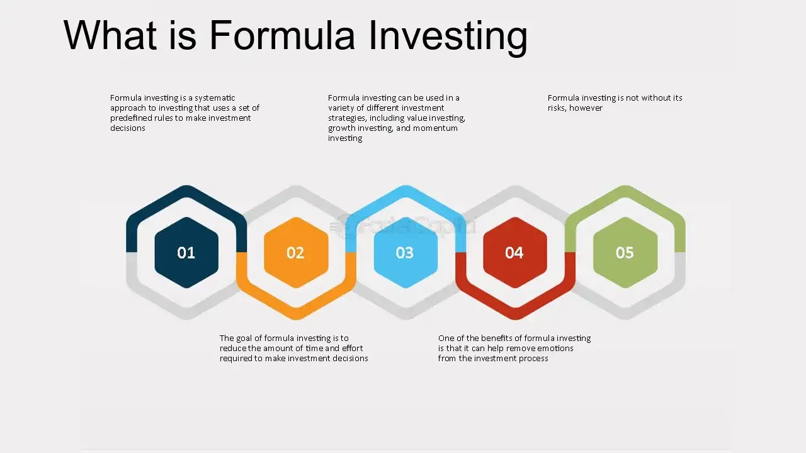

## Table of Contents

## What is formula investing?

Formula investing is a way to pick investments using a set of rules instead of guessing or following feelings. It's like following a recipe to make a dish. Investors use these rules, or formulas, to decide which stocks or other investments to buy, sell, or keep. The rules can be based on things like a company's earnings, how much it costs compared to its earnings, or how much it's growing.

People like formula investing because it takes out the guesswork and emotions from investing. It helps keep decisions steady and can make it easier to stick to a plan. Some well-known formulas include the Dogs of the Dow, which picks stocks from the Dow Jones Industrial Average based on their dividend yield, and value investing, which looks for stocks that seem to be priced lower than they should be based on their earnings or other measures.

## How does formula investing differ from traditional investing?

Formula investing and traditional investing are two different ways to pick investments. Formula investing uses a set of rules to decide which stocks or other investments to buy or sell. These rules can be about things like a company's earnings or how much its stock costs compared to its earnings. This method helps take out the guesswork and emotions from investing. It's like following a recipe where you don't need to make up the steps yourself.

On the other hand, traditional investing often relies on a person's judgment and experience. Investors might look at the same things, like earnings and stock prices, but they also use their feelings and predictions about the market. They might talk to company leaders, read news, and use their own ideas about where the market is going. This way can be more flexible but also more influenced by emotions and personal biases.

Both methods have their own benefits. Formula investing can make it easier to stick to a plan and be more consistent. Traditional investing allows for more personal judgment and can adapt to new information more quickly. Choosing between them depends on what an investor feels comfortable with and their goals.

## What are the basic principles behind formula investing?

Formula investing is based on using a set of clear rules to pick investments. These rules help take away the guesswork and emotions that can sometimes mess up investing. Instead of trying to predict the market or follow your feelings, you follow a recipe. This recipe, or formula, might look at things like a company's earnings, how much its stock costs compared to its earnings, or how fast it's growing. By sticking to these rules, you can make decisions that are more steady and less likely to be swayed by what's happening in the news or how you feel that day.

The main idea behind formula investing is to keep things simple and consistent. When you have a set of rules to follow, it's easier to stick to your plan, even when the market goes up and down. This can help you avoid making quick decisions based on fear or excitement. Over time, following a formula can help you build a solid investment strategy that doesn't depend on trying to guess what will happen next in the market. It's about using clear, measurable factors to guide your choices and keep your investing on track.

## What are some common strategies used in formula investing?

Formula investing uses different strategies to pick investments. One popular strategy is the Dogs of the Dow. This method picks the ten stocks from the Dow Jones Industrial Average that have the highest dividend yields. The idea is that these stocks might be undervalued and could offer good returns. Another common strategy is value investing. This involves looking for stocks that seem to be priced lower than they should be, based on their earnings or other measures. Investors using this strategy believe that over time, the market will recognize the true value of these stocks, leading to higher prices.

Another strategy in formula investing is [momentum](/wiki/momentum) investing. This approach picks stocks that have been going up in price recently, with the belief that they will keep going up. It's like jumping on a moving train, hoping it will keep moving in the same direction. There's also the strategy of using the price-to-earnings (P/E) ratio. Investors using this method look for stocks with low P/E ratios, thinking these might be good deals. Each of these strategies uses clear rules to decide which stocks to buy or sell, helping to keep emotions out of the decision-making process.

## How can someone start implementing formula investing in their portfolio?

To start using formula investing in your portfolio, first, pick a strategy that fits your goals. There are many strategies out there, like the Dogs of the Dow, value investing, or momentum investing. Each one has its own set of rules to follow. For example, if you choose the Dogs of the Dow, you'll need to look at the Dow Jones Industrial Average and pick the ten stocks with the highest dividend yields. Once you've chosen a strategy, learn its rules well so you can follow them without guessing.

After [picking](/wiki/asset-class-picking) a strategy, start applying it to your investments. If you're new to investing, you might want to start small and see how it goes. Use the rules of your chosen strategy to decide which stocks to buy or sell. For example, if you're using value investing, you'll look for stocks that seem cheap compared to their earnings. Keep track of your investments and stick to the rules, even when the market goes up and down. Over time, this can help you build a solid investment plan that's less influenced by emotions and more based on clear, measurable factors.

## What are the advantages of using formula investing strategies?

Formula investing helps take the guesswork out of choosing investments. By following a set of clear rules, you don't have to rely on your feelings or try to predict the market. This can make it easier to stick to your plan and not make quick decisions based on fear or excitement. Over time, this can lead to more steady and reliable results because you're using the same method again and again.

Another advantage is that formula investing can save you time. Once you learn the rules of a strategy, you can apply them without spending hours trying to figure out what to do next. This means you can spend less time worrying about your investments and more time on other things. Plus, since these strategies are based on clear, measurable factors, it's easier to see if your plan is working and make changes if needed.

## What are the potential risks and limitations of formula investing?

Formula investing can make things simpler, but it has its own risks. One big risk is that the rules you follow might not work well in every situation. The market changes a lot, and what worked in the past might not work now. If you stick too closely to your formula without thinking about what's happening in the market, you could miss out on good chances or lose money.

Another limitation is that formula investing can be too strict. Sometimes, you need to be flexible and change your plan based on new information. If you're always following the same rules, you might not see when something important changes. Also, not all formulas are perfect. Some might be too simple and miss important details about a company or the market. This can lead to picking the wrong investments, even if you're following the rules carefully.

## How do you evaluate the performance of a formula investing strategy?

To evaluate the performance of a formula investing strategy, you need to look at how well it does over time. This means checking if the strategy helps you make money and if it does better than just keeping your money in a savings account or following the overall market. You can do this by looking at the returns, or how much your investments grow, and comparing them to a benchmark like the S&P 500. If your strategy's returns are higher than the benchmark, it's doing well. But if they're lower, you might need to think about changing your strategy.

It's also important to consider how much risk you're taking with your formula investing strategy. Some strategies might give you higher returns but also come with more ups and downs. You can measure this by looking at the volatility, or how much your investment values change over time. A good strategy should give you a balance between good returns and not too much risk. Lastly, keep track of how often you need to make changes to your investments. If you're always buying and selling, it might be too hard to keep up with, and you could end up spending more on fees and taxes.

## Can formula investing be automated, and if so, how?

Yes, formula investing can be automated using computer programs and software. These tools can follow the rules of your chosen strategy without you having to do it yourself. For example, if you're using the Dogs of the Dow strategy, you can set up a program to look at the Dow Jones Industrial Average each year and automatically pick the ten stocks with the highest dividend yields. The software can then buy these stocks for you and sell them when it's time to update your portfolio. This way, you don't have to spend time checking the market or making decisions based on feelings.

Automating formula investing can save you a lot of time and help you stick to your plan better. Once you set up the rules in the software, it will keep following them without getting distracted by what's happening in the news or how you're feeling that day. However, you still need to check on the software sometimes to make sure it's working right and to update the rules if the market changes. This way, you can enjoy the benefits of formula investing without the hassle of doing everything by hand.

## What are some advanced techniques in formula investing for experienced investors?

For experienced investors, one advanced technique in formula investing is to use multiple strategies at the same time. This is called a multi-[factor](/wiki/factor-investing) approach. Instead of just using one set of rules, like value investing or momentum investing, you can mix different strategies to find the best investments. For example, you might look for stocks that are both undervalued and have good momentum. By combining different factors, you can make a more balanced and possibly more successful investment plan. This can help you find opportunities that a single strategy might miss.

Another advanced technique is to use [machine learning](/wiki/machine-learning) and data analysis to improve your formula investing. This involves using computers to look at huge amounts of data and find patterns that might not be obvious to people. For example, you can use machine learning to find new factors that affect stock prices or to predict how stocks will do in the future. This can help you create more detailed and accurate rules for your investing strategy. However, it takes a lot of knowledge about both investing and technology to do this well.

## How does one adapt formula investing strategies to different market conditions?

Adapting formula investing strategies to different market conditions means changing the rules you follow based on what's happening in the market. For example, if the market is going up a lot, you might want to use a momentum strategy to pick stocks that are also going up. But if the market is going down, you might switch to a value investing strategy to find stocks that are cheap and might go back up when the market gets better. The key is to keep an eye on the market and be ready to change your strategy if things change a lot.

Even though formula investing is about following rules, it's also important to be flexible. You can do this by setting up your formulas to include different conditions. For example, you might have one set of rules for when the market is doing well and another set for when it's not. This way, you can switch between them without having to come up with new rules every time the market changes. By staying aware of market trends and being willing to adjust your strategy, you can keep your investments on track no matter what's happening.

## What role does data analysis play in refining formula investing strategies?

Data analysis is really important for making formula investing strategies better. By looking at lots of data, you can find out which rules work well and which ones don't. For example, you might see that stocks with high dividends do better in some years but not in others. With this information, you can change your rules to fit what's happening in the market. This helps you make smarter choices about which stocks to buy or sell.

Using data also lets you find new patterns that you might not have seen before. You can use special computer programs to look at big amounts of information and spot trends that are hard for people to see. This can help you add new rules to your strategy or make the old ones work better. By keeping up with data analysis, you can keep your formula investing plan sharp and ready for whatever the market throws at you.

## What is the Role of Financial Planning Formulas?

Financial planning formulas serve as essential tools in assessing investment opportunities, estimating potential returns, and organizing future financial needs. These formulas are integral to developing a structured investment approach, especially for setting and pursuing long-term financial objectives. They provide a methodological framework that can enhance decision-making and optimize financial outcomes.

One of the significant formulas is the **time-weighted rate of return (TWRR)**. This metric is pivotal in evaluating the performance of an investment portfolio by negating the impact of cash flows within the period. It is especially useful for comparing the historical performances of portfolio managers. The formula for calculating the time-weighted rate of return is expressed as follows:

$$
TWRR = \prod_{i=1}^{n} (1 + R_i) - 1
$$

Where $R_i$ is the return for period $i$, and $n$ is the number of periods.

Another crucial formula is the **compound annual growth rate (CAGR)**, which measures the mean annual growth rate of an investment over a specified time longer than one year. It provides a smoothed annual rate of return, which can facilitate comparisons across different types of investments. The formula for CAGR is:

$$
CAGR = \left( \frac{V_f}{V_i} \right)^{\frac{1}{t}} - 1
$$

Where $V_f$ is the final value, $V_i$ is the initial value, and $t$ is the time in years.

**Asset allocation models** play a vital role in diversifying investment portfolios to balance risk and return according to an investor's objectives, risk tolerance, and time horizon. A common model used is the Modern Portfolio Theory (MPT), which suggests that an optimal portfolio is one that has the highest expected return for a given level of risk. The formula to determine the expected return of a portfolio is given by:

$$
E(R_p) = \sum_{i=1}^{n} w_i E(R_i)
$$

Where $w_i$ is the proportion of the total investment in asset $i$, and $E(R_i)$ is the expected return of asset $i$.

Employing these formulas in investment strategies not only structures the approach but also sharpens focus on long-term financial targets. They enable a systematic assessment of decisions and performance, consequently heightening financial planning's accuracy and success rate. Through continuous application, investors can refine their understanding and execution of wealth management strategies, ultimately enhancing financial health and security.

## How can we integrate strategies using a holistic approach?

Combining investment strategies, financial planning formulas, and [algorithmic trading](/wiki/algorithmic-trading) creates a comprehensive investment approach, offering substantial advantages in today's financial markets. The integration of these strategies ensures a balanced portfolio, adeptly leveraging the strengths inherent in each to mitigate risks and enhance potential returns.

A diversified portfolio is fundamental to this approach, as it spreads investments across various asset classes, industries, or geographical regions, reducing the impact of poor performance in any single investment. This diversification is often guided by a strategic combination of long-term and short-term positions, balancing stable growth with opportunities for immediate gain. Further, continuously monitoring market trends is crucial. This involves analyzing financial data, economic indicators, and market sentiment to adapt strategies promptly. Regular adjustments based on quantitative analysis allow investors to optimize portfolio performance more effectively.

Quantitative models can aid this process by identifying investment opportunities and assessing risk metrics. For instance, the Sharpe ratio, a common financial metric, can be used to measure risk-adjusted returns, helping investors ascertain the value of taking on a particular risk.

$$
\text{Sharpe Ratio} = \frac{R_p - R_f}{\sigma_p}
$$

where $R_p$ represents the portfolio return, $R_f$ is the risk-free rate, and $\sigma_p$ is the standard deviation of the portfolio's excess return. Such metrics provide clarity in assessing whether a portfolio's returns are due to smart investment choices or excessive risk.

Investors should tailor this holistic strategy to personal risk tolerance, financial goals, and market conditions. This involves setting clear objectives, such as retirement planning or wealth accumulation, and aligning them with the appropriate level of risk. Each investor's unique financial situation and market outlook will dictate the blend of strategies employed.

Algorithmic trading contributes to this integrative approach by offering precision and speed in executing trades, reducing the emotional bias often found in manual trading. These algorithms can be designed using Python to automate complex trading strategies, adjusting positions based on real-time data. For example, a simple moving average crossover strategy in Python might look like this:

```python
import pandas as pd

# Assume `df` is a DataFrame containing 'Date' and 'Close Price'
df['Short_MA'] = df['Close Price'].rolling(window=40, min_periods=1).mean()
df['Long_MA'] = df['Close Price'].rolling(window=100, min_periods=1).mean()

# Generating signals
df['Signal'] = 0
df.loc[df['Short_MA'] > df['Long_MA'], 'Signal'] = 1
df.loc[df['Short_MA'] < df['Long_MA'], 'Signal'] = -1

# Actions based on signals
df['Position'] = df['Signal'].shift()
```

This code generates trading signals by comparing short and long-term moving averages, and it exemplifies how algorithmic strategies can be developed to react to market conditions.

In essence, integrating diverse investment methodologies amplifies their individual benefits, crafting a versatile and resilient approach. This holistic strategy equips investors to navigate [volatility](/wiki/volatility-trading-strategies) and capitalize on financial opportunities, aligning with personalized financial aspirations.

## References & Further Reading

[1]: Bergstra, J., Bardenet, R., Bengio, Y., & Kégl, B. (2011). ["Algorithms for Hyper-Parameter Optimization."](https://dl.acm.org/doi/10.5555/2986459.2986743) Advances in Neural Information Processing Systems 24.

[2]: ["Advances in Financial Machine Learning"](https://www.amazon.com/Advances-Financial-Machine-Learning-Marcos/dp/1119482089) by Marcos Lopez de Prado

[3]: ["Evidence-Based Technical Analysis: Applying the Scientific Method and Statistical Inference to Trading Signals"](https://www.amazon.com/Evidence-Based-Technical-Analysis-Scientific-Statistical/dp/0470008741) by David Aronson

[4]: ["Machine Learning for Algorithmic Trading"](https://github.com/stefan-jansen/machine-learning-for-trading) by Stefan Jansen

[5]: ["Quantitative Trading: How to Build Your Own Algorithmic Trading Business"](https://www.amazon.com/Quantitative-Trading-Build-Algorithmic-Business/dp/1119800064) by Ernest P. Chan