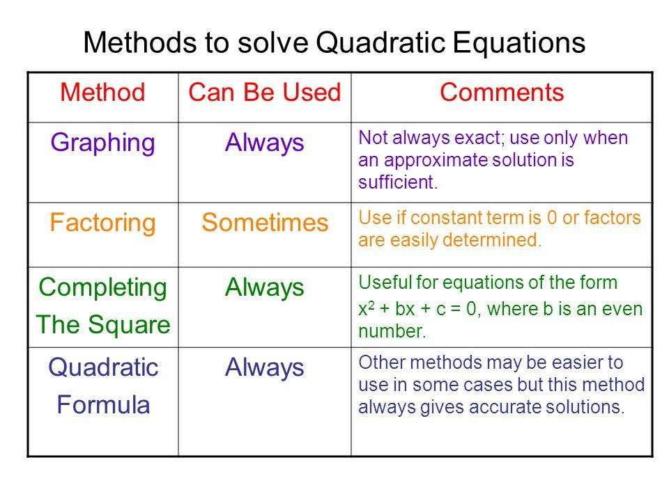

## Table of Contents

## What is the Formula Method?

The Formula Method is a way to solve math problems by using a set formula or equation. It's like following a recipe where you know the steps and ingredients to get the right answer. For example, if you want to find the area of a rectangle, you use the formula length times width. You just plug in the numbers for length and width, and the formula gives you the area.

This method is really helpful because it gives you a clear path to follow. It's especially useful in subjects like algebra, where you often need to solve for unknown values. By using the right formula, you can turn a tricky problem into something easier to handle. It's like having a map that guides you to the solution, making math less confusing and more fun.

## How does the Formula Method differ from other problem-solving techniques?

The Formula Method is different from other problem-solving techniques because it gives you a clear, step-by-step way to solve problems. It's like following a recipe in cooking. You have a specific formula or equation that you use every time you face a certain type of problem. For example, if you want to find the area of a circle, you always use the formula π times the radius squared. This makes it easier because you don't have to think about different ways to solve the problem; you just follow the formula.

Other problem-solving techniques might involve more guesswork or trying different approaches until you find one that works. For example, in trial and error, you might try different solutions until you get the right answer. In logical reasoning, you might break down the problem into smaller parts and think through each step carefully. These methods can be useful, but they can also take more time and be more confusing if you're not sure which approach to use. The Formula Method, on the other hand, is straightforward and reliable once you know the right formula to use.

## What are the basic steps involved in the Formula Method?

The Formula Method involves a few simple steps to solve problems. First, you need to identify the type of problem you're dealing with. This helps you figure out which formula or equation you should use. For example, if you're trying to find the area of a square, you know you'll use the formula side times side. Once you've picked the right formula, you plug in the numbers or variables you know into the formula. This is like filling in the blanks.

After you've put the numbers into the formula, the next step is to do the math. You follow the operations in the formula, like adding, subtracting, multiplying, or dividing, until you get an answer. This part is important because you need to make sure you do the calculations correctly. Once you've done the math, you have your answer. The Formula Method makes problem-solving easier because it gives you a clear path to follow, and if you use the right formula and do the math right, you'll get the correct answer every time.

## Can you provide a simple example of the Formula Method in action?

Let's say you want to find out how much space a square garden takes up. The garden has sides that are each 5 meters long. To find the area, you use the formula for the area of a square, which is side times side. So, you take the length of one side, which is 5 meters, and you multiply it by itself. 

When you do the math, 5 times 5 equals 25. So, the area of the square garden is 25 square meters. It's that simple! By using the formula, you didn't have to guess or try different ways to solve the problem. You just followed the steps and got the right answer.

## What are the common applications of the Formula Method in various fields?

The Formula Method is used a lot in math and science. In math, it helps students solve problems like finding the area of shapes, figuring out percentages, or solving equations. For example, when you want to find the area of a rectangle, you use the formula length times width. In science, formulas are used to calculate things like speed, force, or chemical reactions. If you're trying to find out how fast something is going, you use the formula distance divided by time. These formulas make it easier to solve problems because you just need to plug in the numbers and do the math.

In engineering and technology, the Formula Method is also very important. Engineers use formulas to design buildings, bridges, and machines. They need to calculate how much weight a structure can hold or how much force a machine can produce. For example, they might use the formula for stress to make sure a bridge is safe. In technology, formulas help in programming and data analysis. Programmers use formulas to write code that can do things like calculate interest on a loan or predict future sales. These formulas help make sure everything works correctly and efficiently.

## How can the Formula Method be adapted for complex problems?

When you have a really hard problem, you can still use the Formula Method, but you might need to break it down into smaller parts. Imagine you're trying to solve a big puzzle. Instead of trying to put it all together at once, you can start with smaller pieces. You find a formula that helps you solve one part of the problem, and then you use another formula for the next part. By solving each piece step by step, you can put them all together to solve the whole problem. This way, even a complicated problem becomes easier to handle because you're using simple formulas to tackle it bit by bit.

Sometimes, you might need to change the formula a little bit to fit the problem better. It's like tweaking a recipe to make it taste just right. You might need to add or subtract something from the formula, or maybe even combine different formulas to get the answer you need. This can take some practice, but once you get the hang of it, you'll be able to use the Formula Method to solve all sorts of tricky problems. It's all about understanding the basic formulas and knowing how to adjust them to fit the situation.

## What are the key advantages of using the Formula Method?

The Formula Method is great because it makes solving problems easy and clear. You don't have to guess or try different ways to solve a problem. Instead, you just follow a set of steps using a specific formula. This makes it much simpler because you know exactly what to do. It's like having a map that guides you to the answer, so you don't get lost or confused. This can save a lot of time and make math and science feel less scary.

Another big advantage is that the Formula Method works for all kinds of problems, from simple to complex. Once you learn the right formulas, you can use them over and over again. This means you can solve similar problems quickly and easily. Even when a problem is really hard, you can break it down into smaller parts and use different formulas for each part. This way, you can tackle big problems by solving them step by step, making even the toughest challenges manageable.

## Are there any limitations or challenges when using the Formula Method?

One challenge with the Formula Method is that you need to know the right formula for the problem you're trying to solve. If you pick the wrong formula, you'll get the wrong answer. It's like trying to use a screwdriver when you need a hammer. Also, sometimes the formulas can be hard to remember, especially if there are a lot of them. This can make it tricky to use the Formula Method if you haven't practiced enough.

Another limitation is that the Formula Method might not work well for problems that are really unique or don't fit into a standard type. Some problems need creative thinking or a different approach, and using a formula might not help. It's like trying to fit a square peg into a round hole. So, while the Formula Method is great for many problems, it's not perfect for every situation.

## How can one improve their skills in applying the Formula Method?

To get better at using the Formula Method, you should practice a lot. Start with simple problems and use the formulas you know. As you get more comfortable, try harder problems. It's like learning to ride a bike. You start with training wheels and then take them off when you're ready. The more you practice, the easier it will be to remember the formulas and use them correctly. You can also try making up your own problems to solve. This helps you understand how to use the formulas in different situations.

Another way to improve is to ask for help when you need it. If you're stuck on a problem, don't be afraid to ask a teacher or a friend. They can show you the right formula to use and help you understand how to apply it. You can also use [books](/wiki/algo-trading-books) or online resources to learn more about different formulas and how they work. The key is to keep practicing and learning, so you get better at using the Formula Method to solve all kinds of problems.

## What tools or software can assist in implementing the Formula Method?

There are many tools and software that can help you use the Formula Method easily. One popular tool is a calculator, which can do the math for you quickly. You just type in the numbers and the calculator follows the formula to give you the answer. There are also special calculators, like scientific or graphing calculators, that can handle more complex formulas. These are really helpful for subjects like math and science where you need to solve a lot of problems.

Another useful tool is computer software, like Microsoft Excel or Google Sheets. These programs let you put in formulas and numbers, and they do the calculations for you. They're great for working with lots of data or solving many problems at once. You can also use math software like MATLAB or WolframAlpha, which can solve even harder problems using the Formula Method. These tools make it easier to use formulas correctly and get the right answers, so you can focus on learning and solving problems.

## Can you discuss a case study where the Formula Method significantly impacted a project or research?

In a project to build a new bridge, engineers used the Formula Method to make sure it was safe and strong. They needed to know how much weight the bridge could hold, so they used the formula for calculating stress. By plugging in the numbers for the materials and the design, they figured out that the bridge could handle heavy traffic without breaking. This helped them design the bridge correctly and avoid any accidents. Using the Formula Method made the project go smoothly and saved a lot of time and money.

In another case, scientists were studying how fast a new medicine worked in the body. They used the Formula Method to calculate the rate at which the medicine was absorbed. By using the formula for absorption rate, they found out exactly how long it took for the medicine to start working. This information was really important for deciding how much medicine to give patients and when to give it. The Formula Method helped the scientists get accurate results quickly, which sped up their research and helped them develop a better treatment.

## What are the latest advancements or trends in the Formula Method?

One of the latest trends in the Formula Method is using computers and software to make it easier and faster. Programs like Excel and Google Sheets can now handle complex formulas and do a lot of calculations at once. This helps people solve big problems quickly without having to do all the math by hand. Also, there are new apps and online tools that let you type in a problem and the software will show you the right formula to use and how to solve it. This makes learning and using the Formula Method a lot easier for everyone.

Another advancement is the use of [artificial intelligence](/wiki/ai-artificial-intelligence) (AI) in the Formula Method. AI can learn from past problems and suggest the best formulas to use for new ones. This means that even if you're not sure which formula to use, the AI can help you pick the right one. This is really helpful in fields like engineering and science where you have to solve a lot of different types of problems. AI also helps by checking your work to make sure you used the formula correctly, which can prevent mistakes and save time.

## What are popular strategies in algo trading?

Algorithmic trading utilizes various strategies that enhance trading precision and efficiency. Among the predominant strategies are trend detection, mean reversion, and [arbitrage](/wiki/arbitrage), each employing distinct methodologies and objectives.

Trend detection strategies aim to identify and capitalize on current market directions. Utilizing technical indicators such as moving averages, relative strength index (RSI), and Bollinger Bands, these strategies analyze price movements and [volume](/wiki/volume-trading-strategy) data to detect trends. By aligning trades with the ongoing market [momentum](/wiki/momentum), traders seek to optimize entry and [exit](/wiki/exit-strategy) points. For instance, a common technical indicator used is the Moving Average Convergence Divergence (MACD), which helps in assessing the strength and direction of a trend.

The mean reversion strategy operates on the premise that asset prices tend to revert to their historical averages over time. This strategy identifies stocks or assets whose prices deviate significantly from their mean, assuming that they will revert to the average. The algorithm spots such deviations and executes trades accordingly. The mathematical formulation of this strategy might involve calculating the z-score of asset prices:

$$
Z = \frac{X - \mu}{\sigma}
$$

where $X$ is the current price, $\mu$ is the historical mean, and $\sigma$ is the standard deviation. Trades are triggered when the z-score exceeds predefined thresholds, indicating potential mispricing.

Arbitrage involves exploiting price discrepancies of the same asset across different markets or instruments. This can be spatial, such as differences in asset prices on two exchanges, or temporal, where the same asset is priced differently within the same exchange over time. Algorithms designed for arbitrage opportunities require high-speed data processing and execution to benefit from fleeting margin opportunities before the markets correct the discrepancies. An example is triangular arbitrage in [forex](/wiki/forex-system), which involves three currencies and three trades to exploit price differences in the exchange rates.

Implementing these strategies necessitates sophisticated algorithms capable of executing trades in milliseconds, reinforcing the importance of real-time data processing and high-speed execution. Each strategy requires not just a sound understanding of market mechanics but also advanced mathematical models and computational algorithms, often coded in programming languages like Python. For instance, a simple Python snippet for mean reversion could look like this:

```python
import numpy as np

def calculate_z_score(price, mean, std_dev):
    return (price - mean) / std_dev

# Example usage
current_price = 105
historical_mean = 100
historical_std_dev = 4

z_score = calculate_z_score(current_price, historical_mean, historical_std_dev)

if z_score > 2:  # assume threshold for significant deviation is above 2 standard deviations
    print("Consider selling the asset")
elif z_score < -2:
    print("Consider buying the asset")
```

Successfully deploying these strategies demands considerable computational resources and expertise in financial modeling, making them more accessible to institutional investors and high-frequency traders. Nonetheless, the underlying principles remain relevant to traders aiming to harness the potential of [algorithmic trading](/wiki/algorithmic-trading).

## References & Further Reading

[1]: ["Advances in Financial Machine Learning"](https://www.amazon.com/Advances-Financial-Machine-Learning-Marcos/dp/1119482089) by Marcos Lopez de Prado

[2]: ["Evidence-Based Technical Analysis: Applying the Scientific Method and Statistical Inference to Trading Signals"](https://www.amazon.com/Evidence-Based-Technical-Analysis-Scientific-Statistical/dp/0470008741) by David Aronson

[3]: ["Machine Learning for Algorithmic Trading"](https://github.com/stefan-jansen/machine-learning-for-trading) by Stefan Jansen

[4]: ["Quantitative Trading: How to Build Your Own Algorithmic Trading Business"](https://www.amazon.com/Quantitative-Trading-Build-Algorithmic-Business/dp/1119800064) by Ernest P. Chan