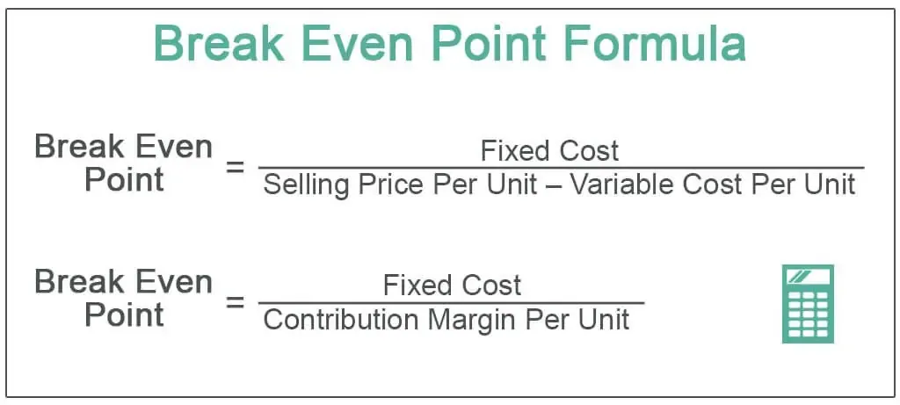

In the fast-evolving world of finance, algorithmic trading has become a central focus for traders seeking efficiency and precision in executing transactions. Leveraging advanced mathematical models and automated technologies, algo trading is fundamentally altering the landscape of trading decision-making. By automating processes that once required human intervention, this approach allows for quick and accurate responses to market changes, significantly enhancing trading efficiency.

Algorithmic trading involves crafting sophisticated algorithms that analyze market data to identify potential trading opportunities. These algorithms follow pre-defined rules based on various parameters such as timing, price, and quantity, or more complex mathematical models. The precision of these models ensures that trading decisions are made devoid of emotional bias, a factor that often clouds human judgment.



This article serves as a comprehensive guide, aimed at both novice and seasoned traders, to understand the dynamics of algorithmic trading. It investigates into essential components such as data collection, algorithm analysis, and execution procedures that are critical to successful trading strategies. Furthermore, it explores formula method calculations used for assessing risks and valuating trades, which are pivotal in managing market unpredictability.

By covering the gamut of algorithmic trading components and techniques, this resource equips traders with the knowledge required to leverage algo trading effectively. It highlights the importance of developing robust algorithms and the strategic implementation of various trading models to capitalize on market movements efficiently. Whether you are just starting or looking to refine your approach, this article provides the insights necessary to harness the full potential of algorithmic trading in today's dynamic financial markets.

## Table of Contents

## What is Algorithmic Trading?

Algorithmic trading, often abbreviated as algo trading, is a method of executing trades using pre-programmed instructions that account for variables such as timing, price, and volume, and even complex mathematical models. These programs make precise trading decisions by analyzing market data, patterns, and trends, thereby initiating trades at optimal conditions without human intervention.

The essence of algorithmic trading lies in its ability to capitalize on high-speed, high-frequency transactions which are beyond human capabilities. Given the same basic set of instructions, computers can process vast amounts of data across multiple markets almost instantaneously, detecting profitable trends or pricing inefficiencies. By doing so, algo trading enables the execution of large orders efficiently while maintaining market balance and optimum prices.

A typical algorithm might involve conditional statements that determine action based on real-time data: if a stock price rises to a specific threshold, the program might automatically execute a buy order. More sophisticated algorithms utilize [machine learning](/wiki/machine-learning) techniques to predict market behaviors based on historical data.

One of the primary advantages of [algorithmic trading](/wiki/algorithmic-trading) is the elimination of human emotions such as fear or greed, typically associated with trading, which can lead to erratic decisions. By predefining rules and limits, algorithmic trading ensures that decisions are made based on logic and market analysis, thereby increasing consistency and reliability in trading outcomes.

Algorithmic trading is particularly favored for high-frequency trading ([HFT](/wiki/high-frequency-trading-strategies)), a strategy that benefits from executing millions of trades at incredibly small margins, cumulatively yielding significant profits when performed at scale. This approach is not just about speed but also about identifying and exploiting short-lived trends in the market.

Overall, algorithmic trading streamlines the trading process, reduces transaction costs, and increases the speed and efficiency of executing trades, making it an integral component of contemporary financial markets.

## How Does Algorithmic Trading Work?

Algorithmic trading operates by continuously processing streams of market data, analyzing them based on predefined rules to identify profitable trading opportunities. This automated approach is founded on three fundamental components: data input, algorithm analysis, and execution.

**Data Input**  
The process begins with the collection of pertinent market data. This includes live price movements, historical price trends, trading volumes, and other relevant financial indicators. This extensive data set forms the backbone of the trading strategy, providing the information necessary for making informed decisions.

**Algorithm Analysis**  
Once the data is gathered, it is subjected to thorough analysis using sophisticated algorithms. These algorithms have been designed with specific criteria that identify potential trading opportunities. The criteria might encompass conditions such as price levels, [volatility](/wiki/volatility-trading-strategies) thresholds, or patterns observed in historical data. For example, consider a simple moving average crossover strategy:

```python
# Example of a simple moving average crossover strategy in Python
import pandas as pd

def moving_average_crossover(prices, short_window=40, long_window=100):
    signals = pd.DataFrame(index=prices.index)
    signals['price'] = prices

    # Create short simple moving average column
    signals['short_mavg'] = prices.rolling(window=short_window, min_periods=1).mean()

    # Create long simple moving average column
    signals['long_mavg'] = prices.rolling(window=long_window, min_periods=1).mean()

    # Create signals
    signals['signal'] = 0 
    signals['signal'][short_window:] = np.where(signals['short_mavg'][short_window:] 
                                                 > signals['long_mavg'][short_window:], 1.0, 0.0)   

    # Generate trading orders
    signals['positions'] = signals['signal'].diff()

    return signals
```

The above code calculates short and long-term moving averages of stock prices, generating buy or sell signals whenever the short-term average crosses the long-term average.

**Execution**  
Upon meeting the set criteria, trades are executed automatically. This process eliminates the need for human intervention, allowing decisions to be made and executed within milliseconds. This speed is crucial in high-frequency trading, where opportunities can vanish in fractions of a second due to rapid market changes.

This methodology not only facilitates rapid decision-making but also ensures consistency in trading decisions, free from the emotional biases that often accompany human traders. Algorithmic trading thereby enhances the efficiency and precision with which trades are conducted, capitalizing on fleeting market opportunities.

## The Formula Method Calculation Technique

The formula method in trading is a specialized technique employed to calculate values such as risks, compensation, or the valuation of trades, notably within derivative contracts like swaps. This method relies on predetermined mathematical formulas agreed upon by the involved counterparties. These formulas are critical in transactions such as early terminations of swap contracts, where the accurate valuation of the remaining contract period is essential for ensuring fairness and minimizing disputes.

One of the key aspects of the formula method is its structured approach, which is crucial for achieving transparency and consistency. Contract termination clauses typically include detailed descriptions of these formulas, specifying the precise calculations required in various trade scenarios. This clarity is essential for both parties to comprehend the potential financial implications and make informed decisions regarding trade exits or continuations.

The formula method is often used alongside other valuation methods, such as the agreement value method and indemnification methods. While the agreement value method focuses on reaching a consensus on trade values without strictly adhering to predefined formulas, indemnification methods involve compensations based on specified conditions.

The calculations conducted using the formula method are vital for risk management, particularly in markets subject to sudden and unpredictable events. By having a reliable valuation framework in place, traders and institutions can better protect themselves against adverse market movements and the associated financial risks.

For example, in an early termination of a swap contract, the formula might involve calculating the present value of remaining cash flows using an agreed-upon discount rate. A simplified Python example of such a calculation could look like this:

```python
def calculate_present_value(cash_flows, discount_rate):
    present_value = 0
    for t, cash_flow in enumerate(cash_flows, start=1):
        present_value += cash_flow / (1 + discount_rate)**t
    return present_value

# Example usage
cash_flows = [1000, 1000, 1000]  # representing future cash flows
discount_rate = 0.05  # 5% discount rate
present_value = calculate_present_value(cash_flows, discount_rate)
print(f"The present value of the remaining cash flows is: {present_value}")
```

This methodical approach provides a robust framework for parties to manage and mitigate risks effectively, ensuring that all potential trade outcomes are fairly evaluated and accounted for.

## Popular Strategies in Algo Trading

Algorithmic trading utilizes various strategies that enhance trading precision and efficiency. Among the predominant strategies are trend detection, mean reversion, and [arbitrage](/wiki/arbitrage), each employing distinct methodologies and objectives.

Trend detection strategies aim to identify and capitalize on current market directions. Utilizing technical indicators such as moving averages, relative strength index (RSI), and Bollinger Bands, these strategies analyze price movements and [volume](/wiki/volume-trading-strategy) data to detect trends. By aligning trades with the ongoing market [momentum](/wiki/momentum), traders seek to optimize entry and [exit](/wiki/exit-strategy) points. For instance, a common technical indicator used is the Moving Average Convergence Divergence (MACD), which helps in assessing the strength and direction of a trend.

The mean reversion strategy operates on the premise that asset prices tend to revert to their historical averages over time. This strategy identifies stocks or assets whose prices deviate significantly from their mean, assuming that they will revert to the average. The algorithm spots such deviations and executes trades accordingly. The mathematical formulation of this strategy might involve calculating the z-score of asset prices:

$$
Z = \frac{X - \mu}{\sigma}
$$

where $X$ is the current price, $\mu$ is the historical mean, and $\sigma$ is the standard deviation. Trades are triggered when the z-score exceeds predefined thresholds, indicating potential mispricing.

Arbitrage involves exploiting price discrepancies of the same asset across different markets or instruments. This can be spatial, such as differences in asset prices on two exchanges, or temporal, where the same asset is priced differently within the same exchange over time. Algorithms designed for arbitrage opportunities require high-speed data processing and execution to benefit from fleeting margin opportunities before the markets correct the discrepancies. An example is triangular arbitrage in [forex](/wiki/forex-system), which involves three currencies and three trades to exploit price differences in the exchange rates.

Implementing these strategies necessitates sophisticated algorithms capable of executing trades in milliseconds, reinforcing the importance of real-time data processing and high-speed execution. Each strategy requires not just a sound understanding of market mechanics but also advanced mathematical models and computational algorithms, often coded in programming languages like Python. For instance, a simple Python snippet for mean reversion could look like this:

```python
import numpy as np

def calculate_z_score(price, mean, std_dev):
    return (price - mean) / std_dev

# Example usage
current_price = 105
historical_mean = 100
historical_std_dev = 4

z_score = calculate_z_score(current_price, historical_mean, historical_std_dev)

if z_score > 2:  # assume threshold for significant deviation is above 2 standard deviations
    print("Consider selling the asset")
elif z_score < -2:
    print("Consider buying the asset")
```

Successfully deploying these strategies demands considerable computational resources and expertise in financial modeling, making them more accessible to institutional investors and high-frequency traders. Nonetheless, the underlying principles remain relevant to traders aiming to harness the potential of algorithmic trading.

## Advantages and Challenges of Algo Trading

Algorithmic trading offers several distinct advantages, foremost among them the reduction in transaction costs attributable to its speed and frequency. By automating trading processes, algo trading can execute trades faster than human capability, often capitalizing on market inefficiencies in mere milliseconds. This high-speed execution minimizes the bid-ask spread and slippage, directly translating into cost efficiency for traders.

Another critical advantage is the ability to backtest trading strategies on historical data. Backtesting allows traders to simulate a strategy using past market data to evaluate its effectiveness before applying it to live trading. This process ensures that only strategies demonstrating a statistical edge are employed, thereby reducing the risk of implementing an unproven strategy in volatile markets.

However, algo trading also faces significant challenges. A major hurdle is the complexity involved in developing the optimal algorithm. A deep understanding of quantitative analysis, trading markets, and programming is essential, making it a daunting task for those lacking specialized expertise. The intricacy of algorithms also necessitates rigorous testing to avoid unforeseeable consequences in live trading environments.

Market volatility presents another concern, with algorithmic trading sometimes exacerbating rapid price swings. This was notably evident during the Flash Crash of 2010, where automated algorithms led to a dramatic drop in the U.S. stock market in a matter of minutes. Such events underscore the importance of implementing safeguards.

Regulatory measures and circuit breakers are critical components in mitigating these risks. Circuit breakers serve as market controls to temporarily halt trading during extreme volatility, thereby preventing massive sell-offs and promoting market stability. Effective regulations ensure that all trading operates within a structured framework, reducing systemic risk and ensuring fairness across trading platforms.

In summary, while algorithmic trading provides numerous benefits, such as cost efficiency and the ability to backtest strategies, it also poses challenges in the form of complexity and potential market instability. Balancing these aspects is crucial for leveraging the full potential of algo trading.

## Conclusion

Algorithmic trading represents a significant step forward in financial innovation, fundamentally altering the way markets operate and trades are executed. By employing sophisticated algorithms, traders can process vast amounts of data at unparalleled speeds, executing transactions with remarkable precision and efficiency. This capability is particularly beneficial in today's fast-paced trading environment, where rapid decision-making is crucial.

The advantages of algorithmic trading extend beyond speed and precision. It significantly reduces transaction costs by automating processes and minimizing human intervention. This cost-effectiveness, combined with the ability to backtest strategies using historical data, makes algorithmic trading an invaluable tool for maximizing profitability and managing risks effectively.

However, the landscape of algorithmic trading is not without its challenges. Developing accurate algorithms that can successfully interpret complex market conditions requires significant expertise and technological resources. Furthermore, the potential for unintended market volatility, as evidenced by events like the Flash Crash of 2010, underlines the importance of robust regulatory frameworks and mechanisms such as circuit breakers to ensure market stability.

Looking ahead, the future of algorithmic trading is poised for even greater advancements. As technology continues to evolve, we can anticipate enhanced capabilities and a broader range of opportunities for traders globally. The integration of [artificial intelligence](/wiki/ai-artificial-intelligence) and machine learning into trading algorithms promises to further optimize decision-making processes, improve risk assessments, and unlock new avenues for strategic investment.

In summary, while algorithmic trading presents certain challenges, its benefits affirm its status as an essential component of modern trading. As technological advancements continue to unfold, algorithmic trading will likely play an increasingly pivotal role in shaping the future of financial markets.

## References & Further Reading

[1]: ["Advances in Financial Machine Learning"](https://www.amazon.com/Advances-Financial-Machine-Learning-Marcos/dp/1119482089) by Marcos Lopez de Prado

[2]: ["Evidence-Based Technical Analysis: Applying the Scientific Method and Statistical Inference to Trading Signals"](https://www.amazon.com/Evidence-Based-Technical-Analysis-Scientific-Statistical/dp/0470008741) by David Aronson

[3]: ["Machine Learning for Algorithmic Trading"](https://github.com/stefan-jansen/machine-learning-for-trading) by Stefan Jansen

[4]: ["Quantitative Trading: How to Build Your Own Algorithmic Trading Business"](https://www.amazon.com/Quantitative-Trading-Build-Algorithmic-Business/dp/1119800064) by Ernest P. Chan