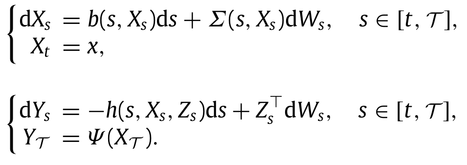

Forward-Backward Stochastic Differential Equations (FBSDEs) have emerged as a formidable mathematical framework within several key disciplines, notably including probability, control theory, and finance. These equations combine the characteristics of both forward and backward stochastic differential equations, providing a comprehensive approach to modeling systems where feedback and adaptive responses are essential. In financial contexts, especially, FBSDEs have started to play a pivotal role, particularly in algorithmic trading, due to their capability to manage and model complex systems characterized by randomness and uncertainty.

Recently, the context of algorithmic trading has witnessed a growing interest in FBSDEs. The complexity and high-frequency nature of financial markets demand sophisticated modeling techniques capable of capturing stochastic dynamics at various levels. FBSDEs have proven particularly useful in this setting, allowing practitioners to model the evolving nature of financial systems with greater precision. This trend arises from the necessity to develop strategies that can respond adaptively to volatile market conditions and make informed decisions within brief timeframes.

The application of FBSDEs in algorithmic trading involves intricate methodologies designed to leverage these mathematical constructs for practical trading strategies. The equations support the modeling of asset price dynamics, fostering a robust framework for decision-making in the face of market fluctuations. These methodologies embrace the integration of stochastic processes that interact dynamically with market variables, promoting more informed and strategic responses to real-time data fluctuations.

In summary, this article aims to elucidate the framework and applicability of FBSDEs within the sphere of algorithmic trading. Through an exploration of their methodologies and distinct advantages, the discussion will highlight how these stochastic differential equations stand at the forefront of modern quantitative finance. By focusing on the sophisticated methods they introduce for tackling complex problems, we aim to underscore their potential for innovation in refining trading strategies.

## Table of Contents

## Understanding Forward-Backward Stochastic Differential Equations

Forward-Backward Stochastic Differential Equations (FBSDEs) are integral to modern quantitative finance and other fields that model complex systems. They form a class of stochastic processes characterized by a pair of differential equations: one set progresses forward in time, while the other set, known as the backward component, is solved by working backward from a final condition. This dual nature allows FBSDEs to model multistage problems where decisions depend on both initial conditions and future outcomes.

The forward equation typically takes the form of a stochastic differential equation (SDE) that models the evolution of a state variable. Mathematically, for a forward process $X_t$, the general form is:
$$

dX_t = \mu(t, X_t)dt + \sigma(t, X_t)dW_t 
$$
where $\mu$ is the drift coefficient, $\sigma$ the diffusion coefficient, and $W_t$ a Wiener process representing randomness.

The backward equation is represented as:
$$

-dY_t = f(t, X_t, Y_t, Z_t)dt - Z_tdW_t 
$$
with $Y_t$ being the backward process. Here, $f$ acts as a generator function that incorporates the forward state and control processes. The backward equation progresses from a terminal condition $Y_T$, where $T$ is the terminal time.

FBSDEs are powerful because they can clearly account for the intricate feedback between the forward state variable evolution and backward stochastic processes, often used in control theory for path-dependent options pricing or portfolio optimization. The coupling of these equations is what makes them suitable for capturing the dynamics of financial models under uncertainty.

Two main techniques are employed to find solutions to FBSDE systems:

1. **Method of Optimal Control**: This technique involves adjusting the control variables to minimize or maximize an expected payoff, leading to a feedback control policy. The optimal control framework aids in driven processes where decision variables directly impact system evolution over time.

2. **Four Step Scheme**: Developed by Ma, Protter, and Yong, this scheme systematically decouples the forward and backward components. The method begins by solving the forward equation independently, followed by calculating adjoint processes, and finally integrating backward to find the solution to the backward equation. This approach is particularly useful when dealing with finite time intervals and contributes to precise numerical solutions.

The coexistence of forward and backward components within FBSDEs allows them to model complex interdependencies in financial markets efficiently. Their ability to integrate real-world uncertainties makes them a crucial tool for tasks requiring high degrees of precision and flexibility, solidifying their place in the modeling of stochastic systems.

## Applications of FBSDEs in Algorithmic Trading

In [algorithmic trading](/wiki/algorithmic-trading), the accurate modeling of financial instruments under uncertainty is essential for devising profitable strategies. Forward-Backward Stochastic Differential Equations (FBSDEs) are employed to capture the complex dynamics of asset prices. This enables robust decision-making in the face of market fluctuations.

FBSDEs allow for a detailed representation of asset price dynamics by accounting for a system where one component evolves forward in time while another operates backward, thereby capturing feedback effects that are common in financial markets. In particular, FBSDEs facilitate the modeling of randomly evolving processes, which is vital for several key areas of trading.

Portfolio optimization is one significant application. Using FBSDEs, traders can model dynamic portfolio allocation that evolves with market changes. Optimal control techniques can be used in conjunction, leading to strategies that respond to both historical trends and instantaneous noise in the market.

In risk management, FBSDEs provide a sophisticated way to represent the potential future states of a financial system under randomness and shocks, thereby enabling the estimation of risk metrics such as Value at Risk (VaR) or Conditional Value at Risk (CVaR). This is particularly useful in stress testing scenarios where market conditions deviate significantly from historical norms.

FBSDEs are also valuable in the derivative pricing space. The ability to incorporate stochastic [volatility](/wiki/volatility-trading-strategies) and [interest rate](/wiki/interest-rate-trading-strategies) dynamics directly into the pricing model enhances the accuracy of pricing derivatives, which often [carry](/wiki/carry-trading) path-dependent features that are difficult to quantify with simpler models.

Moreover, the use of FBSDEs ensures that algorithmic trading strategies are not only based on past data but are also adaptive to real-time information and stochastic innovations. This adaptability is crucial as it supports the continuous calibration of models to reflect the current market environment, thus maintaining the relevance and efficacy of trading strategies.

In summary, by incorporating FBSDEs into algorithmic trading, practitioners can achieve more nuanced and flexible models of asset price dynamics, fostering improved decision-making in portfolio management, risk assessment, and derivative pricing. These advantages position FBSDEs as a vital component in the toolkit of algorithmic traders who seek to navigate the complexities of modern financial markets.

## Numerical Methods and Implementation

Implementing Forward-Backward Stochastic Differential Equations (FBSDEs) in algorithmic trading demands a thorough understanding of numerical techniques to manage the complexity inherent in these models. Several effective methods are employed to approximate and solve FBSDEs, each with its unique advantages and challenges.

**Monte Carlo Simulations** are a widely used approach for solving FBSDEs. They rely on the generation of a large number of random samples to approximate the expected value of the solution. The method involves simulating the paths of the stochastic processes forward in time while simultaneously computing backward components using sampled information from these paths. Monte Carlo techniques are favored for their robustness and flexibility, particularly in high-dimensional problems. However, their computational cost is a drawback, as they often require a substantial number of samples to achieve accurate results, leading to increased runtime.

**Finite Difference Methods** offer an alternative by discretizing the continuous stochastic processes involved in FBSDEs. This approach involves creating a grid over the defined domain and approximating differential operators using difference quotients. Finite difference methods can be highly effective for low-dimensional problems where the computational grid remains manageable. The challenge, however, lies in handling the backward iteration step, which requires careful consideration of boundary conditions and stability criteria to prevent numerical inaccuracies.

**Regression-Based Techniques** have gained popularity due to their efficiency in high-dimensional settings. These techniques combine regression algorithms with the path simulation of stochastic processes, estimating conditional expectations crucial for the backward component of the FBSDEs. A common implementation is the Least Squares Monte Carlo (LSMC) method, which approximates the continuation value by regressing simulated paths on a set of basis functions. This approach balances the computational intensity of Monte Carlo simulations with the efficiency of regression, making it suitable for problems with a large state space.

When implementing these numerical methods, several best practices should be considered. Ensuring the stability and convergence of the chosen method is paramount; this can often be achieved by adequate tuning of parameters such as the time step size and the number of paths in Monte Carlo simulations. Additionally, parallel computing techniques can be leveraged to reduce computational time, particularly for Monte Carlo simulations, which are naturally parallelizable. 

Despite advancements in numerical methods, challenges remain. High-dimensional problems introduce significant computational burdens that can hinder real-time applications in algorithmic trading. Ensuring numerical stability, especially when dealing with the backward components of FBSDEs, requires meticulous calibration of algorithms and handling of edge cases. 

Overall, implementing FBSDEs in algorithmic trading requires a strategic selection of numerical methods tailored to the specific problem dimension and desired accuracy. Utilizing modern computing advancements and efficient algorithms can significantly mitigate computational challenges, enabling the practical application of FBSDEs in dynamic trading environments.

## Advantages of Using FBSDEs in Algo Trading

Forward-Backward Stochastic Differential Equations (FBSDEs) offer several advantages when applied to algorithmic trading, primarily due to their comprehensive modeling capacity and adaptability. A key strength of FBSDEs lies in their ability to simultaneously handle multiple variables and stochastic processes, allowing for the modeling of complex systems such as entire asset portfolios. This multi-variable capability enhances the precision of trading models, as FBSDEs can capture the interactions and dependencies between different financial instruments.

FBSDEs empower traders by enabling them to incorporate multiple sources of randomness into their decision-making models. This integration leads to more robust strategies, capable of adapting to the inherent volatility and unpredictability of financial markets. For instance, in a trading strategy, the ability to [factor](/wiki/factor-investing) in random fluctuations in interest rates, stock prices, and market conditions allows for a more accurate and resilient approach.

Moreover, FBSDEs are particularly adept at accommodating real-time data, which is crucial for modern algorithmic trading strategies that require fast adaptations to market changes. The equations can be used to update trading models dynamically, reflecting the latest market conditions and price movements. This attribute is vital for executing adaptive trading strategies that respond swiftly to real-time events, enhancing potential profitability and risk management.

The adaptability of FBSDEs extends to their implementation in various trading scenarios. Traders can employ these equations for tasks ranging from portfolio optimization to derivative pricing. By modeling the stochastic nature of asset prices, FBSDEs facilitate more precise assessments of risk and return, aiding in the formulation of balanced and effective trading strategies.

Finally, the mathematical foundation of FBSDEs supports quantitative analysis, which is integral to algorithmic trading. Their use of well-established numerical methods ensures that implementations are grounded in rigorous scientific principles, promoting confidence in the outcomes of FBSDE-based models. As a result, traders and financial analysts can harness FBSDEs as a powerful tool, delivering sophisticated insights and driving the development of innovative trading systems.

## Challenges and Future Directions

Forward-Backward Stochastic Differential Equations (FBSDEs) present several computational challenges that need to be addressed for effective application in algorithmic trading. Their intrinsic complexity and resource-intensity are significant barriers, often requiring significant computational power and expertise in numerical techniques.

One of the primary challenges is the nature of FBSDEs themselves, which involve solving stochastic differential equations concurrently in both forward and backward directions. This intricate dynamic demands advanced numerical methods such as recursion, backward induction, and discretization, which can be computationally expensive and time-consuming. Finding efficient and accurate algorithms to solve these equations remains an ongoing research area.

A potential avenue for overcoming these challenges lies in simplifying FBSDE models. By reducing the complexity of the equations, they can be made more tractable without substantially compromising on accuracy. Researchers are investigating various mathematical techniques and approximations to achieve this balance, aiming to create models that are both manageable and precise.

Another promising direction is the integration of [machine learning](/wiki/machine-learning) techniques. Machine learning has shown great potential in approximating solutions to complex mathematical problems and could be employed to enhance FBSDE computations. Neural networks, in particular, could offer innovative approaches to approximate solutions efficiently by learning from a set of training data, thus speeding up computations essential for real-time trading decisions.

Moreover, there is a concerted effort to make FBSDEs more accessible to traders and analysts without deep mathematical expertise. This involves developing user-friendly software tools and frameworks that can abstract the complexity of FBSDEs while still offering the depth necessary for sophisticated trading strategies. Enhancing accessibility will democratize the use of these equations, enabling broader application across the financial industry.

Finally, ongoing advancements in computational hardware and parallel processing technologies also hold promise for expanding the practical use of FBSDEs. Leveraging high-performance computing resources can help mitigate the computational burden, allowing these complex models to be deployed in real-time trading scenarios.

In summary, while FBSDEs pose significant challenges due to their complexity, future research and technological advancements provide numerous opportunities to enhance their application in algorithmic trading, making them more efficient, accessible, and advanced.

## Conclusion

Forward-Backward Stochastic Differential Equations (FBSDEs) provide a sophisticated way to model and solve complex problems in algorithmic trading by offering unique capabilities that address the intricacies of financial markets. Their potential for high precision and adaptability makes them an invaluable component of modern quantitative finance. These equations allow traders and analysts to incorporate multiple sources of uncertainty and randomness into their models, enabling comprehensive decision-making frameworks that account for a variety of market conditions.

FBSDEs distinguish themselves through their dual capacity to progress forward and backward in time, which translates to a better representation of the temporal aspects of financial markets. This bidirectional feature is particularly advantageous when considering path-dependent options and other derivative pricing scenarios where the value of an asset can be significantly influenced by its historical path.

The practical applications of FBSDEs in trading strategies extend beyond mere modeling. Their implementation can significantly enhance risk management and portfolio optimization processes by providing a robust means to evaluate future scenarios, weigh possible outcomes, and thus devise strategies that maximize return while minimizing risk. This capability is crucial in developing adaptive trading strategies that can swiftly respond to dynamic market changes.

In addition, the integration of numerical methods with FBSDEs facilitates their application across various asset classes and trading strategies. Techniques such as Monte Carlo simulations and regression-based approaches enhance the feasibility of these models, making them accessible to a wider audience in the financial industry, including those who may not possess deep mathematical expertise.

While computational challenges remain a consideration, ongoing advancements in numerical methods and computational power promise to mitigate these issues. The incorporation of machine learning techniques also offers potential for enhancing the efficiency and accuracy of FBSDE solutions, paving the way for real-time applications in high-frequency trading environments.

Overall, emphasizing both the numeral techniques and practical applications, future developments in FBSDE research hold promise for revolutionizing trading strategies. By continually improving the accessibility and functionality of these mathematical tools, FBSDEs are well-positioned to remain at the forefront of quantitative finance, driving innovation and sophistication in algorithmic trading approaches.

## References & Further Reading

[1]: Ma, J., Protter, P., & Yong, J. (1994). ["Solving Forward-Backward Stochastic Differential Equations Explicitly—A Four Step Scheme."](https://link.springer.com/article/10.1007/BF01192258) Probability Theory and Related Fields, 98(3), 339-359.

[2]: Yong, J., & Zhou, X. Y. (1999). ["Stochastic Controls: Hamiltonian Systems and HJB Equations."](https://link.springer.com/book/10.1007/978-1-4612-1466-3) Springer.

[3]: Karatzas, I., & Shreve, S. E. (1991). ["Brownian Motion and Stochastic Calculus."](https://link.springer.com/book/10.1007/978-1-4612-0949-2) Springer.

[4]: Bouchard, B., & Touzi, N. (2004). ["Discrete-Time Approximation and Monte-Carlo Simulation of Backward Stochastic Differential Equations."](https://www.sciencedirect.com/science/article/pii/S0304414904000031) Stochastic Processes and their Applications, 111(2), 175-206.

[5]: El Karoui, N., Peng, S., & Quenez, M. C. (1997). ["Backward Stochastic Differential Equations in Finance."](https://onlinelibrary.wiley.com/doi/abs/10.1111/1467-9965.00022) Mathematical Finance, 7(1), 1-71.

[6]: Pham, H. (2009). ["Continuous-Time Stochastic Control and Optimization with Financial Applications."](https://link.springer.com/book/10.1007/978-3-540-89500-8) Springer. 

[7]: Bergman, Y. Z. (1995). ["Option Pricing with Differential Interest Rates."](https://www.jstor.org/stable/2962279) The Review of Financial Studies, 8(2), 475-500.

[8]: Piterbarg, V. (2005). ["Backward Monte Carlo for Pricing Swing Options."](https://scholar.google.com/citations?user=6i7Q_aYAAAAJ&hl=en) International Journal of Theoretical and Applied Finance, 8(02), 175-194.