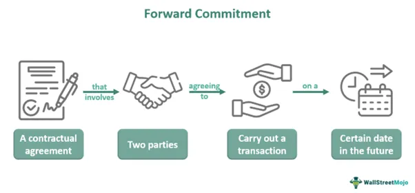

Investment strategies have undergone significant transformation over the years. This evolution has been driven by technological advancements that provide traders and investors with more sophisticated tools for trading and hedging. Financial markets today are increasingly complex, with a diverse array of financial instruments such as stocks, bonds, derivatives, and cryptocurrencies. Each of these instruments offers unique risk and return profiles, which can be strategically used to balance and optimize investment portfolios.

Forward commitments, for instance, are essential tools in mitigating risks associated with price volatility. These contractual agreements enable investors to lock in prices for future transactions, thus providing security and predictability in an unpredictable market environment. Forward commitments are prevalent in futures and swaps markets, where they play a pivotal role in aligning expectations and managing risks for both buyers and sellers.



Concurrently, algorithmic trading has emerged as a transformative force in modern investment strategies. Algorithms—using complex mathematical models—execute trades at speeds and efficiency levels unattainable by human traders. These algorithms have become increasingly popular due to the explosive growth of computing power and access to vast datasets. They offer significant advantages such as reduced transaction costs, minimized human error, and the ability to swiftly capitalize on market opportunities.

In this article, we will explore these individual components and how they interconnect to form sophisticated investment strategies. The intersection of traditional financial instruments with modern technologies like algorithmic trading holds great potential for enhancing trading efficiency and managing financial risks more effectively. This synthesis is not without challenges, including the need for robust risk management and the pressures of regulatory compliance.

Whether you are a seasoned trader or a new investor, understanding these elements is crucial in navigating today's dynamic financial landscape. As financial markets continue to evolve, the integration of innovative strategies with conventional investment practices is invaluable for success. The following sections will detail how forward commitments and algorithmic trading can be leveraged to create balanced and successful investment strategies in complex markets.

## Table of Contents

## Understanding Financial Instruments and Investment Strategies

Financial instruments are tradable assets that encompass a wide range of products such as stocks, bonds, derivatives, and, more recently, cryptocurrencies. These instruments form the backbone of modern financial markets and provide opportunities for both investment and risk management.

Investment strategies involving financial instruments generally focus on portfolio diversification to optimize returns while mitigating risk. The concept of diversification is rooted in the principle that a well-spread portfolio can reduce the impact of individual asset [volatility](/wiki/volatility-trading-strategies) on overall returns. By allocating investments across various asset classes, investors aim to achieve a balance between risk and return.

Traditional investment strategies often include stock [picking](/wiki/asset-class-picking), where investors select individual stocks based on analyses of company fundamentals or market trends. Bonds are another cornerstone of investment portfolios, offering fixed income and typically lower risk compared to stocks. Investors use bonds to generate steady income and hedge against market downturns.

Derivatives such as options and futures add complexity to investment strategies by providing tools for hedging and speculation. These instruments derive their value from underlying assets and can be used to lock in prices or bet on market movements without owning the assets themselves. Derivatives can be powerful in managing financial risks but require sophisticated understanding and management due to their potential for leverage and complexity.

The advent of technology has significantly transformed investment strategies, ushering in automated and quantitative approaches. Algorithms and data-driven models now power trading strategies, allowing for high-speed execution and enhanced decision-making. These quant-based strategies leverage large datasets and computational techniques to analyze markets and execute trades more efficiently than manual processes could achieve.

Each financial instrument possesses its distinct risk and return characteristics, necessitating careful consideration when constructing investment portfolios. Stocks, for example, offer higher potential returns but come with greater volatility. Bonds provide more stability and regular income but with potentially lower returns over time. Derivatives offer both hedging benefits and speculative opportunities, often accompanied by intricate risk factors.

Selecting the right mix of financial instruments requires a comprehensive understanding of individual and portfolio-wide risk-return profiles. By aligning investment decisions with financial goals and market conditions, investors can devise strategies that not only aim for maximum returns but also safeguard against unpredictable market dynamics. Ultimately, a successful investment strategy involves balancing these instruments to meet diverse financial objectives while managing inherent risks.

## The Role of Forward Commitments in Investment Strategies

A forward commitment represents a binding agreement between two parties to buy or sell an asset at a predetermined future date and price. This financial instrument is instrumental in hedging against price volatility, providing a structured approach to managing risk across various markets. Predominantly featured in futures and swaps markets, forward commitments play a substantial role in setting market expectations and mitigating risks associated with price fluctuations.

By locking in future prices, forward commitments offer security and predictability for both buyers and sellers. This feature is particularly advantageous in volatile markets, where price movements can be unpredictable and substantial. For instance, a farmer anticipating a future harvest may use a forward commitment to secure a sale price for their produce, thereby shielding against potential declines in market prices. Similarly, buyers can lock in a purchase price to protect against adverse price increases.

The use of forward commitments extends beyond commodities trading, which typically involves agricultural products, metals, and energy resources. In financial markets, these instruments are equally applicable to interest rates and foreign exchange markets. A corporation with international operations might commit to a currency exchange rate in advance, insulating itself from future exchange rate volatility.

Investors utilize forward commitments in diverse strategic applications to manage financial risks effectively. The strategic deployment of these instruments requires a deep understanding of market conditions and timing. Successful implementation involves analyzing market trends, forecasting price movements, and assessing risk tolerance. Here is a basic Python example showing how an investor might calculate the profit or loss from a forward commitment:

```python
def forward_commitment_pnl(spot_price, forward_price, quantity):
    """
    Calculate profit or loss from a forward commitment

    Parameters:
    spot_price (float): The current market price of the asset
    forward_price (float): The agreed forward price
    quantity (int): The amount of the asset in the agreement

    Returns:
    float: Profit or loss from the forward commitment
    """
    return (spot_price - forward_price) * quantity

# Example usage
spot_price = 105.0  # Current market price
forward_price = 100.0  # Agreed forward price
quantity = 1000  # Quantity of asset

profit_or_loss = forward_commitment_pnl(spot_price, forward_price, quantity)
print("Profit/Loss from forward commitment:", profit_or_loss)
```

The output reveals the financial outcome of a forward contract by calculating the difference between the prevailing market price and the agreed price, multiplied by the quantity involved.

In summary, forward commitments are vital components in an investor's toolkit for risk management. Their ability to provide stability in uncertain market environments makes them indispensable for strategic financial planning. Whether in commodity markets or more comprehensive applications in interest and currency exchanges, forward commitments continue to be an essential feature in contemporary investment strategies. Understanding their utilization and timing can significantly enhance an investor's capacity to manage risks effectively and achieve financial objectives.

## Algorithmic Trading: Transforming Investment Strategies

Algorithmic trading has revolutionized the financial markets by leveraging technology to perform trades with high speed and efficiency. Using sophisticated algorithms, traders can execute orders in fractions of a second, capitalizing on market movements that are imperceptible to human traders. This process relies on pre-set rules that determine decision-making factors such as timing, price, quantity, or even complex mathematical models.

The expansion of the global [algorithmic trading](/wiki/algorithmic-trading) market is propelled by rapid advancements in computing power and the exponential growth of data. Enhanced computational capabilities allow for the processing of vast amounts of financial data in real-time, enabling algorithms to identify profitable trading opportunities and execute trades at optimal moments.

Algorithmic strategies vary widely in complexity, ranging from simple rule-based systems to advanced [machine learning](/wiki/machine-learning) models. Rule-based systems may use straightforward trading signals derived from technical indicators, such as moving averages or relative strength index (RSI), to make buy or sell decisions. In contrast, machine learning models can adapt to market conditions by learning from historical data patterns and adjusting their strategies accordingly. For instance, neural networks can identify intricate patterns in market data that might be invisible to conventional models, allowing traders to anticipate market trends more accurately.

One of the primary benefits of algorithmic trading is the reduction of transaction costs. Automated systems can execute high volumes of trades more efficiently and at lower costs compared to manual trading. Furthermore, the elimination of human error is a significant advantage, as algorithms adhere strictly to their programming, avoiding emotional decisions that can lead to costly mistakes.

Algorithmic trading is also particularly effective in volatile markets, where rapid price movements create numerous opportunities for profit. High-frequency trading ([HFT](/wiki/high-frequency-trading-strategies)), a subset of algorithmic trading, focuses on capitalizing on these opportunities by executing thousands of orders every day at ultra-fast speeds.

However, algorithmic trading is not without its risks. System errors can occur, potentially leading to significant financial losses. Furthermore, the market can become saturated with similar algorithms pursuing the same opportunities, which may reduce their effectiveness and lead to decreased profitability. Continuous monitoring and adjustment of algorithms are essential to maintaining their performance and adapting to changing market conditions.

The implementation of algorithmic trading requires substantial investment in technology and expertise. Traders must have access to high-quality data and powerful computational resources to develop and maintain effective algorithms. Additionally, a deep understanding of financial markets and the ability to interpret complex data patterns are necessary to create successful trading strategies.

Overall, algorithmic trading offers considerable advantages in terms of efficiency, cost-effectiveness, and the ability to exploit fleeting market opportunities. Nonetheless, it requires careful management and a robust risk management framework to mitigate potential downsides, ensuring it remains a transformative force in modern investment strategies.

## Integrating Forward Commitments with Algorithmic Trading

Integrating forward commitments with algorithmic trading represents a strategic convergence that can enhance trading operations by ensuring price stability while leveraging the speed of automation. Forward commitments, typically utilized in futures and swap markets, provide the advantage of locking in prices for a specific date and amount, thereby mitigating the risk of adverse price movements. When these commitments are integrated with algorithmic trading, they foster a more robust investment framework that capitalizes on both stability and rapid execution.

Algorithmic trading establishes pre-set rule-based trades at high velocities, often within fractions of a second, using sophisticated algorithms and expansive data inputs. By programming algorithms to recognize and execute trades based on forward commitment parameters, traders can significantly enhance the effectiveness and precision of their strategies. This is achieved by ensuring that trades adhere strictly to the terms agreed upon in forward commitments, minimizing the possibility of human error and delays, and maximizing efficiency.

This integration is particularly advantageous in volatile markets. With the unpredictable fluctuations in pricing and demand, the stability provided by forward commitments can prevent hasty decisions based on short-term market anomalies. Meanwhile, algorithmic trading’s ability to process vast quantities of market data instantaneously enables the discovery and execution of optimal trade opportunities. For institutions managing large portfolios, this dual approach can reduce exposure to volatility while ensuring optimal execution of trades based on real-time market information.

While the amalgamation of forward commitments and algorithmic trading holds promise, it necessitates a profound understanding of both mechanisms. Traders must possess a comprehensive knowledge of the market variables that influence forward prices and the intricacies of algorithmic trading systems. Additionally, developing algorithmic models that accurately reflect forward commitment conditions involves sophisticated programming and statistical acumen.

For investors to maximize the strategic advantages of this integration, consideration must be given to not only the design of forward commitment contracts but also the architecture of trading algorithms. Incorporating advanced machine learning techniques into algorithms can further refine these strategies, offering adaptive systems capable of learning from market patterns and adjusting parameters dynamically. Continuous refinement and [backtesting](/wiki/backtesting) of algorithms ensure that the combined approach remains effective under diverse market circumstances, thus enhancing overall trading performance. 

Overall, the synergy between forward commitments and algorithmic trading signifies a potent evolution in investment strategies, combining the protective measures of hedging with the operational efficiency of automated trading.

## Challenges and Considerations in Modern Trading Strategies

Technological advancements have certainly opened up new trading opportunities, yet they also present several challenges and considerations for investors. One major concern is cybersecurity. As trading platforms and strategies rely increasingly on digital infrastructure, they become susceptible to cyber attacks. Protecting sensitive financial data and ensuring the integrity of trading systems is critical. This requires robust cybersecurity measures and continuous monitoring to prevent unauthorized access and data breaches.

Regulatory compliance presents another significant challenge. The regulatory landscape of algorithmic trading is constantly evolving to address the complex dynamics introduced by rapid technology adoption. Investors and firms must remain abreast of these changes to avoid legal issues and financial penalties. Regulatory bodies such as the U.S. Securities and Exchange Commission (SEC) have outlined detailed requirements to ensure that algorithmic trading systems are transparent and do not manipulate market conditions. This requires algorithmic traders to maintain clear documentation and implement effective compliance measures.

Algorithmic trading, while offering efficiency, has also contributed to market volatility, leading to phenomena such as flash crashes. Flash crashes are extremely rapid, deep market declines typically followed by a quick recovery, often exacerbated by automated high-frequency trades. These incidents underscore the importance of comprehensive risk management strategies. Effective risk management tools and protocols must be implemented to detect and counteract extreme market movements, ensuring that such volatility does not destabilize portfolios.

Developing a successful algorithmic trading strategy involves several technical prerequisites. Access to high-quality data is crucial, as algorithms rely on accurate, timely information to make informed trading decisions. Additionally, the computational resources required to process data and execute trades at high speeds can be significant, often necessitating investment in advanced hardware and software solutions. Moreover, the expertise to develop and refine algorithms is essential. This typically involves a multidisciplinary team with skills in finance, mathematics, and programming.

The dynamic nature of financial markets means that ongoing review and adaptation of trading strategies are imperative. Algorithms must be regularly updated and tested against new data to ensure that they remain effective under changing market conditions. Backtesting, optimization, and machine learning techniques can be employed to refine strategies continuously. Python, for example, offers powerful libraries such as pandas, NumPy, and scikit-learn for data analysis and machine learning, providing a robust framework for strategy development and testing.

```python
# Example Python code for backtesting a simple moving average crossover strategy
import pandas as pd
import numpy as np

# Load historical price data
data = pd.read_csv('historical_prices.csv')  # Example CSV file
data['Signal'] = 0

# Calculate short-term and long-term moving averages
data['Short_MA'] = data['Close'].rolling(window=40, min_periods=1, center=False).mean()
data['Long_MA'] = data['Close'].rolling(window=100, min_periods=1, center=False).mean()

# Generate signals
data.loc[data['Short_MA'] > data['Long_MA'], 'Signal'] = 1      # Buy
data.loc[data['Short_MA'] < data['Long_MA'], 'Signal'] = -1     # Sell

# Calculate returns
data['Returns'] = data['Close'].pct_change()
data['Strategy_Returns'] = data['Signal'].shift(1) * data['Returns']

# Output cumulative strategy returns
cumulative_strategy_returns = (1 + data['Strategy_Returns']).cumprod()
print(cumulative_strategy_returns)
```

In this evolving landscape, staying informed and adaptable is fundamental to success in modern trading strategies. Regulatory changes, technological innovations, and market dynamics demand continuous education and strategic flexibility from investors.

## Conclusion and Future Outlook

Investment strategies continue to evolve, adapting to advancements in technology and changes in global financial markets. The integration of forward commitments and algorithmic trading represents a significant leap in optimizing trading efficiency and managing risks. Forward commitments, such as futures and swaps, offer traders a method to stabilize expectations regarding future prices, which is crucial for mitigating exposure to volatile market conditions. Simultaneously, algorithmic trading leverages computational power and sophisticated models to execute trades with precision and speed, handling large volumes of data to make informed decisions within milliseconds.

The increasing automation of financial markets highlights the necessity for maintaining a balance between technological capabilities and human intuition. While algorithms can manage calculations and execute trades that may be difficult for humans to handle manually, the development and oversight of these strategies benefit from human insights. Traders and analysts provide contextual understanding and strategic creativity that purely automated systems lack. Thus, the harmonization of machine efficiency with human judgment is essential to navigate unforeseen market events and decision-making in uncertain environments.

Investors who wish to remain competitive in this fast-evolving landscape should prioritize continuous learning and adaptability. The financial markets can be unpredictable, influenced by factors ranging from political to economic events, making it imperative for traders to frequently update their knowledge and skills. Keeping abreast of technological advancements, regulatory changes, and market trends is crucial for any serious participant in financial markets.

Looking ahead, the role of [artificial intelligence](/wiki/ai-artificial-intelligence) (AI) and machine learning in algorithmic trading is expected to grow substantially. These technologies hold the potential to enable even more advanced data analysis and predictive modeling. Machine learning algorithms can detect patterns and anomalies that traditional models might miss, providing a deeper understanding of market dynamics and offering insights that can inform more nuanced trading strategies. As AI technologies become increasingly sophisticated, they are likely to redefine what is possible in algorithmic trading, creating new opportunities and setting new standards for the future of investment strategies.

## References & Further Reading

[1]: Bergstra, J., Bardenet, R., Bengio, Y., & Kégl, B. (2011). ["Algorithms for Hyper-Parameter Optimization."](https://dl.acm.org/doi/10.5555/2986459.2986743) Advances in Neural Information Processing Systems 24.

[2]: ["Advances in Financial Machine Learning"](https://www.amazon.com/Advances-Financial-Machine-Learning-Marcos/dp/1119482089) by Marcos Lopez de Prado

[3]: ["Evidence-Based Technical Analysis: Applying the Scientific Method and Statistical Inference to Trading Signals"](https://www.amazon.com/Evidence-Based-Technical-Analysis-Scientific-Statistical/dp/0470008741) by David Aronson

[4]: ["Machine Learning for Algorithmic Trading"](https://github.com/stefan-jansen/machine-learning-for-trading) by Stefan Jansen

[5]: ["Quantitative Trading: How to Build Your Own Algorithmic Trading Business"](https://www.amazon.com/Quantitative-Trading-Build-Algorithmic-Business/dp/1119800064) by Ernest P. Chan